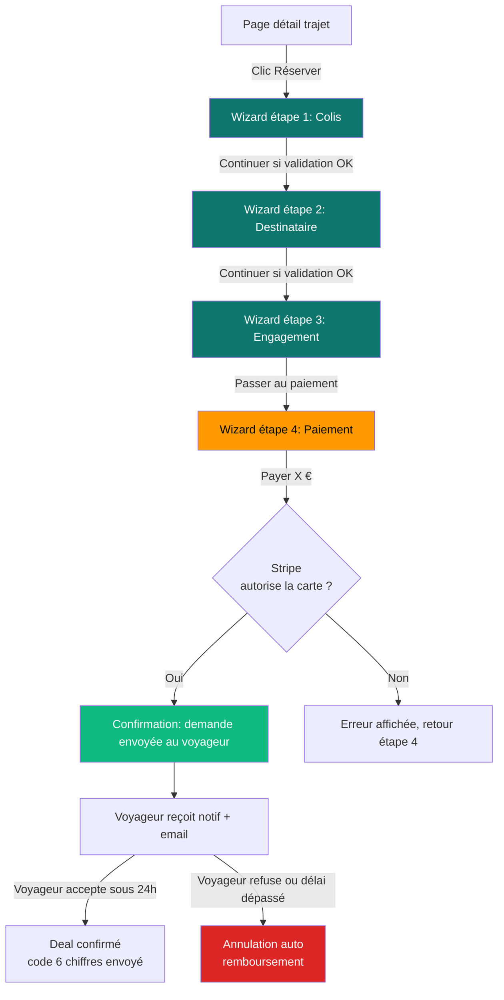

# Yamba — Document fonctionnel : workflow de réservation côté Expéditeur

> **Audience** : Product Owner, designer, stakeholder métier, support client.
> **Version** : 1.0 — Mai 2026
> **Périmètre** : workflow de réservation d'un transport de colis par un expéditeur, depuis la page détail d'un trajet jusqu'à la confirmation de la demande envoyée au voyageur.

---

## 1. Vue d'ensemble

Yamba est une **marketplace P2P (peer-to-peer)** de transport de colis légers entre particuliers. Le produit met en relation :

- Des **Voyageurs** (en interne : `CARRIER`, en UI : *Trippers*) qui ont de la place dans leur bagage lors d'un déplacement et acceptent de transporter le colis d'un tiers contre rémunération.
- Des **Expéditeurs** (*Shippers*) qui ont un colis à envoyer d'un point A à un point B et qui cherchent un voyageur compatible.

Ce document décrit le parcours **Expéditeur** : depuis la consultation d'un trajet jusqu'à l'envoi de la demande de réservation (appelée **Deal**) au voyageur.

### Ce qui est livré dans cette itération

✅ Le **wizard de réservation** complet en 4 étapes, accessible depuis la page détail d'un trajet
✅ Une expérience cohérente **desktop** et **mobile** (deux UIs distinctes mais état partagé)
✅ Le **module de paiement** intégré (Stripe Elements) — saisie carte bancaire, Apple Pay, Google Pay
✅ La **gestion bilingue** complète FR / EN
✅ Le **mode sombre** automatique sur toute l'expérience

### Ce qui reste à faire (PR futures)

🔲 Le branchement avec le `deal-service` backend (actuellement en mock)
🔲 Le branchement Stripe Connect pour réellement débiter la carte (autorisation puis capture)
🔲 La **réception côté Voyageur** de la demande, avec acceptation ou refus sous 24h
🔲 Les pages légales (CGV, contrat de transport, charte expéditeur)
🔲 Les emails de notification (paiement reçu, deal accepté/refusé, etc.)

---

## 2. Personas et parcours d'entrée

### Persona principal : Aïcha, 38 ans, expéditrice ponctuelle

Aïcha vit à Paris et envoie 2 à 3 fois par an des affaires à sa mère qui vit à Brazzaville. Les options classiques (DHL, La Poste) sont chères (~80 € minimum) et lentes (10 à 15 jours). Yamba lui propose des voyageurs réguliers Paris–Brazzaville qui livrent en 24h pour 40 à 60 €.

### Persona secondaire : Marc, 29 ans, e-commerçant

Marc vend des produits artisanaux français à des clients africains. Il utilise Yamba pour livrer ponctuellement quand il a une commande urgente et que ses circuits logistiques habituels sont saturés.

### Parcours d'entrée

```
Page d'accueil → Recherche par trajet (origine, destination, date)
              → Résultats : liste de trajets disponibles
              → Sélection d'un trajet
              → Page détail du trajet (consultation des conditions, prix, voyageur)
              → Clic sur "Réserver" 🎯 ← début du wizard de réservation
```

L'utilisateur doit être **connecté** pour réserver (cette redirection vers le login n'est pas encore implémentée — sera ajoutée dans une PR séparée).

---

## 3. Schéma du workflow complet



> **Note** : Le flow s'arrête actuellement à la confirmation côté expéditeur (étape G). La suite (réception côté voyageur, acceptation, paiement effectif) est l'objet de la **prochaine itération**.

---

## 4. Détail des 4 étapes du wizard

### Étape 1 — Colis

L'expéditeur précise tout ce qui concerne le colis et choisit son niveau d'assurance.

#### Sections de l'étape

1. **Lieux de rendez-vous** — Si le voyageur a proposé plusieurs options de remise (par ex. aéroport CDG, gare du Nord, son domicile), l'expéditeur choisit où il viendra remettre le colis. Idem pour le retrait à destination.
2. **Règles d'or** — Encart d'information sur les bonnes pratiques (emballage soigné, contenu fidèle à la description, articles interdits).
3. **Catégorie du colis** — Choix dans la liste des catégories acceptées par le voyageur (vêtements, chaussures, électronique, bagage cabine, etc.). Le prix du transport varie selon la catégorie (le voyageur a défini son tarif par catégorie lors de la publication du trajet).
4. **Poids déclaré** (en kg) — Saisi par l'expéditeur, sera vérifié par le voyageur lors de la remise.
5. **Valeur déclarée** (en euros) — Détermine le plafond de l'indemnisation en cas de litige. Une infobulle explique le concept au survol.
6. **Description libre** — Détails utiles au voyageur (marque, modèle, particularités).
7. **Photos** — De 0 à 6 photos. Les deux premières sont taguées automatiquement "Contenu" et "Emballé" pour normaliser l'interprétation. **Photos obligatoires** si l'assurance étendue est choisie.
8. **Assurance** (mobile uniquement à cette étape — en desktop, l'assurance est dans la sidebar) — Choix entre :
   - **Basique** (gratuit) : indemnisation jusqu'à 100 €.
   - **Étendue 500 €** (+5 €) : indemnisation jusqu'à 500 €, photos obligatoires, fiche IPID téléchargeable.

#### Règles de validation

| Champ | Règle |
|-------|-------|
| Lieu de remise | Obligatoire si plusieurs options proposées par le voyageur |
| Lieu de retrait | Idem |
| Catégorie | Obligatoire, doit être dans `acceptedCategories` du voyageur |
| Poids | Obligatoire, entre 0,1 et 25 kg, format décimal |
| Valeur déclarée | Obligatoire, entier positif, plafond 500 € si assurance étendue |
| Description | Recommandée, pas bloquante |
| Photos | Obligatoires (≥ 2) **si** assurance étendue |

### Étape 2 — Destinataire

L'expéditeur indique qui va récupérer le colis à destination.

> **Choix produit important** : le destinataire n'a **pas besoin d'un compte Yamba**. C'est volontaire pour deux raisons :
> - Réduire la friction (souvent le destinataire est un proche peu technophile).
> - Le destinataire est souvent dans un pays où l'accès au web/au smartphone est moins universel.
>
> En contrepartie, l'expéditeur reçoit un **code à 6 chiffres** après paiement, qu'il doit transmettre au destinataire par SMS/WhatsApp/téléphone. Le destinataire donnera ce code au voyageur en main propre lors de la livraison. **Sans ce code, le colis ne peut pas être remis.**

#### Champs

| Champ | Obligatoire | Pourquoi |
|-------|-------------|----------|
| Prénom | ✅ | Identifier le destinataire au moment de la livraison |
| Nom | ✅ | Idem |
| Téléphone | ✅ | Le voyageur appelle ou WhatsApp à l'arrivée à destination |
| Email | ❌ | Optionnel, pour notifications si renseigné |

Le format du téléphone est libre (E.164 attendu mais pas strictement validé pour ne pas bloquer les utilisateurs).

### Étape 3 — Engagement

C'est l'étape juridique. L'expéditeur reconnaît :

1. **Comment va se passer la remise** (encart pédagogique) :
   - Le voyageur va inspecter visuellement le colis avant d'accepter de le prendre.
   - S'il y a un écart entre la description et le contenu réel, le voyageur peut refuser.
   - Le voyageur prendra ses propres photos comme preuve en cas de litige.

2. **La Charte Expéditeur** (encart amber, lecture obligatoire) : l'expéditeur jure sur l'honneur que son colis :
   - Ne contient **aucun produit illicite, dangereux ou interdit** (drogues, armes, explosifs, etc.)
   - **Correspond exactement** à la catégorie, au poids et au contenu déclarés
   - **Respecte les obligations douanières** du pays de destination

3. **Acceptation explicite** par une case à cocher unique qui vaut acceptation de :
   - La **Charte Expéditeur**
   - Les **Conditions Générales de Vente** (CGV)
   - Le **Contrat de Transport** (relation contractuelle avec le voyageur)

> **Choix UX** : on combine 3 documents légaux en **une seule case à cocher** plutôt que 3 séparées pour réduire la friction tout en gardant une traçabilité technique (trois flags `charterAccepted`, `termsAccepted` mis à jour ensemble).

### Étape 4 — Paiement

L'expéditeur paie le montant total = transport + frais Yamba (+ assurance étendue le cas échéant).

#### Récap du prix (visible dans la sidebar ou bottom-sheet)

| Ligne | Calcul |
|-------|--------|
| Transport | Tarif catégorie du voyageur (ex. 50 € pour vêtements) |
| Service Yamba | 15 % du transport |
| Assurance 500 € | +5 € si assurance étendue, sinon 0 |
| **Total** | Somme des lignes |

#### Moyens de paiement proposés

- **Carte bancaire** (Visa, Mastercard, Amex, cartes internationales) — formulaire Stripe Elements intégré
- **Apple Pay** — disponible si l'appareil le supporte et que la page est en HTTPS
- **Google Pay** — disponible si l'appareil le supporte et que la page est en HTTPS

#### Modèle économique du paiement

Le paiement fonctionne en **autorisation puis capture** (modèle Stripe `manual capture`) :

1. À l'étape 4, l'expéditeur valide la carte → Stripe **autorise** le montant (réserve les fonds sans débiter).
2. Le voyageur reçoit la demande et a **24h pour accepter**.
3. Si accepté → Stripe **capture** réellement le montant (débit effectif). Les fonds sont retenus par Yamba jusqu'à confirmation de la livraison.
4. Si refusé ou expiration → Stripe **annule l'autorisation** (aucun débit, juste un blocage temporaire qui disparaît sous 7 jours).

> **Note importante** : le bandeau "Tu n'es débité qu'à acceptation par le voyageur (sous 24h max)" matérialise cette promesse, qui est un argument de réassurance fort.

#### Écran "Après votre paiement"

Sous les moyens de paiement, un encart explique le déroulé :

1. Le voyageur reçoit ta demande et a **24h pour accepter**.
2. Tu reçois ton **code à 6 chiffres**, à transmettre au destinataire.
3. Tu retrouves le voyageur pour la **remise du colis** (vérification croisée + photos).
4. Le voyageur **transporte** le colis pendant le trajet.
5. Le destinataire **reçoit** et donne le code au voyageur, qui le saisit dans l'app → confirmation de livraison.

---

## 5. Spécificités UI selon le device

### Desktop (largeur ≥ 1024px)

- **Stepper horizontal** en haut, sous le titre
- **Layout 2 colonnes** : zone formulaire à gauche (max ~60 % de la largeur), sidebar sticky à droite (360 px) qui reste visible au scroll
- La sidebar contient :
  - L'**assurance** (étape 1 uniquement, au-dessus du récap)
  - Le **récap du voyageur et du trajet** (étapes 1-3)
  - Le **récap des prix** (toujours)
  - Le **bouton principal** (Continuer / Passer au paiement / Payer X €)
  - Un **lien Retour** discret en dessous

### Mobile (largeur < 1024px)

- **Stepper compact** (4 cercles + label de l'étape courante)
- **Layout pleine largeur** : pas de sidebar
- L'**assurance** apparaît dans le flow principal de l'étape 1 (en bas)
- Un **bottom-sheet sticky** en bas d'écran avec :
  - Le **total** + lien "Détail" pour déplier le récap complet
  - Le **bouton principal**
  - Le **bouton Retour** (lien discret)

### Cohérence entre desktop et mobile

L'état du formulaire (réponses saisies, étape courante) est **persisté dans le sessionStorage** du navigateur. Concrètement, si l'utilisateur :

- Passe en mode portrait → paysage, ou
- Réduit la fenêtre du navigateur,

… il **ne perd rien**. Le wizard reprend là où il était.

---

## 6. Règles métier

### Tarification

- Le voyageur définit son tarif **par catégorie de colis** au moment de la publication du trajet.
- L'expéditeur voit le tarif quand il sélectionne une catégorie : "Vêtements — 50 €".
- Yamba ajoute **15 % de frais de service** au-dessus du tarif voyageur.
- L'assurance étendue est **+5 €** fixes (couverture jusqu'à 500 €).

### Catégories de colis disponibles

Définies au niveau projet (enum Prisma `ParcelCategory`) :

`CLOTHES`, `SHOES`, `COSMETICS`, `BOOKS`, `ELECTRONICS_SMALL`, `DOCUMENTS`, `FOOD_DRY`, `GIFTS`, `CHECKED_BAG_23KG`, `CABIN_BAG_12KG`, `OTHER`.

Chaque voyageur peut **n'accepter qu'un sous-ensemble** de catégories pour son trajet (ex. un voyageur en cabin only n'acceptera pas les bagages soute 23 kg). L'expéditeur ne voit que les catégories acceptées.

### Niveau d'assurance

| Type | Coût | Plafond | Photos | Documents légaux |
|------|------|---------|--------|------------------|
| Basique | Gratuit | 100 € | Optionnelles | CGV uniquement |
| Étendue 500 € | +5 € | 500 € | **Obligatoires** (≥ 2) | CGV + fiche IPID |

### Délai d'acceptation par le voyageur

- **24h max** à compter de la notification de la demande.
- Au-delà, la demande **expire automatiquement**.
- Pas de débit en cas d'expiration (autorisation Stripe simplement annulée).

### Code de livraison à 6 chiffres

- Généré automatiquement après acceptation du voyageur.
- Envoyé à l'expéditeur (notif + email).
- Doit être transmis au destinataire par un canal libre (SMS, WhatsApp, voix).
- **Sans ce code, le voyageur ne peut pas marquer la livraison comme effectuée** dans l'app.
- Cela protège à la fois l'expéditeur (le voyageur ne peut pas mentir sur la livraison) et le destinataire (la personne qui se présente est bien le bon voyageur, autorisé par le destinataire qui détient le code).

---

## 7. Cas limites et alertes

### L'expéditeur n'est pas connecté

→ Redirection vers `/login?redirect=/trips/{tripId}/book` (à implémenter).

### L'expéditeur abandonne en cours de wizard

→ L'état est persisté en sessionStorage. Si l'utilisateur revient sur la même URL **dans la même session**, il reprend là où il s'est arrêté. Si la session est fermée (fermeture totale du navigateur), l'état est perdu.

### Le voyageur a entre temps annulé / désactivé son trajet

→ Cas non géré actuellement (l'utilisateur peut continuer le wizard sur un trajet qui n'existe plus). À traiter dans la PR de branchement backend.

### Le paiement Stripe échoue

→ Stripe affiche l'erreur dans son widget (CB refusée, fonds insuffisants, etc.). L'utilisateur reste sur l'étape 4.

### Le voyageur refuse explicitement le deal

→ Annulation immédiate. L'expéditeur reçoit une notif "Demande refusée" avec une suggestion d'autres voyageurs sur le même trajet.

---

## 8. Évolutions à venir et roadmap

| Priorité | Évolution | Impact |
|----------|-----------|--------|
| **P0** | Branchement réel du backend `deal-service` (createDeal, getDeals) | Sans ça, c'est un mock |
| **P0** | Activation réelle de Stripe Connect (autorisation + capture) | Permet le paiement effectif |
| **P0** | Notification du voyageur (email + in-app) à la création du deal | Sans ça, le voyageur ne sait pas qu'on attend de lui |
| **P1** | Workflow voyageur : accepter / refuser un deal | Boucle le cycle de vie d'un deal |
| **P1** | Génération automatique du code à 6 chiffres | Lié à l'acceptation |
| **P1** | Pages légales (CGV, contrat de transport, charte) | Conformité juridique |
| **P1** | Guard d'authentification + redirect après login | Empêche les utilisateurs non connectés de réserver |
| **P2** | Possibilité de modifier un draft existant (édition d'une demande non encore envoyée) | Sauvegarde explicite |
| **P2** | Système de remise commerciale (codes promo) | Acquisition utilisateurs |
| **P3** | Réservation pour le compte d'un tiers (entreprise → particulier) | Marché B2B |

---

## 9. Glossaire

| Terme | Définition |
|-------|------------|
| **Trip / Trajet** | Un déplacement publié par un voyageur (origine, destination, date, capacité). |
| **Deal / Demande** | Une réservation de transport faite par un expéditeur sur un trajet précis. |
| **Carrier / Tripper / Voyageur** | L'utilisateur qui transporte le colis. Code interne `CARRIER`, UI publique *Tripper*. |
| **Shipper / Expéditeur** | L'utilisateur qui envoie un colis. |
| **Recipient / Destinataire** | La personne qui réceptionne le colis à destination. N'est pas forcément utilisateur Yamba. |
| **Draft** | Brouillon de réservation en cours de saisie (avant validation paiement). |
| **Charter / Charte** | Engagement juridique de l'expéditeur sur le contenu du colis. |
| **PaymentIntent** | Objet Stripe représentant une intention de paiement. En mode `manual capture`, autorise sans débiter. |
| **Capture** | Étape Stripe qui transforme une autorisation en débit effectif. |
| **Authorization** | Réservation temporaire des fonds sur la carte (avant capture). |
| **MCC** | Merchant Category Code Stripe — Yamba utilise 4215 (transport de colis). |
| **IPID** | Document d'Information sur le Produit d'Assurance (obligatoire en assurance France). |
