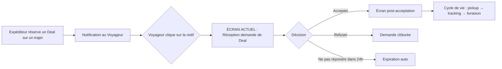
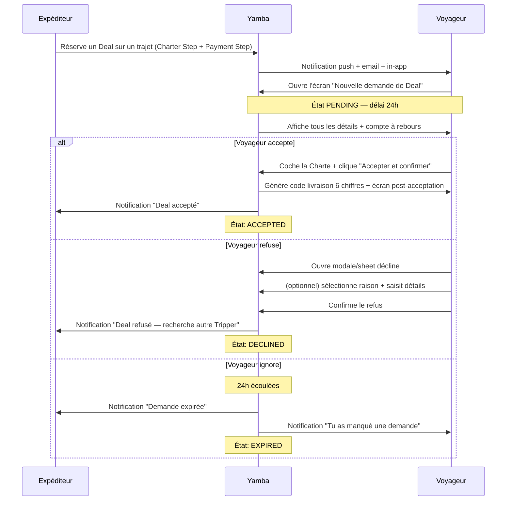
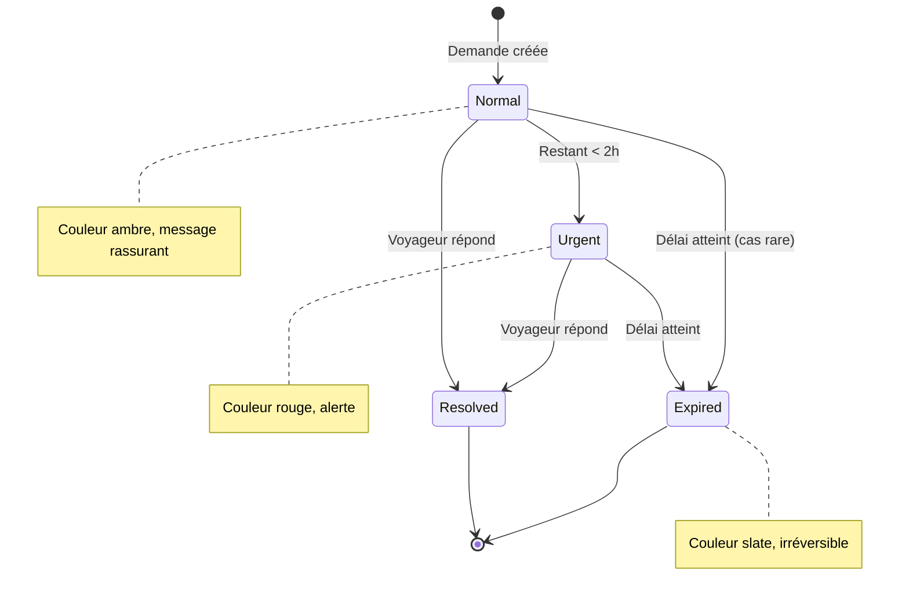

# Yamba — Doc Fonctionnel : Écran de Réception d'une Demande de Deal (Voyageur)

> **Version** : 1.0
> **Date** : 17 mai 2026
> **Branche Git** : `feat/carrier-deal-wizard`
> **Audience** : Product Owner, designer, support, fondateurs
> **Périmètre** : Frontend uniquement (backend mocké)

---

## Sommaire

1. [Vue d'ensemble](#1-vue-densemble)
2. [Contexte produit](#2-contexte-produit)
3. [Objectifs UX](#3-objectifs-ux)
4. [User stories](#4-user-stories)
5. [Workflow détaillé](#5-workflow-détaillé)
6. [États d'une demande de Deal](#6-états-dune-demande-de-deal)
7. [Description écran par écran](#7-description-écran-par-écran)
8. [Règles métier](#8-règles-métier)
9. [Internationalisation et accessibilité](#9-internationalisation-et-accessibilité)
10. [Sécurité et confiance utilisateur](#10-sécurité-et-confiance-utilisateur)
11. [Glossaire produit](#11-glossaire-produit)

---

## 1. Vue d'ensemble

Yamba est une marketplace P2P qui met en relation des **Expéditeurs** (Shippers) souhaitant envoyer un colis et des **Voyageurs** (Carriers, alias Trippers) effectuant un trajet international entre la diaspora française et l'Afrique francophone.

Cet écran constitue le **point pivot du parcours Voyageur** : c'est l'instant où il découvre qu'un Expéditeur souhaite lui confier un colis sur l'un de ses trajets publiés, et où il décide d'**accepter** ou **refuser** ce Deal.

### En une phrase

> *« Aminata souhaite t'envoyer un colis sur ton trajet Paris → Brazzaville. Voici les détails, le contrat, et ton gain. Décide. »*

### Ce qui est dans ce périmètre

- Affichage complet d'une demande de Deal entrante
- Compte à rebours d'expiration en temps réel
- Acceptation avec validation de la Charte Voyageur
- Refus avec raison et détails optionnels
- Layout responsive desktop / mobile
- Support FR / EN, dark / light mode

### Ce qui N'est PAS dans ce périmètre

- L'écran post-acceptation (Deal confirmé + code 6 chiffres) → prochaine PR
- L'inbox « Mes deals » côté Voyageur → PR ultérieure
- L'onglet « Demandes en attente » dans le détail trajet → PR ultérieure
- Le backend (deal-service, Stripe transferts, notifications email/push) → PR séparée

---

## 2. Contexte produit

### Pourquoi cet écran est critique

Côté business, le **taux d'acceptation des demandes** est un indicateur de santé direct pour Yamba :
- Trop bas → les Expéditeurs n'envoient pas leurs colis, abandon de la plateforme
- Trop élevé sans discernement → augmentation des incidents (colis non conformes, contenus interdits, etc.)

L'écran doit donc :
1. **Donner toutes les infos** pour qu'un Voyageur juge sereinement
2. **Rassurer** sur la légitimité de l'Expéditeur et la couverture en cas de litige
3. **Cadrer juridiquement** via une Charte Voyageur claire avant acceptation
4. **Déculpabiliser le refus** pour ne pas générer d'acceptations forcées
5. **Maximiser la visibilité du gain** sans en faire un argument unique

### Place dans le parcours global



---

## 3. Objectifs UX

| Objectif | Métrique cible (post-MVP) |
|----------|---------------------------|
| Décision rapide et éclairée | Temps moyen sur la page < 2 minutes |
| Taux d'acceptation qualifié | > 60 % des demandes acceptées |
| Compréhension de la Charte | Taux de check de la case > 95 % avant accept |
| Refus sans culpabilité | Taux de refus avec raison renseignée > 40 % |
| Réactivité | > 70 % des demandes traitées en < 4 heures |

### Principes UX appliqués

1. **Cohérence avec le booking shipper** : un Voyageur qui a déjà été Expéditeur reconnaît immédiatement les patterns (H1 + sous-titre, sidebar sticky, footer de réassurance).
2. **Hiérarchie d'attention** : l'expiration et les CTAs sont toujours visibles, le contenu défile.
3. **Progressive disclosure** : la Charte est lue avant le clic, pas après.
4. **Anti-manipulation** : pas de countdown agressif tant qu'il reste > 2 h, pas de hero visuellement pesant qui pousserait à accepter sans réfléchir.
5. **Mobile-first** : bottom-bar sticky avec CTAs toujours accessibles.

---

## 4. User stories

### En tant que Voyageur Yamba

> **US-CD-001** — En tant que Voyageur, je veux être notifié dès qu'une demande de Deal arrive sur l'un de mes trajets, afin de pouvoir réagir rapidement.

> **US-CD-002** — En tant que Voyageur, je veux voir l'identité de l'Expéditeur (nom, avatar, note, ancienneté), afin d'évaluer sa fiabilité.

> **US-CD-003** — En tant que Voyageur, je veux voir tous les détails du colis (catégorie, poids, valeur, description, photos), afin de juger sa compatibilité avec mon trajet.

> **US-CD-004** — En tant que Voyageur, je veux connaître les lieux exacts de remise et de livraison, afin d'estimer la faisabilité logistique.

> **US-CD-005** — En tant que Voyageur, je veux voir précisément combien je vais gagner et quand, afin de juger la rentabilité.

> **US-CD-006** — En tant que Voyageur, je veux savoir si le colis est assuré, afin de me rassurer en cas de litige.

> **US-CD-007** — En tant que Voyageur, je veux comprendre clairement mes engagements juridiques avant d'accepter, afin de m'engager en connaissance de cause.

> **US-CD-008** — En tant que Voyageur, je veux pouvoir refuser une demande sans crainte de pénalité, afin de garder mon libre arbitre.

> **US-CD-009** — En tant que Voyageur, je veux voir un compte à rebours du délai d'expiration, afin de prioriser ma réponse.

> **US-CD-010** — En tant que Voyageur, je veux zoomer sur les photos du colis, afin d'inspecter le contenu déclaré.

---

## 5. Workflow détaillé

### Vue macro



### Détail du compte à rebours



---

## 6. États d'une demande de Deal

| État | Description | Couleur UI | Actions possibles |
|------|-------------|------------|-------------------|
| `PENDING` | En attente de la réponse du Voyageur | Ambre | Accept / Decline |
| `ACCEPTED` | Le Voyageur a accepté, Deal confirmé | Emerald (succès) | (consulter uniquement) |
| `DECLINED` | Le Voyageur a refusé | Slate (neutre) | (consulter uniquement) |
| `EXPIRED` | Délai de 24h dépassé sans réponse | Slate (gris) | (consulter uniquement) |
| `CANCELLED` | L'Expéditeur a annulé avant que le Voyageur réponde | Slate | (consulter uniquement) |

Sur l'écran actuel, on traite uniquement le cas `PENDING`. Les autres états seront traités dans la PR « Inbox Mes deals » + écran post-acceptation.

---

## 7. Description écran par écran

### 7.1 Layout Desktop (≥ 1024 px)

**Structure haute** :
- Lien retour discret en haut à gauche (un seul)
- H1 noir gras : « Nouvelle demande de Deal »
- Sous-titre dynamique : `Reçue il y a 2h · Paris → Brazzaville · jeu. 28 mai · vol direct 8h`
- Bandeau d'expiration compact (chip ambré, ou rouge si < 2 h)

**Grid 2 colonnes** :

#### Colonne principale (gauche)
1. **De la part de** — Identité de l'Expéditeur (avatar coloré aux initiales, nom + initiale, badge « Vérifié » violet, note étoilée, nombre d'envois, ancienneté, lien « Voir profil »)
2. **Détails du colis** — Catégorie, poids déclaré, valeur déclarée (3 colonnes) + description libre en pleine largeur
3. **Photos déclarées par {prénom}** — Grid responsive 2/3/4 colonnes avec tag « Contenu » / « Emballé », clic → lightbox plein écran
4. **Modalités de remise et livraison** — Pickup avec note flexibilité, Delivery avec note « Téléphone communiqué après acceptation · code à 6 chiffres »
5. **Avant d'accepter, lis bien ces points** — Tip block bleu avec 4 conseils clés
6. **Ton engagement** — Charte Voyageur amber avec 6 engagements + lien vers Charte complète + Case d'acceptation unique « J'accepte la Charte Voyageur, le Contrat de transport et les CGV »

#### Sidebar sticky (droite)
1. **Card Earnings emerald** — Label « TU GAGNES », montant net en gros (89,30 €), note de versement (J+4 sur compte Stripe), breakdown détaillé (prix total payé − commission Yamba − frais Stripe)
2. **Card Couverture** — Bouclier vert + « Assurance 500 € incluse » + note rassurante
3. **Card Actions** — Indicateur d'état charte (« Coche la Charte pour confirmer » → « ✓ Charte acceptée »), bouton « Accepter et confirmer » (mango), bouton « Refuser » (outline), note de déculpabilisation

### 7.2 Layout Mobile (< 1024 px)

**Header pleine largeur** :
- Flèche retour + titre « Nouvelle demande de Deal » + sous-titre « Reçue il y a 2h 3min »

**Scrollable content** (avec padding latéral uniforme) :
1. Bandeau d'expiration (chip ambré card)
2. Hero earnings compact (bandeau emerald « TU GAGNES 89,30 € »)
3. De la part de
4. Détails du colis
5. Photos (grid 2 cols)
6. Lieux remise / livraison
7. Détail du gain (breakdown inline)
8. Couverture (note inline emerald)
9. Avant d'accepter (tip compact)
10. Charte Voyageur + case d'acceptation

**Bottom-bar sticky** :
- Indicateur d'état charte (centré, petite ligne)
- 2 CTAs côte à côte : « Refuser » (outline) + « Accepter » (mango)

### 7.3 Modale de refus (desktop)

- Backdrop semi-transparent avec backdrop-blur
- Modale centrée, max-width 512 px
- Titre : « Refuser cette demande ? »
- Texte introductif rassurant
- Dropdown raison (optionnel) avec 5 choix
- Toggle « Ajouter des détails » → textarea apparaît (optionnel, 500 caractères max)
- Encart ambre « ⚠ Cette action est définitive »
- 2 boutons : « Annuler » (outline) + « Refuser le Deal » (rouge destructif)
- Esc + clic backdrop ferment

### 7.4 Bottom-sheet de refus (mobile)

- Slide-up animation depuis le bas
- Handle visuel décoratif en haut
- Mêmes champs que la modale desktop, organisés verticalement
- Bouton principal pleine largeur « Refuser le Deal » (rouge)
- Bouton secondaire pleine largeur « Annuler » (outline)
- Tap backdrop ferme

### 7.5 Lightbox photos

- Plein écran, fond noir 90 % opacité + backdrop-blur
- Image centrée, contain max 90 vh × 90 vw
- Boutons de navigation Précédent / Suivant (si plusieurs photos)
- Bouton X de fermeture
- Navigation clavier : Esc (fermer), ← (précédent), → (suivant)

---

## 8. Règles métier

### 8.1 Expiration

| Règle | Valeur |
|-------|--------|
| Délai de réponse maximum | 24 heures à compter de la création |
| Seuil d'alerte urgent | < 2 heures restantes |
| Rafraîchissement du compteur | Toutes les 30 secondes |
| Action automatique à expiration | Statut → `EXPIRED`, Expéditeur notifié |
| Pénalité Voyageur à l'expiration | Aucune (mais notification de rappel) |

### 8.2 Acceptation

| Règle | Détail |
|-------|--------|
| Préalable obligatoire | Case « J'accepte la Charte Voyageur » cochée |
| Comportement si non cochée | Bouton actif, au clic : erreur orange + scroll auto vers la charte |
| Confirmation | Toast « Deal accepté ! Code de livraison généré » |
| Génération code livraison | 6 chiffres aléatoires, visible uniquement à l'Expéditeur |
| Conséquence Stripe | Capture du paiement de l'Expéditeur (différé jusqu'à l'acceptation) |
| Conséquence Voyageur | Accès au numéro de téléphone du destinataire |

### 8.3 Refus

| Règle | Détail |
|-------|--------|
| Préalable obligatoire | Aucun (le refus est libre) |
| Raison obligatoire | Non (optionnelle) |
| Détails complémentaires | Optionnels, 500 caractères max |
| Confirmation | Toast « Demande refusée. {Expéditeur} a été notifiée. » |
| Conséquence Expéditeur | Remboursement intégral Stripe, recherche d'un autre Tripper |
| Conséquence Voyageur | Aucune pénalité, taux d'acceptation inchangé |

### 8.4 Raisons de refus disponibles

| Code | Label FR | Label EN |
|------|----------|----------|
| `CATEGORY_NOT_TRANSPORTED` | Catégorie non transportée | Category not transported |
| `WEIGHT_TOO_HEAVY` | Poids ou volume trop important | Weight or volume too heavy |
| `LOCATION_INCOMPATIBLE` | Lieu de remise ou livraison incompatible | Pickup or delivery location incompatible |
| `TIMING_TOO_TIGHT` | Délais trop courts | Timing too tight |
| `OTHER` | Autre raison | Other reason |

### 8.5 Affichage du gain

Le détail du gain affiché correspond à la formule :

```
Net Voyageur = Prix total payé − Commission Yamba (15 %) − Frais Stripe
```

**Exemple type** :
- Prix total payé par l'Expéditeur : **103,75 €**
- Commission Yamba (12,75 €) et frais Stripe (1,70 €)
- **Net Voyageur : 89,30 €**
- Versement : J+4 après livraison validée (code 6 chiffres saisi)

---

## 9. Internationalisation et accessibilité

### 9.1 Langues supportées

- 🇫🇷 Français (langue par défaut)
- 🇬🇧 Anglais

Toutes les copies sont dans `messages/{fr,en}/carrierDealRequest.json` avec gestion ICU :
- Pluralisation : `{count, plural, =1 {# envoi} other {# envois}}`
- Interpolation : `{shipperFirstName}`, `{hours}`, `{minutes}`, etc.
- Apostrophes doublées pour les passages en français (convention ICU)

### 9.2 Dark mode

- Bascule via toggle du header global
- Classes Tailwind `dark:` sur tous les composants
- Couleurs adaptées :
  - Ambre : `bg-amber-50` → `bg-amber-950/30`
  - Emerald : `bg-emerald-50` → `bg-emerald-950/30`
  - Slate : `bg-white` → `bg-slate-950`, `text-slate-900` → `text-white`

### 9.3 Accessibilité

| Critère WCAG | Implémentation |
|--------------|----------------|
| Contraste AA | Couleurs Tailwind vérifiées : ambre 900 sur ambre 50 = 7.2:1 |
| Navigation clavier | Tous les boutons et liens focusables, lightbox supporte Esc/←/→ |
| Roles ARIA | `role="dialog"`, `aria-modal="true"`, `aria-label` sur boutons icônes |
| Alertes urgentes | `role="alert"` sur banner si < 2 h restantes |
| Focus visible | Ring orange Yamba `focus:ring-[#FF9900]` sur photos et CTAs |
| Lecteurs d'écran | Labels explicites (« Fermer », « Précédent », « Suivant », etc.) |

---

## 10. Sécurité et confiance utilisateur

### 10.1 Charte Voyageur

L'engagement juridique signé à l'acceptation porte sur 6 points :

1. **Vérifier visuellement** le contenu du colis avant prise en charge
2. **Refuser** tout colis non conforme à la déclaration ou paraissant suspect
3. **Transporter avec diligence** et ne pas altérer le contenu
4. **Remettre uniquement** au destinataire après vérification du code à 6 chiffres
5. **Respecter les obligations douanières** applicables au trajet
6. **Signaler à Yamba sans délai** tout incident pendant le trajet

Avertissement légal : *« Je reconnais que ma seule responsabilité serait engagée en cas de transport d'un produit illicite, y compris en l'absence de vérification préalable. »*

### 10.2 Tip de conseils pré-acceptation

L'écran affiche systématiquement 4 conseils clés (en blue tip block) :

- **Vérifie systématiquement le contenu** à la remise du colis
- **Refuse si le contenu réel diffère** de la déclaration
- **Prends tes propres photos** à la prise en charge
- **Tu transportes à tes risques** jusqu'à remise au destinataire avec code validé

### 10.3 Mécanismes de réassurance

- Badge « Vérifié » violet pour les Expéditeurs ayant validé leur identité
- Note étoilée publique (4.8 sur 5 sur l'exemple Aminata)
- Nombre d'envois passés (12 envois)
- Date d'inscription (« Membre depuis nov. 2024 »)
- Couverture d'assurance visible (Assurance 500 € incluse)
- Code livraison à 6 chiffres confidentiel (jamais visible au Voyageur)

---

## 11. Glossaire produit

| Terme | Définition |
|-------|-----------|
| **Deal** | Transaction de transport entre un Expéditeur et un Voyageur |
| **Tripper / Voyageur / Carrier** | Personne qui transporte le colis (3 termes désignent la même entité — `CARRIER` en interne, `Tripper`/`Voyageur` en UI) |
| **Expéditeur / Shipper** | Personne qui envoie le colis |
| **Charte Voyageur** | Engagement juridique du Voyageur, signé à l'acceptation |
| **Contrat de transport** | Document légal encadrant la prestation de transport |
| **CGV** | Conditions Générales de Vente de Yamba |
| **Code livraison** | Code à 6 chiffres généré à l'acceptation, partagé avec l'Expéditeur uniquement, à saisir par le Voyageur lors de la remise |
| **Pickup** | Lieu où le Voyageur récupère le colis auprès de l'Expéditeur |
| **Delivery** | Lieu où le Voyageur remet le colis au destinataire |
| **Assurance étendue 500 €** | Option payante (+ 6 €) souscrite par l'Expéditeur, couvrant perte/vol/casse jusqu'à 500 € |
| **Protection de base** | Couverture incluse par défaut, contre la non-livraison |
| **Verified** | Badge attribué à un utilisateur ayant validé son identité (KYC) |
| **J+4** | Délai de versement Stripe : 4 jours après livraison validée par code |

---

## Notes de version

| Version | Date | Auteur | Notes |
|---------|------|--------|-------|
| 1.0 | 17 mai 2026 | Telama + Claude | Première version, écran réception demande de Deal côté Voyageur, frontend uniquement |

---

**Fin du document fonctionnel.**
