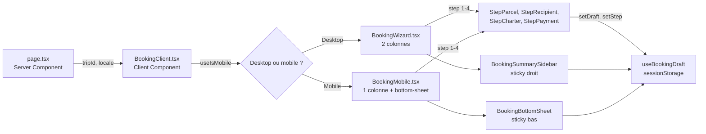
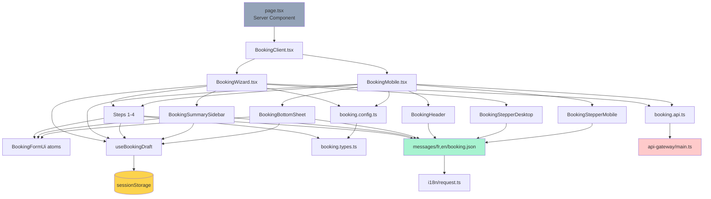

# Yamba — Document technique : wizard de réservation Expéditeur

> **Audience** : développeur full-stack, novice ou intermédiaire, qui rejoint le projet et doit comprendre l'existant pour le faire évoluer.
> **Pré-requis lecteur** : connaissance basique de React, TypeScript, Node.js. Pas besoin d'expérience préalable sur Next.js App Router ou next-intl — tout est expliqué.
> **Version** : 1.1 — Mai 2026 (enrichie avec le catalogue détaillé des fichiers)
> **Code concerné** : `apps/user-ui/src/components/booking/**`, `apps/user-ui/messages/{fr,en}/booking.json`, `apps/user-ui/src/hooks/useBookingDraft.ts`, `apps/api-gateway/src/main.ts` (CORS).

---

## Table des matières

1. [Vue d'ensemble de l'architecture](#1-vue-densemble-de-larchitecture)
2. [Stack technique et choix](#2-stack-technique-et-choix)
3. [Structure des fichiers (overview)](#3-structure-des-fichiers-overview)
4. [Catalogue détaillé des fichiers ⭐](#4-catalogue-détaillé-des-fichiers)
5. [Concept central : le `Draft`](#5-concept-central--le-draft)
6. [Persistance du draft : hook `useBookingDraft`](#6-persistance-du-draft--hook-usebookingdraft)
7. [Convention Next.js 16 : suffix `Action`](#7-convention-nextjs-16--suffix-action)
8. [Internationalisation : next-intl](#8-internationalisation--next-intl)
9. [Validation et erreurs](#9-validation-et-erreurs)
10. [Stripe Elements en mode `deferred`](#10-stripe-elements-en-mode-deferred)
11. [Responsive : double UI desktop/mobile](#11-responsive--double-ui-desktopmobile)
12. [Dark mode dans Stripe](#12-dark-mode-dans-stripe)
13. [Comment faire évoluer : recettes](#13-comment-faire-évoluer--recettes)
14. [Pièges à éviter](#14-pièges-à-éviter)

---

## 1. Vue d'ensemble de l'architecture

Le wizard de booking est une **feature complète isolée** dans le dossier `apps/user-ui/src/components/booking/`. Il s'agit d'un parcours en 4 étapes, accessible via une URL dédiée (`/[locale]/trips/[tripId]/book`).

### Flux haut niveau



### Responsabilités

| Couche | Rôle |
|--------|------|
| `page.tsx` (Server Component Next.js) | Récupère `locale` et `tripId` depuis l'URL. Server-side, mais ici purement transmis. |
| `BookingClient.tsx` (Client Component) | Décide desktop vs mobile via `useIsMobile()`. Affiche un fallback pendant l'hydration. |
| `BookingWizard / BookingMobile` | Orchestrent les 4 étapes, gèrent navigation, validation, submit. |
| `Step{Parcel,Recipient,Charter,Payment}` | Chaque étape est isolée, prend `draft` + `setDraftAction` + `errors`. |
| `BookingSummarySidebar / BookingBottomSheet` | Récap visible en permanence (prix, voyageur, CTAs). |
| `BookingFormUi.tsx` | Atoms UI réutilisables (boutons, inputs, options, tips). |
| `useBookingDraft` | Hook custom : persiste `draft` + `step` en `sessionStorage`. |
| `booking.config.ts` | Logique métier pure : `validateStep`, `canContinueStep`, `computeTotal`. |
| `booking.types.ts` | Types TS partagés (`Draft`, `Step`, `TripContext`, `ValidationErrors`). |

---

## 2. Stack technique et choix

### Frontend

| Technologie | Version cible | Pourquoi |
|-------------|---------------|----------|
| **Next.js 16** (App Router) | ^16 | Server Components + Client Components. Le routage par dossier `[locale]/trips/[tripId]/book/page.tsx` est natif. |
| **React 19** | ^19 | Hooks modernes. Notre wizard est entièrement en composants fonctionnels. |
| **TypeScript** | strict | Sécurité de types, autocomplétion, refactor sûr. Tous les fichiers `.ts/.tsx`. |
| **Tailwind CSS** | ^3 | Toutes les classes utilitaires. Palette `mango` (#FF9900) + `teal` (#0F766E). Stratégie `dark:` (class strategy). |
| **next-intl** | ^3 | i18n avec messages dans JSON par locale + namespace. Voir [section 8](#8-internationalisation--next-intl). |
| **lucide-react** | ^0.x | Bibliothèque d'icônes SVG tree-shakable. |
| **@stripe/react-stripe-js + @stripe/stripe-js** | dernière | Widget de paiement intégré. Voir [section 10](#10-stripe-elements-en-mode-deferred). |
| **sonner** | ^1.x | Toasts pour le succès/erreur du submit. |

### Backend (touchent peu cette feature)

- **Express + TypeScript**, **Prisma + MongoDB**, **Redis (Upstash)** pour les sessions auth.
- **api-gateway** comme proxy unique (port 8080) entre frontend et tous les services.

> ⚠️ Toutes les requêtes frontend passent **par le gateway**, jamais directement vers `auth-service` ou `trip-service`. Règle architecture stricte.

### Choix structurants

#### Pourquoi Next.js App Router et pas Pages Router ?

L'App Router permet de mélanger Server Components et Client Components dans une même arborescence, ce qui simplifie le chargement initial. Pour le booking, on a une `page.tsx` server qui transmet les params à un `BookingClient.tsx` client (car il y a énormément d'état interactif). Plus tard, on pourra fetcher le `trip` réel dans le server component avant de l'envoyer au client.

#### Pourquoi `useBookingDraft` au lieu d'un store global (Redux, Zustand) ?

Le draft est **propre à cette feature** et de courte durée. Un store global serait du sur-engineering : on veut que le state disparaisse quand l'utilisateur quitte le wizard, pas qu'il persiste à travers toute l'app. Hook custom + `sessionStorage` suffit largement et reste local au feature.

#### Pourquoi 2 composants `BookingWizard` et `BookingMobile` au lieu d'un seul responsive ?

Les deux UIs ont des structures DOM **trop différentes** pour être unifiées proprement avec des breakpoints Tailwind seuls : sidebar sticky à droite vs bottom-sheet sticky en bas, c'est deux paradigmes UX distincts. Avoir deux composants permet :
- HTML sémantique correct sur chaque device.
- Animations spécifiques (bottom-sheet a une disclosure animée).
- Maintenabilité : modifier l'un n'affecte pas l'autre.

L'état est partagé via `useBookingDraft` + `sessionStorage`, donc rien n'est dupliqué côté données.

---

## 3. Structure des fichiers (overview)

Vision d'ensemble. Pour une explication détaillée de **chaque fichier**, voir la [section 4](#4-catalogue-détaillé-des-fichiers).

```
apps/user-ui/
├── messages/
│   ├── fr/booking.json                                  ← chaînes FR
│   └── en/booking.json                                  ← chaînes EN
├── src/
│   ├── app/[locale]/trips/[tripId]/book/page.tsx        ← route Next.js
│   ├── components/
│   │   ├── booking/
│   │   │   ├── BookingClient.tsx                        ← router desktop/mobile
│   │   │   ├── BookingWizard.tsx                        ← wrapper desktop
│   │   │   ├── BookingMobile.tsx                        ← wrapper mobile
│   │   │   ├── BookingHeader.tsx                        ← header partagé
│   │   │   ├── BookingStepperDesktop.tsx
│   │   │   ├── BookingStepperMobile.tsx
│   │   │   ├── BookingSummarySidebar.tsx                ← sidebar desktop
│   │   │   ├── BookingBottomSheet.tsx                   ← bottom-sheet mobile
│   │   │   ├── BookingFormUi.tsx                        ← atoms UI
│   │   │   ├── booking.config.ts                        ← validation + calculs
│   │   │   ├── booking.types.ts                         ← types TS
│   │   │   ├── booking.state.ts                         ← mockTrip
│   │   │   └── steps/
│   │   │       ├── StepParcel.tsx
│   │   │       ├── StepRecipient.tsx
│   │   │       ├── StepCharter.tsx
│   │   │       └── StepPayment.tsx
│   │   └── trips/detail/
│   │       ├── BookingSummaryCard.tsx                   ← card "Réserver" page détail (modifié)
│   │       └── BookingMobileBar.tsx                     ← bottom-bar page détail (modifié)
│   ├── hooks/
│   │   ├── useBookingDraft.ts                           ← persistance draft + step
│   │   ├── useIsMobile.ts                               ← viewport check
│   │   └── usePersistedFormState.ts                    ← hook générique
│   ├── i18n/
│   │   ├── request.ts                                   ← chargement namespaces (modifié)
│   │   ├── navigation.ts                                ← wrapper next-intl
│   │   └── routing.ts                                   ← config locales
│   └── services/
│       └── booking.api.ts                               ← createDeal (mock)
└── apps/api-gateway/src/main.ts                         ← config CORS (modifié)
```

### ⚠️ Distinction critique entre deux fichiers homonymes

**`BookingSummaryCard.tsx` (page détail trajet) ≠ `BookingSummarySidebar.tsx` (wizard)** :

- `src/components/trips/detail/BookingSummaryCard.tsx` : affiché sur la page détail d'un trajet. Affiche "À partir de 50 €" + bouton "Réserver" qui redirige vers le wizard. Consomme un **`PublicTrip`** (qui contient `trip.tripper`, pas `trip.carrier`).
- `src/components/booking/BookingSummarySidebar.tsx` : sidebar du wizard. Affiche le récap complet du booking en cours. Consomme un **`TripContext`** (avec `trip.carrier`).

Les noms se ressemblent, leur rôle est totalement différent, et les confondre cause des erreurs runtime du type `Cannot read property 'firstName' of undefined`. À renommer à terme.

---

## 4. Catalogue détaillé des fichiers

Cette section décrit **chaque fichier** créé ou modifié dans cette PR, dans l'ordre où on les rencontre quand on parcourt le code. Chaque entrée suit le format :

- **Path** absolu depuis la racine du repo
- **Type** : Server Component, Client Component, Hook, Utility, Config, Data
- **Rôle** en une phrase
- **Description** détaillée
- **Exports / Props / Inputs**
- **Dépendances** principales
- **À noter** : pièges, choix particuliers, évolutions à venir

---

### 4.1 Route Next.js

#### 📄 `apps/user-ui/src/app/[locale]/trips/[tripId]/book/page.tsx`

- **Type** : Server Component (par défaut dans l'App Router de Next.js)
- **Rôle** : Point d'entrée de l'URL `/fr/trips/abc/book`. Capture les paramètres d'URL et les transmet au client.
- **Description** : Le fichier `page.tsx` est conventionnel — Next.js scanne automatiquement les dossiers et tout `page.tsx` devient une route. Ici, `[locale]` capture `fr` ou `en`, et `[tripId]` capture l'identifiant du trajet (ex. `abc123`). Le Server Component ne fait rien d'autre que rendre `<BookingClient tripId={tripId} />`. Plus tard, ce fichier pourra fetcher le trip réel depuis le backend (server-side, pour SEO et performance) avant de transmettre les données au client.
- **Exports** : `default export` async function `BookingPage({ params })`
- **À noter** :
  - Les params sont **typés** : `{ locale: string; tripId: string }`.
  - C'est un **async Server Component** : peut faire des appels backend ou Prisma directement (mais pour l'instant ne fait que passer).
  - Ne pas y mettre de hooks React (`useState`, `useEffect`) : les Server Components ne les supportent pas.

---

### 4.2 Routage Client desktop/mobile

#### 📄 `apps/user-ui/src/components/booking/BookingClient.tsx`

- **Type** : Client Component (`"use client"` en première ligne)
- **Rôle** : Choisit entre l'UI desktop (`BookingWizard`) ou mobile (`BookingMobile`) selon la largeur du viewport.
- **Description** : Reçoit le `tripId` du Server Component parent. Appelle le hook `useIsMobile()` qui retourne `boolean | null`. Tant que c'est `null` (hydration en cours), affiche un fallback (spinner). Une fois résolu, monte le bon wrapper. Pour le MVP, utilise `mockTrip` au lieu de fetcher le vrai trip. Définit aussi la fonction `handleClose` qui retourne sur la page détail.
- **Props** : `{ tripId: string }`
- **Dépendances** : `useIsMobile`, `BookingWizard`, `BookingMobile`, `mockTrip`, router de next-intl
- **À noter** :
  - Le pattern `isMobile === null` évite un **mismatch d'hydration** : si on rendait `false` par défaut, le SSR montrerait le wizard desktop puis le client basculerait immédiatement en mobile, ce qui ferait crier React.
  - La fonction `handleClose` est passée aux deux wrappers via `onCloseAction`. Elle utilise `router.push` du wrapper `next-intl/navigation` (pas celui de `next/navigation`) pour préserver la locale dans l'URL.
  - **Évolution future** : remplacer `mockTrip` par un hook React Query `useTrip(tripId)`.

---

### 4.3 Wrappers (desktop et mobile)

#### 📄 `apps/user-ui/src/components/booking/BookingWizard.tsx`

- **Type** : Client Component
- **Rôle** : Wrapper desktop du wizard. Layout 2 colonnes avec stepper horizontal en haut.
- **Description** : Orchestre les 4 étapes, gère la navigation (avant, arrière, stepper cliquable), la validation et le submit. Affiche un titre "Réservation" + sous-titre dynamique "Paris → Brazzaville · jeu. 28 mai", un stepper desktop, puis un grid 2 colonnes : zone formulaire à gauche (avec la card de l'étape courante), sidebar sticky à droite (`top-[88px]`). Construit le `ctaLabel` selon l'étape (Continuer / Passer au paiement / Payer X €). Au submit (étape 4), appelle `createDeal()` puis affiche un toast de succès/erreur.
- **Props** : `{ trip: TripContext; onCloseAction: () => void }`
- **Dépendances** : `useBookingDraft`, `useTranslations`, `useLocale`, `validateStep`, `canContinueStep`, `computeTotal`, `createDeal`, `toast` (sonner), tous les `Step*` et `BookingSummarySidebar`
- **À noter** :
  - Le `useEffect` qui normalise la catégorie est important : si l'utilisateur arrive avec un draft sessionStorage où `category` n'est plus dans `trip.acceptedCategories`, on bascule vers la première catégorie acceptée pour éviter une erreur silencieuse.
  - `setShowErrors` est resetté à chaque changement de step (`useEffect`).
  - `nextStep` valide d'abord, set `showErrors=true` si invalide (déclenche l'affichage des erreurs sans naviguer), sinon avance.
  - `formatDate` et `formatPrice` sont définis localement (pas dans un util partagé). Si tu en as besoin ailleurs, factorise dans `@/lib/intl.ts`.

#### 📄 `apps/user-ui/src/components/booking/BookingMobile.tsx`

- **Type** : Client Component
- **Rôle** : Wrapper mobile du wizard. Layout pleine largeur avec header, stepper compact, contenu scrollable, bottom-sheet sticky.
- **Description** : Mirror de `BookingWizard` mais avec une structure DOM mobile-first. Utilise `BookingHeader` (avec bouton retour vers la page trajet), `BookingStepperMobile`, puis le contenu de l'étape, puis `BookingBottomSheet` qui contient prix + CTAs (sticky en bas d'écran).
- **Props** : `{ trip: TripContext; onCloseAction: () => void }`
- **Dépendances** : Idem `BookingWizard` mais avec `BookingHeader`, `BookingStepperMobile`, `BookingBottomSheet` à la place de leurs équivalents desktop.
- **À noter** :
  - Pas de `useEffect` de normalisation de catégorie ici. **Petite incohérence** avec `BookingWizard` — à harmoniser : extraire la logique partagée dans `useBookingDraft` ou dans un hook `useBookingValidation`.
  - Le `<div className="flex-1 overflow-y-auto pb-4">` est le wrapper du body scrollable. Si tu ajoutes une étape qui doit prendre toute la hauteur, attention au sizing.

---

### 4.4 Steps

#### 📄 `apps/user-ui/src/components/booking/steps/StepParcel.tsx`

- **Type** : Client Component
- **Rôle** : Étape 1 — saisie des informations du colis (locations, catégorie, poids, valeur, description, photos, assurance).
- **Description** : Composant le plus complexe des 4 steps. Gère la sélection de locations (avec `LocationOption` ou `LocationDisplay` selon qu'il y a une ou plusieurs options), affiche le tip "Règles d'or", génère dynamiquement les options de catégorie selon `trip.acceptedCategories` avec leur prix. Le bloc photos a une logique spéciale : les 2 premières photos sont auto-taguées "Contenu" et "Emballé" (constants `DECLARED_CONTENT`, `DECLARED_PACKAGED`). Affiche un encart d'assurance **uniquement en mobile** (en desktop, l'assurance est dans la sidebar).
- **Props** : `{ trip, draft, setDraftAction, errors, hideInsurance? }`
- **Constantes locales** : `GOLDEN_RULES_KEYS = ["pack", "weigh", "describe", "prohibited"] as const`
- **Helpers locaux** : `FormFieldWithTooltip` (label + tooltip côte à côte), `formatEur` (formatage Intl)
- **À noter** :
  - Le `handleAddPhotos` utilise `URL.createObjectURL` pour générer des URLs blob preview. **Important** : `handleRemovePhoto` doit faire `URL.revokeObjectURL` pour éviter une fuite mémoire.
  - Les keys photos sont uniques via `Date.now()` + `Math.random()` pour éviter les collisions si l'utilisateur ajoute plusieurs photos en moins d'1 ms.
  - Le wrapper racine a `className="px-4 py-5 md:px-0 md:py-0"` : padding mobile, désactivé en desktop (car la card du wizard apporte son propre padding). **Si tu refactores, n'enlève pas ces classes** : sans elles le contenu colle aux bords en mobile.

#### 📄 `apps/user-ui/src/components/booking/steps/StepRecipient.tsx`

- **Type** : Client Component
- **Rôle** : Étape 2 — saisie des informations du destinataire (prénom, nom, téléphone, email optionnel).
- **Description** : Le plus simple des 4 steps. Un encart pédagogique (tip "Comment se passera la livraison") avec 3 puces. Un formulaire avec 4 champs. La fonction `setRecipient` est un helper pour patcher la partie `recipient` du draft sans toucher au reste.
- **Props** : `{ draft, setDraftAction, errors }`
- **Constantes locales** : `DELIVERY_FLOW_KEYS = ["codeGiven", "shareIt", "handToTraveler"] as const`
- **À noter** :
  - Le destinataire n'a **pas besoin d'un compte Yamba**. Choix produit important — voir le doc fonctionnel.
  - Le `phoneE164` n'est pas strictement validé (juste un check basique). À durcir si tu veux empêcher les saisies de type "abcdef".

#### 📄 `apps/user-ui/src/components/booking/steps/StepCharter.tsx`

- **Type** : Client Component
- **Rôle** : Étape 3 — engagement juridique de l'expéditeur.
- **Description** : Affiche un encart tip "Comment se passera la remise", puis un encart amber `<CharterBlock>` avec les 3 engagements, puis une case à cocher `<CharterCheckbox>` qui matérialise l'acceptation des 3 documents (Charte + CGV + Contrat de Transport) en une seule action. Le toggle de la case **modifie 2 flags du draft en même temps** (`charterAccepted` et `termsAccepted`) pour conserver la traçabilité technique tout en restant simple côté UX.
- **Props** : `{ draft, setDraftAction, errors }`
- **Constantes locales** : `HANDOVER_FLOW_KEYS`, `CHARTER_ITEMS_KEYS`, et 3 hrefs pour les routes légales (`CGV_HREF`, `TRANSPORT_CONTRACT_HREF`, `FULL_CHARTER_HREF`)
- **À noter** :
  - Les 3 hrefs pointent vers `/legal/...` qui ne sont **pas encore implémentées**. PR future.
  - Si la case d'acceptation génère une erreur, on affiche un seul message (le plus prioritaire entre `errors.charterAccepted` et `errors.termsAccepted`).

#### 📄 `apps/user-ui/src/components/booking/steps/StepPayment.tsx`

- **Type** : Client Component
- **Rôle** : Étape 4 — sélection du moyen de paiement et widget Stripe Elements.
- **Description** : Affiche 3 options de paiement (Carte, Apple Pay, Google Pay) comme des cards radio. Sous l'option "Carte" sélectionnée, monte le widget Stripe Elements en mode `payment` deferred. Le widget Stripe s'adapte au dark/light mode via le hook `useIsDarkMode`. Apple Pay et Google Pay sont des placeholders (besoin du backend pour fonctionner réellement). Affiche enfin un encart "Après votre paiement" avec 5 étapes pédagogiques et un trust badge Stripe.
- **Props** : `{ draft, setDraftAction, price }`
- **Constantes/Helpers locaux** :
  - `cachedStripePromise` (module-level cache pour `loadStripe()`)
  - `getStripePromise()` (lecture lazy de la clé env)
  - `useIsDarkMode()` (hook custom avec MutationObserver sur `<html>.class`)
  - `AppleIcon`, `GoogleIcon` (SVG inline, évite une dépendance extra)
- **À noter** :
  - Si `NEXT_PUBLIC_STRIPE_PUBLISHABLE_KEY` est absente, on affiche un fallback "Préparation du paiement…" sans crasher. Le warning est logué en console.
  - L'`amount` envoyé à Stripe est en **cents** (donc `Math.round(total * 100)`). Le `Math.max(50, ...)` est obligatoire car Stripe refuse les montants < 50 cents.
  - Le `appearance.theme: isDark ? "night" : "stripe"` est crucial pour la cohérence visuelle.
  - **Évolution backend** : remplacer le mode deferred par un vrai `clientSecret` une fois que `deal-service` créera un PaymentIntent.

---

### 4.5 Composants partagés UI

#### 📄 `apps/user-ui/src/components/booking/BookingHeader.tsx`

- **Type** : Client Component
- **Rôle** : Header présent en haut de la page mobile (et utilisé optionnellement en desktop). Bouton retour à gauche, titre + sous-titre au centre, bouton fermer à droite.
- **Description** : Composant atomique d'environ 40 lignes. Reçoit le sous-titre dynamique en prop (puisque "Paris → Brazzaville" est calculé à partir du trip), et récupère lui-même les autres chaînes via `useTranslations("booking")`.
- **Props** : `{ subtitle?: string; onBackAction; onCloseAction }`
- **À noter** : utilise `IconButton` de `BookingFormUi`, qui attend `onClickAction` (pas `onClick`).

#### 📄 `apps/user-ui/src/components/booking/BookingStepperDesktop.tsx`

- **Type** : Client Component
- **Rôle** : Indicateur de progression horizontal pour le desktop. 4 cercles numérotés reliés par des barres, avec labels.
- **Description** : Calcule pour chaque step son état (`active`, `done`, `future`). Les steps déjà complétés (state `done`) sont cliquables pour revenir en arrière. L'étape courante (`active`) et les futures (`future`) ne sont pas cliquables. Couleur orange (#FF9900) pour active, teal (#0F766E) pour done, gris pour future.
- **Props** : `{ current: Step; onStepClickAction?: (step: Step) => void }`
- **Constantes** : `STEP_KEYS = ["parcel", "recipient", "charter", "payment"] as const`

#### 📄 `apps/user-ui/src/components/booking/BookingStepperMobile.tsx`

- **Type** : Client Component
- **Rôle** : Indicateur de progression compact pour mobile. 4 cercles sans labels, avec un label + indicateur "étape 2 sur 4" en dessous.
- **Description** : Plus simple que la version desktop. Pas de logique de clic (les utilisateurs mobile utilisent le bouton Retour). Utilise `t("steps.indicator", { current, total: 4 })` pour le label en bas, qui utilise l'ICU MessageFormat pour la pluralisation.
- **Props** : `{ current: Step }`

#### 📄 `apps/user-ui/src/components/booking/BookingSummarySidebar.tsx`

- **Type** : Client Component
- **Rôle** : Sidebar sticky desktop. Contient l'assurance (étape 1) + récap trajet/voyageur (étapes 1-3) + breakdown prix + CTA principal + lien Retour.
- **Description** : Composé de 2 sous-composants : `InsuranceCard` (n'apparaît qu'en étape 1) et `RecapCard` (toujours visible). `RecapCard` masque les infos voyageur/trajet en étape 4 (focus sur le paiement). Le CTA est `mango` (orange Yamba) avec icône cadenas en étape 4 (paiement sécurisé), sinon flèche droite. Le lien Retour est discret en dessous.
- **Props** : `{ trip, draft, setDraftAction, price, currentStep, ctaPrimaryLabel, ctaPrimaryDisabled?, ctaIsLock?, onCtaPrimaryAction, showBackButton, onBackAction? }`
- **Helpers locaux** : `Row` (icône + label), `PriceRow` (label + montant), `formatPrice`, `formatDateShort`, `formatTimeShort`
- **À noter** : `formatPrice/Date/Time` prennent `locale` en argument pour faire du formatage Intl correct (`fr-FR` ou `en-US`).

#### 📄 `apps/user-ui/src/components/booking/BookingBottomSheet.tsx`

- **Type** : Client Component
- **Rôle** : Bottom-sheet sticky mobile. Affiche le total + lien "Détail", et expose CTA principal + bouton Retour. La section "Détail" déplie pour montrer le breakdown prix.
- **Description** : Le bottom-sheet a une "handle" décorative en haut (barre grise) qui suggère un drag (pas implémenté — c'est juste un cue visuel). Le toggle "Détail" est animé avec `transition-[max-height,opacity]`. Quand déplié, montre voyageur + breakdown prix + summary colis (si step < 4).
- **Props** : `{ trip, draft, price, currentStep, ctaPrimaryLabel, ctaPrimaryDisabled?, ctaIsLock?, onCtaPrimaryAction, showBackButton, onBackAction? }`

#### 📄 `apps/user-ui/src/components/booking/BookingFormUi.tsx`

- **Type** : Client Component (collection d'atoms)
- **Rôle** : Bibliothèque d'atoms UI réutilisables dans tout le wizard. Évite la duplication.
- **Description** : Fichier le plus volumineux (~800-1000 lignes) car il regroupe tous les petits composants : boutons (`IconButton`, `PrimaryButton`, `SecondaryButton`), inputs (`FormInput`, `FormSelect`, `FormTextarea`), options (`LocationOption`, `LocationDisplay`, `InsuranceOption`, `PaymentMethodOption`), grilles (`PhotoGrid`), blocs (`TipBlock`, `CharterBlock`, `CharterCheckbox`), helpers (`FormField`, `SectionTitle`, `RequiredBadge`, `InfoTooltip`, `TrustBadge`), constantes (`MANGO`, `TEAL_DONE`, `MAX_PHOTOS`).
- **Exports nommés** : tous les composants et constantes ci-dessus.
- **À noter** :
  - Les `*Option` (LocationOption, InsuranceOption, PaymentMethodOption) sont des cards radio cliquables. Elles supportent toutes `onSelectAction`, `selected`, `hasError`.
  - `InsuranceOption` a un piège résolu : si on lui passe un `extraLink`, on **ne peut pas** mettre un `<button>` à l'intérieur (hydration error `<button>` dans `<button>`). Solution implémentée : le wrapper externe est un `<div role="button" tabIndex={0} onKeyDown>` au lieu d'un vrai `<button>`.
  - **Casse sensible** : le fichier est `BookingFormUi.tsx` (i minuscule). macOS est case-insensitive mais Linux/Turbopack non. Ne pas écrire `BookingFormUI` dans un import.

---

### 4.6 Logique métier (TypeScript pur)

#### 📄 `apps/user-ui/src/components/booking/booking.config.ts`

- **Type** : Utility / Logic (aucune dépendance React)
- **Rôle** : Toute la logique métier du wizard, isolée des composants pour être testable unitairement.
- **Description** : Exporte 4 fonctions principales :
  - `validateStep(step, draft, trip, isFr)` → retourne `ValidationErrors` (objet de strings).
  - `canContinueStep(step, draft, trip, isFr)` → retourne `boolean`, équivalent à `validateStep().length === 0`.
  - `computeTotal(draft, trip)` → retourne `PriceBreakdown` avec `transport`, `serviceFee`, `insurance`, `total`.
  - `getFirstAcceptedCategory(trip)` → utilitaire pour initialiser/normaliser le draft.
  - Constantes : `MAX_PHOTOS = 6`, `SERVICE_FEE_RATE = 0.15`, `INSURANCE_500_PRICE = 5`.
- **À noter** :
  - Le paramètre `isFr` est passé pour les messages d'erreur en FR/EN. **Dette technique** : à migrer vers next-intl JSON à terme (`booking.json` → `errors.weightRequired`, etc.).
  - Cette logique pourrait être **partagée avec le backend** (Node.js peut importer un fichier `.ts` compilé) pour valider côté serveur aussi. À considérer quand on branchera le backend.

#### 📄 `apps/user-ui/src/components/booking/booking.types.ts`

- **Type** : Types TypeScript
- **Rôle** : Single source of truth pour tous les types partagés du wizard.
- **Description** : Exporte :
  - `Draft` : structure du formulaire (avec sous-types `RecipientDraft`, etc.)
  - `Step` : `1 | 2 | 3 | 4`
  - `TripContext` : structure du trajet consommée par le wizard (carrier, locations, prix par catégorie, etc.)
  - `ValidationErrors` : `Partial<Record<keyof Draft, string>>` mappant chaque champ vers son message d'erreur éventuel.
  - `PriceBreakdown` : `{ transport, serviceFee, insurance, total }`
  - `ParcelCategory` : enum string (`CLOTHES`, `SHOES`, ...)
  - `ParcelPhoto` : `{ id, file, previewUrl, context, label }`
  - `PhotoContext` : `"DECLARED_CONTENT" | "DECLARED_PACKAGED" | "CUSTOM"`
  - `PaymentMethod` : `"CARD" | "APPLE_PAY" | "GOOGLE_PAY"`
- **À noter** : Les enums sont en `SCREAMING_SNAKE_CASE` pour être directement compatibles avec Prisma. Les ICU keys dans les messages JSON utilisent les mêmes (`categories.CLOTHES`).

#### 📄 `apps/user-ui/src/components/booking/booking.state.ts`

- **Type** : Mock data
- **Rôle** : Fournit un `mockTrip: TripContext` pour le MVP, en attendant le branchement backend.
- **Description** : Objet en dur représentant un trajet Paris → Brazzaville par "Thomas K.", avec 2 lieux de remise, 2 lieux de retrait, 5 catégories acceptées avec leurs prix, et des infos voyageur. Sert au développement et aux tests visuels.
- **Exports** : `mockTrip`, `initialDraft` (valeurs par défaut d'un draft vierge).
- **À noter** : **À supprimer** dans la PR backend. Le mock sera remplacé par un fetch depuis le `trip-service`.

---

### 4.7 Hooks custom

#### 📄 `apps/user-ui/src/hooks/useBookingDraft.ts`

- **Type** : Hook React
- **Rôle** : Source unique de vérité pour le draft + le step courant du wizard, persistés en sessionStorage.
- **Description** : Combine deux hooks plus génériques :
  - `usePersistedFormState<Draft>("booking-draft", initialDraft)` pour le draft.
  - Un mini-hook interne `usePersistedStep("booking-step", 1)` pour le step (qui est un `number`, donc ne rentre pas dans `usePersistedFormState<T extends object>`).
  Expose `{ draft, setDraft, step, setStep, clear }`. La fonction `clear()` est appelée après un submit réussi pour vider le state.
- **À noter** :
  - **Race condition possible** : si le hook hydrate depuis sessionStorage après le premier render, on peut avoir un flash de valeurs par défaut. Pour éviter ça, le hook utilise un `useState` initialiser qui lit sessionStorage **synchronement** (`typeof window !== "undefined"`).
  - **Clés sessionStorage** : `booking-draft` et `booking-step`. Si tu changes ces clés, tous les drafts existants seront ignorés.

#### 📄 `apps/user-ui/src/hooks/useIsMobile.ts`

- **Type** : Hook React
- **Rôle** : Détecte si le viewport est en mode mobile (< 1024 px).
- **Description** : Listener sur `window.resize`. Retourne `null` pendant le SSR/hydration pour éviter les mismatches, puis `boolean` après hydration.
- **Exports** : `useIsMobile(): boolean | null`
- **À noter** : Le breakpoint 1024 px est défini en dur. À aligner avec le breakpoint Tailwind `lg` (1024 px par défaut).

#### 📄 `apps/user-ui/src/hooks/usePersistedFormState.ts`

- **Type** : Hook générique
- **Rôle** : Hook utilitaire qui combine `useState` + sessionStorage avec une signature similaire à `useState`.
- **Description** : Lit depuis sessionStorage à l'initialisation (sync, pas d'effet). Sauve à chaque changement via `useEffect`. Contraint `T extends object` (donc pas pour primitives).
- **Exports** : `usePersistedFormState<T extends object>(key: string, initial: T): [T, Dispatch<SetStateAction<T>>]`
- **À noter** : Utilisé aussi ailleurs dans l'app (ex. wizard de création de trajet côté carrier).

---

### 4.8 Internationalisation

#### 📄 `apps/user-ui/messages/fr/booking.json`

- **Type** : Data (messages traduits)
- **Rôle** : Toutes les chaînes en français du wizard, namespacées par fonction.
- **Description** : Structure imbriquée :
  ```jsonc
  {
    "title": "...",
    "steps": { "parcel": "...", "indicator": "..." },
    "step1": { "title": "...", "goldenRules": { "pack": "...", ... } },
    "step2": { ... },
    "step3": { ... },
    "step4": { ... },
    "summary": { "deals": "{count, plural, =1 {# deal} other {# deals}}" },
    "insurance": { ... },
    "categories": { "CLOTHES": "Vêtements", "SHOES": "Chaussures", ... }
  }
  ```
- **À noter** :
  - **Apostrophes doublées** (`d''or` pour `d'or`) car ICU utilise `'` comme caractère d'échappement.
  - **Interpolation** : `{carrierFirstName}`, `{count}`, `{amount}`.
  - **Pluralisation ICU** : `{count, plural, =1 {...} other {...}}`.
  - Si tu modifies cette structure, n'oublie pas de **synchroniser** `messages/en/booking.json`.

#### 📄 `apps/user-ui/messages/en/booking.json`

- **Type** : Data (messages traduits)
- **Rôle** : Idem que `fr/booking.json` mais en anglais.
- **Description** : Mêmes clés exactes que la version FR. Toute clé manquante en EN fera planter `useTranslations` côté anglophone.

#### 📄 `apps/user-ui/src/i18n/request.ts` (modifié)

- **Type** : Config next-intl
- **Rôle** : Charge tous les namespaces JSON pour la locale demandée.
- **Description** : Fonction asynchrone appelée par next-intl à chaque requête. Récupère le `locale` (`fr` ou `en`), tombe sur le default si invalide, puis charge en parallèle tous les fichiers JSON des namespaces via `Promise.all`. Retourne l'objet `{ locale, messages: { common, home, auth, booking, ... } }`.
- **Modification** : Ajout de `booking` dans la liste des imports + dans le retour.
- **À noter** : **Chaque fois que tu ajoutes un nouveau namespace JSON**, tu dois aussi le déclarer ici. Sinon `useTranslations("monnouveau")` ne trouvera rien et plantera silencieusement.

---

### 4.9 Services / API

#### 📄 `apps/user-ui/src/services/booking.api.ts`

- **Type** : Service (client-side fetch wrapper)
- **Rôle** : Encapsule les appels au backend liés au booking (création de deal, etc.).
- **Description** : Pour le MVP, contient une fonction `createDeal(draft, trip)` qui simule un appel backend en retournant un `{ dealId }` après une attente de 800ms. À terme, fera un vrai `fetch(\`${API_BASE}/deals\`, { method: "POST", body: ... })`.
- **Exports** : `createDeal(draft: Draft, trip: TripContext): Promise<{ dealId: string }>`
- **À noter** : C'est ici que tu brancheras le backend dans la prochaine PR. Le pattern Yamba est de **tout passer par le gateway** : `${process.env.NEXT_PUBLIC_API_BASE_URL}/deals`, jamais directement vers `deal-service`.

---

### 4.10 Composants modifiés sur la page détail trajet

#### 📄 `apps/user-ui/src/components/trips/detail/BookingSummaryCard.tsx` (modifié)

- **Type** : Client Component
- **Rôle** : Card "À partir de X €" + bouton "Réserver" affichée sur la page détail d'un trajet (sidebar desktop).
- **Description** : Calcule le prix minimum à partir des `categoryPrices` du trip, formate avec Intl, affiche les 3 trust elements (no charge before acceptance, protection, CO2 saved). Le bouton "Réserver" déclenche `router.push(\`/trips/${trip.id}/book\`)`.
- **Modification** : Remplacement du toast "Coming soon" par la navigation vers le wizard.
- **Props** : `{ trip: PublicTrip }`
- **À noter** : Consomme `PublicTrip` (type différent de `TripContext` utilisé dans le wizard). `PublicTrip.tripper` ≠ `TripContext.carrier`. **Ne pas confondre** avec `BookingSummarySidebar.tsx` du dossier `booking/`.

#### 📄 `apps/user-ui/src/components/trips/detail/BookingMobileBar.tsx` (modifié)

- **Type** : Client Component
- **Rôle** : Bottom-bar fixée en bas de la page détail trajet sur mobile, avec prix + bouton "Réserver".
- **Description** : Équivalent mobile de `BookingSummaryCard`. Même modification : `router.push` vers le wizard au lieu du toast.

---

### 4.11 Backend (touché)

#### 📄 `apps/api-gateway/src/main.ts` (modifié — CORS)

- **Type** : Config Express
- **Rôle** : Point d'entrée du gateway HTTP. Configure CORS, proxies vers les services backend, routes communes.
- **Modification** : Le `origin` de `cors()` est passé d'une liste hardcodée à une fonction callback qui accepte localhost + IPs réseau local via regex.
- **Description** :
  - **Avant** : `cors({ origin: ["http://localhost:3000"], credentials: true })` → bloque toute autre origine, notamment les tests mobile.
  - **Après** : `cors({ origin: (origin, cb) => { /* regex match localhost / 192.168 / 10.x */ }, credentials: true })` → permet le dev mobile sans modif de config à chaque changement d'IP.
- **À noter** : Bien garder `credentials: true` pour les cookies de session (auth). En **production**, restreindre à `https://app.yamba.app` strict.

---

### 4.12 Récap visuel des dépendances



---

## 5. Concept central : le `Draft`

Le **draft** est l'objet TypeScript qui représente le formulaire en cours de saisie. Il contient toutes les réponses de l'utilisateur sur les 4 étapes.

### Définition du type

```ts
// booking.types.ts
export type Draft = {
  // Étape 1 — Colis
  pickupLocationId: string;
  deliveryLocationId: string;
  category: ParcelCategory;
  weightKg: string;             // string car saisie utilisateur libre
  declaredValueEur: string;
  description: string;
  photos: ParcelPhoto[];
  insurance: "BASIC" | "EXTENDED_500";

  // Étape 2 — Destinataire
  recipient: {
    firstName: string;
    lastName: string;
    phoneE164: string;
    email: string;
  };

  // Étape 3 — Engagement
  charterAccepted: boolean;
  termsAccepted: boolean;

  // Étape 4 — Paiement
  paymentMethod: "CARD" | "APPLE_PAY" | "GOOGLE_PAY";
};
```

### Concept d'updater function

Tous les setters du draft suivent le pattern **immutable** de React :

```tsx
setDraftAction((prev) => ({ ...prev, weightKg: "2.5" }));
```

Au lieu de :
```tsx
draft.weightKg = "2.5";  // ❌ JAMAIS — React ne re-render pas, et le hook ne sauve pas en sessionStorage
```

L'updater fonction (qui prend `prev` et retourne le nouvel objet) est obligatoire pour deux raisons :
1. **React voit que l'objet a changé** (référence différente) et re-render.
2. **Le hook `useBookingDraft` peut sauver le nouveau draft** en sessionStorage à chaque changement.

---

## 6. Persistance du draft : hook `useBookingDraft`

### Pourquoi sessionStorage ?

| Choix | Persistance | Quand effacé |
|-------|-------------|--------------|
| `localStorage` | Permanente | Quand l'utilisateur efface manuellement (ou clear) |
| **`sessionStorage`** | Session navigateur | Fermeture totale du navigateur (pas onglet) |
| `cookies` | Configurable | Selon expiration |
| State React (useState) | Mémoire seulement | Reload de page → perdu |

Pour un draft de booking, on veut :
- Survivre à un reload accidentel (F5)
- Survivre au changement desktop ↔ mobile (resize de la fenêtre)
- **Pas survivre** à la fermeture du navigateur (sinon, on aura toujours d'anciens drafts au prochain achat — pollue l'UX)

→ `sessionStorage` est le bon compromis.

### Implémentation simplifiée

```ts
// hooks/useBookingDraft.ts
export function useBookingDraft() {
  const [draft, setDraft] = usePersistedFormState<Draft>("booking-draft", initialDraft);
  const [step, setStep] = usePersistedStep("booking-step", 1);

  const clear = () => {
    sessionStorage.removeItem("booking-draft");
    sessionStorage.removeItem("booking-step");
    setDraft(initialDraft);
    setStep(1);
  };

  return { draft, setDraft, step, setStep, clear };
}
```

> **Note** : `usePersistedFormState<T>` requiert `T extends object`, ce qui n'inclut pas `number` (Step est un nombre). C'est pourquoi un mini-hook séparé `usePersistedStep` existe.

### Comment l'utiliser dans un composant

```tsx
function MyComponent() {
  const { draft, setDraft, step, setStep, clear } = useBookingDraft();

  return (
    <input
      value={draft.weightKg}
      onChange={(e) =>
        setDraft((prev) => ({ ...prev, weightKg: e.target.value }))
      }
    />
  );
}
```

---

## 7. Convention Next.js 16 : suffix `Action`

### La règle

En **Next.js 16**, tout composant marqué `"use client"` qui reçoit une **prop de type fonction** doit la nommer avec le suffix `Action` :

```tsx
// ✅ Correct
type Props = {
  setDraftAction: (updater: (prev: Draft) => Draft) => void;
  onClickAction: () => void;
};

// ❌ Erreur TS2322 en strict mode
type Props = {
  setDraft: (updater: (prev: Draft) => Draft) => void;
  onClick: () => void;
};
```

### Pourquoi cette règle ?

Next.js veut distinguer clairement les fonctions qui sont :
- Des **Server Actions** (exécutées côté serveur, sérialisées via le réseau)
- Des **simples handlers client** (exécutés dans le navigateur)

Le suffix `Action` est une **convention** qui rend cette distinction visuelle dans le code. Même si une prop est purement client-side (cas de notre booking), le compilateur strict de Next.js 16 impose ce suffix.

### Exception

Cette règle s'applique aux **props** de composants. Elle ne s'applique **pas** aux :
- **Retours de hook** : `const [setDraft] = useState()` est OK sans le suffix.
- **Variables internes** : `const handleClick = () => {...}` est OK.

### Où vous le verrez dans notre code

| Composant | Props concernées |
|-----------|------------------|
| Steps (StepParcel etc.) | `setDraftAction` |
| Atoms UI | `onClickAction`, `onSelectAction`, `onChangeAction` |
| Sidebar / BottomSheet | `onCtaPrimaryAction`, `onBackAction` |
| Header | `onBackAction`, `onCloseAction` |

---

## 8. Internationalisation : next-intl

### Architecture des messages

Plutôt qu'un seul gros JSON par locale, on **namespace par feature** :

```
messages/
├── fr/
│   ├── common.json       ← Boutons, labels génériques
│   ├── auth.json         ← Login, signup
│   ├── booking.json      ← Toute la feature wizard
│   ├── trips.json        ← Recherche, listing
│   └── ...
└── en/
    └── (mêmes namespaces)
```

### Comment ça se charge

Dans `src/i18n/request.ts` :

```ts
const [common, home, auth, booking, ...] = await Promise.all([
  import(`../../messages/${locale}/common.json`),
  import(`../../messages/${locale}/home.json`),
  import(`../../messages/${locale}/auth.json`),
  import(`../../messages/${locale}/booking.json`),
  // ...
]);

return {
  locale,
  messages: {
    common: common.default,
    home: home.default,
    auth: auth.default,
    booking: booking.default,
    // ...
  },
};
```

> ⚠️ **Quand vous ajoutez un nouveau namespace JSON**, n'oubliez pas de l'ajouter ici. Sinon `useTranslations("monnouveaunamespace")` ne trouvera rien.

### Structure d'un namespace : `booking.json`

```jsonc
{
  "title": "Réservation",
  "back": "Retour",
  "continue": "Continuer",
  "pay": "Payer {amount}",                  // ICU MessageFormat
  "steps": {
    "parcel": "Colis",
    "recipient": "Destinataire",
    "indicator": "étape {current} sur {total}"
  },
  "step1": {
    "title": "Décris ton colis",
    "subtitle": "Précision et photos garantissent un envoi sans accroc",
    "pickupBlockTitle": "Tu remets le colis à {carrierFirstName}",
    "goldenRules": {
      "title": "Règles d''or pour un envoi qui se passe bien",
      "pack": "**Emballe soigneusement.** Sac ou boîte solide, papier bulle.",
      "weigh": "...",
      "describe": "**Décris fidèlement.** {carrierFirstName} vérifiera."
    }
  },
  "summary": {
    "deals": "{count, plural, =1 {# deal} other {# deals}}"  // Pluralisation ICU
  }
}
```

#### Points importants

1. **Apostrophes doublées** (`d''or` au lieu de `d'or`) car ICU MessageFormat utilise `'` comme caractère d'échappement.
2. **Interpolation** : `{nomVariable}` pour les valeurs dynamiques.
3. **Pluralisation** : syntaxe `{count, plural, =1 {...} other {...}}`. Le `#` est remplacé par la valeur.
4. **Imbrication** : on peut faire `step1.goldenRules.pack`, ce qui aide à la lisibilité.

### Comment l'utiliser dans un composant

```tsx
"use client";
import { useTranslations, useLocale } from "next-intl";

function StepParcel() {
  const t = useTranslations("booking");          // ← nom du namespace
  const locale = useLocale();                     // ← "fr" ou "en"

  return (
    <div>
      <h1>{t("step1.title")}</h1>
      <p>{t("step1.subtitle")}</p>

      {/* Avec interpolation */}
      <div>{t("step1.pickupBlockTitle", { carrierFirstName: "Thomas" })}</div>

      {/* Avec pluralisation */}
      <div>{t("summary.deals", { count: 42 })}</div>
    </div>
  );
}
```

### Pattern pour les listes (golden rules, etc.)

next-intl ne supporte pas nativement les arrays. Le pattern qu'on utilise :

```tsx
const GOLDEN_RULES_KEYS = ["pack", "weigh", "describe", "prohibited"] as const;

const goldenRules = GOLDEN_RULES_KEYS.map((key) =>
  t(`step1.goldenRules.${key}`, { carrierFirstName: "Thomas" })
);

return <TipBlock items={goldenRules} />;
```

> Les clés sont **typées en `const`** pour avoir l'autocomplétion et la sécurité de type. Le `t(\`...${key}\`)` perd le typage strict mais marche à runtime.

---

## 9. Validation et erreurs

### Logique : `booking.config.ts`

Toute la logique métier est **pure** (sans React) dans `booking.config.ts`. Cela permet de tester unitairement sans monter de composants.

```ts
// booking.config.ts
export function validateStep(
  step: Step,
  draft: Draft,
  trip: TripContext,
  isFr: boolean
): ValidationErrors {
  const errors: ValidationErrors = {};

  if (step === 1) {
    if (!draft.weightKg) {
      errors.weightKg = isFr ? "Champ requis" : "Required";
    } else if (parseFloat(draft.weightKg) > 25) {
      errors.weightKg = isFr ? "Max 25 kg" : "Max 25 kg";
    }
    // ... autres règles
  }

  return errors;
}

export function canContinueStep(step, draft, trip, isFr): boolean {
  return Object.keys(validateStep(step, draft, trip, isFr)).length === 0;
}

export function computeTotal(draft: Draft, trip: TripContext): PriceBreakdown {
  const transport = trip.categoryPrices[draft.category] ?? 0;
  const serviceFee = transport * 0.15;
  const insurance = draft.insurance === "EXTENDED_500" ? 5 : 0;
  return {
    transport,
    serviceFee,
    insurance,
    total: transport + serviceFee + insurance,
  };
}
```

### Affichage des erreurs : le flag `showErrors`

Les erreurs ne sont **pas affichées en permanence** au fur et à mesure de la saisie (trop intrusif). Elles n'apparaissent qu'à la **première tentative de continuer** :

```tsx
const [showErrors, setShowErrors] = useState(false);

const errors = useMemo(() => {
  if (!showErrors) return EMPTY_ERRORS;
  return validateStep(step, draft, trip, isFr);
}, [showErrors, step, draft, trip, isFr]);

const nextStep = () => {
  if (!canContinueStep(step, draft, trip, isFr)) {
    setShowErrors(true);     // ← révèle les erreurs
    return;                   // ← bloque la navigation
  }
  setShowErrors(false);       // ← reset pour l'étape suivante
  setStep((s) => (s + 1) as Step);
};
```

> Quand on change d'étape, `setShowErrors(false)` est appelé via un `useEffect` qui dépend de `step`. Comme ça, chaque étape commence "vierge" sans flagger les erreurs.

### Messages d'erreur : FR/EN inline (dette technique)

Actuellement les messages d'erreur sont **hardcodés en FR et EN dans le code** (avec ternaire `isFr ? ... : ...`). C'est une dette technique : à terme, il faudra les migrer vers `booking.json` aussi. Pour l'instant ça marche mais c'est inconsistent avec le reste du wizard.

---

## 10. Stripe Elements en mode `deferred`

### Le problème

Pour faire un paiement Stripe en mode classique, il faut :
1. Backend : créer un `PaymentIntent` → renvoyer son `client_secret` au frontend.
2. Frontend : initialiser Stripe Elements avec le `client_secret`.
3. Utilisateur saisit la carte → frontend appelle `stripe.confirmPayment()`.

**Problème** : on n'a pas encore le backend pour créer le PaymentIntent. Mais on veut quand même afficher le widget pour l'expérience utilisateur.

### La solution : deferred intent

Stripe a un mode où **on ne crée pas de PaymentIntent à l'avance**. On lui dit juste "le montant final sera X €, prépare le widget pour ça" :

```tsx
<Elements
  stripe={stripePromise}
  options={{
    mode: "payment",                         // ← mode paiement (vs setup)
    amount: Math.round(price.total * 100),   // ← en cents
    currency: "eur",
    paymentMethodCreation: "manual",          // ← crucial : pas de PaymentIntent auto
    appearance: { ... },
  }}
>
  <PaymentElement options={{ layout: { type: "tabs" } }} />
</Elements>
```

Le widget se rend, l'utilisateur peut saisir sa carte. **Quand on a le backend**, on transformera `stripe.confirmPayment()` en `stripe.createPaymentMethod()` puis on enverra l'ID au backend qui créera le PaymentIntent.

### Module-level cache du `Stripe` object

`loadStripe()` télécharge le script Stripe (~50 KB) depuis leur CDN. On veut éviter de le télécharger à chaque montage du composant. D'où le cache module-level :

```ts
let cachedStripePromise: Promise<Stripe | null> | null = null;

function getStripePromise(): Promise<Stripe | null> | null {
  if (cachedStripePromise) return cachedStripePromise;
  const key = process.env.NEXT_PUBLIC_STRIPE_PUBLISHABLE_KEY;
  if (!key) {
    console.warn("Stripe publishable key missing");
    return null;
  }
  cachedStripePromise = loadStripe(key);
  return cachedStripePromise;
}
```

### Configuration requise

Dans `apps/user-ui/.env.local` :

```env
NEXT_PUBLIC_STRIPE_PUBLISHABLE_KEY=pk_test_...
```

- `NEXT_PUBLIC_` est obligatoire pour que Next.js inline la valeur dans le bundle JS du navigateur.
- C'est la **clé publishable** (commence par `pk_`), pas la secrète. Aucun risque à l'exposer.
- En production, utilisez `pk_live_...`. Pour le dev, `pk_test_...`.

---

## 11. Responsive : double UI desktop/mobile

### Détection du device

Hook custom `useIsMobile()` :

```ts
export function useIsMobile(): boolean | null {
  const [isMobile, setIsMobile] = useState<boolean | null>(null);

  useEffect(() => {
    const check = () => setIsMobile(window.innerWidth < 1024);
    check();
    window.addEventListener("resize", check);
    return () => window.removeEventListener("resize", check);
  }, []);

  return isMobile;  // ← null pendant l'hydration SSR
}
```

> Le retour `null` pendant l'hydration est important. Si on rendait `false` par défaut, on aurait un **mismatch d'hydration** : le SSR rend la version desktop, le client switch en mobile immédiatement → React râle.

### Switch dans `BookingClient.tsx`

```tsx
export default function BookingClient({ tripId }: Props) {
  const isMobile = useIsMobile();

  if (isMobile === null) {
    return <BookingFallback />;  // ← spinner neutre pendant hydration
  }

  if (isMobile) {
    return <BookingMobile trip={...} onCloseAction={...} />;
  }

  return <BookingWizard trip={...} onCloseAction={...} />;
}
```

### Partage de l'état entre les deux wrappers

Quand l'utilisateur redimensionne sa fenêtre :
1. `useIsMobile` détecte le changement.
2. `BookingClient` re-render → **démonte** `BookingMobile`, **monte** `BookingWizard` (ou inverse).
3. Si le state était en `useState` interne, il serait **perdu**.

D'où l'importance de `useBookingDraft` qui persiste en `sessionStorage` : le nouveau wrapper qui monte **rehydrate** depuis le storage et reprend là où on en était.

---

## 12. Dark mode dans Stripe

### Le problème

Stripe Elements a son propre thème (`stripe` vs `night`). Mais comment Stripe sait quel thème utiliser dans notre app, alors qu'on contrôle dark/light avec une classe `dark` sur `<html>` ?

### La solution : MutationObserver

```ts
function useIsDarkMode(): boolean {
  const [isDark, setIsDark] = useState(false);

  useEffect(() => {
    const root = document.documentElement;
    const update = () => setIsDark(root.classList.contains("dark"));
    update();

    const observer = new MutationObserver(update);
    observer.observe(root, { attributes: true, attributeFilter: ["class"] });
    return () => observer.disconnect();
  }, []);

  return isDark;
}
```

On observe les changements de classe sur `<html>` et on met à jour notre state local. Le composant Stripe re-render avec `theme: isDark ? "night" : "stripe"`. Synchronisation immédiate quand l'utilisateur toggle le thème.

---

## 13. Comment faire évoluer : recettes

### Ajouter un champ au formulaire

Exemple : ajouter un champ "Note pour le voyageur" à l'étape 2.

1. **Ajouter au type** `Draft` dans `booking.types.ts` :
   ```ts
   export type Draft = {
     // ...
     recipient: { /* ... */ };
     noteForCarrier: string;  // ← nouveau
   };
   ```

2. **Initialiser dans `initialDraft`** dans `booking.state.ts` (ou `useBookingDraft`) :
   ```ts
   const initialDraft: Draft = {
     // ...
     noteForCarrier: "",
   };
   ```

3. **Ajouter dans `booking.json` FR + EN** :
   ```json
   {
     "step2": {
       "form": {
         "noteForCarrier": "Note pour le voyageur",
         "noteForCarrierPlaceholder": "Informations utiles..."
       }
     }
   }
   ```

4. **Ajouter dans le formulaire** `StepRecipient.tsx` :
   ```tsx
   <FormField label={t("step2.form.noteForCarrier")}>
     <FormTextarea
       value={draft.noteForCarrier}
       onChangeAction={(v) =>
         setDraftAction((prev) => ({ ...prev, noteForCarrier: v }))
       }
       placeholder={t("step2.form.noteForCarrierPlaceholder")}
     />
   </FormField>
   ```

5. **Ajouter à `validateStep`** si le champ est obligatoire :
   ```ts
   if (step === 2) {
     // ...
     if (draft.noteForCarrier.length > 500) {
       errors.noteForCarrier = "Max 500 caractères";
     }
   }
   ```

### Ajouter une nouvelle étape (passer de 4 à 5)

1. **Modifier le type** `Step` :
   ```ts
   export type Step = 1 | 2 | 3 | 4 | 5;
   ```

2. **Créer le composant** `StepReview.tsx` (ou autre nom) dans `steps/`.

3. **Ajouter dans `booking.json`** : `step5: { title: "...", subtitle: "..." }` + ajouter dans `steps.review` etc.

4. **Ajouter dans les Steppers** : modifier `STEP_KEYS` pour inclure `"review"`.

5. **Modifier les Wrappers** :
   ```tsx
   {step === 5 && <StepReview ... />}
   ```

6. **Modifier les CTAs** pour gérer le nouveau step (le `step === 4 ? "pay" : "continue"` devient une logique plus complexe).

7. **Ajouter `validateStep` cas 5**.

### Brancher le backend `deal-service`

1. Créer le service `apps/deal-service` (si pas existant) avec route `POST /deals`.
2. Configurer le proxy gateway pour router `/api/deals/*` vers `deal-service`.
3. Modifier `booking.api.ts` :
   ```ts
   export async function createDeal(draft, trip) {
     const formData = new FormData();
     // sérialiser le draft + les photos
     const res = await fetch(`${API_BASE}/deals`, {
       method: "POST",
       body: formData,
       credentials: "include",
     });
     if (!res.ok) throw new Error("Failed to create deal");
     return res.json();  // { dealId, clientSecret }
   }
   ```
4. Modifier `StepPayment.tsx` pour appeler `stripe.confirmPayment` avec le `clientSecret` retourné.

### Fetcher le trip réel au lieu du mockTrip

Dans `BookingClient.tsx` :

```tsx
"use client";
import { useTrip } from "@/hooks/useTrip";

export default function BookingClient({ tripId }) {
  const { data: trip, isLoading, error } = useTrip(tripId);

  if (isLoading) return <BookingFallback />;
  if (error || !trip) return <BookingError />;

  // ... reste inchangé
}
```

Où `useTrip` est un hook React Query :

```ts
export function useTrip(tripId: string) {
  return useQuery({
    queryKey: ["trip", tripId],
    queryFn: () => fetch(`${API_BASE}/trips/${tripId}`).then(r => r.json()),
  });
}
```

---

## 14. Pièges à éviter

### Casse sensible des fichiers

macOS est **case-insensitive** par défaut, mais Linux (CI, prod) et Turbopack le sont. Si vous nommez un fichier `BookingFormUi.tsx` mais qu'un import fait `from "./BookingFormUI"`, ça marchera sur Mac et **plantera en CI**.

Toujours respecter la casse exacte.

### Imports relatifs vs alias

L'alias `@/` pointe vers `apps/user-ui/src/`. Préférez :

```tsx
import { useBookingDraft } from "@/hooks/useBookingDraft";   // ✅
import { useBookingDraft } from "../../../hooks/useBookingDraft";  // ❌ fragile
```

### Variables d'environnement `NEXT_PUBLIC_`

Les variables `NEXT_PUBLIC_*` sont **inlinées au démarrage** de Next.js. Si vous modifiez `.env.local` :
- En dev → **redémarrer** le serveur.
- En prod → **rebuild**.

Sinon les anciennes valeurs persistent dans le bundle JS.

### `redirect()` dans un Client Component

```tsx
import { redirect } from "next/navigation";

"use client";
function MyComponent() {
  redirect("/login");  // ❌ déclenche un infinite re-render loop
}
```

Utilisez `router.push("/login")` à la place (depuis `useRouter`).

### CORS et les credentials

Le gateway a `credentials: true` dans sa config CORS. Le frontend doit envoyer `credentials: "include"` dans ses `fetch` :

```ts
fetch(url, { credentials: "include" });  // ✅
fetch(url);                               // ❌ pas de cookies envoyés
```

### Photos en mémoire (`URL.createObjectURL`)

Quand l'utilisateur upload des photos, on génère des URLs blob locales :
```ts
const previewUrl = URL.createObjectURL(file);
```

Ces URLs gardent une référence au blob en mémoire. Il faut les **révoquer** quand on supprime la photo :
```ts
URL.revokeObjectURL(photo.previewUrl);
```

Sans ça, fuite mémoire si l'utilisateur upload/supprime beaucoup.

### Apostrophes dans les JSON next-intl

Une apostrophe `'` non doublée casse le parsing ICU MessageFormat :

```jsonc
{ "text": "Tu n'es pas connecté" }      // ❌ ne marche pas
{ "text": "Tu n''es pas connecté" }     // ✅
```

### Confusion BookingSummaryCard vs BookingSummarySidebar

⚠️ Ce piège vaut sa propre alerte. Voir [section 3](#3-structure-des-fichiers-overview) "Distinction critique entre deux fichiers homonymes". Le simple fait de coller le contenu de l'un dans l'autre cause des erreurs runtime `Cannot read property 'firstName' of undefined`.

---

## 15. Ressources

- [Next.js App Router docs](https://nextjs.org/docs/app)
- [next-intl docs](https://next-intl-docs.vercel.app/)
- [Stripe Elements deferred intent](https://stripe.com/docs/payments/accept-a-payment-deferred)
- [React 19 hooks](https://react.dev/reference/react/hooks)
- [Tailwind CSS dark mode](https://tailwindcss.com/docs/dark-mode)

---

*Ce document évolue avec le code. Toute modification importante de l'architecture doit y être reflétée. Pour les conventions générales du repo Yamba (Git, naming, etc.), voir le `README.md` à la racine.*
