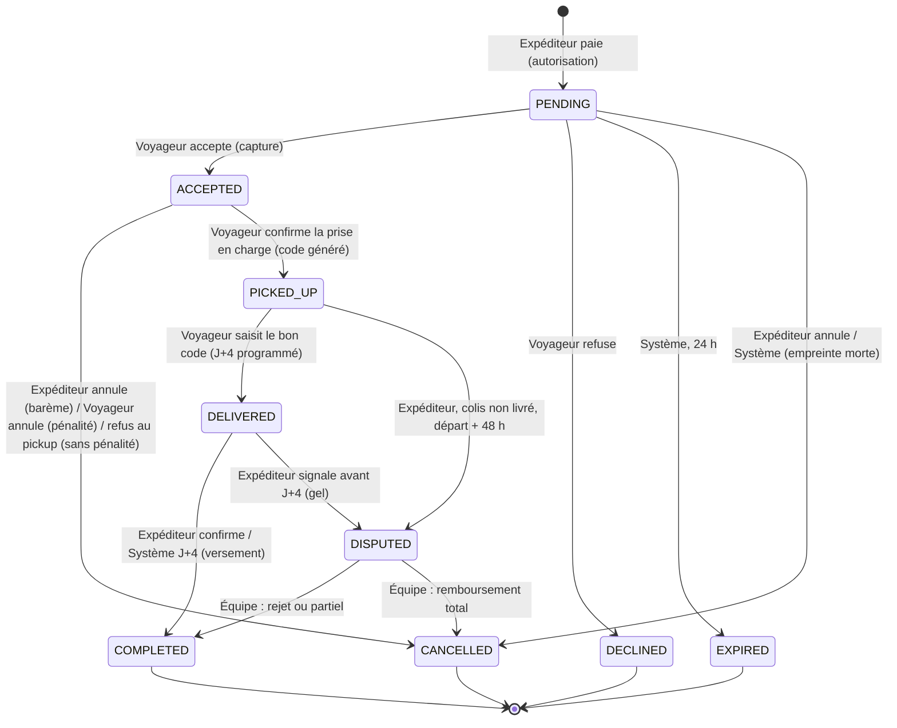
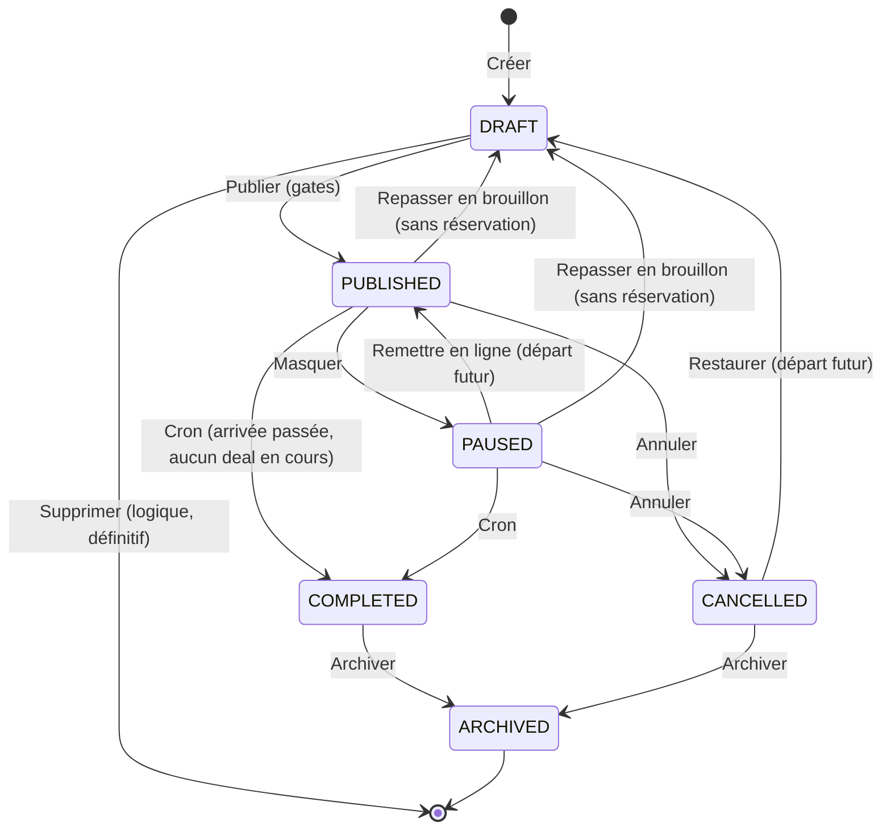

# YAMBA — Documentation métier et fonctionnelle complète (côté membres : Expéditeur, Voyageur, destinataire)

> **Lot 1 — livrable de référence.** Ce document décrit ce que la plateforme Yamba fait réellement pour ses membres, tel que le code et ses tests le font au 5 septembre 2026 (branche `dev`, chantiers B1→B5, C-PR1→C-PR8c, F-PR1→F-PR3, D35, D65→D71 livrés). Il est écrit pour un développeur junior ou un nouveau chef de produit qui n'a pas accès au code : chaque comportement décrit a été vérifié dans une source (règles métier V2, documentation métier cumulative, registre des décisions D1→D71 et arbitrages A1→A145, spécifications, moteur de prix, catalogue des paramètres) ou dans le code lui-même.
>
> **Hiérarchie de vérité appliquée** : le code et ses tests priment sur le registre, qui prime sur les règles métier, qui priment sur les synthèses. Quand une documentation et le code divergent, la divergence est signalée explicitement et c'est le comportement du code qui est décrit. Les points non implémentés ou laissés en « porte » (ouverts pour plus tard, marqués 🚪 dans le registre) sont indiqués comme tels : **rien dans ce document n'affirme un comportement qui n'a pas été observé**.
>
> **Registre de rédaction** : le document emploie un registre neutre. Les textes cités entre guillemets sont ceux que le membre voit à l'écran (la plateforme, elle, tutoie ses membres — décision D45). Un seul mot par rôle : **Voyageur** (celui qui transporte) et **Expéditeur** (celui qui confie un colis) — jamais « Tripper » ni « Yamber », conformément à A144. Les montants sont donnés en centimes et en euros.

---

## Sommaire

1. [Vision, proposition de valeur, acteurs, glossaire, modèle économique, périmètre](#1-vision-proposition-de-valeur-acteurs-glossaire-modèle-économique-périmètre)
2. [Parcours détaillés écran par écran](#2-parcours-détaillés-écran-par-écran)
   - 2.1 Inscription (code par email, Google, consentement) · 2.2 Connexion et sessions · 2.3 Mot de passe · 2.4 Profil et page publique · 2.5 Devenir Voyageur (onboarding et Stripe Connect) · 2.6 Publier un trajet · 2.7 Cycle de vie d'un trajet · 2.8 Recherche · 2.9 Alertes de route · 2.10 Favoris et Voyageurs suivis · 2.11 Réserver (assistant en 4 étapes) · 2.12 Le devis et la protection · 2.13 Les plafonds du compte neuf · 2.14 La demande côté Voyageur et l'acceptation sous 24 h · 2.15 Le paiement (autorisation puis capture) · 2.16 Messagerie, rendez-vous et numéro · 2.17 La prise en charge (checklist, photos, refus) · 2.18 Le transit (jalons) · 2.19 Le code de livraison · 2.20 La remise et la période de vérification · 2.21 Le versement · 2.22 Les annulations · 2.23 Litige et médiation · 2.24 Notation double-aveugle · 2.25 Réputation visible · 2.26 Page destinataire · 2.27 Signalement · 2.28 Données personnelles · 2.29 Préférences · 2.30 Maintenance vue par le membre · 2.31 Matrice complète des emails et notifications
3. [Les machines d'état : réservation et trajet](#3-les-machines-détat--réservation-et-trajet)
4. [Toutes les règles de gestion, consolidées par domaine](#4-toutes-les-règles-de-gestion-consolidées-par-domaine)
5. [Cas de figure de bout en bout](#5-cas-de-figure-de-bout-en-bout)
6. [Paramètres métier et invariants figés](#6-paramètres-métier-et-invariants-figés)
7. [Recommandations d'expert (hors périmètre livré)](#7-recommandations-dexpert-hors-périmètre-livré)
8. [Annexe — divergences constatées entre documentation et code](#8-annexe--divergences-constatées-entre-documentation-et-code)

---

## 1. Vision, proposition de valeur, acteurs, glossaire, modèle économique, périmètre

### 1.1 Ce qu'est Yamba

Yamba est une **place de marché entre particuliers pour le transport de colis légers**. Un Voyageur qui prend l'avion (ou le train, ou la voiture) vend les kilos de franchise bagage qu'il n'utilise pas ; un Expéditeur lui confie un colis, le paie en ligne, suit la livraison, et le destinataire reçoit le colis à l'arrivée contre un code à six chiffres. Le modèle est celui du covoiturage appliqué au colis : la plateforme organise la rencontre, sécurise l'argent, fournit les preuves, arbitre les litiges.

Le positionnement de marque est **universel** : Yamba n'est pas une application « diaspora », même si les premiers corridors sont franco-africains (le corridor de démonstration est Paris → Brazzaville). Le marché informel de référence sur ces corridors — appelé « GP » — facture au kilo, entre 8 et 15 € le kilo : c'est le standard mental des utilisateurs et c'est pourquoi **le prix Yamba est un prix au kilo** (décision D13).

La proposition de valeur, telle que la plateforme la formule elle-même sur ses écrans d'authentification (trois promesses, jamais un chiffre inventé — A60) :

| Promesse | Ce qui la tient dans le produit |
|---|---|
| **Un compte vérifié** | Inscription par code envoyé à l'adresse email, ou identité Google vérifiée côté serveur ; le Voyageur passe par Stripe Connect (identité et RIB) avant de pouvoir accepter de l'argent. |
| **Débité seulement à l'acceptation** | La carte de l'Expéditeur est *autorisée* (empreinte) à la demande et *capturée* (débitée) uniquement quand le Voyageur accepte ; un refus ou une expiration libère l'empreinte sans débit. |
| **Garantie Yamba** | Code de remise à six chiffres, photos à chaque étape, suivi, paiement bloqué jusqu'à la livraison, protection étendue optionnelle jusqu'à 500 €. |

### 1.2 Les acteurs

| Acteur | Ce qu'il fait | Ce qu'il voit | Compte Yamba |
|---|---|---|---|
| **Voyageur** (`carrier` dans le code) | Publie un trajet (mode, dates, prix au kilo, capacité, familles acceptées), reçoit des demandes, accepte ou refuse sous 24 h, inspecte et photographie le colis à la remise, confirme éventuellement des jalons de voyage, saisit le code du destinataire, est versé à J+4. | Ses demandes et ses colis, son gain **net**, l'état de ses versements. **Jamais** le prix total payé par l'Expéditeur, **jamais** le code de livraison. | Obligatoire, avec un profil Voyageur et un compte Stripe Connect pour accepter. |
| **Expéditeur** (`shipper`) | Cherche un trajet, réserve un colis (assistant en 4 étapes), paie, prépare le colis, remet le colis au Voyageur, transmet le code au destinataire, vérifie la livraison (confirme, laisse courir ou signale), note le Voyageur. | Son devis figé (deux lignes : transport, service & protection), l'état de son paiement, le code de livraison (après la prise en charge), les photos de prise en charge. | Obligatoire pour réserver. |
| **Destinataire** (`recipient`) | Reçoit le colis. Détient le code que l'Expéditeur lui a transmis et le donne au Voyageur en main propre. Peut suivre l'avancée du colis via un lien partagé par l'Expéditeur. | Une page publique minimale (prénoms, corridor, dates, jalons). Jamais une adresse, un numéro, le code, une photo, un montant. | **Aucun compte.** C'est un tiers dont les données (prénom, nom, téléphone, email facultatif) sont fournies par l'Expéditeur et effacées 30 jours après la fin du deal. |
| **Yamba** (`SYSTEM` et `ADMIN`) | Le système exécute les automatismes (expiration à 24 h, complétion à J+4, versements, rappels, purges) ; l'équipe (back-office séparé, hors périmètre de ce lot) arbitre les litiges, vérifie les billets, masque des trajets, sanctionne des comptes, règle les paramètres. | — | — |

Un même compte peut cumuler les deux rôles membres : un Voyageur peut aussi expédier, un Expéditeur peut devenir Voyageur. Le risque interne (TrustScore, D71) est celui du compte, tous rôles confondus.

### 1.3 Glossaire

| Terme | Définition |
|---|---|
| **Trajet** (`Trip`) | L'annonce publiée par un Voyageur : origine, destination, dates, mode de transport, prix au kilo, capacité en kilos, position sur les familles de colis, forfaits de bagage entier, lieux de remise et de livraison, justificatifs. Un trajet peut porter plusieurs réservations. |
| **Deal / Réservation / Envoi** (`Booking`) | Le contrat entre un Expéditeur et un Voyageur pour **un** colis sur **un** trajet. L'écran Voyageur dit « Deal », l'écran Expéditeur dit « envoi » ou « demande ». Un booking = un colis (D23) : deux colis = deux réservations. |
| **Demande** | Une réservation au statut PENDING : l'Expéditeur a payé (autorisation), le Voyageur a 24 h pour répondre. |
| **Snapshot de prix** | La photographie complète du devis figée dans la réservation à sa création (D17). Un changement ultérieur du trajet ou des paramètres ne la modifie jamais. |
| **Capacité / kilos restants** | `capacityKg` déclarée par le Voyageur ; `reservedKg` compteur serveur incrémenté à chaque demande ; kilos restants = capacité − réservés, toujours dérivés, jamais stockés. |
| **Famille de colis** | L'une des huit natures de contenu (Documents & papiers, Vêtements & textile, Alimentaire sec & scellé, Électronique & appareils, Cosmétiques & soins, Pièces & outillage, Jouets & puériculture, Accessoires & divers). Elle qualifie le risque et la conformité, **jamais le prix**. |
| **Classe de taille S / M / L** | Qualification visuelle du volume : S « de l'enveloppe à la boîte à chaussures » (×1,00), M « tient dans un sac cabine » (×1,10), L « occupe une demi-valise » (×1,25). Jamais de dimensions demandées. |
| **Bagage entier** | Produit forfaitaire : bagage soute 23 kg ou bagage cabine 12 kg, à prix fixe fixé par le Voyageur, consommant sa franchise nominale sur la capacité. |
| **Transport / Service & protection** | Les deux lignes du prix Expéditeur. Transport = ce que le Voyageur touche (son net). Service & protection = commission Yamba (12 %, plancher 3 €) + prime de Garantie étendue (6 €) le cas échéant. |
| **Garantie Yamba** | La protection du colis. « Protection de base » incluse (non-livraison couverte, paiement bloqué jusqu'à la remise) ; « Garantie Yamba 500 € » optionnelle (perte, vol, casse, plafond 500 €, prime 6 €). Le mot « assurance » est interdit dans le produit tant qu'aucun contrat d'assureur n'est signé (GAR-02). |
| **Code de livraison** | Six chiffres générés par le serveur à la prise en charge, montrés à l'Expéditeur seul, saisis par le Voyageur à la remise. Jamais dans un email, un événement, une vue Voyageur, ni un message du fil. |
| **Prise en charge / pickup** | La remise physique du colis par l'Expéditeur au Voyageur, avec inspection (checklist en cinq points) et photos. |
| **Jalons de transit** | Trois confirmations facultatives du Voyageur : à l'aéroport → décollage → atterrissage. |
| **Période de vérification** | Les quatre jours après la remise (J+4) pendant lesquels l'Expéditeur peut confirmer, ne rien faire ou signaler. |
| **Versement / payout** | Le transfert du net du Voyageur vers son compte Stripe Connect, à COMPLETED. « Versement envoyé » n'est pas « argent reçu » : le compte bancaire est crédité sous 2 à 7 jours. |
| **Litige / signalement de deal** | L'ouverture d'un dossier `YAM-XXXX` par l'Expéditeur, qui gèle le versement et déclenche la médiation. À ne pas confondre avec le **signalement** (SIG) d'un trajet, d'un profil ou d'un message, geste de modération sans effet sur l'argent. |
| **Retenue** | La part (50 %) conservée quand l'Expéditeur annule à moins de 48 h du départ ; elle revient au Voyageur au prorata de sa part nette. |
| **Réputation visible** | Niveau public (Nouveau / Confirmé / Top) et faits (deals terminés, moyenne des avis révélés, annulations tardives), explicables. |
| **TrustScore** | Score de risque interne 0..100, jamais montré au membre, qui plafonne les comptes neufs ou à risque et éclaire le support. |
| **Sudo** | La fenêtre de 15 minutes ouverte par un code reçu par email, exigée avant un geste sensible (mot de passe, email, Stripe, export, suppression). |
| **Fil / conversation** | La messagerie d'un deal, ouverte à l'acceptation, avec un objet « rendez-vous » et la révélation tardive du numéro. |

### 1.4 Le modèle économique

Le revenu de Yamba est **une commission unique, payée par l'Expéditeur, en sus du transport** (D16) :

| Élément | Règle | Exemple |
|---|---|---|
| Transport | `€/kg × poids facturable × coefficient de taille × (1 + supplément de famille)`, avec un plancher de 8,00 € par colis et un poids facturable minimum de 0,5 kg | 2,5 kg en S à 11,50 €/kg → 2 875 centimes = 28,75 € |
| Commission | 12 % du transport, jamais moins de 300 centimes (3,00 €) | 12 % de 2 875 = 345 centimes = 3,45 € |
| Prime de Garantie étendue | 600 centimes (6,00 €) si « Garantie Yamba 500 € » choisie, sinon 0 | — |
| **Total Expéditeur** | transport + commission + prime | 3 220 centimes = **32,20 €** (38,20 € avec la Garantie) |
| **Net Voyageur** | = le transport, exactement | 28,75 € |

Les frais du prestataire de paiement (Stripe) sont **absorbés dans la commission** et ne sont jamais affichés séparément. La prime de protection est un **flux comptable distinct** de la commission dès le premier jour (GAR-04) : le jour où un assureur portera la Garantie, la prime lui sera reversée sans changer le schéma. Le revenu reconnu par Yamba est la commission plus la prime des deals terminés (RG-FIN-15) ; une retenue conservée, un versement dû ou un remboursement proposé sont des passifs.

La commission vaut aussi sur les bagages entiers (forfait × 12 %) et sur les anciens trajets « par catégorie » encore réservables (RG-C-11). Le plancher de 8 € est du **transport** (il va au Voyageur) : la commission s'applique dessus, pas à la place.

### 1.5 Périmètre v1 et hors périmètre

**Dans le périmètre livré (côté membres)** : inscription par code email ou Google avec consentement ; sessions à deux profils, appareils connectés, sudo ; profil et page publique ; onboarding Voyageur avec Stripe Connect Express ; publication et cycle de vie complet d'un trajet (six statuts) ; justificatifs de trajet vérifiés par l'équipe ; recherche avec comparabilité, poids du colis, familles, tri, compteur de vues ; alertes de route ; favoris ; abonnement à un Voyageur ; réservation en quatre étapes avec devis figé, protection, autorisation puis capture ; plafonds de compte neuf ; acceptation / refus / expiration / annulation avec barème ; messagerie avec rendez-vous, réponses rapides, numéro révélé 2 h avant, relance email des non-lus, signalement de message ; prise en charge avec checklist et photos, refus sans pénalité ; jalons de transit ; code de livraison avec verrou et régénération ; remise, période de vérification, rappel J+3, complétion à J+4 ; versement avec rejeu, compensation d'annulation tardive, portefeuille ; litige avec dossier, version du Voyageur, décision, notification ; notation double-aveugle et réputation ; page destinataire ; signalement de trajet et de profil ; export et effacement des données ; préférences (langue, relance email, mesure d'audience) ; mode maintenance en lecture seule ; ~40 emails et notifications.

**Hors périmètre v1 (portes documentées)** : vérification d'identité forte de l'Expéditeur (Stripe Identity, CNF-05) ; véritable assurance portée par un assureur (D22, transitoire « Garantie Yamba ») ; SMS sortant vers le destinataire (D69 4A) ; multi-devise et Mobile Money (D11, DEV-04) ; réservation instantanée (D20 : tout passe par PENDING) ; multi-colis par deal (D23) ; annulation en cascade des deals quand un Voyageur annule son trajet (ANN-03, **non implémentée** — voir §8) ; tolérance de poids au pickup (PRC-07, affichée mais non appliquée : le poids réel n'est pas saisi) ; suppression d'un message envoyé (A142) ; retrait d'un signalement ; temps réel par websocket (sondage court) ; locales autres que FR/EN ; applications mobiles (jalons 4 et 5).

Sources : `context/YAMBA-SPECIFICATION-COMPLETE.md` §1–2, §16 ; `context/YAMBA-REGLES-METIER-V2.md` (COM, GAR, DEV) ; `context/YAMBA-MOTEUR-PRIX.md` §1–4 ; `context/YAMBA-REGISTRE-DECISIONS-ROADMAP-v1.3.md` (D13, D16, D17, D22, D23, D45, A144) ; `packages/libs/pricing/src/index.ts` ; `docs/SPECIFICATIONS-WORKFLOW-BOOKING-YAMBA.md` §1.

## 2. Parcours détaillés écran par écran

Convention de lecture : chaque sous-section décrit l'écran tel que le membre le voit (titres et boutons cités entre guillemets, en français), puis ce que le serveur fait réellement, puis les règles et les cas limites. Les identifiants d'erreur (`QUOTE_DIVERGENCE`, `NEW_ACCOUNT_CAP`…) sont ceux de l'API ; le membre ne les voit jamais tels quels, il voit la phrase traduite.

### 2.1 Inscription : code par email, Google, consentement

**Écran « Inscription » — « Crée ton compte Yamba »**. Le formulaire demande : prénom, nom, adresse email, mot de passe, et **une case unique d'acceptation** des Conditions générales et de la politique de confidentialité (les versions des textes sont enregistrées avec l'accord : `termsVersion`, `privacyVersion`). Sans la case, l'inscription est refusée par le serveur (`termsAccepted` doit valoir `true`).

Ce qui se passe :

1. Le serveur vérifie le mot de passe contre des règles nommées une à une : au moins 8 caractères, une minuscule, une majuscule, un chiffre, un caractère spécial ; pas une date ; pas de suite ni de répétition ; **pas le prénom, le nom ni l'adresse email** (accents ignorés, fragments d'au moins 3 caractères). Le message affiché nomme **la** règle violée, dans la langue de l'interface, sous le champ concerné — jamais « ne respecte pas tous les critères » (RG-A-02, A51). Un email déjà utilisé donne « Un compte existe déjà avec cet e-mail » sous le champ email.
2. L'inscription est mise **en attente** (30 minutes) et un **code à six chiffres** est envoyé à l'adresse (« Ton code d'activation Yamba », valable **10 minutes** ; l'écran affiche le même compte à rebours « Code valable 10:00 » — RG-A-04). Chaque « Renvoyer le code » prolonge l'attente de 30 minutes (RG-A-03).
3. L'écran de saisie du code applique le barème par paliers de cinq (RG-A-01) : les quatre premières erreurs annoncent le nombre d'essais restants ; la 5ᵉ invalide le code et bloque la saisie 1 minute (il faut redemander un code) ; la 10ᵉ bloque 30 minutes et déclenche l'email « activité suspecte » ; la 15ᵉ et chacune des suivantes bloquent 24 heures. Le compteur vit 24 heures et **un renvoi de code ne le remet pas à zéro**.
4. Au bon code, le compte est créé, l'accord est journalisé (`ConsentLog` avec versions, horodatage serveur), l'email « Bienvenue » part, la langue de l'interface au moment de l'inscription devient la **langue préférée** du compte (D44), et la session s'ouvre.

**Connexion Google** (D47). Le bouton officiel Google ouvre la fenêtre Google ; le serveur **vérifie** le jeton d'identité (audience, signature, `email_verified` obligatoire). Trois issues :

| Situation | Résultat |
|---|---|
| Identité Google déjà connue | Connexion directe (« Content de te revoir »). |
| Compte Yamba existant avec la même adresse vérifiée | Rattachement automatique puis connexion (toast « relié à Google ») ; les deux chemins fonctionnent ensuite. |
| Nouvelle personne | Écran « Finalise ton compte » — « Google a confirmé ton adresse {email}. Il ne manque que ton accord. » Sans cocher l'accord : rien n'est créé (`CONSENT_REQUIRED`). En cochant : compte créé **sans mot de passe**, identité liée, accord journalisé, email de bienvenue. |

Tant que Google n'est pas configuré sur l'environnement, le bouton reste visible mais inactif : « Connexion Google bientôt disponible ». Facebook : bouton présent, inerte (décision de recette). Un compte Google seul peut se donner un mot de passe par « Mot de passe oublié » ou depuis Sécurité.

**Porte d'identité contextuelle**. Un visiteur qui clique « Réserver », le cœur d'un favori, « Suivre » ou « Partager un trajet » ne quitte jamais la page : une fenêtre « Connecte-toi pour réserver / enregistrer un favori / suivre {prénom} / partager un trajet » s'ouvre par-dessus, avec le formulaire de connexion (email + mot de passe, Google) **à l'intérieur**. Après connexion, le geste engagé reprend (le favori est enregistré, le formulaire de réservation s'ouvre, le suivi est appliqué). « Plus tard », Échap ou un clic sur le fond referment sans conséquence (RG-C-12, RG-C-17 à RG-C-21). « Inscris-toi » reste une page (formulaire long, code par email) avec retour à la page d'origine.

### 2.2 Connexion et sessions

**Écran « Connexion » — « Ravi de te revoir »** : email, mot de passe, et une case **décochée par défaut** « Rester connecté sur cet appareil » avec l'aide « Coché : 7 jours sans activité. Sinon : déconnexion après 60 minutes sans activité. » (A62).

La politique de session (D27, RG-A-13, RG-A-14) a deux profils, appliqués par le serveur :

| | Session standard | « Rester connecté » |
|---|---|---|
| Déconnexion après inactivité | 60 minutes | 7 jours |
| Durée de vie maximale, quelle que soit l'activité | 7 jours | 30 jours |

Le renouvellement silencieux du jeton d'accès (toutes les 15 minutes) ne repousse jamais le plafond. Une session refusée (expirée ou jeton réutilisé : indiscernables) affiche un message neutre. Le chemin Google ouvre toujours une session standard (pas de case).

**Session expirée pendant un geste** : le membre ne voit jamais « Erreur, réessaye ». Une fenêtre « Ta session a expiré » s'ouvre par-dessus la page courante, il se reconnecte sur place et refait son geste (RG-H-05, A89).

**Écran « Sécurité » › « Appareils connectés »** (D65, RG-SES-02) : chaque session est listée avec le navigateur et le système (libellé dérivé de l'agent utilisateur), la dernière activité, l'adresse IP, la mention « connexion mémorisée » le cas échéant, et « cet appareil » pour la session courante. « Déconnecter » coupe un appareil (il devra se reconnecter à sa prochaine action) ; « Déconnecter les autres appareils » coupe tous les autres. Les sessions ouvertes avant ce lot apparaissent « Appareil inconnu » jusqu'à leur prochaine connexion. Un compte **suspendu** par l'équipe voit sa connexion refusée (« Ton compte est suspendu ») et toutes ses sessions révoquées ; un compte **restreint** garde ses sessions mais ne peut plus publier ni réserver (ses deals en cours continuent).

**Les gestes sensibles et la fenêtre sudo** (RG-SES-01, D65 1A). Cinq gestes exigent un code reçu par email même en session active : changer le mot de passe, changer l'adresse email, ouvrir le tableau de bord Stripe (RIB), télécharger ses données, supprimer son compte. La porte « M'envoyer le code » envoie « Ton code de confirmation Yamba » (mêmes paliers de blocage que l'inscription) ; le code accepté ouvre une **fenêtre de 15 minutes liée à cet appareil seulement**. Pendant la fenêtre, un second geste sensible ne redemande pas de code. Techniquement, une route protégée répond `403 SUDO_REQUIRED` et l'écran ouvre la porte puis rejoue le geste.

### 2.3 Mot de passe

**Mot de passe oublié** (visiteur) : saisie de l'email → le serveur répond toujours « code envoyé » (il ne révèle jamais si un compte existe) → email « Ton code de réinitialisation Yamba » (10 minutes) → saisie du code (mêmes paliers) → nouveau mot de passe (mêmes règles de force). Pour un compte Google sans mot de passe, ce parcours **crée** un mot de passe ; les deux chemins fonctionnent ensuite (J7).

**Changer le mot de passe** (membre, Sécurité) : sous sudo ; le nouveau mot de passe doit respecter les règles et **différer** de l'actuel ; toutes les **autres** sessions sont révoquées ; un email « mot de passe modifié » est envoyé (RG-SES-03).

**Changer l'adresse email** (Sécurité) : sous sudo, en deux temps (RG-SES-04). La nouvelle adresse doit être libre (409 « déjà utilisée par un autre compte ») ; elle reçoit « Confirme ta nouvelle adresse » (code, 10 minutes, demande gardée 10 minutes) ; la confirmation applique le changement, révoque les autres sessions et prévient l'**ancienne** adresse (« L'adresse email de ton compte a changé », sans lien). Une identité Google liée garde son adresse d'origine : la connexion Google continue de fonctionner.

### 2.4 Profil et page publique (D67)

**Écran « Profil »** (tableau de bord) : avatar (initiale par défaut), prénom, nom (2 à 40 caractères chacun), date de naissance (privée, jamais affichée, passée, **16 ans au moins**, pré-remplit l'identité Stripe du Voyageur), deux bascules « Page publique » et « Afficher ma ville ». Un Voyageur avec page voit en plus « nom affiché » et « présentation » (300 caractères au plus) et le bouton « Voir mon profil public ». Un Expéditeur pur n'a ni nom d'affichage ni présentation (RG-PRO-02).

**Avatar** : image de 2 Mo au plus (JPEG, PNG, WebP), téléversée par le navigateur puis déclarée au serveur, qui vérifie qu'elle est hébergée sur le compte d'images de Yamba (une URL étrangère est refusée). Changer ou retirer la photo supprime l'ancien fichier ; l'effacement du compte la supprime aussi (RG-PRO-04).

**L'adresse de la page publique** (`/u/<slug>`) est immuable : un lien partagé ne meurt jamais (RG-PRO-01).

**Page publique d'un membre** : prénom + initiale, avatar, « Membre depuis », ville (si autorisée), et deux blocs : « En tant que Voyageur » (présentation, badges « Vérifié » et « Top Voyageur », routes fréquentes, trajets disponibles avec aperçu, avis révélés avec pouces des critères et « Signaler cet avis ») et « En tant qu'expéditeur » (faits et badge). Chaque bloc porte le **niveau de réputation** avec ses critères en info-bulle, la ligne de faits (deals terminés, moyenne sur N avis, annulations tardives) et le critère du niveau suivant (RG-NOTE-11). Les compteurs d'abonnés et d'abonnements sont affichés. Le bouton « Suivre » (avec l'alerte « M'alerter de son prochain trajet ») ouvre la porte d'identité pour un visiteur ; sur son propre profil, il laisse place à « Modifier mon profil ». Le propriétaire ne se voit jamais proposer de discuter avec lui-même.

**Page masquée** (RG-PRO-05) : la bascule « Page publique » désactivée fait répondre « Profil introuvable » (404) à tout le monde sauf au propriétaire, qui la voit avec la mention « masquée ». Les trajets publiés du membre **restent visibles** avec son prénom : masquer sa page n'est pas se cacher d'un deal (l'aide de la bascule le dit).

### 2.5 Devenir Voyageur : onboarding et Stripe Connect

**Écran « Devenir Voyageur »**, deux étapes : « Profil » puis « Paiements ».

1. **Profil** : nom d'affichage, présentation, téléphone (E.164), adresse principale (autocomplétion Google Places). La sauvegarde crée la page Voyageur (`CarrierPage`), passe l'étape à `STRIPE` et le statut Voyageur à `ONBOARDING`.
2. **Paiements** : « Configurer Stripe » crée un compte **Stripe Connect Express** (le RIB, l'identité et l'activité sont saisis chez Stripe, jamais chez Yamba) et renvoie vers le parcours Stripe par un lien à usage unique. Au retour (`/carrier/onboarding/stripe/callback`), le serveur relit le compte : si les informations sont soumises et les encaissements activés, l'étape passe à `COMPLETE`, le statut Voyageur à `ACTIVE`, et l'email « Ton profil Voyageur est actif » part.

Ce que l'onboarding conditionne — et ce qu'il ne conditionne pas (D31, RG-V-02) :

| Geste | Exige l'onboarding complet ? |
|---|---|
| Créer et **publier** un trajet | **Non.** Publier est libre (le contrôle a été retiré de la publication). |
| **Accepter** une demande | **Oui.** Sans profil et sans compte Stripe aux encaissements activés : refus `CARRIER_ONBOARDING_REQUIRED`, message « {montant} t'attendent — finalise ton profil pour accepter », et l'écran emmène vers l'onboarding (RG-F-06). Le deal reste PENDING et son compte à rebours court. |
| Recevoir un **versement** | Le compte doit avoir les **virements** activés (`payouts_enabled`) : sinon le versement reste « en attente : finalise ton compte Stripe » et est rejoué automatiquement (RG-PAY-06). |

Un Voyageur qui a commencé sans finir reçoit des **rappels** par email à 24 h, 72 h et 7 jours après la création de sa page (cron horaire), puis plus rien. Quand Stripe déclare le compte prêt (`account.updated`), les drapeaux du Voyageur sont mis à jour sans qu'il repasse par l'onboarding et ses versements bloqués repartent sans clic (RG-H-02). « Voir mes virements sur Stripe » (Finances › Portefeuille) ouvre le tableau de bord Stripe Express dans un nouvel onglet (sous sudo) ; sans compte : « finalise d'abord ton compte ».

### 2.6 Publier un trajet : « Créer un trajet »

Trois étapes : « Trajet », « Conditions », « Vérification ». Un **brouillon** peut être sauvegardé incomplet à tout moment (« Brouillon ») ; aucune règle ci-dessous ne bloque un brouillon (RG-B-28) — sauf la cohérence bagage / capacité, refusée même en brouillon (RG-B-29).

**Étape 1 « Votre trajet »** — « Mode de transport, itinéraire et dates. » Mode : avion, train ou voiture (avec, selon le mode : vol direct ou avec escale ; train direct ou avec correspondance ; voiture directe ou détour possible d'un commun accord). Aller simple ou aller-retour. Origine et destination par autocomplétion (ville, pays, coordonnées → **fuseaux horaires** dérivés, D24). Dates et heures **locales à chaque lieu** (départ 14 h = 14 h à l'aéroport de départ) ; le serveur calcule les instants UTC qui servent à toute comparaison (expiration, complétion, fenêtres).

**Étape 2 « Vos conditions »** — quatre blocs de prix, puis les lieux :

| Bloc | Ce que le Voyageur saisit | Règle |
|---|---|---|
| **Prix au kilo** | Un seul prix, curseur 5 → 20 €/kg par pas de 0,50, saisie libre possible, pré-rempli à la médiane suggérée arrondie au 0,50 € | Obligatoire, > 0. « Ton prix = ton net » (la commission est payée par l'Expéditeur). Une **suggestion** indicative (fourchette basse / médiane / haute, « Pourquoi ce prix ? ») et un verdict « Prix juste » / « Sous le marché — tu laisses de l'argent » / « Au-dessus — moins de demandes probables » ; elle ne bloque jamais (RG-B-05 à RG-B-08). |
| **Capacité** | Kilos disponibles, curseur 2 → 30 kg, pré-rempli à 12 kg | Obligatoire, > 0. Réservée au fil des demandes par un compteur serveur, **immuable après publication** (RG-B-09, RG-B-10). Texte d'aide : « Aucun envoi ne te rapporte moins de 8 € » (plancher D32) et la tolérance de poids ±10 % au pickup (information, RG-B-11). |
| **Familles de colis** | Pour chacune des 8 familles : interrupteur Accepté / Refusé, et pour une famille acceptée un supplément optionnel (curseur 5 → 50 % par pas de 5, 20 % par défaut ; entier 1..100 accepté) | Par défaut tout accepté sans supplément, section repliée « Toutes les familles acceptées ». Refus et suppléments sont **visibles avant la réservation** (recherche, page trajet, assistant) (RG-B-12 à RG-B-16). |
| **Bagage entier** | Forfait « bagage soute 23 kg » et/ou « bagage cabine 12 kg », en euros | Optionnels, > 0 si renseignés. Proposables **seulement** si la capacité contient la franchise (≥ 23 kg / ≥ 12 kg) : sinon la ligne est grisée « Monte ta capacité à 23 kg pour proposer ce forfait », le montant est mémorisé mais jamais envoyé. Équivalent au kilo affiché (« ≈ 4,35 €/kg »). Le serveur refuse une offre incohérente, brouillon compris (RG-B-17 à RG-B-19, RG-B-29, RG-B-30). |
| **Gain net** | — | Carte « Si tes 12 kg sont réservés — Tu gagnes 138,00 € » (capacité × prix, sans les forfaits), mention « versé à J+4 après livraison confirmée » (RG-B-20, RG-B-21). |
| **Lieux** | Au moins un lieu de remise et un lieu de livraison (aéroport, gare, zone de ville ; exact, rayon, ville entière) | Obligatoires pour publier. |
| **Options et message** | Message aux Expéditeurs | « Réservation instantanée » n'est plus proposée : « Chaque demande passe par ton accord — tu réponds sous 24 h » (RG-B-31, D20). |

La suggestion de prix (V1.5, calculée côté front) : base du corridor (15 zones-marché, table éditable ; Paris → Brazzaville ≈ 12,11 €/kg, Paris → Amsterdam ≈ 5,85, trajet intérieur ≈ 55 % de la base borné 3–6 €/kg, corridor inconnu 11 €) × 1,05 si vol direct × 0,95 si départ ≤ 3 jours (0,98 si ≤ 7 jours) ; basse = ×0,90, haute = ×1,15. C'est une hypothèse de marché, pas une donnée observée (§7).

**Étape 3 « Vérification »** : carte « Prix & capacité » (prix, kilos, gain, familles surchargées / refusées, forfaits), documents, et **l'aperçu public** tel que l'Expéditeur le verra. **Justificatifs** (« Documents ») : jusqu'à 5 fichiers de 5 Mo au plus (paramètres `documents.*`), typés billet (`TICKET_PROOF`), itinéraire, véhicule, identité, autre. Un billet déposé passe « à vérifier » ; l'équipe le valide (badge public « Billet vérifié ») ou le rejette avec un motif fermé (illisible, dates différentes, nom différent, document non recevable) — email dans la langue du Voyageur, nouveau dépôt possible. **Le billet reste informatif** : rien n'est bloqué sans billet vérifié (RG-ADM-21).

**« Publier le trajet »** — les gates serveur, dans l'ordre : trajet en brouillon et date de départ non passée ; origine, destination et date de départ renseignées ; **un moteur de prix complet** (prix au kilo > 0 **et** capacité > 0 ; à défaut, pour un ancien trajet, au moins un prix par catégorie — l'ancien moteur prime jamais sur le nouveau) ; cohérence bagage / capacité ; au moins une catégorie acceptée **seulement** pour l'ancien moteur ; au moins un lieu de remise et un lieu de livraison. Le profil Voyageur et Stripe **ne sont plus exigés ici** (voir §8, divergence avec RG-01 de la documentation du cycle de vie). À la publication : `publishedAt` posé, prix comparable recalculé (D33), notifications aux alertes de route et aux abonnés (§2.9, §2.10), compteur « trajets publiés » du Voyageur incrémenté.

### 2.7 Cycle de vie d'un trajet : « Mes trajets »

**Écran « Mes trajets »** : en tête, la bande **« À traiter »** trans-trajets (« Demande de {prénom} · Répondre », « Pickup avec {prénom} · Faire le pickup », « Remise à {prénom} · Saisir le code », « Note ton Expéditrice {prénom} · Noter »), dans l'ordre d'urgence, puis chaque trajet avec son badge de statut et, dessous, la section « Demandes et colis » (lignes cliquables : Expéditeur, colis, gain net, statut). L'historique est replié par défaut. Un bandeau en tête totalise les versements bloqués par un compte Stripe non prêt (« finalise ton compte Stripe »).

Les six statuts et leurs libellés (D28, appliqué le 05/09/2026) :

| Statut | Libellé | Signification |
|---|---|---|
| `DRAFT` | **Brouillon** | Créé, invisible. |
| `PUBLISHED` | **En ligne** | Visible des Expéditeurs, réservable. |
| `PAUSED` | **Masqué** | Retiré de la recherche par le Voyageur ; les réservations déjà prises continuent. |
| `COMPLETED` | **Terminé** | Le voyage est fini ; atteint automatiquement, jamais par le Voyageur. |
| `CANCELLED` | **Annulé** | Annulé par le Voyageur ; restaurable en brouillon tant que le départ n'est pas passé. |
| `ARCHIVED` | **Archivé** | Rangé définitivement ; irréversible ; « Dupliquer » reste possible. |

Le menu d'actions n'affiche que ce que la machine d'état serveur autorise (`allowedActions`) : « Publier », « Masquer » / « Remettre en ligne », « Repasser en brouillon », « Annuler », « Restaurer », « Archiver », « Supprimer » (brouillons seulement, suppression logique définitive), « Dupliquer » (toujours), « Modifier » (brouillon toujours ; en ligne ou masqué **uniquement sans réservation active** — dès la première demande, le trajet est intouchable : la seule issue est l'annulation). La matrice complète est en §3.2. Sur la page publique de son propre trajet, le Voyageur voit « C'est votre trajet » + « Modifier le trajet », jamais « Réserver » (RG-B-33).

**Masqué par Yamba** (RG-ADM-22) est distinct de « Masqué » par le Voyageur : l'équipe peut retirer un trajet de la recherche et de sa page publique (404) avec un motif interne ; les réservations en cours continuent ; le Voyageur le voit dans son espace avec un bandeau rouge « Trajet masqué par Yamba » et reçoit un email au motif générique ; il ne peut pas le lever lui-même ; c'est réversible (« de nouveau visible »). Yamba **n'annule jamais** un trajet à la place du Voyageur (RG-ADM-23).

**Complétion automatique** (RG-16, RG-17) : un cron quotidien (03:15 UTC) passe « Terminé » les trajets en ligne ou masqués dont l'arrivée (à défaut le départ) est passée **et** qui n'ont plus aucun deal en cours. Un deal **en litige** ne bloque pas la complétion (le voyage est fini, le litige gèle le versement de ce deal-là) ; un deal accepté, pris en charge ou livré la bloque. Le versement n'a aucune influence sur le statut du trajet (RG-19).

**Annulation d'un trajet avec réservations actives** : la machine l'autorise ; le contrôleur enregistre l'annulation et incrémente le compteur d'annulations du Voyageur, **mais aucune cascade n'est exécutée sur les deals** (ni annulation, ni remboursement, ni notification des Expéditeurs). C'est une lacune connue (ANN-03 / RG-09 « à venir »), détaillée en §8 et §7. Un Voyageur qui doit renoncer à un colis accepté doit annuler **le deal** (§2.22), ce qui rembourse l'Expéditeur intégralement.

Sources : `context/YAMBA-DOC-METIER.md` (#82 RG-B-*, D67 RG-PRO-*, fix auth RG-A-*, D65 RG-SES-*, D47 RG-A-09→12, A62 RG-A-13/14) ; `docs/DOC-METIER-TRIP-LIFECYCLE.md` ; `docs/YAMBA-DOC-METIER-SESSION-POLICY.md` ; `apps/trip-service/src/services/trip-state-machine.ts` ; `apps/trip-service/src/controllers/trip.controller.ts` (publishTrip, cancelTrip) ; `apps/trip-service/src/services/pricing-gate.ts` ; `apps/auth-service/src/controller/carrier.controller.ts` ; `apps/auth-service/src/cron/onboarding-reminder.cron.ts` ; `packages/libs/api-contracts/src/auth/member-auth.schema.ts` ; `apps/user-ui/messages/fr/{auth,myTrips,carrier,dashboard}.json` ; registre D27, D31, D44, D45, D47, D57, D65, D67, A50–A54, A58–A64, A89, A108.

### 2.8 Rechercher un trajet

**Écran « Résultats disponibles »** (`/search`). La barre de recherche prend une ville de départ, une ville d'arrivée et une date ; le titre s'adapte (« Trajets pour Paris → Brazzaville », « Trajets au départ de Paris », « Trajets le 12 juin 2026 », « Tous les trajets disponibles »). Onglets de mode : « Tout », « Avion », « Train », « Voiture ». Panneau « Filtres » (feuille du bas sur mobile).

Ce que la recherche fait :

| Fonction | Comportement | Règle |
|---|---|---|
| **Votre colis** (poids 0,5 → 30 kg) | Chaque carte affiche « ≈ 40 € tout compris pour 3 kg » (transport + service calculés par le moteur unique pour ce poids) ; le tri par prix se fait **pour ce poids** ; les trajets au kilo dont la capacité totale est insuffisante sont exclus ; ceux dont les kilos restants sont insuffisants affichent « Plus assez de place ». Le poids est mémorisé sur l'appareil et pré-remplit la réservation. « Tout effacer » le remet à 2 kg. | RG-S-02bis |
| Sans poids saisi | Prix **comparable** = coût d'un colis de référence de **2 kg** : `max(2 × €/kg, 8 €)` pour un trajet au kilo, prix le plus bas pour un ancien trajet par catégorie. Exemple : 12 €/kg → 24 € ; 3 €/kg → 8 € (plancher). | RG-S-01, D33 |
| Tri | « Date la plus proche », « Prix le plus bas » (libellé « pour un colis de 2 kg » ou « pour votre colis de 3 kg »), « Mieux notés ». Un trajet sans aucun prix n'apparaît pas dans le tri par prix. | RG-S-02 |
| **« Que voulez-vous envoyer ? »** (8 familles) | Cocher une famille **exclut** les trajets dont le Voyageur la **refuse** ; plusieurs cochées = le trajet doit toutes les accepter ; un trajet sans position (ancien moteur, ou tout accepté) est compatible avec toutes. Un supplément est annoncé sur la carte **avant** le clic (« Électronique : +20 % »). Chaque puce affiche le nombre de trajets compatibles ; une puce à 0 est désactivée. | RG-S-03 → RG-S-06 |
| Filtres de confiance | « Super tripper » (= niveau Top), « Profil vérifié », « Billet vérifié » : une ligne dont le compte est 0 est **masquée**, pas grisée. | RG-S-08 |
| Ancien filtre par catégorie | Plus proposé ; s'il arrive par une vieille URL, il ne s'applique qu'aux anciens trajets et ne cache jamais un trajet au kilo. | RG-S-07 |
| « Réservation instantanée » | Ni filtre ni badge (tout passe par l'accord du Voyageur). | RG-B-35 |
| Comptes suspendus / trajets masqués par Yamba | Exclus par des filtres de lecture (jamais une écriture croisée). | A106, A108 |

Une carte de trajet au kilo dit : « prix au kilo · 12,00 €/kg · 12 kg dispo · ex. colis 2 kg ≈ 27 € » (RG-B-32, RG-B-34), la durée, le badge « Top Voyageur » le cas échéant, une pastille « n vues » (compteur dédoublonné par visiteur et par jour, « Populaire » à partir de 20 vues, rien à zéro — RG-PIL-04, RG-PIL-10), et le cœur favori. Le plancher est annoncé partout où un prix au kilo apparaît : « Colis léger (enveloppe, passeport, lunettes…) : 8 € minimum, quel que soit le poids » (RG-S-13).

**Page d'un trajet** (`/trips/:id`) : l'offre complète — prix au kilo, kilos encore disponibles, « Votre colis de 3 kg ≈ 40,32 € tout compris » (poids mémorisé), les 8 familles avec leur statut (accepté / +N % / refusé), les forfaits bagage, les lieux de remise et de livraison, le Voyageur (prénom + initiale, niveau, badge billet vérifié, « n vues »), le CO₂ évité **pour le poids du colis**, et les conditions d'annulation **du registre** : 100 % jusqu'à 48 h avant le départ, partiel en deçà, aucune annulation après la remise (RG-S-09 → RG-S-12). Un visiteur ne réserve jamais sans avoir vu un supplément ou un refus. Un trajet supprimé ou masqué par Yamba répond « introuvable » (on ne révèle pas son existence : RG-27). La page compte une vue par visiteur et par jour sans identifier le visiteur (RG-PIL-04) ; si le compteur est indisponible, la page répond sans compteur (RG-PIL-05).

Chaque recherche est comptée par corridor, y compris **sans résultat** (« demande sans offre », signal de recrutement de Voyageurs pour l'équipe — RG-PIL-03), sans donnée personnelle.

### 2.9 Alertes de route : « Mes alertes route »

**Écran « Mes alertes route »** — « Nouvelle alerte · Reçois un email dès qu'un trajet correspond ». Champs : le trajet (origine → destination, autocomplétion), la « Période d'intérêt » (dates), et deux bascules : « Recevoir un email » et « Inclure les trajets proches ». La création est aussi proposée depuis une recherche sans résultat (« Aucun trajet ne correspond ? Créer une alerte pour ce trajet ») et par une bannière de fin de liste (« Reste informé·e des futurs trajets »).

Règles (déduites du code, identifiants nouveaux en §4) :

- Au plus **20 alertes actives** par membre ; au-delà, refus explicite.
- Une alerte expire le lendemain (00:00 UTC) de la fin de sa période d'intérêt, ou **6 mois** après sa création si aucune date n'est donnée ; elle peut être prolongée de 6 mois.
- À chaque publication de trajet, le serveur cherche les alertes actives avec email activé, d'un autre membre que le Voyageur, sur les mêmes pays, et calcule un **score de correspondance** : 100 si le lieu Google est identique ou si pays + ville normalisée correspondent ; 70 si même pays et lieu à moins de **50 km** (retenu seulement si « Inclure les trajets proches » est coché) ; 0 sinon. Les dates du trajet doivent tomber dans la période d'intérêt.
- **Anti-spam** : une alerte n'est pas notifiée deux fois en **24 h** (`lastNotifiedAt`), et un membre effacé ou dont l'adresse est en suppression (rebond dur, plainte) n'est jamais écrit.
- L'email « nouveau trajet correspondant » part dans la langue du destinataire ; la publication du trajet n'échoue jamais à cause d'une notification.

### 2.10 Favoris et Voyageurs suivis

**Favoris** (D46, RG-FAV-01 → RG-FAV-06) : le cœur sur une carte de recherche ou sur la page du trajet bascule immédiatement (optimiste) ; « Mes favoris » liste les trajets mis de côté du plus récent au plus ancien, avec la même carte que la recherche. Un favori est **privé** : le Voyageur n'est jamais notifié, aucun compteur public n'existe. Seul un trajet **en ligne** peut être ajouté (409 « n'est plus disponible » pour un brouillon, un trajet masqué, terminé, annulé ou archivé) ; le retrait est toujours possible ; on ne met pas son propre trajet en favori (le cœur est absent sur sa fiche, 403 sur les cartes) ; un favori **survit à la fin du trajet** (il apparaît comme passé). Un visiteur qui touche le cœur voit la porte d'identité et revient sur la même page.

**Voyageurs suivis** : depuis la page publique d'un Voyageur, « Suivre » (avec « M'alerter de son prochain trajet » coché par défaut) ; « Voyageurs suivis » liste les abonnements avec « Prochain trajet à venir ». À chaque publication d'un trajet par un Voyageur suivi, chaque abonné qui a demandé l'alerte reçoit un email (mêmes exclusions : effacé, adresse supprimée, le Voyageur lui-même). Se suivre soi-même est refusé par le serveur.

### 2.11 Réserver : l'assistant en 4 étapes

Point d'entrée : « Réserver » sur la page du trajet (carte desktop et barre mobile). Un visiteur voit la porte « Connecte-toi pour réserver » par-dessus le trajet et atterrit dans l'assistant après connexion ; l'URL directe `/trips/:id/book` montre la même porte en pleine page (RG-C-12, A58). **Réserver exige un compte** — mais **pas** de vérification d'identité forte (voir §8 : CNF-05 non implémentée).

**Écran « Réservation »**, quatre étapes : « Colis », « Destinataire », « Engagement », « Paiement » (« étape 1 sur 4 »). Desktop : formulaire à gauche, colonne droite collante avec le récapitulatif et le bouton principal ; mobile : feuille du bas avec le total et « Détail ». L'état est conservé dans le stockage de session du navigateur (une rotation d'écran ne perd rien).

**Étape 1 « Décris ton colis »** — « Précision et photos garantissent un envoi sans accroc ».

| Section | Contenu | Règle |
|---|---|---|
| Lieux de rendez-vous | « Tu remets le colis à {prénom} » et « Le destinataire récupère le colis » : choix parmi les lieux proposés par le Voyageur ; pré-sélectionnés s'il n'y a qu'un choix évident. | RG-C-13 |
| Règles d'or | Encart repliable : emballage, contenu fidèle, « **Aucun produit interdit.** Voir la liste complète » (stupéfiants, armes, batteries lithium seules, liquides hors règles cabine, espèces, médicaments hors prescription, denrées périssables, contrefaçons — CNF-01). | CNF-01 |
| « Que voulez-vous envoyer ? » | « Un colis (au kilo) », « Un bagage soute 23 kg », « Un bagage cabine 12 kg » (les deux derniers seulement si le Voyageur les propose). | RG-C-01 |
| Famille du colis | Les 8 familles ; une famille refusée est visible, grisée, barrée, info-bulle « {prénom} ne prend pas cette famille sur ce trajet » ; une famille surchargée affiche « +20 % » avant le choix. | RG-C-02 |
| Poids (kg) | Pré-rempli avec le poids de la recherche, sinon 2 kg ; « {kg} kg encore disponibles sur ce trajet » ; > 30 kg ou > kilos restants → erreur sous le champ, « Continuer » bloqué. | RG-C-03 |
| « Taille — pas besoin de mesurer » | S « enveloppe → boîte à chaussures », M « tient dans un sac cabine », L « occupe une demi-valise ». « À l'œil : le coefficient s'applique au prix au kilo. » | RG-C-04 |
| Valeur déclarée (€) | Entier positif ; plafond de l'indemnisation ; plafonnée pour un compte neuf (§2.13). | GAR-06, D71 |
| Description courte | Au moins 5 caractères (« Ex : 3 t-shirts, 1 pull, du chocolat »). | RG-D-15 |
| Photos du colis | Jusqu'à 6, les deux premières taguées « Contenu » et « Emballé » ; **obligatoires avec la Garantie étendue**. Téléversées **avant** le paiement : si une photo ne part pas, la carte n'est pas débitée et rien n'est créé (RG-P-23). Le Voyageur les voit sur la demande. | RG-C-10 |
| « Protection du colis » | « Protection de base » (incluse) ou « Garantie Yamba 500 € » (+6 €). Sur desktop, ce choix vit dans la colonne droite. | RG-C-10 |

Pour un bagage entier, poids et taille sont masqués : le transport est le forfait (RG-C-09 R9).

**Étape 2 « À qui livrer ? »** — le destinataire n'a pas de compte. Le **téléphone** est saisi en premier (« c'est le canal du code de livraison ») avec un indicatif pays (défaut +33, 20 pays), normalisé en E.164 (« 06 42 18 81 12 » → `+33642188112` ; « 12 » → erreur) — RG-C-15. Prénom et nom obligatoires ; email **facultatif** (RG-D-15). Un encart « Comment se passera la livraison » rappelle le code à six chiffres à transmettre. Le téléphone du destinataire sera communiqué au Voyageur **à la prise en charge**, pas à l'acceptation (RG-P-26, RGP-02).

**Étape 3 « Engagement »** — l'étape juridique : l'encart « comment va se passer la remise » (inspection visuelle, refus possible en cas d'écart, photos du Voyageur), la **Charte Expéditeur** (aucun produit illicite, contenu conforme à la déclaration, obligations douanières), et **une seule case** valant acceptation de la Charte, des Conditions générales et du Contrat de transport (`charterAccepted` / `termsAccepted` doivent valoir `true` ; une demande sans charte est refusée — RG-D-11, CNF-02). L'horodatage est celui du serveur.

**Étape 4 « Paiement »** — le récapitulatif en **deux lignes** (§2.12), le bandeau « Tu n'es débité qu'à acceptation par le voyageur (sous 24 h max) », **un seul composant de paiement** (Stripe Payment Element : carte, Apple Pay, Google Pay selon l'appareil — RG-D-13), et l'encart « Après votre paiement » (24 h pour accepter → code à six chiffres → remise → transport → livraison contre le code). Hors production sans prestataire configuré, un bandeau « Mode test » l'annonce et « Payer » crée le deal (RG-D-14). Les deux « retours » sont distincts : « Retour au trajet » quitte, « Étape précédente » recule (RG-C-16).

« Payer 32,20 € » déclenche la séquence en deux appels décrite en §2.15. Succès : « Demande envoyée ! Le voyageur a 24 h pour accepter » et ouverture du suivi (§2.20). Un ancien trajet « par catégorie » reste réservable avec un sélecteur de catégorie et son prix par colis (RG-C-11).

### 2.12 Le devis : ce que l'Expéditeur paie, ce que le Voyageur touche

Le devis affiché à l'écran et le devis figé par le serveur sont calculés par **le même code** (D34, RG-C-09) avec les **valeurs des paramètres du serveur** (`GET /trips/pricing/params`, RG-PAR-08). Tout est en centimes entiers ; les euros n'existent qu'à l'affichage.

```
poids facturable  = max(poids déclaré, 0,5 kg)
transport brut    = round(€/kg × poids facturable × coef taille × (1 + supplément %))
transport         = max(transport brut, 8,00 €)           ← « Minimum par colis appliqué » si le plancher joue
commission        = max(round(transport × 12 %), 3,00 €)
prime             = 6,00 € si « Garantie Yamba 500 € », sinon 0
Service & protection = commission + prime
TOTAL Expéditeur  = transport + service & protection
NET Voyageur      = transport
```

| Cas | Transport | Service & protection | Total | Net Voyageur |
|---|---|---|---|---|
| 2,5 kg · S · 11,50 €/kg | 2 875 c = 28,75 € | 345 c = 3,45 € | **3 220 c = 32,20 €** | 28,75 € |
| Même colis, taille L (×1,25) | 3 594 c = 35,94 € | 431 c = 4,31 € | 4 025 c = 40,25 € | 35,94 € |
| Même colis, Électronique +20 %, S | 3 450 c = 34,50 € | 414 c = 4,14 € | 3 864 c = 38,64 € | 34,50 € |
| Passeport 0,1 kg · S · 11,50 €/kg | 0,5 kg facturable → 575 c → plancher **800 c = 8,00 €** | plancher **300 c = 3,00 €** | 1 100 c = 11,00 € | 8,00 € |
| 2,5 kg · S + Garantie 500 | 2 875 c | 345 + 600 = 945 c = 9,45 € | 3 820 c = 38,20 € | 28,75 € |
| Bagage soute 23 kg à 230 € | 23 000 c | 2 760 c = 27,60 € | 25 760 c = 257,60 € | 230,00 € |
| 3 kg · S · 12 €/kg (recherche « ≈ 40 € ») | 3 600 c = 36,00 € | 432 c = 4,32 € | 4 032 c = 40,32 € | 36,00 € |

Le récapitulatif **détaille** le transport (« 3 kg × 12,00 €/kg × S · +20 % ») pour que le calcul soit vérifiable (RG-C-07), ne montre jamais de frais de paiement, ne montre jamais « 0 € » (sans poids : « Indique le poids du colis pour voir le prix » — RG-C-13), et ne contient jamais le mot « assurance » (RG-C-10 R12).

**La protection** (D22, GAR) : « Protection de base » — non-livraison couverte, paiement bloqué jusqu'à la remise ; « Garantie Yamba — jusqu'à 500 € » — +6 €, perte / vol / casse pendant le transport, **exclusions affichées avant validation** (dont la saisie douanière d'un colis non conforme), photos obligatoires. L'indemnisation est plafonnée au minimum entre la valeur déclarée, le plafond du niveau et la valeur justifiée en médiation, et n'est versée qu'à l'issue d'un litige tranché en faveur de l'Expéditeur (GAR-06). Le snapshot enregistre `protectionProvider = YAMBA_GUARANTEE` quand la Garantie étendue est prise ; le plafond de la protection de base n'est pas paramétré dans le code (classe C).

**Ce que le devis fige** (`BookingPricingSnapshot`, D17) : modèle (PER_KG / FLAT_BAG), poids, poids facturable, classe et coefficient de taille, €/kg, supplément de famille, transport brut, `minimumApplied`, transport, taux et montant de commission, `commissionFloorApplied`, niveau de protection, prime, service, total Expéditeur, net Voyageur, kilos consommés, devise (EUR). Plus les quatre autres photographies : trajet (villes, pays, fuseaux, départ, mode), colis (famille, description, valeur déclarée, photos), destinataire (E.164), lieux choisis (RG-D-10). **Un Booking ne recalcule jamais depuis le Trip** : si le Voyageur change son prix, ou si l'équipe change la commission, les deals existants ne bougent pas (COM-04, RG-PAR-05). Si un paramètre change entre l'affichage et le paiement, le total attendu ne correspond plus et l'Expéditeur revoit le prix (`QUOTE_DIVERGENCE`).

### 2.13 Les plafonds du compte neuf (D71, CNF-06)

Un compte est **neuf** tant qu'il a moins de 30 jours (`trust.newAccountDays`) **et** moins de 3 deals terminés. Un compte **à risque** (score interne ≥ 60, §2.25) est traité comme neuf quel que soit son âge. Ces comptes sont plafonnés à la réservation :

| Plafond | Défaut | Vérifié |
|---|---|---|
| Envois par mois civil | 5 demandes créées depuis le 1ᵉʳ du mois | dès l'autorisation de paiement |
| Poids par colis (PARCEL) | 10 kg | dès l'autorisation de paiement |
| Valeur déclarée par colis | 300,00 € (30 000 c) | à la création de la demande |

Le refus est un `409 NEW_ACCOUNT_CAP` avec le plafond, la limite et la valeur ; l'écran affiche un message traduit du type « Ton compte est récent … » qui dit que le plafond se lève avec les premiers envois terminés (RG-TRU-05). Le refus intervient **avant tout paiement**. Le membre ne voit jamais son score.

Sources : `context/YAMBA-DOC-METIER.md` (#83 RG-S-*, #85 RG-C-*, B2-PR1 RG-D-*, D46 RG-FAV-*, D71 RG-TRU-*) ; `context/YAMBA-MOTEUR-PRIX.md` ; `packages/libs/pricing/src/index.ts` ; `packages/libs/trust/index.ts` ; `apps/deal-service/src/services/deal-request.service.ts` ; `apps/deal-service/src/services/booking-request.ts` ; `apps/auth-service/src/controller/saved-route.controller.ts` ; `apps/auth-service/src/utils/saved-route.helper.ts` ; `apps/trip-service/src/services/trip-notifications.service.ts` ; `apps/trip-service/src/utils/saved-route-matching.helper.ts` ; `packages/libs/api-contracts/src/trip/trip-search.schema.ts` ; `apps/user-ui/messages/fr/{search,savedRoutes,following,favorites,booking}.json` ; registre D22, D33, D34, D46, D62 7A, D71, A58–A64, A118, A122.

### 2.14 La demande côté Voyageur et l'acceptation sous 24 h

Le Voyageur est prévenu par une notification in-app et un email « Nouvelle demande » qui indique **ses gains s'il accepte** et **la date limite** (24 h) — jamais le prix payé par l'Expéditeur (RG-N-02, A13). Il retrouve la demande depuis l'accueil du tableau de bord (bande « À traiter » : « Demande de {prénom} · expire dans … »), depuis « Mes trajets » (sous le trajet concerné, badge « En attente », gain net ; « +1 demande » sur la ligne du trajet), depuis la page du trajet (« Demandes et colis ») et depuis la notification (qui mène au deal et se marque lue) — RG-P-18 à RG-P-21. Il n'existe pas d'onglet « demandes » séparé.

**Écran « Nouvelle demande de Deal »** (`/carrier/deals/:id`) — « État : demande reçue, en attente de réponse », « Cette demande expire dans {h} », chip ambre puis rouge sous 2 h (compte à rebours rafraîchi toutes les 30 s). Blocs : « DE LA PART DE » (avatar, prénom + initiale, niveau, nombre d'envois, ancienneté, « Voir profil » → page publique si elle existe), « DÉTAILS DU COLIS » (catégorie / famille, poids, valeur déclarée, description), « PHOTOS DÉCLARÉES PAR {prénom} » (visionneuse plein écran), « MODALITÉS DE REMISE ET LIVRAISON » (« Téléphone du destinataire communiqué à la prise en charge »), « COUVERTURE DU COLIS » (« Garantie Yamba incluse » ou « Protection étendue 500 € incluse »), « Avant d'accepter, lis bien ces points » (vérifier le contenu, refuser si différent, prendre ses photos, transporter à ses risques jusqu'au code validé), « TON ENGAGEMENT » : la **Charte Voyageur** (vérifier visuellement, refuser un colis non conforme ou suspect, transporter avec diligence, remettre uniquement contre le code, respecter la douane, signaler tout incident ; avertissement de responsabilité personnelle en cas de produit illicite) avec **une case** « J'accepte la Charte Voyageur, le Contrat de transport et les CGV ». Colonne droite (dès 768 px) et barre du bas sur mobile : « TU GAGNES 28,75 € » (net, « versé à J+4 sur ton compte Stripe »), « Accepter et confirmer », « Refuser », note de déculpabilisation.

| Geste | Ce que le serveur fait | Ce que voit l'Expéditeur |
|---|---|---|
| **Accepter** (charte cochée) | Vérifie que la demande n'est pas périmée (un PENDING dont l'échéance est passée refuse l'acceptation **avant même** le passage du cron — RG-V-06) ; vérifie le **gate D31** (profil Voyageur complété + compte Stripe aux encaissements activés, sinon `CARRIER_ONBOARDING_REQUIRED`, rien n'est débité, le deal reste PENDING) ; **capture** le paiement chez le prestataire (RG-V-01) ; puis, en une transaction, PENDING → ACCEPTED + événement `booking.accepted`. Le fil de messagerie devient accessible. | Notification et email « {prénom} a accepté ta demande », montant confirmé, prochaine étape. |
| **Refuser** | Raison **optionnelle** parmi cinq (« Catégorie non transportée », « Poids ou volume trop important », « Lieu de remise ou livraison incompatible », « Délais trop courts », « Autre raison ») — pas de texte libre (RG-F-03). L'empreinte est **libérée** (aucun débit n'apparaît), les kilos sont rendus au trajet, PENDING → DECLINED. Aucune pénalité pour le Voyageur. | Notification et email « non acceptée » avec la raison si donnée et « tu n'es pas débité·e ». |
| **Ne rien faire** | Un cron (toutes les 5 minutes) passe les demandes périmées en EXPIRED, libère l'empreinte et rend les kilos (RG-V-06). | Email « Ta demande a expiré » ; suivi : « Demande expirée · Expirée le {date} ». |

Deux décisions simultanées (deux appareils, ou une décision et le cron) ne produisent jamais deux vérités : la base n'accepte qu'une transition depuis l'état attendu, et le prestataire tranche l'argent (on ne capture pas un paiement libéré). Le perdant voit « Ce deal a changé entre-temps — actualise la page » et la page se relit (RG-V-07, RG-F-05).

**Écran « Mon Deal accepté »** — « Tu es engagé sur ce Deal · {prénom} est prévenue · à toi de fixer le rendez-vous pour le pickup ». Parcours en cinq jalons (Accepté · Pickup · Transport · Livraison · Versement), « Contacte {prénom} pour fixer le rendez-vous » (boutons « Message » et « Appeler » → messagerie, §2.16), « DÉTAILS DU DEAL » (Expéditeur, contenu déclaré, pickup choisi, livraison à), « TON PAIEMENT » (« Net pour toi », « Versé à J+4 », « Sur ton compte Stripe »), et « Le jour J : la prise en charge » → « Confirmer la prise en charge ».

### 2.15 Le paiement : autorisation puis capture (D37, D39, D40)

La naissance d'un deal se fait en **deux appels** :

1. **Autoriser** (`POST /deals/payment-intents`) : le serveur revérifie que le trajet est réservable (en ligne, non supprimé, non masqué par Yamba, pas encore parti, pas son propre trajet — RG-D-07), vérifie les plafonds du compte neuf (poids, envois du mois), recalcule le devis avec le moteur unique et les paramètres du serveur, le compare au total **vu** par l'Expéditeur (`expectedTotalCents`, sinon `409 QUOTE_DIVERGENCE` : « Le prix a changé depuis ton devis. Le nouveau total est affiché — vérifie-le avant de payer. »), vérifie que la place existe encore, puis pose une **autorisation à capture manuelle** (empreinte) chez le prestataire. Rien n'est écrit en base.
2. L'Expéditeur confirme dans le composant de paiement (carte, Apple Pay, Google Pay).
3. **Créer** (`POST /deals`) : le serveur re-vérifie tout, y compris la valeur déclarée contre le plafond, l'autorisation elle-même (`AUTHORIZED`, bon montant, bonne devise, bon trajet, bon Expéditeur, **jamais réutilisée** — RG-D-03, RG-D-04), la famille (refusée → `FAMILY_REFUSED` : « Le voyageur n'accepte pas ce type de colis sur ce trajet. »), puis dans **une transaction** : réservation atomique des kilos (`updateMany` conditionnel sur `reservedKg` — deux Expéditeurs ne peuvent pas prendre le dernier kilo, RG-D-05), création du Booking **PENDING** avec ses cinq snapshots, écriture des deux événements `booking.requested` et `booking.payment_authorized`. Si la place a disparu entre 1 et 3 : transaction annulée, empreinte libérée, « Il ne reste plus assez de place sur ce trajet pour ton colis. »

Le colis de 0,2 kg est **facturé** 0,5 kg mais ne **réserve** que 0,2 kg (RG-D-06) ; un bagage entier réserve sa franchise (23 ou 12 kg).

**Après la demande** : l'Expéditeur reçoit un email-reçu « Paiement autorisé » avec le montant ; le Voyageur, sa notification et son email de demande. Le suivi (`/bookings/:id`) affiche « En attente du Voyageur · Sans réponse, elle expire le {date} et tu es intégralement remboursé·e ».

**Capture à l'acceptation** (RG-V-01) : une empreinte carte expire chez le prestataire en ~7 jours ; capturer à la veille du départ casserait tout deal accepté tôt. Conséquence : **toute annulation après acceptation est un remboursement**, jamais une libération d'empreinte. Ordre partout : **l'argent d'abord, la base ensuite** (capture / remboursement chez le prestataire avant la transaction conditionnelle ; un échec après capture est compensé au mieux et rattrapé par le webhook).

**Le prestataire a raison** (RG-V-08, D40) : si Stripe annonce qu'une empreinte est morte (`payment_intent.canceled` : expiration ~7 jours, annulation côté fournisseur), la demande PENDING correspondante est **annulée par le système** (kilos rendus, notification à l'Expéditeur, aucun remboursement puisque rien n'a été débité) et l'acceptation devient impossible.

Hors production sans clés Stripe, un fournisseur **fictif** en mémoire simule tout ; il est **refusé en production** (l'application ne démarre pas sans prestataire réel).

**Écran « Finances » › « Paiements »** (Expéditeur) : trois cartes calculées par le serveur — « Bloqué chez Yamba », « Dépensé » (retenues d'annulation comprises), « Remboursé » (argent réellement rendu) — et une liste par état : autorisé mais pas débité · bloqué chez Yamba (jusqu'au … quand la livraison est faite) · libéré · jamais débité (empreinte disparue) · remboursé de … le … · remboursé partiellement, retenue reversée au Voyageur (RG-FIN-03, RG-FIN-04). Sur le suivi, le bloc « TON PAIEMENT » ne montre jamais une donnée absente (pas de fausse carte « Visa •••• », RG-T-04).

### 2.16 Messagerie, rendez-vous et numéro (D61)

Le besoin n'est pas « un chat » : deux inconnus doivent se retrouver deux fois, souvent dans un aéroport. Yamba structure d'abord le **rendez-vous**, garde le fil pour le reste, et ouvre le téléphone au bon moment.

**Écran « Messages »** (tableau de bord) : la liste des conversations à gauche (Voyageur ou Expéditeur, corridor, dernier message, rendez-vous proposé), le fil à droite ; une seule colonne sur mobile. La bulle du header compte les **conversations** non lues, pas les messages. Le fil s'actualise seul (toutes les 3 s quand il est ouvert, 20 s sur la liste, jamais en arrière-plan). Les sept boutons « Message » / « Appeler » des écrans de deal mènent au fil du deal (ou le créent) ; « Appeler » **ne compose jamais un numéro** : il ouvre le fil en mettant en avant le numéro s'il est révélé, ou son heure d'ouverture (RG-FCH-14, RG-FCH-15). Avant l'acceptation, le bouton explique que la conversation s'ouvrira à l'acceptation (RG-FCH-16).

| Règle | Détail |
|---|---|
| **Un fil par deal, ouvert à l'acceptation** | Avant, la demande porte déjà un message ; un tiers reçoit 403 (RG-FCH-01). |
| **Le rendez-vous est un objet** | Panneau « Rendez-vous » en haut du fil : type (« Remise du colis » / « Livraison »), lieu (« Paris CDG, terminal 2E, comptoirs d'enregistrement »), précisions, début, fin ; « Proposer ce rendez-vous », « Proposer un autre » (contre-proposition, remplace la proposition ouverte du même type), « Accepter » (on n'accepte pas sa propre proposition) ; états « À confirmer par vous », « En attente de l'autre personne », « Confirmé ». Chaque geste laisse une ligne système dans le fil (RG-FCH-02). |
| **Créneau** | Au moins 30 minutes à l'avance, au plus 90 jours, durée ≤ 12 heures (RG-FCH-03). |
| **Réponses rapides traduites** | Neuf puces dans la langue du lecteur (« Je suis en route. », « J'ai environ 20 minutes de retard. », « À quel terminal es-tu ? », « Je suis au terminal, près des comptoirs d'enregistrement. », « Quel est ton numéro de vol ? », « Le colis est prêt, emballé et fermé. », « J'ai atterri, je récupère mes bagages. », « Le destinataire est prévenu et disponible. », « Appelle-moi quand tu arrives. »). Une puce **remplit** la zone de saisie sans envoyer : le membre relit puis envoie (RG-FCH-08, RG-FCH-23). |
| **Le code de livraison ne s'écrit jamais** | Le serveur extrait les groupes de six chiffres du texte (trois au plus) et les compare au hachage du code du deal : une correspondance refuse le message (« le code se donne en main propre »). Le service ne lit jamais le code en clair (RG-FCH-04). |
| **Les coordonnées sont repérées, jamais bloquées** | Un email ou un numéro dans un message part, mais le message est signalé à l'équipe (RG-FCH-05). |
| **Le numéro de l'autre partie s'ouvre tard** | « Voir le numéro » n'est actif qu'à partir de **2 h avant le rendez-vous de remise confirmé** (à défaut, 2 h avant le départ du trajet) : bandeau « Le numéro s'affiche à partir du {heure} » ou « Proposez et confirmez un rendez-vous ci-dessous ». La révélation est unique par lecteur, tracée, et notée dans le fil (« Le numéro de téléphone a été affiché. ») ; le numéro est cliquable (`tel:`) sur mobile (RG-FCH-06). |
| **Lecture seule** | Pendant un **litige** (« Un litige est en cours : les échanges passent par la médiation. ») ; **14 jours** après la fin du deal (terminé ou annulé) (« Cette conversation est fermée à l'écriture. Vous pouvez toujours la relire. ») ; un deal terminé sans date de fin connue est fermé aussitôt (RG-FCH-07, RG-FCH-12). |
| **Notification** | In-app immédiate au destinataire. **Email de relance** si le message reste non lu **15 minutes**, au plus un par heure et par conversation, jamais deux fois pour le même message, jamais pour un message système ni pour l'auteur ; l'email dit qui a écrit et sur quel trajet, **jamais le texte** (RG-FCH-13, RG-FCH-17, RG-FCH-18). Le membre peut désactiver cette relance (§2.29). |
| **Signaler un message** | Sur un message texte de l'autre partie : « Signaler ce message » avec un motif (« Veut sortir de Yamba (paiement ou envoi en dehors) », « Tentative d'arnaque », « Propos déplacés ou harcèlement », « Autre ») et des précisions ; une fois par message (« Tu as déjà signalé ce message. ») ; sans effet automatique ; le signalé n'est pas prévenu (RG-FCH-19). |
| **Aucune suppression** | Un message envoyé ne se supprime pas, ni pour soi ni pour l'autre : le fil est une pièce du dossier de médiation (RG-FCH-24). |
| **Durée de vie** | Purge un an après la plus tardive de la fin du deal et de la dernière activité, deal terminal seulement ; les signalements survivent (RG-FCH-22). L'effacement d'un compte anonymise l'auteur (« Membre supprimé ») sans supprimer le fil de l'autre partie. |
| **Lecture par l'équipe** | Seulement depuis un dossier (litige, signalement), journalisée ; le numéro n'y apparaît jamais, seules les révélations sont tracées (RG-FCH-20). |

### 2.17 La prise en charge : checklist, photos, refus

**Écran « Prise en charge du colis »** (`/carrier/deals/:id/pickup`) — « Vérifie le contenu visuellement, prends tes photos, puis confirme. » Colonne principale : **1. « Vérifie le contenu »** — cinq points à cocher « après vérification physique » : « Le contenu correspond à ce qu'{prénom} a déclaré », « Le poids me semble correspondre à la déclaration ({poids} kg) », « Aucun produit interdit n'est présent (armes, drogues, contrefaçons, etc.) », « L'emballage est correct et le colis peut voyager sans risque », « J'ai vu et identifié chaque article du colis » ; **2. « Tes photos »** — 1 à 5, tags Contenu / Emballé, 10 Mo et WebP acceptés ; **3. « Notes »** libres. Colonne droite : « Ce qu'{prénom} a déclaré » (référence de comparaison), la carte « CONFIRMATION » avec la progression (« Vérification 3/5 · Photos min 1 » : le bouton inactif explique ce qui manque), l'information « {prénom} recevra son code », et « Confirmer la prise en charge » / « Refuser ».

Ce que le serveur fait à la confirmation (RG-P-01, RG-P-02, RG-P-03, RG-P-11, RG-P-12, RG-P-13) :

- Les photos sont téléversées **par le navigateur** une par une avant l'appel ; un échec arrête tout (« téléversement échoué »), rien n'est envoyé. Le serveur ne reçoit que des adresses d'images (1 à 5).
- La checklist **5/5 + ≥ 1 photo** est exigée **par le serveur** (400 sinon), pas seulement grisée à l'écran (CNF-04). La checklist et les photos sont **figées avec la date serveur** : c'est l'attestation d'inspection du Voyageur et le dossier de preuve d'un litige.
- ACCEPTED → PICKED_UP ; le **code de livraison naît ici** (§2.19) ; l'Expéditeur est notifié (in-app + email « ton code est prêt dans ton suivi », sans le code) ; le téléphone du destinataire devient visible du Voyageur.

**Refuser** : dialogue « Refuser ce colis ? », raison **optionnelle** parmi cinq (« Le contenu ne correspond pas à la déclaration », « Contenu suspect ou interdit », « Poids ou volume trop important », « Emballage inadapté au transport », « Autre raison »), pas de texte libre (RG-P-14). C'est **un droit sans pénalité** (CNF-07, RG-P-08) : le deal est annulé (ACCEPTED → CANCELLED, clos par le Voyageur), l'Expéditeur est **remboursé intégralement** (l'argent est capturé : remboursement chez le prestataire **avant** la transaction), les kilos redeviennent disponibles, aucune trace réputationnelle. L'Expéditeur reçoit « refus à la remise » avec la raison traduite puis « Remboursement émis » avec le montant. La transition `refusePickup` est distincte de l'annulation `cancel/CARRIER` (défaut du Voyageur, §2.22).

La **tolérance de poids ±10 %** (PRC-07) est une information affichée au Voyageur ; le poids réel n'est pas saisi à la remise, aucun calcul d'écart n'existe dans le code (classe C).

### 2.18 Le transit : jalons facultatifs

**Écran « Suivi du colis »** (Voyageur, `/carrier/deals/:id`, statut PICKED_UP) — « En transit vers {ville} · Colis pris en charge il y a {durée} · vol prévu à {heure} ». Une **carte d'action unique** (« spotlight ») propose le prochain jalon logique : « Tu es à l'aéroport ? » → « Ton vol décolle ? » → « Tu as atterri ? » → « {prénom} t'a donné le code ? » (→ écran de remise). Une timeline « ÉTAPES DU VOYAGE » en lecture (Deal accepté ✓ · Colis pris en charge ✓ · Arrivée à l'aéroport · Décollage · Atterrissage · Livraison à {prénom}). Carte du destinataire (« {prénom} {nom} · Destinataire · à contacter à l'arrivée ») avec le numéro réel saisi à la réservation. « TON PAIEMENT » (net, versé à J+4).

Règles (RG-P-09, RG-P-10, RG-P-15, RG-NOT-03, RG-NOT-05) :

- Les trois jalons `AT_AIRPORT → FLIGHT_DEPARTED → FLIGHT_ARRIVED` sont **facultatifs** (aucune pénalité s'ils sont omis) et **ordonnés** (un saut ou un doublon est refusé : « hors séquence », « déjà confirmé »). Ils ne conditionnent aucune étape : seuls la prise en charge et la remise sont contractuels.
- Un toast « Annuler » de **5 secondes** précède l'envoi ; passé ce délai, le jalon est envoyé et **acquis** (aucune dé-confirmation côté serveur). Un onglet fermé pendant les 5 s perd la confirmation, à refaire.
- Chaque jalon crée une notification in-app nommée côté Expéditeur (« {prénom} est à l'aéroport », « a décollé », « a atterri · préviens le destinataire ») ; **seul l'atterrissage envoie un email** (« {prénom} a atterri — préviens le destinataire de ton colis ») : c'est le seul jalon où l'Expéditeur doit agir.

**Écran de suivi Expéditeur en transit** (`/bookings/:id`) : bannière dynamique (« Colis entre les mains de {prénom} », « {prénom} est à l'aéroport », « En vol vers {ville} · arrivée prévue à {heure} », « {prénom} est arrivé à {ville} · la remise à {destinataire} approche »), la carte code compacte (« Ton code de livraison », repartager, régénérer), la timeline miroir, « COMMUNICATION » (Voyageur → messagerie ; destinataire → Appeler / WhatsApp avec le numéro saisi), « LE COLIS » (photos déclarées), « TON PAIEMENT » (« Bloqué jusqu'à livraison »), « COUVERTURE ». Le lien « Signaler un colis non livré » est visible mais **fermé** avant la date servie par l'API (départ + 48 h, « à partir du {date} ») — §2.23.

### 2.19 Le code de livraison (D43)

| Règle | Détail |
|---|---|
| Format et naissance | Six chiffres (100000–999999) tirés par le serveur **à la prise en charge**, jamais avant : tant que le colis n'est pas physiquement pris en charge, l'Expéditeur voit « Ton code de livraison · 🔒 En attente ». |
| Stockage | Double : un hachage bcrypt (seul lu par la remise) et une version chiffrée AES-256-GCM avec une clé d'environnement (seule lue par la vue Expéditeur, en statut PICKED_UP uniquement, jamais dans les listes). Le clair n'est jamais en base ; en production, l'application refuse de démarrer sans clé (RG-P-11). |
| Qui le voit | **L'Expéditeur seul**, sur son suivi, tant que le colis voyage (INV-1, RG-P-04). Jamais le Voyageur (ni écran, ni notification, ni email, ni liste, ni fil de messagerie), jamais l'équipe (même dans un dossier de médiation ou la chronologie d'un deal). |
| Transmission | Hors application, par l'Expéditeur au destinataire : carte « Partage le code à {prénom} » — WhatsApp (`wa.me` vers le numéro saisi), SMS, email, « Copier le message », message pré-rempli (prénoms, route, code). |
| Régénération | « Régénérer le code ? » (confirmation en ligne, compteur « X/5 restants ») : **par l'Expéditeur seul**, au plus **5 fois**, seulement tant que le colis voyage. L'ancien code meurt immédiatement, le compteur d'essais du Voyageur repart à zéro, un email de sécurité « un nouveau code a été généré » part (sans le code). Le code affiché est toujours **relu du serveur** (RG-P-05, RG-P-17). |
| Saisie à la remise | Par le Voyageur, écran « Livraison à {prénom} » (§2.20) : **3 essais**, puis **verrou de 15 minutes**, puis 3 nouveaux essais ; le compteur vit sur le serveur (fermer l'application ne redonne pas d'essai) ; un bon code pendant le verrou est refusé ; une régénération lève le verrou (RG-P-06, RG-P-16). Un essai manqué n'est pas un événement métier (pas de notification). |
| Après la remise | Le code est masqué et ne se régénère plus (« Code de livraison saisi par {prénom} et validé »). |

### 2.20 La remise et la période de vérification

**Écran « Livraison à {prénom} »** (Voyageur, `/carrier/deals/:id/deliver`) — « Tu es arrivé à {ville} · livraison finale du colis », encart « {prénom} est devant toi ? Demande-lui le code… », six cases (groupes 3+3, saisie numérique, collage distribué), « Une photo de la remise ? » (**facultative**, 2 au plus, envoyée avant la saisie du code, visible par l'Expéditeur et la médiation — RG-VOY-05), aide repliable « {prénom} ne se souvient plus du code ? » (vérifier WhatsApp / SMS, appeler l'Expéditeur ensemble, avertissement de blocage). Erreur : « Ce code n'est pas le bon · Tentative X sur 3 » ; au 3ᵉ échec : « Saisie bloquée 15 min » avec compte à rebours. Succès : « Livraison validée ! · Ton versement arrive » — « {net} partiront le {date J+4} au plus tard, puis 2 à 7 jours » ; bouton « Noter {prénom} » seulement quand la notation est possible.

Le bon code, et lui seul, vaut livraison (RG-P-07) : PICKED_UP → DELIVERED, `deliveredAt` posé, **versement programmé à J+4** (`payoutDueAt = deliveredAt + 4 jours`), événement `booking.delivered`. L'Expéditeur reçoit in-app « Colis remis · vérifie avant le {date} » et l'email « 3 jours pour confirmer ou signaler » ; le Voyageur reçoit in-app « Livraison validée · versement après vérification » (pas d'email : son email « versement » arrive plus tard).

**Écran de suivi Expéditeur « livré »** (`/bookings/:id`, DELIVERED) — « Ton colis a été livré à {prénom} · Confirmé {quand} par {Voyageur} avec le code à 6 chiffres », « 3 jours pour t'assurer que tout va bien. » Cartes :

| Carte | Contenu | Règle |
|---|---|---|
| « VERSEMENT AUTOMATIQUE DANS · 2 jours · 14 h » | Compte à rebours sobre (jamais rouge), jalons Livraison ✓ / J+1 / … / J+4 | RG-T-01 |
| « Tout s'est bien passé ? » | Bouton **secondaire** « Confirmer la livraison » → « Confirmer définitivement ? » (Oui / Annuler), conseil « demande au destinataire d'ouvrir le colis avant de confirmer ». Le geste par défaut est de **ne rien faire**. | RG-E-01, RG-PAY-09 |
| « RÉCAP DE LA LIVRAISON » | Colis livré, remis à {prénom} « hier à 22h27 », « Code de livraison saisi par {prénom} et validé », photos de traçabilité (déclarées, prise en charge, remise le cas échéant) | — |
| « Comment ça marche » | confirmer = payé immédiatement / rien = automatique à J+4 / signaler = gelé + médiation | — |
| « Quelque chose ne va pas avec ce colis ? » | Sobre, non invitant → « Signaler un problème » (§2.23) ; masquée après confirmation | RG-E-02 |

Chaque bouton reflète `allowedActions` : « Confirmer » n'existe que si le serveur permet `confirmEarly`, « Signaler » que s'il permet `dispute` ; à J+4 passé (cron pas encore passé), les deux disparaissent et le compte à rebours est à zéro (RG-E-02, E10). **La confirmation anticipée est définitive** : elle libère le versement immédiatement et retire le droit de signaler (INV-3). **La veille de l'échéance**, l'Expéditeur reçoit un rappel in-app + email « Dernier jour pour vérifier ton colis » — une seule fois par deal (RG-PAY-10). À J+4 sans action, un cron (toutes les 5 minutes) passe le deal COMPLETED par le système et lance le versement.

**Écran « Envoi terminé »** (COMPLETED) — « Tu as confirmé la livraison le {date} » ou « Période de vérification terminée le {date}, sans signalement de ta part. » ; « Le paiement de {prénom} est libéré » ; « transaction close, plus de signalement possible » ; carte « Comment s'est passé ton Deal avec {prénom} ? · Noter {prénom} » (RG-E-05). L'Expéditeur ne voit **jamais** un échec de versement du Voyageur.

### 2.21 Le versement au Voyageur (D49, D50)

| Règle | Détail |
|---|---|
| **COMPLETED d'abord, transfert ensuite** | La transition DELIVERED → COMPLETED (confirmation anticipée ou cron J+4) est une transaction qui pose `payoutStatus = PENDING` ; le transfert (Stripe `transfers.create` vers le compte Connect, **rattaché à la charge** de l'Expéditeur) part juste après, hors transaction. Aucun versement avant COMPLETED (INV-2, RG-PAY-01, RG-PAY-03). |
| **Montant** | `transportCents` du snapshot = le net figé à la réservation, dans sa devise ; jamais recalculé, jamais le total payé (RG-PAY-02). |
| **Idempotence** | Une clé par deal : un rejeu ou un double clic ne verse jamais deux fois (RG-PAY-04). |
| **Échec** | `payoutStatus = FAILED` avec une cause ; **rejeu automatique espacé** (toutes les 5 min pendant 30 min, puis toutes les 30 min, puis toutes les 2 h, puis une fois par jour, sans jamais se taire — RG-FIN-06) ; un compte Stripe déclaré prêt fait repartir les versements aussitôt (RG-H-02). La complétion et la notation ne sont jamais bloquées par un échec. |
| **Cause servie au Voyageur** | Grossière, jamais le message Stripe : compte non prêt → « {montant} en attente : finalise ton compte Stripe » + bouton « Finaliser mon compte Stripe » (sur le deal, en bandeau de « Mes trajets » et de Finances) ; toute autre erreur → « {montant} en cours de traitement » (RG-VOY-02, RG-VOY-03). |
| **Gel** | `FROZEN` pendant un litige (INV-5) : « {montant} en attente ». |
| **Renversement** | Un transfert renversé par Stripe passe `REVERSED` (« versement sous examen »), n'est jamais renvoyé automatiquement ; l'équipe tranche (RG-H-03). |
| **Virement bancaire refusé** | Notification « Virement bancaire refusé : vérifie ton RIB » + email calme, sans le message de la banque (RG-H-04). |
| **Copie** | « Versement envoyé » n'est jamais « argent reçu » : partout « parti vers ton compte, sur ton compte bancaire sous 2 à 7 jours » (RG-PAY-08, RG-VOY-04). La date d'arrivée n'est jamais promise ; « Voir mes virements sur Stripe » renvoie au tableau de bord Stripe Express. |

**Écran « Finances » › « Portefeuille »** (Voyageur) : trois cartes — « À venir » (livraisons en vérification, avec la date), « Envoyés » (avec « ce mois »), « En attente » (compte Stripe à finaliser) — et la liste par état : à venir · en cours d'envoi · en attente (avec le bouton) · gelé (signalement) · parti le … (2 à 7 jours) · retenue conservée (annulation après le départ) · **compensation** d'annulation tardive nommée comme telle (RG-FIN-02). Tous les totaux sont calculés par le serveur ; aucun écran ne recalcule un montant (RG-FIN-01).

### 2.22 Les annulations et les remboursements (ANN)

**Par l'Expéditeur** — depuis « Mes envois » (bouton « Annuler » discret sur la ligne, dialogue « Annuler cet envoi ? · Tu seras remboursée de {montant} ») ; le suivi y ramène, il ne duplique pas l'action (RG-T-06). Le montant affiché **avant** confirmation est servi par le serveur (`cancellationPreview`), jamais calculé par l'écran (RG-F-02, A31) ; le montant réel est recalculé à l'instant de l'annulation.

| Moment | Remboursement | Retenue | Notes |
|---|---|---|---|
| Demande **PENDING** | Intégral (l'empreinte est libérée : rien n'a été débité) | — | Le Voyageur n'est pas dérangé par email (in-app seulement, RG-N-04). |
| **ACCEPTED**, à **48 h ou plus** du départ | 100 % (remboursement réel, car capturé) | — | `cancellation.fullRefundUntilHours` = 48. Ex. : 3 220 c → 3 220 c rendus. |
| **ACCEPTED**, à **moins de 48 h** du départ (avant le départ) | 50 % | 50 % du total, **reversée au Voyageur au prorata de sa part nette** (`round(retenue × net ÷ total)`, reste à Yamba), immédiatement, par le même mécanisme que le versement | Ex. : total 3 220 c, net 2 875 c → remboursé 1 610 c (16,10 €), compensation Voyageur `round(1 610 × 2 875 / 3 220)` = 1 438 c (14,38 €), Yamba garde 172 c. Le dialogue et l'email disent que la retenue revient au Voyageur (RG-ANN-01, RG-ANN-05). |
| **ACCEPTED**, **après le départ** sans prise en charge | 50 % | Conservée par Yamba **à arbitrer** (`HELD_FOR_MEDIATION`) : la médiation décidera qui a fait défaut ; côté Voyageur « retenue conservée, on te contacte » (RG-ANN-03). |
| Après **PICKED_UP** | **Aucune annulation** | — | La seule voie est le litige (INV-4 ; F7 : aucun bouton Annuler). |

**Par le Voyageur** — après acceptation (`cancel/CARRIER`) : remboursement **intégral** de l'Expéditeur quel que soit le moment, kilos restitués, et **impact sur la réputation** (compteur d'annulations après acceptation, qui exclut du niveau Top — ANN-02, effet `PENALIZE_CARRIER`). L'Expéditeur reçoit « annulée » + « Remboursement émis » ; le Voyageur reçoit « Deal annulé, tes kilos sont restitués » seulement s'il avait accepté. Le refus au pickup (§2.17) est une annulation **sans** pénalité.

**Automatiques** — refus, expiration : remboursement / libération intégral et automatique, tracé (`refundAmountCents`, qui a fermé, quand, raison) et notifié dans la même transaction (ANN-04, RG-V-09). Chaque remboursement émis laisse un email « Remboursement émis » avec le montant exact et les délais bancaires (5 à 10 jours ouvrés, ou simple disparition de l'empreinte si rien n'a été débité — RG-N-01). Les frais du prestataire ne sont pas restitués à Yamba sur un remboursement (assumé).

Rien n'est rétroactif : un deal annulé avant l'existence de la compensation garde sa trace sans versement (RG-ANN-04).

Sources : `context/YAMBA-DOC-METIER.md` (B2-PR1→PR5, B3-PR1→PR4, B4-PR1→PR3, Retenue ANN-01, Finances, Durcissement B4, Notifications vivantes, F-PR1→F-PR3b, C-PR5a) ; `docs/SPECIFICATIONS-WORKFLOW-BOOKING-YAMBA.md` §3–4 ; `apps/deal-service/src/services/{booking-state-machine,booking-lifecycle,deal-request.service,deal-lifecycle.service,deal-transport.service,deal-settlement.service,wallet.service}.ts` ; `apps/deal-service/src/cron/{expire-bookings,payout-bookings}.cron.ts` ; `apps/message-service/src/lib/{conversation.rules,meetup.rules,message-guard.rules,phone-reveal.rules,unread-reminder.rules,quick-replies}.ts` ; `packages/libs/delivery-code` ; `apps/user-ui/messages/fr/{carrierDealRequest,carrierDealAccepted,carrierDealPickup,carrierDealTracking,carrierDealDeliver,bookingTracker,shipments,finances,messaging}.json` ; registre D37→D43, D49→D52, D61, A31–A34, A38–A45, A65–A82, A86–A89, A132–A142.

### 2.23 Litige et médiation (D51, D55)

**Qui, quand** (RG-LIT-01, RG-LIT-02) : seul l'**Expéditeur** ouvre un litige — après la remise, jusqu'à J+4 (fenêtre affichée « Tu peux signaler jusqu'au {date} ») ; ou **pendant le transport**, pour un colis jamais livré, dès que le départ du trajet est dépassé de **48 h** (date servie par l'API : « possible à partir du {date} »), avec le motif verrouillé sur « Le colis n'a jamais été livré à {prénom} ».

**Écran « Signaler un problème »** (`/bookings/:id/report`) — bannière « On est là pour t'aider · le paiement de {prénom} reste bloqué ». Quatre blocs numérotés :

1. « Quel est le problème ? » (**requis**) — « Le colis n'a jamais été livré à {prénom} », « Contenu manquant ou différent de la déclaration », « Colis ou contenu endommagé », « Délai significativement dépassé », « {prénom} a un autre problème avec le voyageur », « Autre problème ».
2. « Raconte-nous ce qui s'est passé » (**requis**, au moins **50 caractères**, compteur doux « X / minimum 50 »).
3. « Ajoute des photos » (recommandé, 5 au plus, 10 Mo chacune, envoyées **dès la sélection** ; l'envoi est impossible tant qu'une photo est en cours ou en échec — RG-E-04).
4. « Ta solution souhaitée » (optionnel) — remboursement total (montant affiché), partiel, « contacter le Voyageur », « Yamba décide ».

Puis « Ce qui va se passer après ton signalement » (accusé sous 48 h ouvrées → version du Voyageur → décision → paiement gelé pendant l'examen) et l'**engagement sur l'honneur** (case obligatoire, mention de responsabilité, « Pourquoi cet engagement ? »). « Envoyer le signalement » → « Envoyer le signalement ? Une fois envoyé, ton signalement ne pourra plus être modifié. » → « Signalement envoyé · Numéro de dossier YAM-XXXX ». Un accès direct sans droit renvoie au suivi avec un message (RG-E-07).

Ce que le serveur fait (RG-LIT-03 → RG-LIT-06) : un dossier complet ou rien (motif, ≥ 50 caractères, engagement coché ; sinon 400 par champ) ; ticket **`YAM-` + 4 chiffres** aléatoires uniques (nouveau tirage en cas de collision) ; en une transaction : statut DISPUTED, **versement gelé** (`FROZEN`) si un versement était programmé (depuis PICKED_UP, rien n'était programmé, rien à geler), création du `Dispute` (une seule ouverture par deal), événement `booking.disputed`. Le signalement n'est **ni modifiable ni retirable** (INV-4). Le fil de messagerie passe en lecture seule.

Notifications : l'Expéditeur reçoit l'accusé (email « Signalement YAM-XXXX enregistré », ticket, gel, 48 h ouvrées) ; le Voyageur est informé **calmement** (« Un signalement a été ouvert sur ton transport », la **catégorie** seule, « ton paiement est mis en attente, nous te contacterons pour ta version ») — jamais la description ni les photos avant la médiation (RG-LIT-06, A68). In-app aux deux.

**Écran Expéditeur « Signalement en cours · dossier YAM-XXXX »** : « TON DOSSIER » (motif, description, solution souhaitée, photos, date), « Ce qui va se passer » (4 étapes), paiement « Gelé », « Une question sur ton dossier ? » (email au support avec le ticket en objet). Il apprend que « {prénom} a donné sa version », jamais son contenu (RG-MED-01).

**Écran Voyageur « Signalement en cours · dossier YAM-XXXX »** : ticket, motif (catégorie), « ce n'est pas une décision », 3 étapes, versement « en attente », et la carte **« Donne ta version »** (RG-MED-01) : texte d'au moins 50 caractères, jusqu'à 5 photos, « Envoyer ma version », **une seule fois** (« Version envoyée le … », le bouton ne revient pas) ; l'échéance de décision est affichée.

**La décision** (RG-MED-02 → RG-MED-08, D55) : l'équipe ne peut trancher qu'après la version du Voyageur **ou** 72 h après l'ouverture (`dispute.responseDelayHours`). Trois issues pour un litige :

| Issue | Argent | Statut final | Compteur interne « litiges perdus » |
|---|---|---|---|
| **Rejet** | Le Voyageur est payé en entier (net figé) | COMPLETED (clos par l'équipe) | Expéditeur +1 |
| **Remboursement partiel** (1 centime → total − 1) | L'Expéditeur reçoit le montant ; le Voyageur reçoit `max(net − montant, 0)` ; Yamba conserve le reste (commission comprise) | COMPLETED (clos par l'équipe) | Voyageur +1 |
| **Remboursement total** | L'Expéditeur est remboursé en entier, commission comprise ; le Voyageur ne reçoit rien | CANCELLED (clos par l'équipe) | Voyageur +1 |

Ordre d'exécution : **remboursement chez le prestataire d'abord**, puis une transaction (transition par la machine, résolution du dossier, compteur, journal, événement `booking.dispute_resolved`), puis le transfert par l'exécuteur unique (rejoué en cas d'échec). Une **retenue à arbitrer** (annulation après le départ) a deux issues aux montants calculés par le serveur : compensation au Voyageur (prorata) ou restitution à l'Expéditeur (RG-MED-04).

Chaque décision porte un **motif d'au moins 50 caractères lu par les deux parties**, est irréversible dans l'application (recours = médiation conventionnelle par email), et déclenche « Décision rendue » (écran « Envoi terminé » / « Deal terminé » avec l'issue, **le montant qui concerne chaque partie** et le motif, notification, email). Aucune des deux parties ne voit la version de l'autre. **Un deal clos par médiation ne se note pas** (RG-MED-07 : une note après litige serait une note de vengeance) ; le compteur « litiges perdus » n'a aucun effet public, il nourrit le TrustScore (§2.25).

### 2.24 Notation mutuelle double-aveugle (D53)

**Quand** : après COMPLETED (hors clôture par médiation), chaque partie note l'autre **une fois**, dans une fenêtre de **14 jours** (`rating.windowDays`). Pas de note sur un deal annulé, en litige ou clos par médiation (RG-NOTE-01). Le bouton « Noter {prénom} » vit sur l'écran du deal terminé des deux rôles, en mention sur les lignes de liste (« Livré · Note {prénom} ») et en action « à traiter » sur l'accueil, **tant que le serveur dit `canRate`** ; jamais une fenêtre bloquante ; « Plus tard » ramène au deal sans question (RG-NOTE-08).

**Écran « Donne ton avis »** (`/bookings/:id/rate`, `/carrier/deals/:id/rate`) — « Ton Deal avec {prénom} est terminé ». La personne notée est présentée par prénom, initiale, corridor et date de fin : **jamais sa moyenne ni son nombre de deals** avant la note (biais d'ancrage, RG-NOTE-09). « Ta note globale » (1 à 5 étoiles : Décevant / Moyen / Correct / Très bien / Excellent) est le **seul champ requis**. « SUR CES POINTS PRÉCIS » : pouces optionnels propres au rôle noté — Voyageur : « Ponctualité au rendez-vous », « Communication », « Soin du colis » ; Expéditeur : « Clarté de la déclaration », « Réactivité », « Ponctualité au rendez-vous » (un critère hors rôle est ignoré — RG-NOTE-06). « TON COMMENTAIRE » : public, attribué au prénom, non modifiable, **280 caractères** au plus (RG-NOTE-05). « PUBLICATION » rappelle la visibilité ; « Publier mon avis » / « Plus tard ».

**Le double-aveugle** (RG-NOTE-02, RG-NOTE-03) : un avis naît **caché**. Il est révélé quand l'**autre** a noté (même transaction ; notification « Les notes sont révélées » aux deux) ou à la fin des 14 jours (cron horaire, révélé même si un seul a noté ; sans aucune note, la fenêtre se ferme en silence). Seuls les avis révélés sont publics et comptent dans la moyenne, le nombre d'avis et le niveau. Après sa note, l'écran dit pourquoi on ne voit pas encore celle de l'autre : « Révélée quand {prénom} aura noté, ou le {date} au plus tard. » ou « {prénom} t'avait déjà noté : vos deux avis sont visibles ». Une fois révélées, « Vos avis » montre les deux notes côte à côte sur le deal (RG-NOTE-10).

**Relances** : J+5 (« Pense à noter {prénom} ») et J+7 (« Dernier rappel : note {prénom} ») après la fin de transaction, aux seuls rôles qui n'ont pas noté, in-app + email, puis silence (RG-NOTE-04). Le bouton reste jusqu'à la fermeture de la fenêtre.

Cas d'écran : rouvrir la page de notation d'un deal déjà noté, en litige ou d'un autre compte donne « Ta note est envoyée » / « Ce Deal ne peut pas être noté pour le moment » + retour — jamais une erreur brute ; un conflit (course avec le cron, double onglet) recharge le contexte (« Ce Deal ne peut plus être noté (déjà noté ou fenêtre fermée). »).

**« Signaler cet avis »** sur un avis public ouvre un email au support avec la référence de l'avis (porte : pas de file dédiée, D68).

### 2.25 Réputation visible et score interne (D29, D71)

**Deux objets, jamais fusionnés** (REP-01, RG-TRU-01) :

**① La réputation visible**, calculée par le serveur et dénormalisée à chaque fait (révélation d'avis, complétion, annulation fautive) ; le profil public et la recherche la lisent, ne la calculent pas.

| Niveau | Voyageur | Expéditeur |
|---|---|---|
| **Nouveau** | < 3 deals terminés (présenté « Nouveau Tripper »… désormais « Nouveau Voyageur » — jamais « 0.0 · 0 deals », RG-C-14) | < 3 envois terminés |
| **Confirmé** / **fiable** | ≥ 3 deals terminés (`reputation.carrier.confirmedMinDeals`) | ≥ 3 (`reputation.shipper.confirmedMinDeals`) — badge « Expéditeur fiable » |
| **Top** | ≥ 10 deals, moyenne révélée ≥ 4,8, 0 annulation après acceptation (`reputation.carrier.top*`) — badge « Top Voyageur », `isSuperCarrier`, filtre « Super tripper » | ≥ 5 envois, ≥ 4,8, 0 annulation tardive (`reputation.shipper.top*`) |

Les faits affichés (RG-NOTE-07, RG-NOTE-11) : deals terminés, annulations tardives / fautives, moyenne sur N avis révélés, le critère du niveau suivant. Les seuils sont des paramètres de la plateforme ; la copie du profil les recopie (info-bulle du badge). **Les niveaux sont informatifs : aucun effet sur le prix** (D53 6A — divergence assumée avec REP-03 et PRC-05, voir §8). Signaux exclus : fréquence de connexion, volume brut de trajets (REP-05).

**② Le TrustScore interne**, calculé **à la lecture** (jamais stocké) à partir de faits nommés, sur le compte tous rôles confondus :

| Signal | Points | Plafond |
|---|---|---|
| Litige perdu en médiation | +25 chacun | 60 |
| Annulation tardive | +10 chacune | 30 |
| Signalement ouvert reçu | +8 chacun | 24 |
| Signalement retenu par le support | +15 chacun | 45 |
| Vélocité d'un compte neuf (≥ 3 demandes en 24 h) | +20 | — |
| Compte de moins de 7 jours | +10 | — |
| Deal terminé | −4 chacun | −40 |
| Bons avis (≥ 3 avis à ≥ 4,5) | −10 | — |

Score borné 0..100. Niveaux : `HIGH_RISK` ≥ 60 ; `NEW` si compte < 30 jours et < 3 deals terminés ; `WATCH` ≥ 30 ; `STANDARD` sinon. `NEW` et `HIGH_RISK` sont **plafonnés** (§2.13) ; `WATCH` est « à surveiller » sans plafond (RG-TRU-03, RG-TRU-04). Le score n'apparaît sur **aucun** écran membre, email ni page publique ; il éclaire la fiche admin et fait passer en priorité un membre à risque dans la file des signalements ; **aucune sanction n'est jamais automatique** (RG-TRU-06). Non retenus : écarts de poids au pickup (non saisis), identité vérifiée (pas de KYC Expéditeur).

### 2.26 La page destinataire (D69)

Le destinataire est un tiers sans compte. L'Expéditeur lui partage **un lien de suivi**, créé à la demande depuis son suivi (carte « Partage le suivi à {prénom} » : « Copier le message », « WhatsApp » vers le numéro saisi, SMS) — dès l'acceptation, jusqu'à la fin du deal ; le Voyageur ne peut pas le créer (403) ; avant l'acceptation ou après une fin sans livraison, il n'y a rien à suivre (`409 TRACKING_NOT_AVAILABLE`) (RG-DES-01).

**Page publique `/track/:jeton`** — « Ton colis arrive, {prénom} » : prénom de l'Expéditeur, prénom + initiale du Voyageur, corridor et dates, la frise des jalons (accepté → pris en charge → en route → arrivé → remis, ou « clôturé »), avec le conseil du code au moment de l'arrivée, la mention RGP-02 « {Expéditeur} a confié ton prénom et ton numéro à Yamba pour cette livraison, et à personne d'autre » (lien vers la politique de confidentialité), et « Toi aussi, envoie ou transporte avec Yamba » (recherche, devenir Voyageur). **Jamais** une adresse, un numéro, le code, une photo, un montant (RG-DES-02). Page non indexée.

Le jeton (32 octets aléatoires) n'est pas devinable ; le lien répond « Ce lien de suivi n'est plus valide » dès que le tiers est **effacé** de la réservation (30 jours après la fin, §2.28), si la réservation est supprimée ou si le lien est retiré — sans distinguer (RG-DES-03). **Yamba n'envoie rien au destinataire** : pas de SMS, pas d'email (porte, RG-DES-04). Qui possède le lien voit la progression, comme un numéro de suivi postal.

### 2.27 Signaler un trajet, un profil, un message (D26, D68, SIG)

Depuis une annonce publique (« Signaler cette annonce ») ou un profil (« Signaler ce profil »), un **membre connecté** (un visiteur voit la porte d'identité : un signalement est toujours signé) choisit un motif fermé — annonce : contenu illicite, arnaque suspectée, inapproprié, autre ; profil : arnaque, inapproprié, usurpation d'identité, autre — et des précisions facultatives (RG-SIG-05). Refusés : sa propre annonce ou son propre profil (aucun bouton, 400 côté serveur), un doublon ouvert du même auteur sur la même cible (« Tu as déjà signalé cet élément »), une cible invisible (annonce supprimée, membre effacé ou page masquée → « introuvable ») (RG-SIG-06).

Effets : « Merci, ton signalement est bien reçu » + email « Ton signalement a bien été reçu » dans la langue de l'auteur ; **rien ne change** sur la cible ; l'auteur n'apprend jamais la suite, la cible n'apprend jamais qui l'a signalée (SIG-04, RG-SIG-07). À partir de **3 signalements ouverts** sur une même cible, la ligne devient prioritaire dans la file de l'équipe ; masquer l'annonce ou sanctionner le compte reste une décision humaine journalisée (RG-SIG-08). Le signalement d'un **message** suit la même mécanique depuis le fil (§2.16). Le signalement d'un **avis** reste un email au support (porte).

### 2.28 Données personnelles : export, effacement, tiers destinataire (D63)

**Écran « Sécurité » › « Mes données »**.

**Télécharger mes données** (RG-RGP-02) : sous sudo (code par email), un fichier JSON `yamba-mes-donnees-<date>.json` (`format: yamba-data-export/1`) contenant ce qui **appartient au membre** : profil, adresses, consentements, préférences, trajets, réservations (son rôle, ses montants — **jamais les coordonnées de l'autre partie ni le code de livraison** ; côté Voyageur, aucune clé destinataire), avis donnés et avis reçus révélés, messages écrits, rendez-vous, révélations de numéro, alertes, favoris, abonnements, notifications, signalements faits. **Jamais** les signalements qui le visent, les notes internes, les décisions de médiation in extenso, les litiges perdus. **Une fois par 24 heures** (« One export per 24 hours »). Chaque demande est inscrite au registre `DataRequest` (preuve du délai légal).

**Supprimer mon compte** (RG-RGP-03 → RG-RGP-05) : sous sudo, avec le mot **SUPPRIMER** tapé ; **immédiat et irréversible**. **Refusé** (bandeau ambre « Impossible pour l'instant » avec les motifs, avant toute saisie) tant qu'un deal n'est pas terminal (demande en attente, accepté, en transit, livré, en litige), qu'un versement est dû ou en échec, qu'une retenue est en médiation, qu'un trajet est en ligne ou masqué, ou que le compte porte un profil d'équipe. Sinon, en **une transaction** : identité anonymisée (« Membre supprimé », email technique `erased+<id>@anonymised.invalid`), mot de passe, téléphones, date de naissance, connexions Google, adresses, avatar (fichier supprimé), alertes, favoris, abonnements dans les deux sens, notifications, justificatifs de trajets **effacés** ; réservations, litiges, avis (auteur « Membre supprimé »), messages, rendez-vous, révélations, signalements et journal **conservés** (intégrité comptable et dossiers) ; le compte Stripe Connect n'est pas supprimé par Yamba (obligations comptables), son identifiant est mis à part sans nom ; toutes les sessions révoquées. Ensuite : déconnexion immédiate, plus aucune connexion, **plus aucun email** (chaque résolveur de destinataire ignore un compte effacé), un email de confirmation sans lien à l'ancienne adresse. L'autre partie d'une conversation voit « Membre supprimé » ; « Voir le numéro » n'a plus rien à montrer.

**Le tiers destinataire** (RG-RGP-06) : nom, téléphone et email du destinataire sont effacés de la réservation par un cron nocturne (03:40 UTC) **30 jours après la fin du deal** (`privacy.recipientRetentionDays`), jamais avant (un litige ou une preuve de remise peut en avoir besoin) ; la page destinataire meurt en même temps.

**Conservation** (RG-MNT-07) : notifications in-app 1 an, traces d'emails 1 an (jamais le contenu), conversations 1 an après la fin du deal, tiers 30 jours, événements techniques 90 jours ; journal admin jamais purgé.

**Consentements tracés** (RGP-03) : CGU + confidentialité à l'inscription (versions), mesure d'audience (COOKIES, accord et retrait), charte Expéditeur et charte Voyageur à chaque deal (horodatage serveur dans la réservation).

### 2.29 Préférences : langue, relance email, mesure d'audience

| Préférence | Où | Règle |
|---|---|---|
| **Langue** | Bascule FR / EN du header | Un membre connecté qui bascule met à jour immédiatement sa langue préférée ; **tous ses emails futurs** suivent (sujet et corps), quelle que soit la langue de la personne qui déclenche l'envoi (RG-A-06, RG-A-07). À l'inscription, la langue de l'écran devient celle du compte. Sans compte (code d'inscription, mot de passe oublié) : langue de l'écran. Une langue hors liste est refusée (`LOCALE_UNSUPPORTED`). |
| **Relance par email des messages non lus** | Sécurité (bascule) | Désactivée, aucun email de relance ne part ; la notification in-app reste (RG-RGP-09). |
| **Mesure d'audience** (D66) | Bannière « Mesure d'audience » (« Accepter » / « Refuser » à égalité, « En savoir plus ») puis Sécurité › Mes données | Rien n'est mesuré sans accord ; refuser ne charge aucun script ; le choix vaut 6 mois sur l'appareil et, pour un membre, est écrit sur le compte et tracé (accord et retrait) ; un membre ayant accepté ne revoit pas la bannière sur un autre appareil. Jamais une donnée personnelle (identifiant technique seulement ; corridors, montants, statuts ; jamais le destinataire ni le code). Données hébergées en Europe, sans enregistrement de session (RG-ANA-01 → RG-ANA-06). |
| **Mot de passe, email, appareils** | Sécurité | §2.2, §2.3. |
| **Page publique, ville, avatar** | Profil | §2.4. |

### 2.30 Le mode maintenance vu par le membre (D64)

Deux interrupteurs existent côté équipe (un état planifié en base, une variable d'environnement de secours). Vu du membre (RG-MNT-01 → RG-MNT-03) :

- **Annonce** : un bandeau ambre « Maintenance prévue le {date} : la plateforme passera en lecture seule pendant l'intervention. » s'affiche avant la coupure, sans rien bloquer.
- **Lecture seule** : bandeau rouge « Maintenance en cours : la plateforme est en lecture seule, tu peux consulter mais pas réserver, publier ni écrire. » Le membre peut chercher, lire un trajet, lire un fil, consulter ses envois ; **toute écriture** (réserver, accepter, publier, envoyer un message, noter…) répond « La plateforme est en maintenance : réessaie dans quelques minutes. » (503). La **connexion reste possible** (les routes d'authentification sont exemptées).
- **Levée** : les écritures reprennent dans les 10 secondes, le bandeau disparaît.

Une maintenance planifiée n'est **pas** une panne pour la sonde publique (`/api/status` répond 200 « maintenance ») ; les automatismes (expiration à 24 h, versement J+4, relances) continuent de tourner dans les services pendant une lecture seule décidée côté gateway.

### 2.31 Matrice complète des emails et notifications reçus par les membres

Principes : chaque **moment d'argent** laisse un email (RG-N-01) ; le suivi de transit ne spamme pas (in-app seul, sauf l'atterrissage) ; un email par personne et par événement au maximum (at-most-once, RG-N-06) ; l'email est best-effort et ne bloque jamais le deal (RG-N-07) ; un compte effacé ou une adresse en suppression (rebond dur, plainte) n'est jamais écrit (RG-N-08, RG-EML-04) ; le code de livraison n'est jamais dans un email (RG-N-05) ; la langue est celle du **destinataire** (D44) ; les personnes sont nommées par leur prénom (D45).

**Événements du deal** (`IN_APP_MATRIX` et `EMAIL_MATRIX` du notification-service) :

| Événement | In-app | Email | Contenu de l'email |
|---|---|---|---|
| `booking.requested` — demande créée | Voyageur | Voyageur | « Nouvelle demande » : gains nets, date limite 24 h |
| `booking.payment_authorized` | — | Expéditeur | Reçu « Paiement autorisé » avec le montant |
| `booking.accepted` | Expéditeur | Expéditeur | « {prénom} a accepté ta demande », montant confirmé, prochaine étape |
| `booking.declined` | Expéditeur | Expéditeur | « non acceptée », raison si donnée, « tu n'es pas débité·e » |
| `booking.expired` | Expéditeur | Expéditeur | « Ta demande a expiré » (le Voyageur n'a pas répondu) |
| `booking.cancelled` | Les deux | Expéditeur toujours ; Voyageur **seulement s'il avait accepté** | « annulée » ; Voyageur : « Deal annulé, tes kilos sont restitués » |
| `booking.refund_issued` | — | Expéditeur | « Remboursement émis » : montant exact, délais bancaires, mention « la retenue revient au Voyageur » le cas échéant |
| `booking.picked_up` | Expéditeur | Expéditeur | « ton code est prêt dans ton suivi » (sans le code) |
| `booking.pickup_refused` | Expéditeur | Expéditeur | Raison traduite, remboursement annoncé (`refund_issued` suit) |
| `booking.tracking_event` | Expéditeur (jalon nommé) | Expéditeur **seulement pour l'atterrissage** | « {prénom} a atterri — préviens le destinataire de ton colis » |
| `booking.code_regenerated` | — | Expéditeur | Email de sécurité « un nouveau code a été généré », compteur restant (sans le code) |
| `booking.delivered` | Les deux (« Colis remis · vérifie avant le … » / « Livraison validée · versement après vérification ») | Expéditeur | « 3 jours pour confirmer ou signaler », date J+4 |
| `booking.verification_reminder` (J+3) | Expéditeur | Expéditeur | « Dernier jour pour vérifier ton colis » |
| `booking.completed` | Les deux | Expéditeur | « Transaction terminée » : paiement libéré, bouton « Noter » |
| `booking.payout_sent` | Voyageur (« {montant} partis vers ton compte ») | Voyageur | « {montant} en route vers ton compte » (ou « de compensation ») : parti, 2 à 7 jours |
| `booking.disputed` | Les deux | Les deux | Expéditeur : accusé, ticket, gel, 48 h ouvrées ; Voyageur : signalement ouvert, catégorie, paiement en attente, version attendue |
| `booking.dispute_carrier_responded` | — | — | (file admin seulement) |
| `booking.dispute_resolved` | Les deux | Les deux | « Décision rendue » : issue, montant qui concerne le lecteur, motif |
| `booking.rating_reminder` (J+5, J+7) | Le rôle muet | Le rôle muet | « Pense à noter {prénom} » / « Dernier rappel : note {prénom} » |
| `booking.rating_revealed` | Les deux | **jamais** | — |
| `carrier.payout_failed` (webhook compte connecté) | Voyageur (système, sans lien) | Voyageur | « Virement bancaire refusé : vérifie ton RIB » |

**Messagerie** : notification in-app au destinataire à chaque message ; email de relance « {prénom} t'a écrit à propos de {route} » après 15 minutes sans lecture, au plus un par heure et par conversation, sans le texte, désactivable.

**Compte et authentification** (auth-service, dictionnaires FR/EN) : « Ton code d'activation Yamba » (inscription), « Ton code de réinitialisation Yamba », « mot de passe modifié », « Bienvenue » (compte créé, email ou Google), « activité suspecte » (10ᵉ échec de code), « Ton profil Voyageur est actif », rappels d'onboarding (24 h, 72 h, 7 j), « Ton code de confirmation Yamba » (sudo), « Ton compte Yamba a été supprimé », « Confirme ta nouvelle adresse », « L'adresse email de ton compte a changé », « Ton signalement a bien été reçu ». Plus, décidés par l'équipe : « compte restreint / suspendu » (motif générique, adresse pour contester), « compte rétabli ».

**Trajets** (trip-service) : « nouveau trajet correspondant » (alerte de route, cooldown 24 h), « {Voyageur} publie un nouveau trajet » (abonné), « Billet vérifié pour ton trajet », « Billet non validé pour ton trajet » (motif en clair), « Ton trajet est masqué » (motif générique), « Ton trajet est de nouveau visible ».

Ce qui n'existe **pas** : SMS ; email au destinataire ; email pour les jalons aéroport / décollage ; email de révélation des notes ; notification au membre signalé ; second email de versement (le Voyageur ne reçoit pas `completed` par email).

Sources : `apps/notification-service/src/consumer/booking-events.consumer.ts` (`IN_APP_MATRIX`), `apps/notification-service/src/emails/{booking-emails,settlement-emails}.ts` (`EMAIL_MATRIX`, sujets), `apps/notification-service/src/consumer/messaging-events.consumer.ts`, `apps/auth-service/src/emails/auth-emails.ts` (`AUTH_EMAIL_KEYS`), `apps/trip-service/src/emails/admin-trip-emails.ts`, `apps/trip-service/src/services/trip-notifications.service.ts`, `apps/message-service/src/cron/unread-reminder.cron.ts` ; `context/YAMBA-DOC-METIER.md` (B4-PR1 RG-LIT-*, RG-PAY-*, C-PR2 RG-MED-*, B5 RG-NOTE-*, D68 RG-SIG-*, D69 RG-DES-*, C-PR8b RG-RGP-*, D66 RG-ANA-*, C-PR8c RG-MNT-*, D71 RG-TRU-*, B2-PR4 RG-N-*, D35 RG-EML-*) ; `packages/libs/trust/index.ts` ; `apps/deal-service/src/services/{deal-mediation.service,deal-rating.service,reputation.service,tracking-link.service,recipient-redaction.service}.ts` ; `apps/auth-service/src/services/privacy.service.ts` ; `apps/user-ui/messages/fr/{bookingTracker,mediation,rating,tracking,consent,maintenance,user-profile}.json` ; registre D29, D51→D55, D63→D71, A68, A72–A74, A92–A97, A102–A104, A143.

## 3. Les machines d'état : réservation et trajet

Les deux machines sont des **miroirs exécutables** de la spécification : toute divergence est un bug dans la machine ou dans la spec, jamais une « interprétation » dans un contrôleur. Elles sont pures (aucune dépendance, horloge injectée), et chaque écran ne propose que ce que `getAllowedActions` renvoie pour le rôle du lecteur.

### 3.1 La machine d'état d'une réservation (Booking)

**Les 9 statuts** :

| Statut | Libellé Expéditeur | Libellé Voyageur | Nature | Kilos réservés | Argent |
|---|---|---|---|---|---|
| `PENDING` | En attente du Voyageur | Demande reçue, en attente de réponse | actif | conservés | autorisé (empreinte), pas débité |
| `ACCEPTED` | {prénom} a accepté ton Deal | Tu es engagé sur ce Deal | actif | conservés | capturé, bloqué chez Yamba |
| `PICKED_UP` | Colis entre les mains de {prénom} | En transit vers {ville} | actif | conservés | bloqué |
| `DELIVERED` | Ton colis a été livré | Colis remis à {prénom} | actif | conservés | bloqué jusqu'à J+4 |
| `COMPLETED` | Envoi terminé | Deal terminé | terminal | conservés (le voyage a eu lieu) | versé (ou en cours / en attente) |
| `DECLINED` | Demande non acceptée | Tu as refusé cette demande | terminal | rendus | empreinte libérée |
| `EXPIRED` | Demande expirée | (sans réponse) | terminal | rendus | empreinte libérée |
| `CANCELLED` | Demande annulée | Annulé | terminal | rendus | libéré ou remboursé (intégral / partiel) |
| `DISPUTED` | Signalement en cours · dossier YAM-XXXX | Signalement en cours | **actif** (conserve les kilos, ne bloque pas la complétion du trajet) | conservés | gelé |

**Les transitions, telles que le code les définit** (16 lignes ; la spécification historique en comptait 12 — voir §8) :

| # | De | Action | Acteur | Vers | Garde | Effets déclarés | Argent | Événement | Emails |
|---|---|---|---|---|---|---|---|---|---|
| 1 | — | création (`POST /deals`) | Expéditeur | PENDING | trajet réservable, devis identique, autorisation valide et jamais réutilisée, place disponible, plafonds | réservation des kilos | autorisation (empreinte) | `requested`, `payment_authorized` | Voyageur (demande), Expéditeur (reçu) |
| 2 | PENDING | `accept` | Voyageur | ACCEPTED | non périmée ; gate D31 (profil + Stripe) au service | `CAPTURE_PAYMENT`, notifier l'Expéditeur | **capture** | `accepted` | Expéditeur |
| 3 | PENDING | `decline` | Voyageur | DECLINED | non périmée | libération, rendre les kilos, notifier | libération de l'empreinte | `declined` (+ `refund_issued`) | Expéditeur |
| 4 | PENDING | `expire` | Système (cron 5 min) | EXPIRED | échéance passée seulement | libération, rendre les kilos, notifier | libération | `expired` (+ `refund_issued`) | Expéditeur |
| 5 | PENDING | `cancel` | Expéditeur | CANCELLED | — | libération, rendre les kilos, notifier le Voyageur | libération | `cancelled` | Expéditeur (Voyageur : in-app seul) |
| 6 | PENDING | `cancel` | Système (webhook empreinte morte) | CANCELLED | — (l'événement Stripe fait foi) | rendre les kilos, notifier l'Expéditeur | rien (déjà libéré) | `cancelled` | Expéditeur |
| 7 | ACCEPTED | `cancel` | Expéditeur | CANCELLED | — | `REFUND_PER_CANCELLATION_POLICY`, rendre les kilos, notifier le Voyageur | remboursement 100 % (≥ 48 h) ou 50 % + compensation au Voyageur (< 48 h) ; après le départ : 50 % + retenue à arbitrer | `cancelled`, `refund_issued`, (`payout_sent` LATE_CANCELLATION) | Expéditeur ×2, Voyageur (annulé ; compensation) |
| 8 | ACCEPTED | `cancel` | Voyageur | CANCELLED | — | remboursement intégral, rendre les kilos, `PENALIZE_CARRIER`, notifier | remboursement 100 % | `cancelled`, `refund_issued` | Expéditeur ×2 |
| 9 | ACCEPTED | `pickup` | Voyageur | PICKED_UP | checklist 5/5 + ≥ 1 photo (service) | `GENERATE_CODE`, révéler le code à l'Expéditeur, notifier | — | `picked_up` | Expéditeur |
| 10 | ACCEPTED | `refusePickup` | Voyageur | CANCELLED | — | remboursement intégral, rendre les kilos, notifier ; **sans pénalité** | remboursement 100 % | `pickup_refused`, `refund_issued` | Expéditeur ×2 |
| 11 | PICKED_UP | `deliver` | Voyageur | DELIVERED | pas de verrou 15 min, < 3 essais ; code bcrypt valide (service) | `SCHEDULE_PAYOUT` (J+4), notifier | — | `delivered` | Expéditeur |
| 12 | PICKED_UP | `dispute` | Expéditeur | DISPUTED | départ du trajet dépassé de 48 h ; catégorie « non livré » imposée | ticket, notifier le Voyageur | rien à geler (rien de programmé) | `disputed` | Les deux |
| 13 | DELIVERED | `confirmEarly` | Expéditeur | COMPLETED | — | `TRANSFER_PAYOUT`, stats, invitation à noter, notifier | versement immédiat | `completed`, `payout_sent` | Expéditeur (terminée), Voyageur (versement) |
| 14 | DELIVERED | `autoComplete` | Système (cron 5 min) | COMPLETED | échéance J+4 atteinte | idem | versement | `completed`, `payout_sent` | idem |
| 15 | DELIVERED | `dispute` | Expéditeur | DISPUTED | avant l'échéance J+4 | `FREEZE_PAYOUT`, ticket, notifier | versement gelé | `disputed` | Les deux |
| 16 | DISPUTED | `resolveDisputeKeep` | Équipe | COMPLETED | version du Voyageur reçue ou 72 h (règle de dossier) | versement (net − remboursement partiel), stats, notifier les deux | remboursement partiel éventuel puis transfert | `dispute_resolved` | Les deux |
| 17 | DISPUTED | `resolveDisputeRefund` | Équipe | CANCELLED | idem | remboursement intégral, rendre les kilos, notifier les deux | remboursement 100 % | `dispute_resolved` | Les deux |

Absences **délibérées**, testées par assertions nommées : aucune annulation depuis PICKED_UP ni DELIVERED (seule voie : le litige) ; aucune transition depuis COMPLETED, DECLINED, EXPIRED, CANCELLED ; aucune transition membre depuis DISPUTED ; l'équipe n'a aucune autre transition. Un booking supprimé logiquement est « introuvable » pour toute action.

**Opérations gardées sans transition** : régénérer le code (Expéditeur, PICKED_UP, ≤ 5) ; confirmer un jalon (Voyageur, PICKED_UP, séquence stricte, une fois chacun) ; noter (rôle, COMPLETED non clos par l'équipe, fenêtre de 14 jours ouverte, pas encore noté par ce rôle) ; créer le lien destinataire (Expéditeur, à partir d'ACCEPTED, tant que le deal peut encore livrer).

**Constantes verrouillées par tests** : 3 essais de code, verrou 15 minutes, 5 régénérations, J+4, 48 h après le départ pour le litige « non livré », 14 jours de notation, 24 h d'acceptation (figée à la création).



**Les guards à horloge injectée** rendent la machine cohérente avant le passage des crons : un PENDING dont l'échéance est passée refuse déjà l'acceptation ; un DELIVERED dont J+4 est passé refuse déjà le signalement et la confirmation.

**Le statut de versement**, orthogonal au statut du deal : `PENDING` (programmé / en cours), `SENT`, `FAILED` (rejoué), `FROZEN` (litige), `REVERSED` (renversé par Stripe, décision humaine). INV-2 (aucun versement avant COMPLETED) et INV-5 (aucun versement automatique en litige) se lisent sur ce seul champ.

### 3.2 La machine d'état d'un trajet (Trip)

**Les 6 statuts** : `DRAFT` Brouillon · `PUBLISHED` En ligne · `PAUSED` Masqué · `COMPLETED` Terminé · `CANCELLED` Annulé · `ARCHIVED` Archivé ; plus l'état transversal **supprimé** (suppression logique, brouillons seulement) et le champ **masqué par Yamba** (posé par l'équipe, lu par la recherche, la page publique et la création de demande, indépendant du statut).

| Action | De | Vers | Garde | Effets |
|---|---|---|---|---|
| `publish` | DRAFT | PUBLISHED | départ non passé ; gates de contenu et de prix (§2.6) | `publishedAt`, prix comparable, notifications alertes / abonnés, +1 trajets publiés |
| `pause` (« Masquer ») | PUBLISHED | PAUSED | — | sort de la recherche ; les réservations continuent |
| `resume` (« Remettre en ligne ») | PAUSED | PUBLISHED | départ non passé | — |
| `unpublish` (« Repasser en brouillon ») | PUBLISHED, PAUSED | DRAFT | **aucune réservation active** (DISPUTED compris) | `publishedAt` effacé, −1 trajets publiés |
| `cancel` (« Annuler ») | PUBLISHED, PAUSED | CANCELLED | — (autorisé même avec réservations : **sans cascade**, §8) | −1 publiés, +1 annulés (jamais décrémenté) |
| `restore` (« Restaurer ») | CANCELLED | DRAFT | départ non passé | — |
| `delete` (« Supprimer ») | DRAFT | (statut inchangé, `isDeleted`) | — | définitif, invisible partout, traité comme inexistant |
| `archive` (« Archiver ») | COMPLETED, CANCELLED | ARCHIVED | — | irréversible |
| `complete` | PUBLISHED, PAUSED | COMPLETED | **cron seul** : arrivée (à défaut départ) passée **et** aucun deal en cours (DISPUTED non bloquant) | −1 publiés |
| `edit` (« Modifier ») | DRAFT toujours ; PUBLISHED, PAUSED | — | **aucune réservation active** hors brouillon | — |
| `view`, `duplicate` | tous | — | — | — |
| `viewPublic` | PUBLISHED, PAUSED, COMPLETED | — | non masqué par Yamba (contrôleur) | — |



**Trois cycles de vie distincts** — le trajet (l'annonce), le deal (le colis) et l'argent (le versement) — ne se confondent jamais : un trajet peut être « Terminé » avec un versement encore gelé par un litige ; un trajet « Masqué » transporte toujours les colis acceptés ; un deal terminé ne termine pas le trajet tant qu'un autre colis voyage.

Sources : `apps/deal-service/src/services/booking-state-machine.ts` (table `TRANSITIONS`, guards, `canRegenerateCode`, `canConfirmTrackingStep`, `canRate`) ; `apps/trip-service/src/services/trip-state-machine.ts` ; `apps/trip-service/src/cron/complete-trips.cron.ts` ; `apps/deal-service/src/lib/tracking-link.rules.ts` ; `prisma/schema.prisma` (enums `BookingStatus`, `PayoutStatus`, `TripStatus`) ; `docs/SPECIFICATIONS-WORKFLOW-BOOKING-YAMBA.md` §2 ; `docs/DOC-METIER-TRIP-LIFECYCLE.md` §3–4 ; registre A7, A8, A19, A20, D40, D51, D55 7A.

## 4. Toutes les règles de gestion, consolidées par domaine

Convention : l'identifiant existant est conservé (règles PRC, CAT, COM, CAP, ANN, CNF, GAR, FUS, SES, SIG, REP, DEV, RGP des règles métier V2 ; RG-01…RG-27 du cycle de vie du trajet ; RG-B, RG-S, RG-C, RG-D, RG-V, RG-F, RG-T, RG-N, RG-P, RG-A, RG-FAV, RG-PAY, RG-LIT, RG-E, RG-VOY, RG-ANN, RG-FIN, RG-H, RG-NOT, RG-NOTE, RG-MED, RG-FCH, RG-PAR, RG-RGP, RG-MNT, RG-SES, RG-ANA, RG-PRO, RG-SIG, RG-DES, RG-VOC, RG-TRU, RG-MON, RG-EML de la documentation métier). Les règles **déduites du code** sans identifiant préalable reçoivent un identifiant `RG-X-nn` avec la mention « déduite du code ». Chaque règle : énoncé · pourquoi · paramètre · exemple chiffré. Les règles purement techniques ou d'équipe (ADM, PIL, ALR, API) sont hors périmètre membre et ne sont pas reprises.

### 4.1 Prix (PRC, COM, RG-B, RG-C, RG-PAR)

| Id | Énoncé | Pourquoi | Paramètre | Exemple |
|---|---|---|---|---|
| PRC-01 / RG-B-01 | Le transport se calcule au kilo : un seul €/kg par trajet, jamais de prix par famille. | Le marché de référence (GP) pense au kilo ; un prix par catégorie était long, incohérent et incomparable. | — | 11,50 €/kg × 2,5 kg = 2 875 c. |
| PRC-02 / RG-B-09 | La capacité en kg est obligatoire, > 0, immuable après publication. | C'est la marchandise vendue. | — | 12 kg par défaut ; curseur 2 → 30. |
| PRC-03 / RG-C-04 | Classes de taille S ×1,00, M ×1,10, L ×1,25 ; jamais de dimensions. | Personne ne mesure un colis ; adaptation du poids volumétrique. | `pricing.sizeCoefS/M/L` (S ≤ M ≤ L) | 2 875 c en L → 3 594 c. |
| PRC-04 / RG-B-17→19 / RG-C-01 | Bagage soute 23 kg et cabine 12 kg = forfaits fixés par le Voyageur, hors €/kg, consommant leur franchise sur la capacité. | On loue une franchise complète. | — | 230 € soute → 23 kg consommés, commission 27,60 €. |
| PRC-05 / RG-B-05→08 | Suggestion de prix indicative (base corridor × vol direct × proximité du départ ; fourchette −10 % / +15 %), pré-remplie, jamais bloquante. | Livrable sans données ; le Voyageur reste libre. | table des corridors (front) | Paris → Brazzaville : médiane ≈ 12,11 €/kg. |
| PRC-06 / D32 / RG-C-05 / RG-S-13 | Poids facturable minimum 0,5 kg **et** prix minimum 8 € par colis ; le plus élevé s'applique ; annoncé partout où un €/kg apparaît. | Le coût réel d'un colis léger est le temps du Voyageur ; sans plancher, l'offre se vide sur les petits objets. | `pricing.minBillableKg` (0,5), `pricing.minTransportCents` (800) | 0,1 kg à 11,50 €/kg → 575 c → 800 c. |
| PRC-07 / RG-B-11 | Tolérance de poids ±10 % au pickup ; au-delà, renégociation ou refus sans pénalité. | Un écart de poids est un signal de fraude. | classe C (`WEIGHT_TOLERANCE_PCT`, non lu) | **Non appliquée** : le poids réel n'est pas saisi ; information seulement. |
| PRC-08 / D17 / RG-D-10 | Snapshot immuable : la réservation fige tout le devis et quatre autres photographies ; rien n'est recalculé depuis le trajet. | Contestations impossibles ; comptabilité auditable ; prime séparée dès le jour 1. | — | Le Voyageur passe à 15 €/kg : le deal reste à 11,50. |
| PRC-09 | Forfait bagage suggéré = médiane corridor × franchise × 0,9. | Remise de gros. | classe C (`BAG_FORFAIT_DISCOUNT`) | Suggestion seule ; aucun calcul serveur. |
| PRC-10 | Les tarifs express (DHL…) ne sont jamais une entrée de l'algorithme ; ancre marketing et plafond de sécurité. | Le marché de référence est le GP. | classe C (`SUGGESTION_EXPRESS_CAP_PCT`) | Non implémenté (l'ancre « vs ~85 € chez DHL » n'est pas dans le wizard livré). |
| COM-01 / RG-C-06 / RG-C-08 | Commission unique, en % du transport, payée par l'Expéditeur, frais de paiement absorbés ; le net du Voyageur = le transport. | Aucune marketplace n'expose les coûts de son prestataire. | `pricing.commissionPct` (12 %, bornes 5–20) | 2 875 c × 12 % = 345 c. |
| COM-02 | Plancher de commission. | Couvrir les coûts incompressibles des petits colis. | `pricing.commissionFloorCents` (300, bornes 100–1 000) | 800 c × 12 % = 96 c → 300 c. |
| COM-03 / RG-C-06 / RG-C-07 | Affichage en deux lignes au plus : « Transport » (détaillé) + « Service & protection » ; le Voyageur voit son net, point. | Simplicité de lecture = confiance. | — | « 3 kg × 12,00 €/kg × S 36,00 € · Service & protection 4,32 € ». |
| COM-04 / RG-PAR-05 | La commission et tous les paramètres sont figés dans le snapshot ; un changement de barème n'agit que sur les réservations postérieures. | Jamais rétroactif. | — | Commission passée à 15 % : les deals existants restent à 12 %. |
| RG-C-09 / D34 | Un seul moteur de prix, partagé écran / serveur ; le serveur recalcule et refuse toute divergence. | Deux implémentations divergent toujours un jour ; une divergence de prix est un litige. | — | `QUOTE_DIVERGENCE` si le total attendu ≠ recalculé. |
| RG-PAR-08 | L'assistant calcule avec les valeurs du serveur ; si un paramètre change entre l'affichage et le paiement, l'Expéditeur revoit le prix. | Le prix vu est le prix figé. | `GET /trips/pricing/params` | — |
| RG-C-11 | Un ancien trajet « par catégorie » reste réservable avec son prix par colis ; la commission suit COM-01. | Ne jamais invalider l'existant (A28). | — | Vêtements 50 € → service 6 €. |
| RG-C-13 / RG-B-32 | Jamais « 0 € » ni « à partir de » : sans poids, un indice ; par défaut le poids de la recherche, sinon 2 kg. | Un prix vide est un mensonge. | — | Sans poids : « Indique le poids du colis pour voir le prix ». |

### 4.2 Familles et conformité (CAT, CNF, RG-B, RG-S, RG-P)

| Id | Énoncé | Pourquoi | Paramètre | Exemple |
|---|---|---|---|---|
| CAT-01 / RG-B-16 | La famille ne porte jamais le prix ; elle qualifie la nature (conformité, risque, protection, douane). | Deux taxonomies incompatibles cohabitaient. | — | Un livre et un téléphone de même poids coûtent pareil à transporter. |
| CAT-02 / RG-B-12 | Huit familles figées + deux formats bagage. | Liste finale actée. | — | Alimentaire sec & scellé : scellé d'origine, jamais de périssable. |
| CAT-03 / RG-B-13→15 / RG-D-08 | Par famille : accepté (défaut), supplément entier 1..100 % (curseur 5 → 50), ou refusé ; visible avant la réservation ; refusée = demande refusée ; surchargée = supplément dans le prix. | Transparence, jamais de surprise. | classe C (`CATEGORY_SURCHARGE_MAX_PCT` 30 %, non appliqué : le serveur accepte 1..100) | Électronique +20 % : 2 875 c → 3 450 c. |
| CNF-01 | Liste des interdits, bloquante au wizard (stupéfiants, armes, batteries lithium seules, liquides hors règles cabine, espèces, médicaments hors prescription, périssables, contrefaçons). | Le risque existentiel du métier. | — | Encart « Règles d'or » + « Voir la liste complète ». |
| CNF-02 / RG-D-11 | Attestation sur l'honneur de l'Expéditeur à chaque réservation (case + horodatage serveur). | Valeur probatoire. | — | Demande sans charte → refus. |
| CNF-03 | Le colis voyage non scellé jusqu'au pickup ; scellé devant le Voyageur après inspection. | Inspection possible. | — | « Le colis est prêt, emballé et fermé. » n'est dit qu'après. |
| CNF-04 / RG-P-01 / RG-P-02 | Inspection obligatoire : 5/5 + ≥ 1 photo, exigée par le serveur, figée avec la date serveur. | L'attestation d'inspection est la pièce du litige. | — | 4/5 + 1 photo → 400. |
| CNF-05 | Vérification d'identité forte des deux côtés (KYC Stripe Voyageur ; Stripe Identity Expéditeur). | Conformité, assureur. | classe C (`IDENTITY_REQUIRED_FROM`) | **Côté Expéditeur : non implémenté** — RG-C-12 n'exige qu'un compte. |
| CNF-06 / RG-TRU-03 | Plafonds compte neuf : valeur déclarée, poids, envois par mois. | Contrôle de la fraude. | `trust.newAccount.*` (300 €, 10 kg, 5), `trust.newAccountDays` (30) | Compte de 10 jours, 450 € déclarés → refusé. |
| CNF-07 / RG-P-08 | Droit de refus inconditionnel au pickup, sans pénalité, remboursement intégral. | La conformité repose sur un Voyageur qui peut dire non. | — | Raison « Contenu suspect ou interdit » → CANCELLED + 100 %. |
| CNF-08 | Les contrôles CNF sont opposables au partenaire d'assurance. | Condition de couverture. | — | Sans assureur, principe déclaratif. |
| RG-P-23 | Les photos déclarées sont visibles du Voyageur dès la demande ; envoyées avant le paiement ; un échec d'envoi empêche la réservation. | Le Voyageur décide sur ce qu'il voit. | — | Photo qui échoue → « carte non débitée ». |
| RG-P-25 / GAR-02 | Le mot « assurance » n'apparaît nulle part avant un contrat d'assureur. | Engagement juridique. | — | « Garantie Yamba incluse », « Protection étendue 500 € ». |

### 4.3 Capacité (CAP, RG-D, RG-B)

| Id | Énoncé | Pourquoi | Paramètre | Exemple |
|---|---|---|---|---|
| CAP-01 / RG-D-05 | Les kilos sont réservés dès PENDING, atomiquement ; une demande qui excède les kilos restants est refusée. | Trois demandes de 5 kg sur 8 kg restants seraient acceptables sans ça. | — | 2 Expéditeurs sur le dernier kilo : le second reçoit `CAPACITY_EXCEEDED`. |
| CAP-02 | DECLINED, EXPIRED, CANCELLED rendent les kilos ; ACCEPTED, PICKED_UP, DELIVERED, COMPLETED, DISPUTED les conservent. | Partition stricte actif / terminal. | — | Refus → 2 kg rendus. |
| CAP-03 / D23 | Un booking = un colis. | Simplifie code, litige, notation. | — | Deux colis = deux réservations. |
| CAP-04 / RG-B-31 | Tout deal passe par PENDING ; pas de réservation instantanée. | L'acceptation est le point de contrôle de confiance. | — | Badge « Réponse sous 24 h ». |
| RG-D-06 | Le plancher 0,5 kg est un prix, pas une place. | Ne pas bloquer des kilos fictifs. | — | 0,2 kg facturé 0,5, réserve 0,2. |
| RG-B-29 | Un forfait bagage n'est proposable que si la capacité contient la franchise ; sinon suspendu ; le serveur refuse une offre incohérente même en brouillon. | Cohérence. | — | Capacité 5 kg + soute 100 € → 400. |
| RG-D-16 / A34 | Un trajet publié avant l'arrivée du compteur de kilos reste réservable (reprise de données). | Faux « plus assez de place ». | — | 27 trajets repris. |
| RG-X-01 (déduite du code) | Les kilos restants ne sont jamais stockés : `remaining = capacityKg − reservedKg`. | Invariant vérifiable. | — | 12 − 2 = 10 kg dispo. |

### 4.4 Naissance du deal et paiement (RG-D, RG-V, RG-F, RG-T, D37, D39, D40)

| Id | Énoncé | Pourquoi | Paramètre | Exemple |
|---|---|---|---|---|
| RG-D-01 / RG-V-01 | Autoriser à la demande, capturer à l'acceptation, jamais avant ni après. | Une empreinte expire en ~7 jours. | — | Empreinte 3 220 c ; capture au « oui ». |
| RG-D-02 | Le prix vu est le prix figé ; divergence → refus et nouveau devis. | Jamais de débit non vu. | — | `QUOTE_DIVERGENCE`. |
| RG-D-03 / RG-D-04 | Une autorisation sert à une seule demande, et doit correspondre (montant, devise, trajet, Expéditeur). | Anti-réutilisation. | — | `PAYMENT_ALREADY_USED`, `PAYMENT_MISMATCH`. |
| RG-D-07 | Un trajet n'accepte une demande que s'il est en ligne, non supprimé, non masqué par Yamba, pas encore parti ; jamais son propre trajet. | Cohérence. | — | `TRIP_NOT_BOOKABLE`, `OWN_TRIP`. |
| RG-D-09 | La demande expire 24 h après son envoi ; date figée à la création, transmise au Voyageur. | Fenêtre de réponse. | constante (24 h) | Créée lundi 10 h → expire mardi 10 h. |
| RG-D-12 / RG-V-09 | Les événements sont écrits dans la même transaction que l'état : pas de décision sans notification possible. | Outbox transactionnel. | — | `booking.requested` + `payment_authorized` en une transaction. |
| RG-D-13 | Un seul composant de paiement (carte, Apple Pay, Google Pay). | Aucune promesse de moyen non branché. | — | — |
| RG-D-14 | Hors production sans prestataire, paiement simulé et annoncé ; en production, refus de démarrer. | Sécurité. | — | Bandeau « Mode test ». |
| RG-D-15 | Ce que le formulaire accepte, le serveur l'accepte (email destinataire optionnel, description ≥ 5). | Une carte autorisée puis un refus est une expérience cassée. | — | Email vide → 201. |
| RG-V-02 / RG-F-06 | Pas d'onboarding complet, pas d'acceptation ; le Voyageur est emmené finir son onboarding au moment où il accepte. | Le KYC se demande quand l'argent est réel. | — | « 28,75 € t'attendent — finalise ton profil ». |
| RG-V-03 | La charte du Voyageur est un engagement explicite ; acceptation refusée sans elle. | Conformité. | — | Case non cochée → erreur + défilement vers la charte. |
| RG-V-04 / RG-F-03 | Le refus a cinq raisons optionnelles, jamais bloquantes, pas de texte libre ; libération totale + kilos rendus. | Analytique ; pas de champ non transmis. | — | « Délais trop courts ». |
| RG-V-06 | Expiration automatique et intégrale (cron 5 min) ; une demande périmée refuse déjà l'acceptation. | Le serveur fait foi, pas l'horloge du cron. | `*/5 * * * *` | — |
| RG-V-07 / RG-F-05 | Deux décisions simultanées : une seule gagne ; l'écran relit toujours le serveur. | Une seule vérité. | — | « Ce deal a changé entre-temps ». |
| RG-V-08 | Le prestataire a raison : une empreinte morte annule la demande PENDING. | Notre état converge vers le sien. | — | `payment_intent.canceled`. |
| RG-F-01 / RG-E-02 | L'écran ne propose que ce que `allowedActions` permet ; le front ne calcule aucune fenêtre. | Le front reflète, ne décide jamais. | — | Après J+4 : ni « Confirmer » ni « Signaler ». |
| RG-F-02 | Avant d'annuler, l'Expéditeur voit le montant exact servi par le serveur. | Jamais un montant inventé. | — | « Tu seras remboursée de 16,10 € ». |
| RG-F-04 / RG-P-22 / A13 | Le Voyageur ne voit que son gain ; jamais le total, la commission, les frais. | Frontière des rôles. | — | « TU GAGNES 28,75 € ». |
| RG-T-01→05 | Une seule URL de suivi ; l'état pilote la vue ; la page ne ment jamais ; chaque état terminal rappelle le sort de l'argent ; on n'affiche jamais une donnée qu'on n'a pas. | Un écran « accepté » pour un deal refusé est un mensonge. | — | « Demande expirée · tu n'es pas débité·e ». |
| RG-T-06 | L'annulation se fait depuis « Mes envois » ; le suivi y ramène. | Une seule action. | — | — |
| RG-X-02 (déduite du code) | La transition SYSTEM `cancel` depuis PENDING n'a pas de garde d'expiration : l'événement du prestataire fait foi. | L'empreinte peut mourir seule. | — | — |
| RG-X-03 (déduite du code) | L'argent d'abord, la base ensuite (capture, remboursement, annulation chez le prestataire avant la transaction conditionnelle) ; l'inverse pour le versement (COMPLETED d'abord). | Un remboursement parti sans écriture se voit au rapprochement ; un transfert avant COMPLETED paierait un deal disputé. | — | — |

### 4.5 Annulation (ANN, RG-V-05, RG-ANN)

| Id | Énoncé | Pourquoi | Paramètre | Exemple |
|---|---|---|---|---|
| ANN-01 / RG-V-05 / RG-S-12 | Expéditeur : PENDING 100 % ; ACCEPTED ≥ 48 h du départ 100 % ; < 48 h retenue 50 % ; après PICKED_UP aucune annulation (litige). | Le Voyageur a réservé sa capacité. | `cancellation.fullRefundUntilHours` (48), `cancellation.lateRetentionPct` (50) | 3 220 c la veille → 1 610 c rendus. |
| ANN-02 | Voyageur après acceptation : remboursement intégral + impact réputation. | C'est lui qui fait défaut. | — | Compteur d'annulations +1 → exclu de « Top ». |
| ANN-03 / RG-09 | Annulation d'un trajet avec deals actifs → annulation en cascade selon ANN-02. | Défaut du Voyageur. | — | **Non implémentée** : le trajet passe Annulé, les deals restent en l'état (§8). |
| ANN-04 | Refus et expiration remboursent automatiquement ; tout remboursement est exécuté par le serveur avec trace. | Aucune intervention manuelle. | — | `refundAmountCents`, `closedBy`, `closedAt`. |
| RG-ANN-01 / A79 | Compensation = `round(retenue × net ÷ total)`, sans minimum ; reste et commission à Yamba ; la prime (0 aujourd'hui) sera remboursée à 100 % hors prorata quand elle sera réelle. | Un seul calcul lisible. | — | 1 610 × 2 875 / 3 220 = 1 438 c. |
| RG-ANN-02 | La compensation part immédiatement par le mécanisme de versement ; un échec est rejoué. | Un seul chemin d'argent sortant. | — | `payout_sent` LATE_CANCELLATION. |
| RG-ANN-03 | Annulation après le départ sans prise en charge : retenue conservée à arbitrer. | La machine ne sait pas qui a fait défaut. | — | `HELD_FOR_MEDIATION`. |
| RG-ANN-04 | Rien de rétroactif. | Traçabilité. | — | Deals annulés avant la règle : trace sans versement. |
| RG-ANN-05 / RG-ANN-06 | Emails aux deux (compensation partie ; retenue reversée) ; la compensation visible sur le deal et « Mes trajets ». | Chaque moment d'argent laisse un email. | — | — |
| RG-X-04 (déduite du code) | Le seuil « 48 h » se mesure en heures décimales sur les instants UTC : à exactement 48,0 h, remboursement intégral. | FUS-03. | — | `hoursUntilDeparture >= 48 → 100 %`. |

### 4.6 Protection (GAR)

| Id | Énoncé | Pourquoi | Paramètre | Exemple |
|---|---|---|---|---|
| GAR-01 | Cible : assurance embarquée d'un partenaire ; transitoire : « Garantie Yamba » (engagement commercial plafonné). | Yamba ne devient jamais assureur. | classe C (`PROTECTION_PROVIDER`) | `protectionProvider = YAMBA_GUARANTEE`. |
| GAR-02 | Le mot « assurance » n'apparaît qu'après signature. | Juridique. | — | Vérifié par recette R12, D5. |
| GAR-03 / RG-C-10 | Deux niveaux : base incluse, étendue 500 € optionnelle. | Extensible. | `protection.extendedCapCents` (50 000), `protection.extendedPremiumCents` (600) | +6 € → « Service & protection 9,45 € ». |
| GAR-04 | La prime est un flux comptable distinct de la commission, dès le snapshot. | La fusion serait l'erreur irréversible. | — | `premiumCents` ≠ `commissionCents`. |
| GAR-05 | Exclusions affichées avant souscription (dont saisie douanière d'un colis non conforme). | Obligation d'information. | — | Bloc « Protection du colis ». |
| GAR-06 | Indemnisation ≤ min(valeur déclarée, plafond, valeur justifiée en médiation), seulement après un litige tranché en faveur de l'Expéditeur. | Cadre du sinistre. | — | Valeur 150 €, plafond 500 € → au plus 150 €. |
| RG-X-05 (déduite du code) | Le plafond de la protection de base n'existe pas dans le code ; la Garantie étendue est la seule couverture chiffrée. | Classe C. | `PROTECTION_BASIC_CAP` (non lu) | — |

### 4.7 Prise en charge, transit, code, remise (RG-P, RG-NOT, RG-VOY)

| Id | Énoncé | Pourquoi | Paramètre | Exemple |
|---|---|---|---|---|
| RG-P-03 / RG-P-04 / INV-1 | Le code naît à la prise en charge ; l'Expéditeur le voit tant que le colis voyage ; le Voyageur jamais. | Preuve de remise. | — | « 🔒 En attente » avant le pickup. |
| RG-P-05 | ≤ 5 régénérations, Expéditeur seul, PICKED_UP seul ; l'ancien code meurt, email de sécurité, essais du Voyageur remis à zéro. | Code perdu. | constante 5 | « 4 restantes ». |
| RG-P-06 / RG-P-16 | 3 essais, verrou 15 minutes, compteur serveur ; un bon code pendant le verrou est refusé. | Anti brute-force (10⁶ codes). | constantes 3 / 15 min | `DELIVERY_LOCKED` + `lockedUntil`. |
| RG-P-07 | Le bon code vaut livraison ; J+4 programmé. | — | `PAYOUT_DELAY_DAYS` = 4 | Livré lundi 22 h → versement vendredi 22 h. |
| RG-P-09 / RG-P-10 / RG-P-15 | Jalons facultatifs, ordonnés, uniques, acquis après 5 s ; jamais dé-confirmés côté serveur. | Un « finalement non » serait pire. | — | Décollage avant Aéroport → 409. |
| RG-P-11 | Code haché pour la vérification, chiffré pour le ré-affichage, clé hors base. | Un dump de base ne suffit pas. | `DELIVERY_CODE_ENCRYPTION_KEY` | — |
| RG-P-12 / RG-P-13 | Les photos sont téléversées par l'application, une par une, avant la confirmation ; le serveur ne reçoit que des adresses (1 à 5). | Pas de service média ; rien à moitié fait. | — | Échec photo → formulaire intact. |
| RG-P-14 | Le refus ne demande que la raison (cinq). | Pas de champ perdu. | — | — |
| RG-P-17 | Le code affiché est toujours celui du serveur ; après régénération, relecture avant affichage. | Jamais fabriqué à l'écran. | — | — |
| RG-P-18→21 | Une demande appartient à son trajet ; « À traiter » ne montre que ce qui attend une action ; les compteurs disent la vérité serveur ; une notification mène toujours quelque part. | Le Voyageur cherche au même endroit. | — | Pastille « 1 » sur Activité. |
| RG-P-24 | Accepter et Refuser sont accessibles quelle que soit la largeur d'écran. | Un CTA invisible est une demande qui expire. | — | Colonne dès 768 px. |
| RG-P-26 | Le téléphone du destinataire est annoncé pour la prise en charge, pas pour l'acceptation. | Minimisation. | — | — |
| RG-NOT-01→05 | La cloche se rafraîchit seule (≤ 30 s) ; chaque notification nomme l'autre partie et le trajet et dit quoi faire pour moi ; un jalon est nommé ; « Tout marquer lu » ; seul l'atterrissage envoie un email. | Une notification muette n'est pas lue. | — | « Colis remis · vérifie avant le … ». |
| RG-VOY-05 / A76 | Photo de remise facultative (≤ 2), visible par l'Expéditeur et la médiation. | Le code prouve la remise, la photo prouve l'état. | — | — |
| RG-X-06 (déduite du code) | La saisie du code n'écrit aucun événement quand elle échoue ; seuls le compteur et le verrou changent. | Un essai manqué n'est pas un changement d'état. | — | — |
| RG-X-07 (déduite du code) | Le litige « non livré » depuis PICKED_UP est impossible si la date de départ est inconnue (garde conservatrice). | Sans date, refuser. | — | — |

### 4.8 Versement, période de vérification, litige (RG-PAY, RG-E, RG-VOY, RG-LIT, RG-MED, RG-H, RG-FIN)

| Id | Énoncé | Pourquoi | Paramètre | Exemple |
|---|---|---|---|---|
| RG-PAY-01→05 / INV-2 | Aucun versement avant COMPLETED ; montant = net figé ; COMPLETED d'abord, transfert ensuite ; jamais deux fois ; rattaché à la charge. | Condition légale du versement ; idempotence. | — | Versement de 2 875 c avec la clé du deal. |
| RG-PAY-06 / RG-VOY-02 / RG-VOY-03 | Sans compte prêt, versement en attente avec cause grossière et bandeau ; toute autre erreur « en cours ». | Un CTA doit être juste. | — | « finalise ton compte Stripe ». |
| RG-PAY-07 | Les deux parties lisent l'état du versement ; l'identifiant de transfert à personne. | Transparence sans fuite. | — | Expéditeur : « libéré / en cours / gelé ». |
| RG-PAY-08 / RG-VOY-04 / RG-FIN-05 | « Versement envoyé » n'est pas « argent reçu » ; date d'arrivée jamais promise. | Un transfert Connect n'est pas un virement. | — | « sous 2 à 7 jours ». |
| RG-PAY-09 / RG-E-01 / INV-3 | La confirmation anticipée est définitive, présentée comme un geste secondaire. | Un clic trop rapide retire un droit. | — | Bouton contour + « définitif ». |
| RG-PAY-10 | Rappel la veille de l'échéance, une fois. | « Je n'ai pas vu passer les 4 jours ». | — | J+3. |
| RG-FIN-06 / RG-H-01 | Rejeu espacé sans plafond (5 min ×6, 30 min ×6, 2 h ×12, puis quotidien) ; un versement dû ne se tait jamais. | Silence = argent bloqué. | — | — |
| RG-H-02→04 | Compte prêt → paie tout de suite (webhook) ; transfert renversé → jamais renvoyé seul ; virement refusé → dit au Voyageur sans le message brut. | Filets. | — | « vérifie ton RIB ». |
| RG-LIT-01→07 | Qui (Expéditeur), quand (DELIVERED → J+4 ; PICKED_UP dès départ + 48 h, motif « non livré » seul), dossier complet ou rien (motif, ≥ 50 car., engagement), gel, ticket unique, Voyageur informé calmement (catégorie seule), un email à chaque moment. | Irréversibilité, dossier probant. | `DISPUTE_AFTER_DEPARTURE_HOURS` = 48 | YAM-2041. |
| RG-E-03→08 | En transit, « Signaler un colis non livré » fermé avant la date servie ; photos envoyées à la sélection ; l'écran de fin dit le sort de l'argent ; l'écran de litige montre le dossier ; sans droit, retour au suivi ; « Noter » seulement quand possible. | Le front reflète. | — | — |
| RG-MED-01→08 | Version du Voyageur dans l'app, une fois (≥ 50 car., ≤ 5 photos) ; décision après version ou 72 h ; trois issues (rejet / partiel borné / total) ; deux issues pour une retenue ; motif ≥ 50 car. lu par les deux ; remboursement puis versement ; pas de note après médiation ; les deux prévenus. | Juger sans entendre est injuste. | `dispute.responseDelayHours` (72) | Partiel 15 € : Voyageur reçoit net − 15 €. |
| RG-FIN-01→05 | Un seul calcul serveur ; états lisibles par rôle ; trois cartes par onglet ; « Dépensé » inclut les retenues ; « Remboursé » = argent rendu. | Deux écrans, même chiffre. | — | — |
| RG-FIN-17 / RG-FIN-18 | Un remboursement manuel (geste commercial de l'équipe) prévient l'Expéditeur par l'email standard et apparaît dans son portefeuille ; le versement du Voyageur n'est pas touché. | Yamba porte le geste. | — | 5 € rendus après COMPLETED. |
| RG-X-08 (déduite du code) | Une confirmation anticipée répond après le versement tenté : l'Expéditeur voit « libéré » ou « en cours » dès son clic. | État lisible. | — | — |
| RG-X-09 (déduite du code) | Un deal clos par l'équipe porte `completedBy = ADMIN` : il se lit comme terminé, montre le montant réellement versé, et ne se note pas. | Marqueur sans statut de plus. | — | — |

### 4.9 Notation et réputation (RG-NOTE, REP, RG-TRU)

| Id | Énoncé | Pourquoi | Paramètre | Exemple |
|---|---|---|---|---|
| RG-NOTE-01 | Chacun note l'autre, une fois, deal terminé, dans les 14 jours ; 1 à 5 suffit ; pas de note sur annulé / litige. | Simplicité, 30 secondes. | `rating.windowDays` (14) | — |
| RG-NOTE-02 / RG-NOTE-03 | Secret jusqu'à ce que les deux aient noté, ou 14 jours ; seules les notes révélées comptent. | Anti-représailles. | — | Une seule note à J+14 → révélée quand même. |
| RG-NOTE-04 | Deux rappels (J+5, J+7) aux rôles muets, puis silence. | Pas de spam. | cron horaire | — |
| RG-NOTE-05 / RG-NOTE-06 | Commentaire public, attribué, non modifiable, ≤ 280 ; critères propres au rôle noté. | Un avis dit qui et quoi. | — | — |
| RG-NOTE-07 / RG-NOTE-11 | Réputation explicable : niveau avec critères, faits, prochain niveau ; jamais de score opaque ; aucun effet prix. | Le score opaque génère anxiété. | `reputation.*` | Confirmé = 3 ; Top = 10 (Voyageur) / 5 (Expéditeur), 4,8, 0 annulation. |
| RG-NOTE-08→10 | « Noter » sur le deal, jamais bloquant ; pas de moyenne avant de noter ; l'écran dit pourquoi l'autre note est cachée. | Biais d'ancrage. | — | — |
| RG-NOTE-12 | Chaque avis public porte ses pouces et « Signaler cet avis » (email). | Modération. | — | Porte : file dédiée. |
| REP-01 / RG-TRU-01 | Réputation visible et score interne : deux objets jamais fusionnés. | Publics et règles différents. | — | — |
| REP-04 / RG-TRU-02→06 | Score explicable (faits nommés), compte neuf < 30 j et < 3 deals, à risque ≥ 60, refus expliqué avant paiement, aucune sanction automatique. | Humain dans la boucle. | `trust.*`, pondérations en code | 3 litiges perdus = +60 → à risque. |
| REP-05 | Fréquence de connexion et volume brut de trajets exclus. | La présence n'est pas la fiabilité. | — | — |
| RG-X-10 (déduite du code) | Le risque est celui du compte : signaux Voyageur et Expéditeur additionnés ; moyenne des avis pondérée par le nombre d'avis de chaque rôle. | Un compte, un risque. | — | — |

### 4.10 Trajet (RG-01…RG-27, RG-B, RG-PRO-08)

| Id | Énoncé | Pourquoi | Paramètre | Exemple |
|---|---|---|---|---|
| RG-01 (révisée) | Publication : mode, origine, destination, date de départ, un moteur de prix complet, cohérence bagage, ≥ 1 lieu de remise et ≥ 1 lieu de livraison ; catégories seulement pour l'ancien moteur. **Le profil Voyageur et Stripe ne sont plus exigés** (D31). | Le KYC se demande à l'acceptation. | `documents.*` | — |
| RG-02 | Date de départ future pour publier, reprendre, restaurer. | Une promesse passée n'a plus de sens. | — | — |
| RG-03 / RG-04 | Masquer (pause) retire de la recherche, n'annule pas ; les réservations continuent. | Obligation de transporter. | — | — |
| RG-05 / RG-06 | Retour en brouillon interdit avec réservations actives ; efface `publishedAt`. | On ne fait pas disparaître un trajet payé. | — | — |
| RG-07 / RG-08 / RG-25 | L'annulation est réservée aux trajets en ligne ou masqués, comptée à vie ; un brouillon se supprime. | Historique propre. | — | — |
| RG-10 | Restauration en brouillon seulement, tant que le départ n'est pas passé. | Revalider les informations. | — | — |
| RG-11→13 / RG-27 | Suppression logique, brouillons seuls, définitive ; un trajet supprimé est inexistant pour l'API. | Traçabilité. | — | — |
| RG-14 / RG-15 | Archivage des terminés ou annulés, irréversible ; « Dupliquer » reste. | YAGNI. | — | — |
| RG-16→19 | Complétion automatique : arrivée passée et plus aucun deal en cours ; DISPUTED non bloquant ; le versement n'influence pas le statut. | Trajets zombies vs complétions prématurées. | cron 03:15 UTC | — |
| RG-20 | Filet : deal traînant 7 jours après l'arrivée → complétion forcée + alerte. | — | — | **Non implémenté** (« à venir »). |
| RG-21→23 | Brouillon libre ; en ligne / masqué modifiable seulement sans réservation active ; terminé / annulé / archivé en lecture seule. | Pattern strict. | — | — |
| RG-24 | `totalTripsPublished` = taille du pool public (en ligne + masqué). | Statistique honnête. | — | — |
| RG-26 | Le détail privé n'est visible que du propriétaire ; la fiche publique filtre (prénom + initiale). | Confidentialité. | — | — |
| RG-B-33 / RG-S-10 | Le créateur voit « C'est votre trajet » et ne se réserve ni ne se contacte lui-même. | — | — | — |
| RG-PRO-08 / D28 | Statuts orientés effet : « En ligne » / « Masqué ». | Décrire l'effet, pas la mécanique. | — | — |
| RG-ADM-21 / RG-ADM-22 | Le billet reste informatif ; « Masqué par Yamba » est distinct de la pause, réversible, invisible en recherche et en page, réservations préservées. | Modération ≠ argent. | — | — |
| RG-X-11 (déduite du code) | La complétion retombe sur la date de départ quand la date d'arrivée manque. | Un trajet sans arrivée ne se terminerait jamais. | — | — |
| RG-X-12 (déduite du code) | Un billet en attente sur un trajet parti passe « expiré » à la lecture de la file par l'équipe. | Rien à prouver. | — | — |

### 4.11 Recherche, alertes, favoris, abonnements (RG-S, RG-FAV, RG-X)

| Id | Énoncé | Pourquoi | Paramètre | Exemple |
|---|---|---|---|---|
| RG-S-01 / RG-S-02 | Prix comparable = colis de référence de 2 kg ; tri « Prix le plus bas » sur ce prix, libellé. | Deux moteurs incomparables. | `pricing.referenceKg` (2) | 12 €/kg → 24 € ; legacy 15 € passe devant. |
| RG-S-02bis | Poids du colis en recherche : prix, tri et exclusion par capacité pour ce poids ; mémorisé jusqu'à la réservation. | Le crossover est réel. | — | 1 kg : 12 €/kg (12 €) devant 15 € ; 2 kg : inverse. |
| RG-S-03→07 | Filtre par famille (exclusion des refus, comptes par puce, supplément annoncé, ancien filtre neutralisé). | Jamais de surprise. | — | — |
| RG-S-08 | Un filtre de confiance à 0 est masqué. | Lisibilité. | — | — |
| RG-S-09→12 | Page trajet : offre complète, pas de discussion avec soi-même, CO₂ pour le poids, politique d'annulation du registre. | — | — | — |
| RG-PIL-04 / RG-PIL-10 | Une vue par visiteur et par jour, sans identification ; « n vues », « Populaire » à 20 ; rien à zéro ; un compteur ne casse jamais une page. | Signal social honnête. | `POPULAR_VIEWS` = 20 (front) | — |
| RG-FAV-01→06 | Favori privé, trajets en ligne seulement, pas le sien, survit à la fin, compte requis, geste immédiat et réversible. | Le geste le plus fréquent d'un comparateur. | — | — |
| RG-C-17→21 | Porte d'identité contextuelle avec connexion sur place et reprise du geste ; retour à la page en cours ; chemins internes seulement. | Ne pas perdre l'élan. | — | — |
| RG-X-13 (déduite du code) | Au plus 20 alertes de route actives par membre. | Limite d'abus. | constante 20 | 21ᵉ → refus. |
| RG-X-14 (déduite du code) | Une alerte expire le lendemain de sa dernière date, sinon 6 mois après sa création ; prolongeable de 6 mois. | Alertes mortes. | constantes | — |
| RG-X-15 (déduite du code) | Correspondance d'une alerte : 100 (lieu ou pays + ville), 70 (même pays, < 50 km, si « trajets proches »), 0 ; dates dans la période ; pas plus d'une notification par 24 h par alerte. | Précision et anti-spam. | 50 km, 24 h | — |
| RG-X-16 (déduite du code) | Un abonné avec « M'alerter » reçoit un email à chaque publication du Voyageur suivi ; le Voyageur lui-même et les comptes effacés / supprimés sont exclus. | — | — | — |

### 4.12 Compte, sessions, sécurité, données (RG-A, RG-SES, SES, RG-PRO, RG-RGP, RGP, RG-ANA, RG-SIG, SIG, RG-DES, RG-MNT, RG-EML, DEV, FUS)

| Id | Énoncé | Pourquoi | Paramètre | Exemple |
|---|---|---|---|---|
| RG-A-01 | Échecs de code par paliers de 5 (1 min, 30 min + alerte, 24 h) ; compteur 24 h non remis à zéro par un renvoi. | Faute de frappe ≠ attaque. | classe B | — |
| RG-A-02 | Une règle de mot de passe = un code = une phrase, sur le champ. | Savoir quoi corriger. | — | « ne doit pas contenir le prénom ». |
| RG-A-03 / RG-A-04 | Inscription en attente 30 min, prolongée à chaque renvoi ; l'email et l'écran annoncent la même validité (10 min). | Cohérence. | classe B (10 min) | — |
| RG-A-05→08 / D44 / D45 | Langue de l'email = langue du destinataire ; suit la bascule ; prénoms réels ; tutoiement produit. | Confiance. | `SUPPORTED_LOCALES` | — |
| RG-A-09→12 | Google : jeton vérifié serveur, rattachement par email vérifié, aucun compte sans accord, bouton inerte sans configuration. | Ne jamais faire confiance au navigateur. | — | — |
| RG-A-13 / RG-A-14 / SES-01 / SES-02 | 60 min d'inactivité / 7 j max ; « Rester connecté » (décoché par défaut) : 7 j / 30 j. | Un appareil perdu ne reste pas connecté. | classe B | — |
| RG-SES-01 / SES-03 | Geste sensible = code par email → fenêtre 15 min liée à l'appareil. | L'appareil déverrouillé laissé seul. | classe B (15 min) | — |
| RG-SES-02→05 / SES-04 / SES-05 | Appareils visibles et révocables ; changer le mot de passe ferme les autres appareils ; email en deux temps ; session expirée = porte de connexion sur place. | — | — | — |
| RG-H-05 | Une session expirée ouvre la fenêtre de connexion sur place, jamais « Erreur, réessaye ». | Un 401 déguisé en bug. | — | — |
| RG-PRO-01→07 | Prénom / nom 2–40 ; slug immuable ; présentation Voyageurs seuls (300) ; date de naissance privée ≥ 16 ans ; avatar 2 Mo hébergé chez Yamba ; page masquée → 404 sauf propriétaire ; ville facultative ; aperçu public. | Le membre tient son profil sans usurper. | — | — |
| RG-RGP-01→09 / RGP-01→04 | Sudo par code ; export JSON de ce qui appartient au membre, 1/24 h ; effacement immédiat, bloqué par tout deal vivant, anonymisation sans casser le dossier ; plus aucun email après ; tiers oublié à 30 j ; registre des demandes ; relance email désactivable. | RGPD by design. | `privacy.recipientRetentionDays` (30) | — |
| RG-ANA-01→06 | Rien sans accord ; refuser ne coûte rien ; changement d'avis ; jamais une donnée personnelle ; Europe. | Consentement. | 6 mois (front) | — |
| SIG-01→04 / RG-SIG-05→09 | Un geste, deux cibles (+ message), motifs fermés, signé, pas contre soi, pas de doublon, accusé sans suite, revue prioritaire à 3, aucune sanction automatique, reporter protégé. | Pas d'arme de harcèlement. | `REPORT_REVIEW_THRESHOLD` = 3 (argument par défaut) | — |
| RG-DES-01→06 / RGP-02 | Lien par envoi créé par l'Expéditeur dès l'acceptation ; contenu minimal ; meurt avec l'effacement ; Yamba n'envoie rien ; mention d'origine des données ; bloc d'acquisition. | Le tiers est protégé. | — | — |
| RG-VOC-01 / D45 | Un mot par rôle partout : Voyageur / Expéditeur (Traveler / Shipper). | Trois noms créaient de la confusion. | — | — |
| RG-MNT-01→03 | Maintenance annoncée puis lecture seule ; connexion et back-office ouverts. | Fermer proprement. | 10 s de propagation | — |
| RG-EML-01→07 | Fournisseur derrière une interface ; identifiant et idempotence ; rebond dur ou plainte → plus aucun email au compte (in-app continue) ; levée par le support. | Ne pas écrire dans le vide. | — | — |
| DEV-01→03 | Centimes entiers + devise ; transaction 100 % EUR ; affichage localisé. | Jamais de flottant monétaire. | — | 3 220 → « 32,20 € » / « €32.20 ». |
| FUS-01→04 | Horaires locaux à leur lieu ; deux représentations stockées ; comparaisons en UTC ; affichage local avec fuseau. | Un cron Paris → New York se tromperait de 6 h. | — | « 14:00 (Paris) → 16:30 (New York) ». |
| RG-X-17 (déduite du code) | Un compte suspendu voit sa connexion refusée et ses trajets disparaître de la recherche par lecture ; un compte restreint ne peut ni publier ni réserver (403) mais ses deals continuent. | Sanctions par lecture, réversibles. | — | — |
| RG-X-18 (déduite du code) | Un membre effacé ou en suppression d'adresse n'est jamais destinataire d'un email, quel que soit le flux (deal, messagerie, alertes, abonnements, auth). | Un flux qui l'oublie est un bug. | — | — |

Sources : `context/YAMBA-REGLES-METIER-V2.md` (intégral) ; `context/YAMBA-DOC-METIER.md` (toutes les sections RG-*) ; `docs/DOC-METIER-TRIP-LIFECYCLE.md` §5 ; code cité aux chapitres 2 et 3 pour chaque règle « déduite du code ».

## 5. Cas de figure de bout en bout

Format : étape / acteur / action / ce que fait le système / résultat visible / email ou notification. Personnages : **Aminata** (Expéditrice), **Thomas** (Voyageur, Paris → Brazzaville, 11,50 €/kg, 23 kg, Électronique +20 %, Alimentaire refusé, soute 230 €), **Marie** (destinataire à Brazzaville). Colis de référence : vêtements, 2,5 kg, S, valeur 150 € → total 3 220 c (32,20 €), net 2 875 c (28,75 €).

### Cas 1 — Nominal complet, confirmation anticipée

| # | Acteur | Action | Système | Résultat visible | Email / notification |
|---|---|---|---|---|---|
| 1 | Thomas | Publie son trajet (étapes Trajet / Conditions / Vérification) | Gates de publication OK, prix comparable = 2 300 c (23 €), alertes de route et abonnés notifiés | « Mes trajets » : En ligne | Emails aux alertes / abonnés correspondants |
| 2 | Aminata | Recherche Paris → Brazzaville, poids 2,5 kg, ouvre le trajet, « Réserver » | Vue comptée ; devis 32,20 € calculé avec les paramètres serveur | Assistant, étape 1 pré-remplie à 2,5 kg | — |
| 3 | Aminata | Étapes 1 à 3, « Payer 32,20 € » | Autorisation 3 220 c ; kilos réservés (23 → 20,5 restants) ; Booking PENDING, 5 snapshots ; expire à +24 h | « Demande envoyée ! Le voyageur a 24 h pour accepter » ; suivi « En attente du Voyageur » | Thomas : in-app + email « Nouvelle demande · 28,75 € · expire le … » ; Aminata : reçu « Paiement autorisé 32,20 € » |
| 4 | Thomas | Ouvre la demande, coche la charte, « Accepter et confirmer » | Gate D31 OK ; **capture** 3 220 c ; ACCEPTED ; fil de messagerie créé à la première ouverture | « Mon Deal accepté » | Aminata : in-app + email « Thomas a accepté ta demande » |
| 5 | Thomas / Aminata | Rendez-vous de remise proposé (CDG 2E, samedi 10 h–11 h) et accepté dans le fil | Meetup PROPOSED → ACCEPTED, messages système | Panneau « Rendez-vous · Confirmé » | Notification in-app à chaque message |
| 6 | Thomas | Samedi 8 h, « Voir le numéro » | Fenêtre H-2 ouverte (10 h − 2 h) : révélation tracée | Numéro d'Aminata affiché (`tel:`) | Ligne « Le numéro de téléphone a été affiché. » |
| 7 | Thomas | À la remise : checklist 5/5, 2 photos, « Confirmer la prise en charge » | Photos téléversées ; PICKED_UP ; **code 742891** généré (bcrypt + chiffré) ; téléphone de Marie visible | « Suivi du colis · En transit » | Aminata : in-app « Thomas a pris ton colis en charge » + email « ton code est prêt dans ton suivi » |
| 8 | Aminata | Ouvre le suivi, partage le code à Marie par WhatsApp ; crée le lien destinataire | Code déchiffré pour la vue Expéditeur ; jeton de suivi créé | Carte code « 742 891 » ; « Partage le suivi à Marie » | — |
| 9 | Thomas | « Tu es à l'aéroport ? » puis « Ton vol décolle ? » (5 s chacun) | Jalons AT_AIRPORT, FLIGHT_DEPARTED écrits | Timeline mise à jour des deux côtés ; page de Marie : « en route » | Aminata : in-app seulement |
| 10 | Thomas | « Tu as atterri ? » | FLIGHT_ARRIVED | Bannière « Thomas est arrivé à Brazzaville » | Aminata : in-app **+ email** « Thomas a atterri — préviens le destinataire » |
| 11 | Thomas | Rencontre Marie, saisit 742891 (+ photo de remise facultative) | bcrypt OK ; DELIVERED ; `payoutDueAt` = maintenant + 4 j | « Livraison validée ! » ; page de Marie : « remis » | Aminata : in-app « Colis remis · vérifie avant le … » + email « 3 jours pour confirmer ou signaler » ; Thomas : in-app « Livraison validée · versement après vérification » |
| 12 | Aminata | Le lendemain, « Confirmer la livraison » → « Oui, tout est OK » | COMPLETED (par l'Expéditrice) ; `payoutStatus PENDING` → transfert 2 875 c rattaché à la charge → `SENT` | « Envoi terminé · Le paiement de Thomas est libéré » ; Thomas : « 28,75 € partis vers ton compte » | Aminata : email « Transaction terminée » (bouton Noter) ; Thomas : email « 28,75 € en route vers ton compte » ; in-app aux deux |
| 13 | Aminata puis Thomas | « Noter Thomas » 5 ★ ; Thomas note Aminata | Deux avis, révélés à la seconde note ; réputation recalculée | « Vos avis » côte à côte | In-app « Les notes sont révélées » aux deux |
| 14 | Système | J+30 après la fin | Tiers effacé (Marie) ; lien de suivi mort ; fil en lecture seule depuis J+14 ; purge du fil à 1 an | Page de Marie : « Ce lien de suivi n'est plus valide » | — |

### Cas 2 — Nominal, complétion automatique à J+4

Identique au cas 1 jusqu'à l'étape 11. Aminata ne fait rien. À J+3, le cron envoie « Dernier jour pour vérifier ton colis » (in-app + email, une fois). À J+4, le cron (≤ 5 min) passe COMPLETED par le système, tente le versement, envoie « Transaction terminée · Période de vérification terminée le … sans signalement » à Aminata et « 28,75 € en route » à Thomas. Relances de notation à J+5 et J+7 aux rôles muets ; révélation à J+14 même avec une seule note.

### Cas 3 — Refus par le Voyageur

| # | Acteur | Action | Système | Résultat | Email / notification |
|---|---|---|---|---|---|
| 1–3 | comme cas 1 | | | | |
| 4 | Thomas | « Refuser », raison « Poids ou volume trop important » | Empreinte libérée (aucun débit) ; 2,5 kg rendus ; DECLINED | Thomas : « Tu as refusé cette demande » ; Aminata : « Demande non acceptée · Fermée le … · tu n'es pas débité·e » | Aminata : in-app + email « non acceptée » avec la raison ; Thomas : rien |

### Cas 4 — Expiration sans réponse

Étapes 1–3, puis 24 h passent. Avant même le cron, une tentative d'acceptation de Thomas est refusée (« expirée »). Le cron passe EXPIRED, libère l'empreinte, rend les kilos. Aminata : « Demande expirée · Expirée le … », emails « Ta demande a expiré » puis « Remboursement émis » (libération). Thomas : rien.

### Cas 5 — Annulation par l'Expéditeur avant acceptation

Étapes 1–3, puis Aminata, dans « Mes envois », « Annuler » → dialogue « Tu seras remboursée de 32,20 € » → CANCELLED, empreinte libérée, kilos rendus. Aminata : email « annulée » ; Thomas : in-app seulement (RG-N-04).

### Cas 6 — Annulation par l'Expéditeur après acceptation, à plus de 48 h du départ

Étapes 1–4, départ dans 4 jours. Aminata annule : aperçu « remboursement intégral 32,20 € » ; remboursement 3 220 c **chez le prestataire d'abord**, puis CANCELLED, kilos rendus. Aminata : emails « annulée » + « Remboursement émis 32,20 € (5 à 10 jours ouvrés) » ; Thomas : in-app + email « Deal annulé, tes kilos sont restitués ».

### Cas 7 — Annulation tardive (moins de 48 h avant le départ)

Départ dans 12 h. Aperçu : « Tu seras remboursée de 16,10 € · retenue 16,10 € reversée au Voyageur ». Remboursement 1 610 c ; CANCELLED avec `retentionDisposition CARRIER`, `payoutAmountCents` = round(1 610 × 2 875 / 3 220) = 1 438 c ; transfert immédiat (ou `FAILED` rejoué). Aminata : « Remboursement émis 16,10 € · la retenue revient au Voyageur » ; Thomas : in-app « 14,38 € de compensation partis » + email « 14,38 € de compensation en route vers ton compte ». Portefeuille de Thomas : ligne « Compensation · annulation tardive d'Aminata ». Yamba conserve 172 c.

### Cas 8 — Annulation par l'Expéditeur après le départ, sans prise en charge

Le vol est parti hier, Thomas n'a pas confirmé la prise en charge. Aminata annule : remboursement 50 % (1 610 c) ; retenue `HELD_FOR_MEDIATION`, aucun versement. Thomas : « retenue conservée, on te contacte » ; ligne « Annulée après le départ ». Le dossier apparaît dans la file d'arbitrage ; l'équipe tranche (compensation prorata ou restitution) avec un motif ≥ 50 caractères ; les deux reçoivent « Décision rendue ».

### Cas 9 — Annulation par le Voyageur après acceptation

Thomas annule le deal accepté (impossible depuis la page de son trajet : c'est l'action `cancel/CARRIER` sur le deal). Remboursement intégral 3 220 c ; kilos rendus ; compteur d'annulations de Thomas +1 (il perd « Top » s'il l'avait) ; aucune compensation. Aminata : « annulée » + « Remboursement émis 32,20 € ».

### Cas 10 — Colis refusé au pickup

Étapes 1–6. À la remise, le contenu ne correspond pas. Thomas : « Refuser » → « Le contenu ne correspond pas à la déclaration ». Remboursement 3 220 c d'abord, puis ACCEPTED → CANCELLED (clos par le Voyageur), kilos rendus, **aucune pénalité**. Aminata : in-app + email « refus à la remise · contenu ne correspond pas » puis « Remboursement émis 32,20 € ». Thomas peut en plus signaler le profil (SIG).

### Cas 11 — Code perdu et régénéré

Étapes 1–8. Marie a perdu le message. Aminata : « Régénérer le code ? » (5 restants) → nouveau code, l'ancien meurt, essais de Thomas remis à zéro, email de sécurité « un nouveau code a été généré » (sans le code) ; l'écran relit le serveur et affiche le nouveau code ; Aminata le retransmet. Après 5 régénérations, le bouton est inactif (« Maximum code regenerations reached »).

### Cas 12 — Trois codes faux, verrou, régénération pendant le verrou

Thomas saisit l'ancien code puis deux faux : « Ce code n'est pas le bon · Tentative 1 sur 3 » … « Saisie bloquée 15 min » (compte à rebours, conservé au rechargement). Le bon code pendant le verrou est refusé. Aminata régénère : le verrou est levé, Thomas saisit le nouveau code → DELIVERED. Aucun événement ni notification pour les essais manqués.

### Cas 13 — Litige gagné par l'Expéditrice (remboursement total)

Étapes 1–11. Marie constate un contenu manquant. Aminata, avant J+4 : « Signaler un problème » → « Contenu manquant ou différent », description ≥ 50 caractères, 2 photos, « remboursement total », engagement coché, « Oui, envoyer » → ticket YAM-2041 ; DISPUTED ; versement `FROZEN`. Aminata : email « Signalement YAM-2041 enregistré » ; Thomas : email « Un signalement a été ouvert · Contenu manquant · paiement en attente ». Thomas donne sa version (≥ 50 car., photos) : Aminata voit « Thomas a donné sa version ». L'équipe tranche « remboursement total » avec motif : remboursement 3 220 c d'abord, puis DISPUTED → CANCELLED, kilos rendus, compteur « litiges perdus » de Thomas +1, `dispute_resolved`. Les deux : « Décision rendue » (écran, in-app, email) ; Aminata « remboursée 32,20 € sous 5 à 10 jours » ; Thomas « aucun versement ». Aucune notation possible.

### Cas 14 — Litige perdu par l'Expéditrice (rejet)

Comme le cas 13, mais l'équipe rejette : DISPUTED → COMPLETED (clos par l'équipe), transfert 2 875 c à Thomas, compteur « litiges perdus » d'Aminata +1. Les deux reçoivent « Décision rendue » avec le motif. Aminata voit « Envoi terminé » sans carte « Noter » ; Thomas « 28,75 € partis ».

### Cas 15 — Litige partiel

Décision « remboursement partiel 15,00 € » : récapitulatif serveur (remboursé 1 500 c, versé 2 875 − 1 500 = 1 375 c, conservé par Yamba : commission 345 c) ; remboursement puis COMPLETED puis transfert 1 375 c. Compteur de Thomas +1. Emails « Décision rendue » aux deux avec leur montant.

### Cas 16 — Colis jamais livré (litige depuis le transit)

Étapes 1–9, le vol est parti depuis plus de 48 h, aucun code saisi. Le lien « Signaler un colis non livré » (fermé avant : « à partir du {date} ») s'ouvre ; motif verrouillé « Le colis n'a jamais été livré à Marie ». DISPUTED, rien à geler (aucun versement programmé). Emails aux deux ; médiation ; issue possible : remboursement total → CANCELLED.

### Cas 17 — Litige après J+4 : impossible

À J+4 passé (cron pas encore passé), le suivi n'affiche ni « Confirmer » ni « Signaler » ; un appel direct répond « verification period has ended ». Le cron passe COMPLETED. Le recours est le support par email.

### Cas 18 — Deux onglets : confirmer ici, signaler là

Aminata confirme dans un onglet (COMPLETED) puis envoie un signalement dans l'autre : le second reçoit « Ce deal a changé entre-temps — retour au suivi » ; la page se relit. Une seule vérité.

### Cas 19 — Paiement non autorisé (carte refusée)

Étape 3 : carte 4000 0000 0000 0002. Le composant Stripe affiche l'erreur ; aucune autorisation, aucun deal, aucun kilo réservé, aucun email. Aminata reste à l'étape 4.

### Cas 20 — Le prix a changé entre le devis et le paiement

Thomas passe son prix à 15 €/kg (trajet sans réservation active) pendant qu'Aminata est à l'étape 4. `POST /deals/payment-intents` recalcule 40,25 € ≠ 32,20 € attendu → `QUOTE_DIVERGENCE` : « Le prix a changé depuis ton devis. Le nouveau total est affiché — vérifie-le avant de payer. » Aucune empreinte posée. Même comportement si l'équipe change la commission entre-temps.

### Cas 21 — Dernier kilo pris par un autre Expéditeur

Deux Expéditeurs sur les 2 derniers kilos. Les deux autorisations sont posées ; à la création, la réservation atomique des kilos ne matche qu'une fois : le second reçoit « Il ne reste plus assez de place sur ce trajet pour ton colis », sa transaction est annulée et son empreinte libérée (aucun débit n'apparaît).

### Cas 22 — Empreinte morte chez le prestataire

Demande PENDING, Thomas ne répond pas, mais l'Expéditrice a une carte dont l'autorisation est annulée côté banque au bout de quelques jours (cas rare avant 24 h ; en pratique la fenêtre est de 24 h). Webhook `payment_intent.canceled` → transition SYSTEM `cancel` : CANCELLED, kilos rendus, Aminata notifiée (« Demande annulée », pas de remboursement puisque rien n'a été débité) ; l'acceptation devient impossible.

### Cas 23 — Voyageur sans onboarding complet qui accepte

Thomas n'a pas fini Stripe. « Accepter » → « 28,75 € t'attendent — finalise ton profil pour accepter », redirection vers l'onboarding, rien n'est débité, le deal reste PENDING et le compte à rebours continue. S'il ne finit pas dans les 24 h, la demande expire (cas 4).

### Cas 24 — Versement en échec (compte Stripe sans virements activés)

Étapes 1–12, mais le compte Connect de Thomas n'a pas les virements activés. COMPLETED est posé ; le transfert échoue : `FAILED`, cause `CARRIER_ACCOUNT_NOT_READY`. Thomas : carte ambre « 28,75 € en attente : finalise ton compte Stripe » + bouton, bandeau en tête de « Mes trajets » et de Finances. Rejeu automatique espacé. Quand Stripe envoie `account.updated` avec les virements activés, le versement repart aussitôt → « partis vers ton compte ». Aminata ne voit jamais l'échec : « Le paiement de Thomas est libéré ».

### Cas 25 — Versement en échec pour une erreur du prestataire

Même chose avec une erreur de solde : Thomas voit « 28,75 € en cours de traitement, rien à faire », **aucun** bandeau ; rejeu espacé, puis quotidien ; l'équipe le voit dans sa file.

### Cas 26 — Transfert renversé, virement bancaire refusé

Après `SENT`, Stripe renverse le transfert : `REVERSED`, « versement sous examen », jamais renvoyé automatiquement ; l'équipe re-verse (nouvelle clé) ou abandonne. Si la banque de Thomas refuse le virement (`payout.failed`) : notification « Virement bancaire refusé : vérifie ton RIB » + email calme avec le chemin vers Finances.

### Cas 27 — Compte restreint pendant un deal

L'équipe restreint Thomas (motif ≥ 20 caractères) alors qu'un deal est ACCEPTED : Thomas reçoit l'email « compte restreint » (motif générique, adresse pour contester) ; il ne peut plus publier ni recevoir de nouvelle réservation (403), mais le deal en cours **continue** (pickup, remise, versement). Levée : email « compte rétabli ».

### Cas 28 — Compte suspendu pendant un deal

Thomas est suspendu : sessions révoquées, « Ton compte est suspendu » à la connexion, ses trajets disparaissent de la recherche (lecture), l'équipe est alertée des deals en cours. Le deal reste techniquement ACCEPTED : Yamba n'annule jamais à la place du Voyageur ; l'Expéditrice peut annuler (barème) et le support arbitre au besoin. Aucun automatisme n'annule les deals (voir §7).

### Cas 29 — Membre effacé pendant un deal : impossible

Aminata demande la suppression de son compte alors qu'un deal est ACCEPTED : bandeau « Impossible pour l'instant · Un deal est en cours », aucune saisie de code. Après COMPLETED : la suppression passe (code + SUPPRIMER), immédiate. Thomas voit « Membre supprimé » dans le fil ; le deal, l'avis et les messages restent ; plus aucun email n'est envoyé à Aminata ; le versement de Thomas n'est pas affecté.

### Cas 30 — Destinataire effacé à 30 jours

30 jours après COMPLETED (cron 03:40 UTC) : nom, téléphone et email de Marie effacés de la réservation (« — / — / +00000000000 »), `recipientRedactedAt` posé ; la page `/track/:jeton` répond « Ce lien de suivi n'est plus valide » avec le bloc « Toi aussi » conservé. Un litige encore ouvert à ce moment : le deal n'est pas terminal, l'effacement attend.

### Cas 31 — Page masquée par Yamba pendant une réservation

Un signalement mène l'équipe à masquer le trajet de Thomas alors qu'un deal est ACCEPTED : le trajet disparaît de la recherche, sa page publique répond 404, toute nouvelle demande est refusée (`TRIP_NOT_BOOKABLE`), mais le deal d'Aminata continue normalement. Thomas voit un bandeau rouge « Trajet masqué par Yamba » et reçoit un email générique ; il peut toujours mettre en pause ou annuler lui-même.

### Cas 32 — Maintenance pendant une réservation

Aminata est à l'étape 4 quand l'équipe active la lecture seule : « Payer » répond « La plateforme est en maintenance : réessaie dans quelques minutes. » ; rien n'est autorisé. Pendant ce temps, Thomas peut lire ses deals mais pas accepter ; le cron d'expiration continue de tourner dans le deal-service (une demande PENDING peut expirer pendant une longue maintenance). Un membre déconnecté peut se reconnecter. À la levée, Aminata paie normalement.

### Cas 33 — Google sans consentement

Un nouveau visiteur clique « Continuer avec Google », la fenêtre Google confirme son adresse, l'écran « Finalise ton compte » s'affiche ; il ferme sans cocher : rien n'est créé, page inchangée. Il revient, coche : compte créé sans mot de passe, `preferredLocale` de l'écran, email de bienvenue, retour sur la page visée.

### Cas 34 — Compte neuf plafonné

Compte créé aujourd'hui. Réservation d'un colis de 450 € déclarés : refus **avant paiement** « Ton compte est récent … » (plafond 300 €). À 250 €, la demande passe. Cinquième demande du mois : passe ; sixième : refus (plafond envois). Colis de 12 kg : refus (plafond 10 kg) ; 8 kg passe. Un compte de 6 mois avec 3 deals terminés n'a aucun plafond. Un compte ancien avec 3 litiges perdus (score 75 ≥ 60) retrouve les plafonds.

### Cas 35 — Signalement d'un trajet par trois membres

Trois Expéditeurs signalent la même annonce (« Arnaque suspectée ») : chacun reçoit « Merci, ton signalement est bien reçu » + email ; l'annonce reste en ligne ; la ligne passe « Prioritaire · 3 ouverts » dans la file de l'équipe ; Thomas n'apprend rien. Un quatrième signalement du même auteur : « Tu as déjà signalé cet élément ».

### Cas 36 — Message contenant le code

Dans le fil, Aminata écrit « le code est 742891 » : refus sous la saisie (« le code se donne en main propre »), message non envoyé. Elle écrit « appelle-moi au 06 12 34 56 78 » : le message part, marqué pour l'équipe, aucune alerte visible pour elle.

### Cas 37 — Numéro demandé trop tôt, sans rendez-vous

Deal accepté, aucun rendez-vous confirmé, départ dans 3 jours. « Appeler » ouvre le fil avec le bandeau « Le numéro s'affiche 2 h avant le rendez-vous confirmé. Proposez et confirmez un rendez-vous ci-dessous. » Après confirmation d'un rendez-vous samedi 10 h, le bandeau dit « Disponible à partir du samedi 08:00 ».

### Cas 38 — Relance email des messages non lus

Thomas écrit à 14 h ; Aminata n'ouvre pas le fil. À 14 h 15–14 h 20 (cron 5 min), Aminata reçoit « Thomas t'a écrit à propos de Paris → Brazzaville » (sans le texte). Thomas écrit encore à 14 h 40 : pas de second email avant 15 h 15. Si Aminata a désactivé la relance dans Sécurité, ou si son adresse est en suppression (rebond dur), aucun email ; la notification in-app est là.

### Cas 39 — Fil après la fin du deal

J+10 après COMPLETED, les deux peuvent encore écrire ; J+15, « Cette conversation est fermée à l'écriture. Vous pouvez toujours la relire. » Pendant un litige : « Un litige est en cours : les échanges passent par la médiation. »

### Cas 40 — Alerte de route et abonnement

Aminata crée l'alerte Paris → Brazzaville (période octobre, email, trajets proches). Thomas publie Paris → Brazzaville le 12 octobre : score 100, email « nouveau trajet correspondant ». Un autre Voyageur publie Paris → Pointe-Noire (même pays, > 50 km) : score 0, rien. Un troisième publie Orly → Brazzaville (< 50 km de CDG) : score 70, email car « trajets proches » est coché. Le même trajet republié dans les 24 h : pas de second email. Aminata suit aussi Thomas : chaque publication de Thomas lui vaut un email d'abonné.

### Cas 41 — Trajet annulé par le Voyageur avec un deal accepté (lacune)

Thomas « Annule » son trajet depuis « Mes trajets » alors que le deal d'Aminata est ACCEPTED : le trajet passe Annulé, le compteur d'annulations de trajets +1, **mais le deal reste ACCEPTED**, l'argent capturé reste bloqué, aucune notification n'est envoyée à Aminata. Elle découvre la situation sur le suivi ou dans le fil ; elle peut annuler (barème ANN-01, avec retenue si < 48 h !) ou attendre le support. Comportement à corriger (§7, §8).

### Cas 42 — Modifier un trajet réservé

Thomas veut changer la date de son trajet En ligne qui porte une demande PENDING : « Modifier » absent ; l'API répond « Cannot edit a trip with active bookings. Cancel the trip instead. » Il peut « Masquer » (les demandes continuent) ou s'arranger avec l'Expéditrice dans le fil.

### Cas 43 — Session expirée pendant la régénération du code

Aminata laisse le suivi ouvert 61 minutes puis clique « Régénérer » : la fenêtre « Ta session a expiré » s'ouvre par-dessus le suivi ; après connexion sur place, la régénération fonctionne.

### Cas 44 — Changement de langue et emails

Aminata bascule l'interface en EN dans le header ; Thomas (FR) accepte sa demande : Aminata reçoit « Your request … was accepted » (EN) ; Thomas reçoit ses propres notifications en FR. Un Voyageur au compte effacé : l'email dit « ton Voyageur a accepté », jamais « null ».

### Cas 45 — Export et effacement RGPD

Aminata, Sécurité › « Télécharger mes données » → code → fichier JSON (ses réservations avec `role: SHIPPER`, jamais le code ni les coordonnées de Thomas). Une seconde demande dans l'heure : « One export per 24 hours ». Sans deal vivant, « Supprimer mon compte » → code → SUPPRIMER → déconnexion, email « Ton compte Yamba a été supprimé » ; la connexion échoue ensuite.

### Cas 46 — Rebond dur sur l'adresse d'un membre

Le fournisseur signale un rebond dur sur l'adresse de Thomas : `emailSuppressedAt` posé ; plus aucun email (deal, relance, alertes, versement) ; les notifications in-app continuent ; le support peut lever la suppression après correction de l'adresse (Thomas change son email depuis Sécurité).

Sources : les chapitres 2 à 4 ; grilles de recette de `context/YAMBA-DOC-METIER.md` (D1–D6, V1–V9, F1–F9, N1–N8, T1–T8, P1–P14, PAY1–PAY6, LIT1–LIT8, E1–E12, V10–V19, ANN1–ANN8, FIN1–FIN8, H1–H8, NOTE1–NOTE16, MED1–MED10, FCH01–FCH32, RGP1–RGP12, MNT1–MNT10, SIG1–SIG8, DES1–DES8, TRU1–TRU7, EML1–EML8, SES1–SES10, J1–J8, G1–G8, H1–H9, ANA1–ANA8).

## 6. Paramètres métier et invariants figés

Depuis D62, chaque paramètre a une **classe** : **A** réglable en ligne par l'équipe (catalogue `platform-settings.schema.ts`, source unique de la page admin, de ses info-bulles, de l'OpenAPI et de `context/YAMBA-PARAMETRES.md`) ; **B** visible mais modifiable par déploiement seulement (invariants de sécurité) ; **C** prévue mais absente tant que le code ne la lit pas. Règles communes de classe A : motif d'au moins 20 caractères, une ligne de journal par clé, email à tous les super administrateurs, effet en 30 secondes, **jamais rétroactif** (le snapshot de réservation est la loi), bornes et cohérence (S ≤ M ≤ L, plafond de Garantie ≥ prime, Top ≥ Confirmé, intervalle de relance ≥ délai) refusées côté serveur ; une base de paramètres vide ou illisible reproduit exactement les valeurs par défaut du code. Le front lit les paramètres de prix par `GET /trips/pricing/params`. Portée **métier** = super administrateur seul ; **exploitation** = profil Exploitation ou super administrateur.

### 6.1 Classe A — paramètres réglables en ligne (49 clés, dont 29 à effet direct sur les membres)

| Clé | Libellé | Défaut | Bornes | Portée | Règle | Effet membre |
|---|---|---|---|---|---|---|
| `pricing.commissionPct` | Commission Yamba *(CGU)* | **12 %** | 5 → 20 % | métier | D16, COM-01 | Ligne « Service & protection » |
| `pricing.commissionFloorCents` | Plancher de commission *(CGU)* | **3,00 €** (300 c) | 1,00 → 10,00 € | métier | D16, COM-02 | Petits colis |
| `pricing.minBillableKg` | Poids facturable minimum | **0,5 kg** | 0,1 → 2 kg | métier | D32, PRC-06 | Colis légers |
| `pricing.minTransportCents` | Prix minimum par colis *(CGU)* | **8,00 €** (800 c) | 1,00 → 30,00 € | métier | D32, PRC-06 | « Minimum par colis appliqué » |
| `pricing.referenceKg` | Colis de référence (comparabilité) | **2 kg** | 1 → 10 kg | métier | D33 | Tri « Prix le plus bas » (trajets existants recalculés par script) |
| `pricing.sizeCoefS` / `M` / `L` | Coefficients de taille | **×1 / ×1,1 / ×1,25** | ×0,5 → ×2 (S ≤ M ≤ L) | métier | PRC-03 | Transport |
| `protection.extendedPremiumCents` | Prime Garantie étendue *(CGU)* | **6,00 €** (600 c) | 0 → 50,00 € | métier | D22, GAR-06 | Ligne « Garantie Yamba 500 € » |
| `protection.extendedCapCents` | Plafond Garantie étendue *(CGU)* | **500,00 €** (50 000 c) | 100 → 2 000 € | métier | D22, GAR-03 | Couverture affichée |
| `cancellation.fullRefundUntilHours` | Remboursement intégral jusqu'à *(CGU)* | **48 h** | 0 → 168 h | métier | ANN-01, D21 | Aperçu d'annulation |
| `cancellation.lateRetentionPct` | Retenue d'annulation tardive *(CGU)* | **50 %** | 0 → 100 % | métier | ANN-01, D39, D50 | Remboursement partiel, compensation |
| `rating.windowDays` | Fenêtre de notation *(CGU)* | **14 j** | 1 → 60 j | métier | D53, RG-NOTE-01 | « révélée … ou le {date} au plus tard » |
| `dispute.responseDelayHours` | Délai de réponse au litige | **72 h** | 12 → 336 h | métier | D55 1A, RG-MED-02 | Échéance affichée au Voyageur |
| `reputation.carrier.confirmedMinDeals` | Voyageur confirmé : deals minimum | **3** | 1 → 50 | métier | D29 ①, REP-03 | Badge « Confirmé » |
| `reputation.carrier.topMinDeals` | Voyageur top : deals minimum | **10** | 1 → 200 | métier | REP-03 | Badge « Top Voyageur », filtre « Super tripper » |
| `reputation.carrier.topMinRating` | Voyageur top : note minimale | **4,8 / 5** | 3 → 5 | métier | REP-03 | — |
| `reputation.carrier.topMaxLateCancellations` | Voyageur top : annulations tolérées | **0** | 0 → 10 | métier | REP-03 | — |
| `reputation.shipper.confirmedMinDeals` | Expéditeur fiable : deals minimum | **3** | 1 → 50 | métier | REP-03 | Badge « Expéditeur fiable » |
| `reputation.shipper.topMinDeals` | Expéditeur top : deals minimum | **5** | 1 → 200 | métier | REP-03 | — |
| `reputation.shipper.topMinRating` | Expéditeur top : note minimale | **4,8 / 5** | 3 → 5 | métier | REP-03 | — |
| `reputation.shipper.topMaxLateCancellations` | Expéditeur top : annulations tardives tolérées | **0** | 0 → 10 | métier | REP-03 | — |
| `messaging.writeDaysAfterEnd` | Fil ouvert après la fin du deal | **14 j** | 0 → 90 j | métier | D61 2A, RG-FCH-07 | Lecture seule ensuite |
| `messaging.phoneRevealLeadHours` | Numéro révélé avant le rendez-vous | **2 h** | 0 → 72 h | métier | D61 4A | « Voir le numéro » |
| `messaging.retentionDays` | Conservation des conversations | **365 j** | 30 → 1 095 j | exploitation | D61 8A, RG-FCH-22 | Purge du fil |
| `messaging.reminderDelayMinutes` | Relance email après | **15 min** | 1 → 1 440 min | exploitation | D61 6A, RG-FCH-17 | Email de relance |
| `messaging.reminderMinIntervalMinutes` | Au plus une relance toutes les | **60 min** | 5 → 1 440 min (≥ délai) | exploitation | D61 6A | — |
| `documents.maxDocsPerTrip` | Documents par trajet | **5** | 1 → 20 | exploitation | ex-SiteConfig | Justificatifs |
| `documents.maxDocSizeMb` | Taille maximale d'un document | **5 Mo** | 1 → 25 Mo | exploitation | ex-SiteConfig | — |
| `privacy.recipientRetentionDays` | Effacement du destinataire après | **30 j** | 7 → 365 j | exploitation | D63 5A, RGP-02 | Page destinataire, données du tiers |
| `retention.notificationsDays` | Notifications in-app | **365 j** | 30 → 1 095 j | exploitation | D64 6A, RGP-01 | Boîte de notifications |
| `retention.emailDeliveriesDays` | Traces d'envoi d'emails | **365 j** | 30 → 1 095 j | exploitation | D64 6A | — |
| `retention.consumedEventsDays` | Registre des événements consommés | **90 j** | 7 → 365 j | exploitation | D64 6A | — |
| `retention.outboxPublishedDays` | Événements d'outbox publiés | **90 j** | 7 → 365 j | exploitation | D64 6A | — |
| `trust.newAccountDays` | Compte neuf pendant | **30 j** | 7 → 180 j | exploitation | D71, CNF-06 | Plafonds |
| `trust.newAccount.maxDeclaredValueCents` | Compte neuf : valeur déclarée max | **300,00 €** | 50 → 5 000 € | métier | D71, CNF-06 | `NEW_ACCOUNT_CAP` |
| `trust.newAccount.maxWeightKg` | Compte neuf : poids max par colis | **10 kg** | 1 → 30 kg | métier | D71, CNF-06 | — |
| `trust.newAccount.maxShipmentsPerMonth` | Compte neuf : envois par mois civil | **5** | 1 → 50 | exploitation | D71, CNF-06 | — |
| `alerts.*` (11 clés) | Seuils d'alerte d'exploitation (versement en échec 48 h, litige sans décision 72 h, retenue 7 j, renversement 48 h, outbox 10 tentatives / 15 min, emails 24 h, aucun trajet 7 j, taux d'acceptation 30 % sur 7 j, 5 demandes) | — | — | exploitation | D59 3A | Aucun effet direct membre (alertes de l'équipe) |

Les clés marquées *(CGU)* figurent dans les conditions générales : la page admin prévient qu'un changement exige une mise à jour du texte (RG-PAR-10).

### 6.2 Classe B — invariants modifiables par déploiement seulement

| Invariant | Valeur | Règle |
|---|---|---|
| Session membre : inactivité | 60 min (7 j avec « Rester connecté ») | D27, RG-A-13 |
| Session membre : durée maximale | 7 j (30 j avec « Rester connecté ») | D27, RG-A-14 |
| Jeton d'accès | 15 min, renouvelé en silence | D27 |
| Fenêtre sudo | 15 min, liée à l'appareil | D65, RG-SES-01 |
| Code par email (inscription, mot de passe, sudo, changement d'email) : validité | 10 min | RG-A-04 |
| Inscription en attente | 30 min, prolongée à chaque renvoi | RG-A-03 |
| Blocages de code par email | paliers de 5 : 1 min · 30 min + alerte · 24 h ; compteur 24 h | RG-A-01 |
| Délai d'acceptation d'une demande | 24 h, figé à la création | RG-D-09 |
| Expiration d'une empreinte carte | ~7 jours (prestataire) | D39 |
| Code de livraison : blocage | 3 codes faux → 15 min ; 5 régénérations | D43, RG-P-05, RG-P-06 |
| Période de vérification | J+4 (`PAYOUT_DELAY_DAYS`), rappel à J+3 | RG-P-07, RG-PAY-10 |
| Litige « non livré » depuis le transit | départ + 48 h (`DISPUTE_AFTER_DEPARTURE_HOURS`) | D51 |
| Rappels de notation | J+5, J+7 | RG-NOTE-04 |
| Rendez-vous | ≥ 30 min à l'avance, ≤ 90 jours, durée ≤ 12 h | RG-FCH-03 |
| Réponses rapides | 9 par langue | RG-FCH-08 |
| Alertes de route | 20 actives max, 6 mois, 50 km, cooldown 24 h | déduites du code |
| Onboarding Voyageur : rappels | 24 h, 72 h, 7 j | cron horaire |
| Photos | déclaration ≤ 6 ; pickup 1–5 ; remise ≤ 2 ; litige ≤ 5 ; version du Voyageur ≤ 5 ; 10 Mo ; avatar 2 Mo | D42, A47, A76 |
| Textes | description ≥ 5 ; litige et version ≥ 50 ; commentaire ≤ 280 ; présentation ≤ 300 ; prénom / nom 2–40 | — |
| Age minimum | 16 ans | RG-PRO-03 |
| Export de données | 1 par 24 h | RG-RGP-02 |
| Mesure d'audience : choix mémorisé | 6 mois | RG-ANA-01 |
| Popularité | « Populaire » à 20 vues | RG-PIL-10 |
| Pondérations du TrustScore | +25/60, +10/30, +8/24, +15/45, +20 (≥ 3 demandes / 24 h), +10 (< 7 j), −4/−40, −10 (≥ 3 avis ≥ 4,5) ; seuils 30 / 60 ; 3 deals | D71 |
| Motifs (équipe) | 20 caractères (sanction, masquage, export) ; 50 (décision, remboursement manuel) | D54, D56, D58 |
| Crons | expiration et versement toutes les 5 min ; relance messages toutes les 5 min ; notation à h:17 ; alertes à h:05 ; complétion des trajets 03:15 ; fil 03:30 ; tiers 03:40 ; conservation 03:50–03:55 ; récapitulatif support 08:00 (UTC) | — |

### 6.3 Classe C — prévues, pas lues par le code (aucun curseur affiché)

| Clé | Règle | État |
|---|---|---|
| `WEIGHT_TOLERANCE_PCT` (10 %) | PRC-07, RG-B-11 | Texte d'information au Voyageur ; aucun calcul (le poids réel n'est pas saisi). |
| `SUGGESTION_EXPRESS_CAP_PCT` | PRC-10 | Suggestion sans plafond express. |
| `IDENTITY_REQUIRED_FROM` | CNF-05 | Pas de vérification d'identité de l'Expéditeur. |
| `PROTECTION_BASIC_CAP` / `PROTECTION_PROVIDER` | GAR-01, GAR-03 | Protection de base sans plafond chiffré ; fournisseur fixé `YAMBA_GUARANTEE`. |
| `REPORT_REVIEW_THRESHOLD` (3) | SIG-03 | Argument par défaut de la règle, un seul consommateur. |
| `BAG_FORFAIT_DISCOUNT` (0,9) | PRC-09 | Suggestion front seulement. |
| `CATEGORY_SURCHARGE_MAX_PCT` (30 %) | CAT-03 | Le serveur accepte 1..100 ; 30 % n'est qu'une suggestion de rédaction. |

### 6.4 Invariants non négociables (règles de plateforme, jamais paramétrables)

1. Les montants sont des centimes entiers avec une devise ; transaction 100 % EUR.
2. Les vues par rôle sont des listes blanches strictes : le Voyageur ne voit jamais le total, la commission, le code, le hachage, le compteur de régénérations ; l'Expéditeur ne voit jamais l'identifiant de transfert ni l'échec de versement du Voyageur.
3. Le code de livraison ne voyage jamais dans un événement, un email, une vue Voyageur, un message, un dossier de l'équipe, un export.
4. Aucun changement d'état sans événement écrit dans la même transaction.
5. Le snapshot de prix est immuable.
6. 403 et 404 sont respectés : on ne révèle pas l'existence d'une ressource à qui n'y a pas droit (un deal d'un autre membre est « introuvable » ; une conversation d'un tiers est « interdite »).
7. Toute limite est appliquée côté serveur ; l'écran reflète `allowedActions`.
8. Tout deal passe par PENDING ; un booking = un colis.
9. L'argent d'abord, la base ensuite (capture, remboursement) ; COMPLETED d'abord, transfert ensuite (versement).
10. Aucune sanction automatique sur un signalement ou un score ; un humain décide, journalisé.
11. Les fournisseurs fictifs (paiement, email) sont refusés en production.
12. Un compte effacé ou une adresse supprimée n'est jamais destinataire d'un email.

Sources : `context/YAMBA-PARAMETRES.md` (généré depuis `packages/libs/api-contracts/src/admin/platform-settings.schema.ts`) ; `context/YAMBA-REGLES-METIER-V2.md` §13 ; `packages/libs/pricing/src/index.ts` (`PRICING_PARAMS`) ; `packages/libs/trust/index.ts` (`TRUST_PARAMS`, `TRUST_WEIGHTS`) ; `apps/deal-service/src/services/booking-state-machine.ts` (constantes) ; `apps/message-service/src/lib/meetup.rules.ts` ; `apps/auth-service/src/controller/saved-route.controller.ts` ; crons des cinq services ; `CLAUDE.md` (règles non négociables) ; registre D62.

---

## 7. Recommandations d'expert (hors périmètre livré)

Cette section est clairement séparée du constat : elle contient des **avis** et des **propositions**, pas des comportements de la plateforme. Chaque point est argumenté ; l'ordre est celui du risque métier estimé.

### 7.1 Manques à combler avant le lancement public

**R1 — Annulation d'un trajet avec réservations actives : implémenter la cascade ANN-03.** Aujourd'hui (§8, cas 41), un Voyageur peut annuler un trajet qui porte des deals acceptés : le trajet passe « Annulé », mais les deals restent en l'état avec l'argent capturé, sans notification. L'Expéditrice qui annule alors subit le barème ANN-01 (retenue de 50 % si le départ est proche) pour un défaut qui n'est pas le sien. C'est le seul endroit où la promesse « débité seulement si le Voyageur s'engage » est trahie. Proposition : soit refuser l'annulation du trajet tant qu'un deal est actif (« Annule d'abord tes deals »), soit exécuter la cascade `cancel/CARRIER` sur chaque deal actif (remboursement intégral, kilos rendus, pénalité de réputation, emails) dans le trip-service via un appel au deal-service — en respectant « aucune écriture croisée » (D54 2A) par un événement `trip.cancelled` consommé par le deal-service. Le premier choix est le plus simple et le plus sûr pour une bêta ; le second est le comportement gravé au registre.

**R2 — Suspension d'un compte pendant un deal : définir l'automatisme.** Un Voyageur suspendu ne peut plus se connecter ; ses deals acceptés restent vivants et l'Expéditrice n'a que le barème d'annulation ou le support. Proposition : à la suspension, marquer les deals ACCEPTED du membre « défaut du Voyageur » (transition `cancel/CARRIER`, remboursement intégral) après un délai de grâce, ou au minimum notifier chaque Expéditeur avec un lien vers le support et une annulation sans retenue.

**R3 — Vérification d'identité de l'Expéditeur (CNF-05, Stripe Identity).** Le registre la grave comme décision (D9) mais rien n'est implémenté : un compte email + carte suffit pour confier un colis. Le risque existentiel (colis illicite transporté par un Voyageur de bonne foi) repose aujourd'hui sur l'attestation, l'inspection au pickup et les plafonds. Proposition : Stripe Identity à la première réservation au-delà d'un seuil de valeur déclarée (paramètre `IDENTITY_REQUIRED_FROM`), avec un badge « Vérifié » côté Expéditeur qui alimente la réputation et le TrustScore (signal « identité vérifiée » déjà prévu et non retenu en D71).

**R4 — Tolérance de poids au pickup (PRC-07) : saisir le poids constaté.** La checklist demande « le poids me semble correspondre » sans chiffre. Saisir le poids réel (pesée bagage, balance de cuisine) rendrait la règle ±10 % applicable, donnerait au TrustScore le signal « écarts de poids répétés » prévu par REP-04, et permettrait une renégociation encadrée (supplément accepté par l'Expéditrice dans le fil) au lieu d'un refus binaire.

**R5 — Filet de complétion des trajets (RG-20).** Un deal qui reste ACCEPTED sans pickup après le départ bloque la complétion du trajet indéfiniment (le cron exige « aucun deal en cours »). Proposition : 7 jours après l'arrivée, forcer la complétion et lever une alerte d'exploitation ; proposer à l'Expéditeur une annulation **sans retenue** quand la prise en charge n'a jamais eu lieu.

**R6 — Photos de colis : fichiers privés et URLs signées.** Les photos (déclaration, pickup, remise, litige, messages) sont lisibles par quiconque connaît l'URL (dette D42), et aucun identifiant de fichier n'est conservé hors avatars et justificatifs : l'effacement RGPD ne les supprime pas. Avant le lancement, passer en fichiers privés avec lecture signée et conserver les `fileId` pour la purge.

**R7 — Moniteur externe et sauvegardes.** Le compte de surveillance (D70) est « à la main du fondateur » ; la vérification des sauvegardes de la base est au backlog. Sans cela, une panne nocturne ou une corruption passe inaperçue. À faire avant toute mise en ligne.

### 7.2 Risques métier identifiés

**R8 — Le vocabulaire « Garantie Yamba » engage Yamba sur ses fonds propres.** Tant qu'aucun assureur ne porte la protection étendue, chaque litige gagné par l'Expéditeur avec « Garantie 500 € » est une indemnisation payée par la commission. À 6 € de prime pour 500 € de plafond, une sinistralité de 1,2 % suffit à rendre la ligne déficitaire. Proposition : suivre le ratio prime / indemnisation dès les premiers deals (rapport mensuel), plafonner la Garantie au montant réellement justifié en médiation (GAR-06, déjà la règle), et accélérer la négociation assureur (D22).

**R9 — Le remboursement d'un litige total inclut la commission ; les frais du prestataire ne sont pas restitués.** Chaque remboursement coûte à Yamba les frais Stripe de la transaction initiale (assumé D39). À volume, une politique de « frais de dossier » sur les annulations tardives non fautives, ou la conservation de la commission en cas de litige rejeté partiellement, mérite un arbitrage explicite.

**R10 — Fenêtre de 24 h et empreinte de 7 jours : un deal accepté ne peut pas naître tôt.** La capture à l'acceptation résout l'expiration de l'empreinte, mais une demande faite 3 semaines avant le départ est débitée 3 semaines avant, et l'annulation devient un remboursement (délais bancaires 5 à 10 jours). C'est une friction de trésorerie pour l'Expéditeur. À surveiller dans les retours ; une alternative est l'autorisation différée (Stripe « setup intent » + capture à J-2) au prix d'échecs de capture à gérer.

**R11 — Le destinataire n'est pas informé par Yamba.** Toute l'information passe par l'Expéditeur (code, lien de suivi). Si l'Expéditeur est injoignable au moment de la remise, le Voyageur est bloqué (3 essais / 15 min) et le colis reste en transit. Un SMS sortant de Yamba au destinataire (code de secours après vérification de l'Expéditeur, ou simple rappel du lien) réduirait ce risque ; il a un coût par message et exige le consentement du tiers (D69 4A).

**R12 — Litiges « endommagé » sans photo de remise.** La photo de remise est facultative ; sans elle, un litige « colis endommagé » se juge sur les photos de prise en charge et la parole des parties. Rendre la photo de remise **fortement suggérée** quand la Garantie étendue est prise (voire obligatoire pour les valeurs déclarées élevées) protège le Voyageur.

**R13 — Score de risque calculé à la lecture, sans historique.** Le TrustScore n'est pas stocké : un support ne peut pas voir « il était à 70 la semaine dernière ». Un instantané au journal à chaque sanction (porte D71) suffirait pour la traçabilité RGPD des décisions.

**R14 — Un Voyageur de mauvaise foi peut refuser au pickup sans trace.** CNF-07 est un droit ; mais des refus répétés ne nourrissent ni la réputation ni le TrustScore. Proposition : compter les refus au pickup dans le score interne (signal faible, +5 plafonné), jamais dans la réputation publique.

**R15 — Les alertes de route et les abonnements envoient des emails sans notification in-app ni désinscription fine.** Un membre très sollicité n'a que la suppression de l'alerte. Ajouter une notification in-app et une bascule « fréquence » (immédiat / quotidien) évitera les plaintes (qui suppriment l'adresse de toute la plateforme — RG-EML-04).

### 7.3 Évolutions proposées

**R16 — Multi-devises et Mobile Money (D11, DEV-04).** Le schéma est prêt (centimes + devise), mais le Voyageur au Congo reçoit des euros sur un compte Stripe Connect qui ne verse pas partout. Le vrai marché cible exige MTN MoMo / Airtel Money côté versement et XAF côté affichage. Chantier lourd (nouveau `PaymentProvider`, conversion, comptabilité par devise déjà prévue dans le rapport), à cadrer après les premiers volumes.

**R17 — Assurance embarquée (D22).** Remplacer la Garantie Yamba par un produit d'assureur (Wakam, Owen, Qover…) : le schéma (`protectionProvider`, prime distincte) est prêt ; le questionnaire de souscription renforcerait la conformité ; le mot « assurance » devient alors un actif de confiance.

**R18 — Multi-colis et réservation groupée.** Deux colis = deux réservations, deux codes, deux rendez-vous. Un « panier » de réservations sur un même trajet, avec un seul paiement et un seul rendez-vous mais des codes distincts, réduirait la friction sans casser « un booking = un colis ».

**R19 — Suggestion de prix V2 (D15).** La table des corridors est une hypothèse ; après lancement, alimenter la médiane par l'offre observée, la demande latente (alertes de route par corridor, déjà comptée), le taux d'acceptation par niveau de prix (PostHog), et brancher enfin le modificateur réputation (REP-03) une fois l'historique suffisant.

**R20 — Locales ES puis PT, puis mobile (jalons 3 à 5).** La plateforme est conçue pour N langues (liste unique, dictionnaires) ; ajouter une langue = un fichier de messages et un dictionnaire d'emails. Le mobile (React Native + Expo, D36) réutilisera le moteur de prix, les contrats et les mêmes règles.

**R21 — Rendez-vous géolocalisé et rappels.** Le rendez-vous est un objet ; lui ajouter une position (lieu Google), un rappel 2 h avant (in-app, email) et la mise à jour automatique du numéro révélé transformerait la coordination. Le temps réel (SSE puis Socket.io) est planifié aux seuils gravés en D61.

**R22 — Retrait d'un message dans une fenêtre de deux minutes (A142).** Effacement logique, texte conservé pour l'équipe : réduit les erreurs d'envoi sans affaiblir le dossier.

**R23 — Notation : signalement d'avis dans la file de modération, réponse publique du noté.** Aujourd'hui « Signaler cet avis » est un email. Une file dédiée (même modèle `Report`, cible `REVIEW`) et un droit de réponse public d'une ligne équilibreraient la réputation.

**R24 — Page destinataire : compte léger optionnel.** Le tiers qui reçoit régulièrement des colis (parent au pays) pourrait, en un clic depuis la page, devenir membre et suivre tous ses colis ; c'est le canal d'acquisition dormant identifié en D69.

**R25 — Facture et reçu téléchargeables.** L'Expéditeur reçoit un email-reçu ; un PDF de facture (transport, commission, prime, TVA le cas échéant) depuis Finances est attendu par les professionnels (persona « e-commerçant ») et par la comptabilité.

---

## 8. Annexe — divergences constatées entre documentation et code

Le code fait foi ; la documentation concernée devrait être mise à jour.

| # | Document | Ce qu'il dit | Ce que fait le code | Gravité |
|---|---|---|---|---|
| 1 | `SPECIFICATIONS-WORKFLOW-BOOKING-YAMBA.md` §2.2, `CLAUDE.md` (« 9 statuts, 12 transitions ») | 12 transitions ; DISPUTED terminal ; résolution « hors périmètre v1 » | **16 transitions** (plus la création) : `PENDING —cancel/SYSTEM→ CANCELLED` (D40), `PICKED_UP —dispute→ DISPUTED` (D51), `DISPUTED → COMPLETED / CANCELLED` par l'équipe (D55) ; DISPUTED n'est plus terminal | Documentation à réviser |
| 2 | Spéc. workflow §1.3, §3.2 | « Débit total à la réservation », « frais Stripe 1,70 € » dans la décomposition, « commission 12,75 € » sur 103,75 € (≈ 15 %) | Autorisation à la demande, capture à l'acceptation (D37, D39) ; commission 12 % plancher 3 € ; frais absorbés, jamais affichés (COM-01) | Exemples obsolètes |
| 3 | Spéc. workflow §3.3, §6 | « débounce serveur pour l'undo 5 s », « `POST /deals/:id/events` idempotent avec débounce » | L'undo est client seul ; aucune annulation serveur d'un jalon (A39) | Mineure |
| 4 | Spéc. workflow §3.1 | Code généré « à la transition ACCEPTED → PICKED_UP » ✔ ; mais `YAMBA-DOC-FONCTIONNEL-BOOKING-SHIPPER.md` §6 et `CARRIER-DEAL-REQUEST.md` §8.2 disent « généré après acceptation », « envoyé à l'expéditeur (notif + email) » | Code généré à la prise en charge (D43), jamais dans un email | Documents de mai 2026 obsolètes |
| 5 | `YAMBA-DOC-FONCTIONNEL-BOOKING-SHIPPER.md` | Prix par catégorie, service 15 %, assurance +5 € (basique 100 €), poids 0,1–25 kg, ≥ 2 photos avec l'assurance étendue, téléphone libre | Prix au kilo, 12 % / 3 €, Garantie +6 € (500 €), poids 0,5–30 kg (et kilos restants), photos obligatoires avec la Garantie (≥ 1), téléphone E.164 avec indicatif ; « assurance » interdit | Document historique, à archiver |
| 6 | `YAMBA-DOC-FONCTIONNEL-CARRIER-DEAL-REQUEST.md` §7.1, §8.5, §7.3 | Sidebar « breakdown : prix total − commission − frais Stripe » ; « Accès au numéro du destinataire » à l'acceptation ; textarea « détails » du refus (500 car.) ; « Assurance 500 € incluse » | Le Voyageur ne voit que son net (A13) ; numéro à la prise en charge (RGP-02) ; raison seule (A32) ; « Protection étendue 500 € » (GAR-02) | Document historique, à archiver |
| 7 | `DOC-METIER-TRIP-LIFECYCLE.md` RG-01 | Publication conditionnée au profil Voyageur et à Stripe (charges activées) et à « au moins une catégorie acceptée » | Le gate profil / Stripe a migré vers l'acceptation (D31) ; la catégorie n'est exigée que pour l'ancien moteur (RG-B-25) | À réviser |
| 8 | `DOC-METIER-TRIP-LIFECYCLE.md` §2, RG-03 | `PAUSED` = « En pause », `PUBLISHED` = « Actif » | « Masqué » / « En ligne » (D28, appliqué le 05/09/2026) | Libellés |
| 9 | `DOC-METIER-TRIP-LIFECYCLE.md` RG-09, RG-20 ; `YAMBA-REGLES-METIER-V2.md` ANN-03 | Annulation d'un trajet réservé → remboursement et notification de chaque Expéditeur ; filet de complétion à 7 jours | **Non implémentés** : `cancelTrip` n'a aucune cascade ; aucun filet | **Lacune fonctionnelle** (R1, R5) |
| 10 | `YAMBA-REGLES-METIER-V2.md` REP-03, PRC-05 | Les niveaux de réputation alimentent le modificateur réputation du moteur de prix | Niveaux informatifs, aucun effet prix (D53 6A) ; la suggestion V1.5 n'a pas de facteur réputation | Assumé au registre |
| 11 | `YAMBA-REGLES-METIER-V2.md` CNF-05 ; `YAMBA-DOC-METIER.md` RG-C-12 (« identité requise dès la 1re réservation ») | Stripe Identity pour l'Expéditeur | Aucune vérification d'identité de l'Expéditeur ; réserver exige seulement un compte | Porte (R3) |
| 12 | `YAMBA-REGLES-METIER-V2.md` PRC-07, CAT-03 (≤ 30 %), PRC-09, PRC-10, GAR-03 (plafond de base) | Paramètres serveur | Classe C : non lus ; le supplément accepte 1..100 % ; pas de plafond de base | Assumé (D62 2A) |
| 13 | `YAMBA-REGLES-METIER-V2.md` SES-01 (cible 30–60 min), SES-02 (30 j) | Une seule politique | Deux profils : 60 min / 7 j et 7 j / 30 j (« Rester connecté ») | Précision |
| 14 | `YAMBA-REGLES-METIER-V2.md` RGP-02 | « information du destinataire au premier SMS » | Aucun SMS ; l'information passe par la page de suivi partagée par l'Expéditeur (D69) | Porte |
| 15 | `YAMBA-SPECIFICATION-COMPLETE.md` §3.2, §11 | `payment-service :6008`, `media-service :6009`, R2 | Pas de service de paiement ni de médias : lib `@packages/payments` (D38), upload direct ImageKit (D42) | Architecture révisée |
| 16 | `YAMBA-SPECIFICATION-COMPLETE.md` §5.1 | « DISPUTED terminal v1 », « ADMIN : aucune transition » | Deux transitions ADMIN (D55) | À réviser |
| 17 | `YAMBA-DOC-METIER.md` #85 RG-C-14 | « Nouveau Tripper » | « Voyageur » partout (A90, A144) ; « Tripper » ne se lit plus | Libellé |
| 18 | `YAMBA-DOC-METIER.md` B4-PR1 RG-PAY-03 (« 10 essais »), Durcissement RG-H-01 (« 100 fois ») | Plafonds de rejeu | Rejeu espacé **sans plafond** (A111, RG-FIN-06) | Règles successives ; la dernière fait foi |
| 19 | `YAMBA-DOC-METIER.md` B3-PR1 RG-P-05 | « le compteur d'essais du Voyageur repart à zéro » à la régénération ✔ ; A38 précise aussi la remise à zéro **après le verrou de 15 min** | Conforme ; précision non reprise dans la règle | Mineure |
| 20 | `YAMBA-DOC-METIER.md` #82 RG-B-14 | Surcharge « entier entre 1 et 100 » ; V2 CAT-03 « suggéré ≤ 30 % » | Le curseur propose 5 → 50 ; le serveur accepte 1..100 | Cohérent, mais trois bornes différentes selon le document |

---

*Fin du document. Mots comptés à la livraison : voir le compte rendu de remise.*
