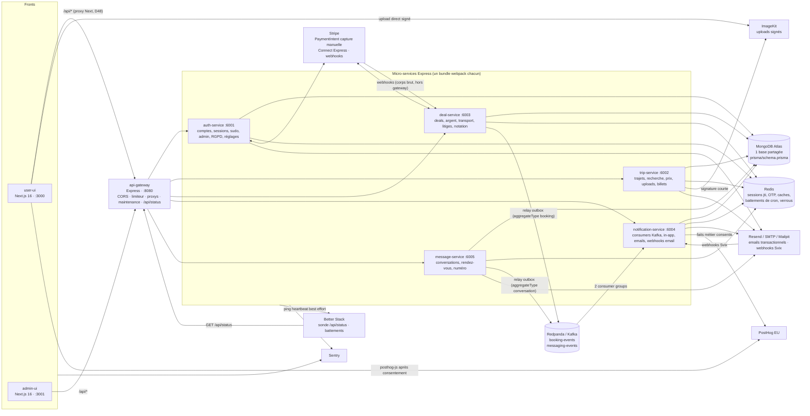
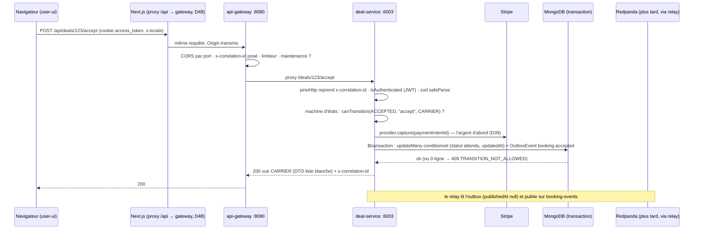
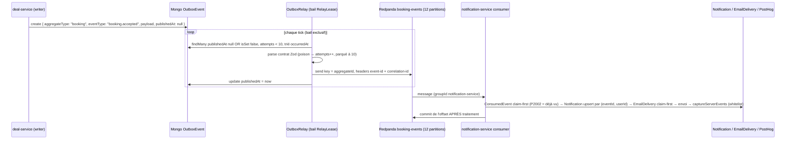
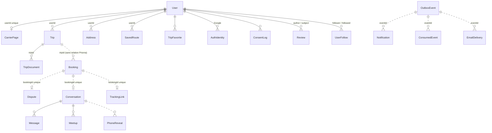
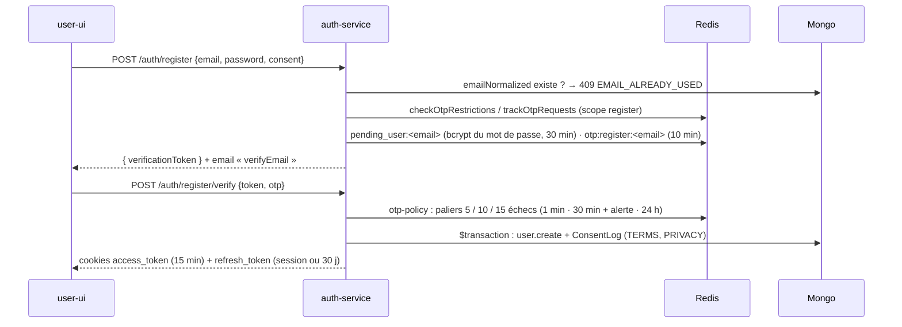
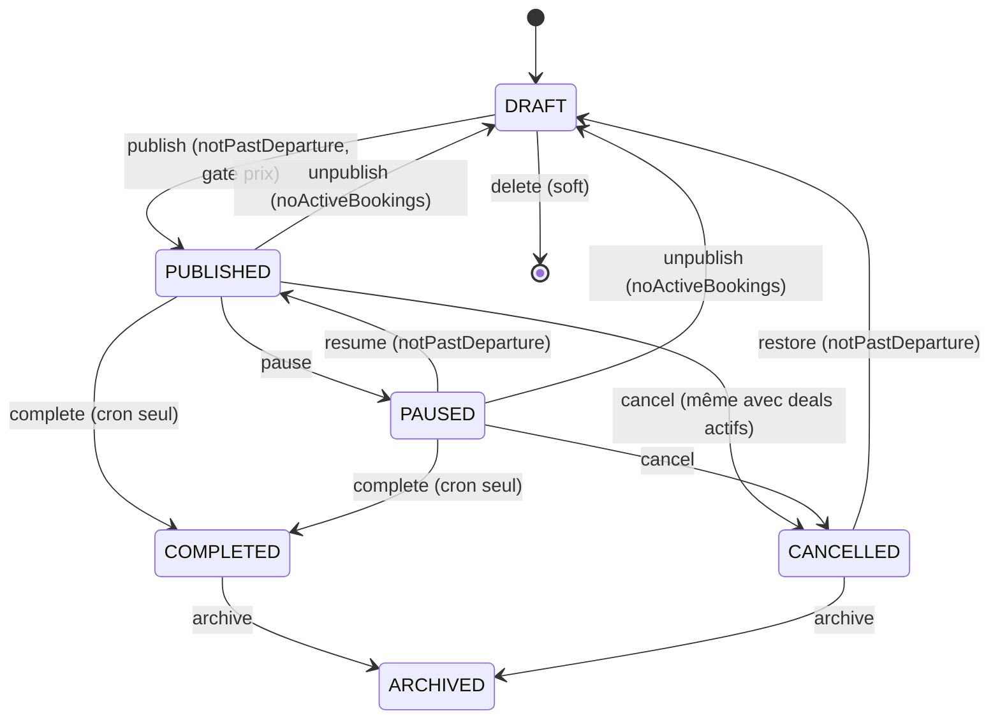
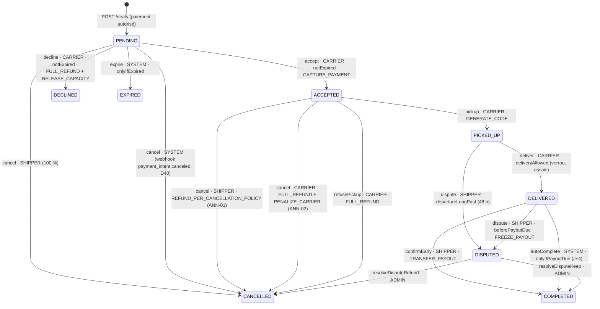
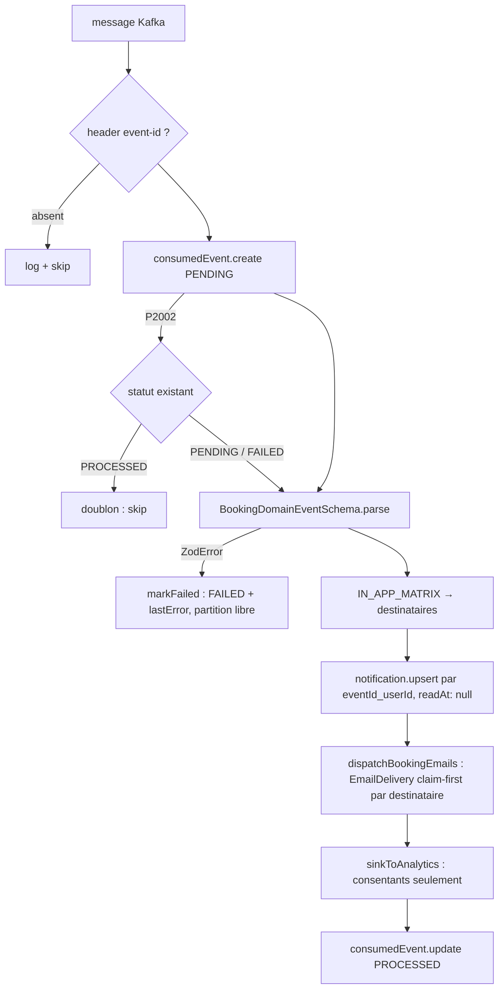
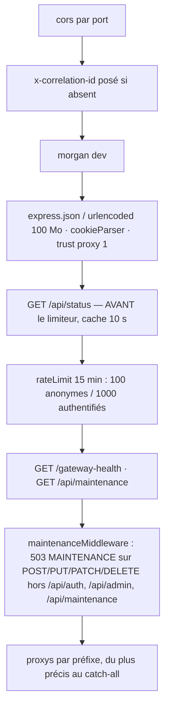
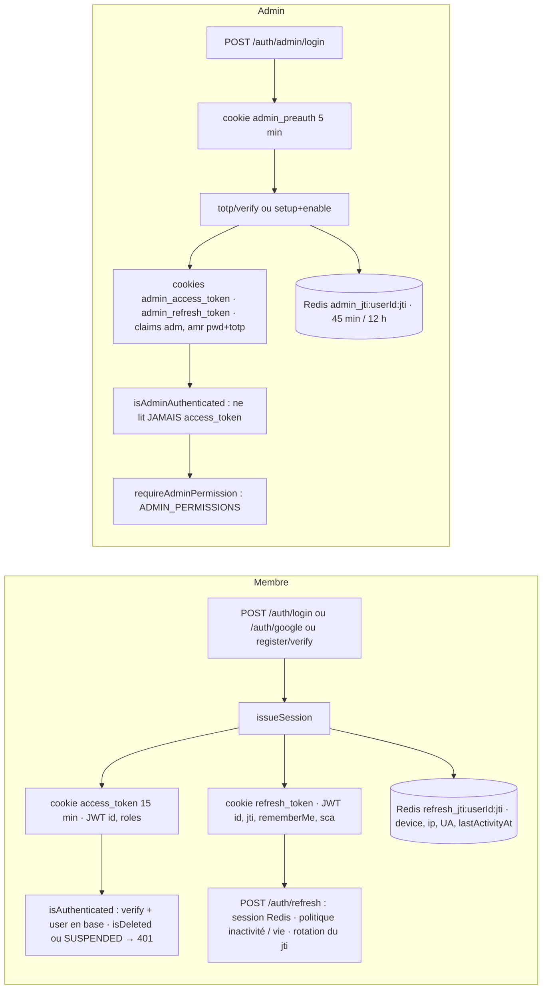

# Yamba — Documentation technique de bout en bout (Lot 4 : transmission de connaissance)

> **Public** : un développeur junior qui arrive seul sur le projet.
> **Objectif** : comprendre chaque brique, chaque bibliothèque, quand et pourquoi elle a été introduite, comment tout est branché — et savoir, à la fin, ajouter un endpoint, un événement, un cron, une page admin ou une lib sans casser une règle.
> **Méthode** : chaque affirmation est vérifiée dans le code ; les chemins sont cités (`apps/…`, `packages/…`). Quand une décision d'architecture existe, son numéro de registre est donné (`D1` à `D71`, fichier `context/YAMBA-REGISTRE-DECISIONS-ROADMAP-v1.3.md`).
> **Convention de lecture** : ✅ **livré** = présent dans `dev` avec ses tests ; 🚪 **porte** = prévu et préparé dans le code (interface, champ, alias), non implémenté ; 💡 **recommandation** = avis d'expert, hors périmètre livré, à décider.
> **État de référence** : branche `dev` au 05/09/2026 (fin du Jalon 2, chantier C soldé, chantier F messagerie livré, D71 TrustScore livré, dépendances à 0 vulnérabilité sous Nx 23 / TypeScript 6).

---

## Sommaire

1. [Carte d'ensemble](#1-carte-densemble)
   1.1 Les briques et leurs liens · 1.2 Flux d'une requête HTTP · 1.3 Flux d'un événement de domaine · 1.4 Les trois vérités (code, registre, règles)
2. [La pile, techno par techno](#2-la-pile-techno-par-techno)
   Node / TypeScript 6 / Nx 23 · Express 4 · Zod 4 + OpenAPI 3.1 + Scalar · Prisma 6 + MongoDB Atlas · ioredis · kafkajs + Redpanda · Stripe · ImageKit · Nodemailer / Resend · bcrypt / AES-GCM / CSPRNG / TOTP · JWT · pino + correlation id · Sentry · PostHog · Next.js 16 + next-intl + TanStack Query + Tailwind · Jest 30 · webpack · GitHub Actions
3. [Le modèle de données](#3-le-modèle-de-données)
   29 modèles · 10 types composites · 40 enums · règles non négociables
4. [Les services, un chapitre chacun](#4-les-services)
   4.1 auth-service :6001 · 4.2 trip-service :6002 · 4.3 deal-service :6003 · 4.4 notification-service :6004 · 4.5 message-service :6005
5. [Le gateway :8080](#5-le-gateway)
6. [Les fronts](#6-les-fronts) — user-ui :3000 · admin-ui :3001
7. [Sécurité de bout en bout](#7-sécurité-de-bout-en-bout)
8. [Qualité et CI](#8-qualité-et-ci) — les 17 checks, stratégie de tests, baseline
9. [Exploitation](#9-exploitation) — variables d'environnement, démarrage local, LAN, Mailpit, FAKE, santé, moniteur, maintenance, conservation, sauvegardes
10. [Guides pratiques](#10-guides-pratiques) — endpoint, événement + consumer, paramètre, cron, page admin, namespace i18n, lib `@packages`
11. [Catalogue des décisions D1→D71 et des pièges « payés une fois »](#11-catalogue-des-décisions-et-des-pièges)
12. [Glossaire technique](#12-glossaire-technique) et [Recommandations d'expert (hors périmètre livré)](#13-recommandations-dexpert-hors-périmètre-livré)

---

## 1. Carte d'ensemble

### 1.1 Les briques et leurs liens

Yamba est une application de *crowdshipping* : un **Voyageur** (« Yamber »/« Tripper » à l'écran, `carrier` dans le code et la base) publie un trajet et vend sa franchise bagage au kilo ; un **Expéditeur** (`shipper`) lui confie un colis. Le code est un **monorepo Nx** (`npm workspaces`), tout en TypeScript strict. Les commentaires, la documentation et l'i18n sont en français ; les surfaces publiques (OpenAPI, messages d'erreur d'API, clés d'événements) sont en anglais.

Le système est composé de **deux fronts Next.js**, **un gateway Express**, **cinq micro-services Express**, **une seule base MongoDB** (Atlas, replica set), **un Redis**, **un broker Kafka** (Redpanda en développement) et **six services externes** (Stripe, ImageKit, Resend/SMTP, PostHog, Sentry, un moniteur de disponibilité type Better Stack).



**Ports et rôles (vérifiés dans chaque `main.ts`)** :

| Brique | Port | Fichier de boot | Responsabilités |
|---|---|---|---|
| `apps/user-ui` | 3000 | `apps/user-ui/next.config.js` | Front public FR/EN, App Router, proxy `/api` → gateway |
| `apps/admin-ui` | 3001 | `apps/admin-ui/next.config.js` | Back-office FR, sessions séparées, 2FA TOTP |
| `apps/api-gateway` | 8080 | `apps/api-gateway/src/main.ts` | CORS par port, correlation id, limiteur, `/api/status`, maintenance, proxys par préfixe |
| `apps/auth-service` | 6001 | `apps/auth-service/src/main.ts` | Inscription/connexion (OTP, Google), JWT + refresh, sessions, sudo, onboarding Voyageur + Stripe Connect, alertes de route, profils publics, signalements, **toutes les routes admin transverses** (`/admin/me`, users, KPI, pilotage, settings, status, privacy), RGPD |
| `apps/trip-service` | 6002 | `apps/trip-service/src/main.ts` | Trajets (CRUD, machine d'états, gate de publication), recherche, uploads ImageKit, favoris, admin trajets/billets |
| `apps/deal-service` | 6003 | `apps/deal-service/src/main.ts` | Booking (9 statuts / 12 transitions), argent (autorisation, capture, remboursement, versement), transport (pickup, code de livraison), litiges, notation, portefeuille, lien de suivi, admin finances/litiges/alertes, **relay outbox `booking`**, 7 crons |
| `apps/notification-service` | 6004 | `apps/notification-service/src/main.ts` | Deux consumers Kafka (booking-events, messaging-events), notifications in-app, emails `booking.*`, webhooks email, PostHog serveur, cron de conservation |
| `apps/message-service` | 6005 | `apps/message-service/src/main.ts` | Conversation par deal, `Meetup` objet, gardes du fil, révélation du numéro, admin conversations/signalements, **relay outbox `conversation`**, 3 crons |

**Une seule base pour cinq services.** C'est une propriété structurante : `prisma/schema.prisma` vit à la **racine** du dépôt et `packages/libs/prisma/index.ts` expose un `PrismaClient` singleton importé par tous. La frontière entre services n'est donc pas la base mais **le domaine** : chaque service écrit ses propres collections (auth → `User`, trip → `Trip`, deal → `Booking`/`Dispute`, message → `Conversation`/`Message`/`Meetup`, notification → `Notification`/`EmailDelivery`/`ConsumedEvent`) et **ne fait jamais d'écriture croisée** (D54 2A). Les lectures croisées sont permises (le deal-service lit un `Trip` pour réserver des kilos ; le message-service lit un `Booking` pour savoir si le fil est ouvert).

### 1.2 Flux d'une requête HTTP

Prenons `POST /api/deals/:id/accept` (le Voyageur accepte une demande).



Points à retenir :

- **Le gateway ne connaît pas le métier**. Il pose le `x-correlation-id` s'il manque, applique CORS par port, un limiteur, le mode maintenance, puis proxie par préfixe (`apps/api-gateway/src/main.ts`). Tout ce qui ne matche aucun préfixe part vers auth-service (catch-all `/`).
- **Chaque service revalide tout** : le JWT (`packages/middleware/isAuthenticated.ts`), le corps (schémas Zod de `packages/libs/api-contracts`), la transition (machine d'états), les limites métier. Le front n'est jamais une garde.
- **L'argent d'abord, la base ensuite** pour capture/remboursement (D39) ; **la base d'abord, l'argent ensuite** pour le versement (D49). Ce n'est pas une incohérence : dans le premier cas l'argent protège l'Expéditeur, dans le second `COMPLETED` est la condition légale du versement.
- **Aucun changement d'état sans événement d'outbox dans la même transaction** (D2). Le relay est asynchrone ; l'événement ne peut pas être perdu, seulement retardé.

### 1.3 Flux d'un événement de domaine



Le pattern est identique pour le message-service (`aggregateType: "conversation"`, topic `messaging-events`, second consumer group). **Chaque relay ne draine que son `aggregateType`** — c'est ce qui permet à deux services d'écrire dans la même collection `OutboxEvent` sans se voler les événements (CLAUDE.md, F-PR1).

### 1.4 Les trois vérités

Le projet est gouverné par des documents, avec un ordre de précédence explicite (CLAUDE.md, « Read first ») :

1. **Le code et ses tests** gagnent toujours.
2. **Le registre des décisions** `context/YAMBA-REGISTRE-DECISIONS-ROADMAP-v1.3.md` (D1→D71) : une décision d'architecture y est gravée **avant** le code, jamais après.
3. **Les règles métier** `context/YAMBA-REGLES-METIER-V2.md` (PRC, CAT, COM, CAP, ANN, CNF, GAR, SES, REP, SIG, RGP…).
4. Les synthèses de `context/` (`YAMBA-CONTEXT.md` fait/reste, `YAMBA-SPECIFICATION-COMPLETE.md`, handoffs).

Trois documents cumulatifs sont complétés à chaque PR et **ne sont jamais recréés** : `context/YAMBA-DOC-TECHNIQUE.md` (une section par lot, 1 905 lignes), `context/YAMBA-DOC-METIER.md` (règles RG-* et tests d'acceptation), `context/YAMBA-APPRENTISSAGE-DEV.md` (99 chapitres : techniques et pièges). Ce livrable les synthétise sans les remplacer : quand un détail manque ici, c'est là qu'il faut aller.

---
## 2. La pile, techno par techno

Chaque fiche suit le même plan : **ce que c'est · pourquoi ce choix (décision, date) · depuis quand · comment c'est branché (fichiers) · ce qu'il faut savoir · pièges connus**. Les versions sont celles de `package.json` à la racine (les dépendances sont hissées à la racine par `npm workspaces` ; les `apps/*/package.json` ne déclarent presque rien — voir 2.1).

### 2.1 Node 22 · TypeScript 6 · Nx 23

**Ce que c'est.** Node 22 exécute les services et les fronts. TypeScript 6.0.3 compile tout en mode `strict`. Nx 23.2.0 est l'orchestrateur du monorepo : il infère les cibles (`build`, `serve`, `test`, `typecheck`, `dev`) depuis des plugins, met en cache les résultats et calcule le graphe des projets.

**Pourquoi.** Un monorepo unique permet de partager les contrats Zod, le moteur de prix et les libs entre cinq services et deux fronts sans publier de paquets (D34 : « deux implémentations divergent toujours un jour »). Nx apporte le cache et les cibles inférées ; `AGENTS.md` impose « toujours passer par `nx` ». TypeScript 6 et Nx 23 datent de la PR `chore/deps` (05/09/2026) : `npx nx migrate 23.2.0` a monté TypeScript, webpack 5.110 et webpack-cli 7.2 en 25 migrations qui ont seulement posé `ignoreDeprecations: "6.0"` dans les tsconfig (`context/YAMBA-DOC-TECHNIQUE.md`, section « chore/deps »).

**Depuis quand.** Nx est présent depuis l'origine (Nx 22 à la spécification, 23 depuis `chore/deps`). Le fichier `AGENTS.md` (section « nx configuration ») est généré par Nx et se met à jour tout seul entre ses balises.

**Comment c'est branché.**

- `nx.json` : quatre plugins inférant les cibles — `@nx/js/typescript` (`typecheck`), `@nx/jest/plugin` (`test`, en excluant `apps/auth-service-e2e` et `apps/api-gateway-e2e`), `@nx/webpack/plugin` (`build`, `serve`, `preview`), `@nx/next/plugin` (`dev`, `start`, `build`). Le `namedInputs.sharedGlobals` inclut `.github/workflows/ci.yml` : toucher la CI invalide tout le cache. Le générateur Next est réglé `style: tailwind, linter: none` — **aucun linter n'est configuré** dans le dépôt.
- `package.json` racine : `"workspaces": ["apps/*"]`. Les scripts utiles sont `dev` (`nx run-many --target=serve --all`), `user-ui`, `admin-ui`, `generate:openapi`, `settings-doc`. Le champ `overrides` force `uuid ^11`, `deepmerge-ts ^8`, `qs ^6.15.4` (transitives vulnérables qu'aucun paquet direct ne peut monter sans majeure).
- `apps/<service>/package.json` : porte uniquement la définition Nx de la cible `serve` (`@nx/js:node` sur le bundle webpack, `dependsOn: ["build"]`) et, pour le deal-service, les cibles `prune-lockfile` / `copy-workspace-modules` (préparation d'une image Docker). Les services n'ont pas de `project.json` : tout est inféré.
- `tsconfig.base.json` : `target es2022`, `module nodenext`, `strict`, `noUnusedLocals`, `noImplicitReturns`, `isolatedModules`, `composite`, et surtout `paths` — les alias `@packages/*`. Les entrées **explicites** (`@packages/api-contracts`, `delivery-code`, `email`, `messaging`, `payments`, `pricing`, `totp`, `admin-audit`) sont déclarées **avant** le joker `@packages/*` parce que leur chemin réel est `packages/libs/<lib>/src/index.ts`, pas `packages/<lib>`. Les autres libs (`@packages/libs/prisma`, `@packages/libs/redis`, `@packages/libs/health`…) passent par le joker et sont importées par leur chemin de dossier.
- `apps/<service>/tsconfig.app.json` : `rootDir: "../../"`, `include: ["src/**/*.ts", "../../packages/**/*.ts"]`, `exclude` des specs. C'est **ce fichier** que la CI et vous devez donner à `tsc` : `npx tsc --noEmit --project apps/<service>/tsconfig.app.json`. Passer `--project apps/<service>` résout le `tsconfig.json` de solution (`files: []`, `references`) et vérifie **zéro fichier** (CLAUDE.md).

**Ce qu'il faut savoir.**

- Commandes canoniques : `npx nx dev user-ui`, `npx nx serve deal-service`, `npx nx build <p>`, `npx nx typecheck <p>`, `npx nx test <p>`, `npx nx test <p> -- --testPathPatterns=<motif>` (Jest 30 a renommé l'option). Les noms de projets Nx sont `@yamba-app/<service>` sauf `auth-service` (son `package.json` s'appelle `@./auth-service` avec `nx.name: "auth-service"`) — c'est visible dans la matrice CI.
- `nx serve` charge le `.env` racine et **écrase** les variables passées en ligne de commande. Pour forcer un environnement (ex. `STRIPE_SECRET_KEY=` vide pour le Fake), il faut lancer le bundle : `cd apps/deal-service && STRIPE_SECRET_KEY= node --env-file=../../.env dist/main.js`.
- Le cache Nx est local (`.nx/`) ; en CI, le job de build utilise `--skip-nx-cache` pour prouver un vrai build.

**Pièges connus.** macOS est insensible à la casse, Linux (CI) ne l'est pas : un import `./Components/x` compile chez vous et casse en CI. Un `node_modules` imbriqué dans `apps/<service>` (version qui diverge entre le `package.json` du service et la racine) masque la copie racine : `npm ls <pkg>` doit dire « deduped » (`imagekit` est épinglé `6.0.0` aux deux endroits, A47).

### 2.2 Express 4

**Ce que c'est.** Le framework HTTP minimal de tous les services et du gateway (`express ^4.21.2`).

**Pourquoi.** Choix d'origine du projet ; le « template de service » (D8) impose ce que chaque service doit avoir au boot : logs structurés, correlation id, CORS, `express.json`, `cookie-parser`, `/health`, OpenAPI, routes, error middleware. Express 5 est une porte (`chore/deps` : « routage asynchrone, `req.query` en lecture seule »).

**Comment c'est branché.** Chaque `apps/<service>/src/main.ts` suit le même ordre (voir chapitre 4 pour la lecture ligne à ligne) : `initSentry("<service>")` **en première ligne** avant tout autre import (`packages/error-handler/sentry.ts`), puis `express()`, `pinoHttp` (deal, notification, message), `cors`, corps (`express.json`, avec `express.raw` **avant** pour le webhook Stripe), `cookieParser`, `/health`, `/openapi.json` + `/docs`, routeurs, `errorMiddleware` (`packages/error-handler/error-middleware.ts`), `listen`, puis crons/relay/consumers **après** le listen.

**Ce qu'il faut savoir.** La convention de dossiers est `routes/ → controller(s)/ → service(s)/`, avec `lib/` ou `utils/` pour les règles pures, `cron/`, `relay/`, `consumer/`, `emails/`, `openapi/`. Les erreurs typées (`packages/error-handler/index.ts`) traversent les couches et sont traduites en HTTP par le middleware commun ; un 5xx est capturé par Sentry avec les tags `service` et `x-correlation-id`.

**Pièges.** Un routeur monté **après** un catch-all ne sera jamais atteint (leçon du squelette deal : `/api/deals` partait vers auth-service — d'où les commentaires « déclaré AVANT le catch-all » dans le gateway). Le webhook Stripe **doit** être monté avant `express.json` : la signature porte sur les octets bruts (D40).

### 2.3 Zod 4 · OpenAPI 3.1 · Scalar

**Ce que c'est.** Zod (`^4.4.3`) valide les entrées à l'exécution. Le même objet Zod génère le document OpenAPI 3.1 de chaque service, servi sur `/openapi.json` et lu par la visionneuse Scalar sur `/docs` (chargée depuis un CDN, zéro dépendance npm).

**Pourquoi (D3, chantier 0).** « La doc ne peut plus dériver du code (source de vérité unique) ; OAS 3.1 = meilleur support des générateurs TS/Kotlin/Swift ; prérequis industriel de la version mobile ». Le Swagger legacy de l'auth-service (swagger-autogen) « mentait » ; il a été retiré et l'auth-service a rejoint l'OpenAPI généré en dernier (A145, 05/09/2026 : 75 chemins, 86 opérations, 365 schémas).

**Comment c'est branché.**

- Les schémas vivent dans `packages/libs/api-contracts/src/` (alias `@packages/api-contracts`), rangés par domaine : `trip/`, `booking/`, `messaging/`, `notification/`, `auth/`, `admin/`, plus `common.ts` et `locale.ts`. L'index ré-exporte tout.
- Chaque service a `src/openapi/build-openapi.ts` qui assemble `paths` + `components.schemas` depuis ces contrats, et `main.ts` construit le document **une fois au boot**.
- `scripts/generate-openapi.ts` (commande `npm run generate:openapi`) écrit les cinq `apps/<service>/openapi.json` **versionnés** ; le job CI « Contrats OpenAPI (generate + diff) » régénère et fait `git diff --exit-code` : un contrat modifié sans régénération fait échouer la PR.
- `apps/auth-service/src/openapi/build-openapi.spec.ts` lit les routeurs au format source (`router.get("…")`), convertit `:param` en `{param}` et exige chaque paire méthode + chemin dans `paths` — **et** refuse une opération documentée sans route. Un endpoint auth ne peut donc plus être oublié.
- `docs/livrables/_api-reference.generated.md` est produit par `scripts/build-api-reference.py` depuis les cinq `openapi.json`.

**Ce qu'il faut savoir.** Les erreurs de validation sont des 400 avec le détail Zod ; les codes d'erreur métier (`QUOTE_DIVERGENCE`, `TRANSITION_NOT_ALLOWED`, `SUDO_REQUIRED`, `NEW_ACCOUNT_CAP`…) sont des constantes exportées par les contrats et **le code est le contrat, pas le message** (chapitre 48 de l'apprentissage : l'API parle anglais, l'utilisateur lit du français). Les ensembles de statuts partagés (`booking.enums.ts`) sont importés par le front comme par les services.

**Pièges.** L'alias `@packages/api-contracts/locale` existe **séparément** pour que le front consomme `SUPPORTED_LOCALES` sans embarquer Zod dans le bundle client (chapitre 52). `admin-ui` recopie à la main la matrice `ADMIN_PERMISSIONS` dans `apps/admin-ui/src/lib/permissions.ts` pour la même raison (Zod hors du bundle admin) — la copie est identique au contrat aujourd'hui (33 clés), mais c'est une double source à surveiller (voir recommandations).

### 2.4 Prisma 6 · MongoDB Atlas

**Ce que c'est.** Prisma (`^6.19.3`, `prisma-client-js`) est l'ORM ; la base est **MongoDB Atlas** en replica set (les transactions multi-documents exigent un replica set — `packages/libs/prisma/scripts/tx-probe.ts` le prouve : « Transaction numbers are only allowed on a replica set » = cluster inapte).

**Pourquoi.** Choix d'origine (documents flexibles pour des snapshots imbriqués : `BookingPricingSnapshot`, `TripLocationPoint`…). Les transactions Atlas ont été prouvées avant B2 (registre §7.2) car « aucun changement d'état sans outbox dans la même transaction » (D2) en dépend.

**Comment c'est branché.**

- `prisma/schema.prisma` à la racine (1 509 lignes, **29 modèles, 10 types composites, 40 enums** — chapitre 3). `npx prisma generate` après toute modification ; `npx prisma db push` synchronise (pas de migrations avec le provider Mongo).
- `packages/libs/prisma/index.ts` : singleton `PrismaClient` partagé. Import : `import prisma from "@packages/libs/prisma"`.
- Les services reçoivent Prisma **injecté** dans leurs fabriques (`makeXxxService({ db })`) pour être testés avec un faux (voir 8.2).
- `packages/libs/prisma/scripts/` : seeds et scripts de reprise, exécutés avec `npx tsx --env-file=.env <script>` (sourcer `.env` en zsh abîme le mot de passe Mongo).

**Ce qu'il faut savoir — les quatre pièges payés (CLAUDE.md « Known pitfalls », chapitres 7, 33, 43, 72).**

1. **Champ absent ≠ champ null.** Sur Mongo, `where: { readAt: null }` ne matche **pas** un document où `readAt` est absent. Règle : `OR: [{ field: null }, { field: { isSet: false } }]` pour **chaque** filtre nullable, et les writers posent `null` explicitement. Payé cinq fois (`readAt`, `reservedKg` A34, relay outbox A49, `trackingEvents` A85, `Dispute.resolvedAt` C-PR2). Exemple réel du relay (`apps/deal-service/src/relay/outbox-relay.ts`) : la requête des événements à publier combine `publishedAt: null` et `publishedAt: { isSet: false }`.
2. **Les listes absentes sont pires** : aucun filtre (`none`, `some`, `isEmpty`, `equals: []`) ne matche une liste absente. Les writers créent les listes à `[]` (`booking-request.ts`), les gardes de concurrence passent par `updatedAt` (verrou optimiste) et `repair-absent-lists.ts` répare l'existant via une commande Mongo brute (`$exists`).
3. **Unique nullable = collision sur null (P2002).** Deux documents avec `champ: null` sur un index unique se percutent. D'où `AuthIdentity` séparé (pas de `googleSub` nullable unique sur `User`), `CarrierPage.primaryAddressId` sans `@unique` (A42), `EmailDelivery.providerMessageId` « jamais unique ».
4. **`{ increment: 1 }` sur un champ absent donne null**, pas 1 (pipeline `$add` avec un opérande manquant) : pour un compteur ajouté après coup, lire puis écrire (C-PR2 `disputesLostCount`).
5. **Atlas partagé plafonne les pipelines à 50 étapes** ; Prisma émet un `$set` par champ sur les updates touchant des types composites → `P2010 Pipeline length greater than 50`. `apps/trip-service/src/lib/mongo-update-chunks.ts` découpe les updates larges (les champs de transition en dernier).

Autres faits : les relations Prisma sont volontairement **absentes** du `Booking` (ObjectId indexés seulement, « pas de cascade accidentelle sur l'historique transactionnel ») ; les jointures sont explicites dans les services. `onDelete: Cascade` existe sur les relations de `User` mais l'effacement RGPD n'efface **jamais** un `User` : il l'anonymise champ par champ (D63).

**Pièges de version.** Prisma 7 est une porte (`prisma.config.ts`, adaptateurs) ; l'override `deepmerge-ts ^8` existe justement pour rester en 6 sans vulnérabilité.

### 2.5 ioredis (Redis)

**Ce que c'est.** `ioredis ^5.9.2`, un singleton dans `packages/libs/redis/index.ts` (variable `REDIS_DATABASE_URI`), Upstash ou Redis local.

**Pourquoi.** Tout ce qui est éphémère, partagé entre instances et sans valeur d'audit : sessions, codes OTP et leurs paliers de blocage, fenêtres sudo, caches courts, verrous NX, battements de cron, compteurs de demande.

**Comment c'est branché (usages vérifiés).**

| Usage | Clé / mécanisme | Fichier |
|---|---|---|
| Sessions membre (refresh token, `jti`, `lastActivityAt`, device/ip/UA) | clés de session par `jti` | `apps/auth-service/src/utils/session-policy.ts`, `session-device.ts` |
| Sessions admin | préfixe `admin_jti:` (inactivité 45 min, vie 12 h, pré-auth 5 min) | `apps/auth-service/src/utils/admin-session.ts`, `admin-session-policy.ts` |
| OTP inscription / mot de passe / sudo, paliers de blocage | `otp-policy.ts` (règle pure + Redis) | `apps/auth-service/src/utils/otp-policy.ts` |
| Fenêtre sudo 15 min | `sudo:<userId>:<jti>` | `apps/auth-service/src/utils/sudo.ts` |
| Invitation admin 48 h | jeton Redis | `admin-users.service.ts` |
| Cache pilotage 60 s | courbes et corridors | `apps/auth-service/src/controller/admin-pilotage.controller.ts` |
| Dédoublonnage des alertes (un email par règle et par jour) | `SET NX` | `apps/deal-service/src/cron/ops-alerts.cron.ts` |
| Battements de cron | `yamba:cron:<service>:<nom>`, TTL 7 j | `packages/libs/redis/cron-heartbeat.ts` (`withHeartbeat`) |
| Compteurs de demande (vues de trajet dédupliquées par visiteur/jour, recherches par corridor) | constructeurs de clés purs | `packages/libs/redis/trip-stats.ts` (écrit par trip-service, lu par auth-service) |
| Santé | `redisCheck(redis)` 2 s | `packages/libs/health/index.ts` |

**Ce qu'il faut savoir.** `withHeartbeat` enveloppe **chaque** tick de cron ; un cron non enveloppé est invisible sur la page « État des services » (D64 4A). Après un tick réussi, `pingExternalHeartbeat` appelle sans attendre l'URL de battement externe configurée dans `CRON_HEARTBEAT_PING_URLS` (D70).

### 2.6 kafkajs · Redpanda (transactional outbox)

**Ce que c'est.** `kafkajs ^2.2.4` isolé derrière `packages/libs/messaging` (`@packages/messaging`) : interface `EventPublisher`, `KafkaEventPublisher`, `KafkaEventConsumer`, `TOPICS`, `CONSUMER_GROUPS`. Redpanda (`docker-compose.yml`, image `redpandadata/redpanda:v24.2.18`, port 9092) est le broker de développement, 100 % compatible Kafka, sans ZooKeeper ni JVM.

**Pourquoi (D2, dès B1).** « Le découplage producteur/consommateur permet d'ajouter notifications, analytics, audit sans toucher au métier ; le journal persistant = audit trail des deals ; l'outbox est le pattern impossible à retrofitter ». Redpanda plutôt que Kafka en local : un binaire. En production : broker managé compatible Kafka (Upstash Kafka a été décommissionné ; Confluent Cloud ou Redpanda self-host — porte 🚪).

**Comment c'est branché.**

- **Écriture** : le service écrit un `OutboxEvent { aggregateType, aggregateId, eventType, payload, correlationId, publishedAt: null }` dans la **même** `$transaction` que le changement d'état (`apps/deal-service/src/services/booking-write.ts`, `apps/message-service/src/services/conversation.service.ts`). Le payload est validé par le contrat Zod **avant** l'insertion (`booking-events.schema.ts`, `messaging-events.schema.ts`).
- **Relay** : `apps/deal-service/src/relay/outbox-relay.ts` (+ `relay-lease.ts`) et `apps/message-service/src/relay/messaging-relay.ts`. Un bail `RelayLease` (document `_id: "outbox-relay"`, `owner: hostname#pid#uuid`, `expiresAt`) garantit **un seul publieur** (l'ordre par `aggregateId` l'exige) ; acquisition atomique par `updateMany` conditionnel, renouvelée à chaque tick. Chaque relay filtre **son** `aggregateType`. Poison : échec de validation ou de publication → `attempts++` ; à `MAX_RELAY_ATTEMPTS` (10) la ligne est **parquée** (exclue de la requête, jamais supprimée — A24). Clé Kafka = `aggregateId` (ordre par deal), en-têtes `event-id` (= `_id` de l'OutboxEvent) et correlation id.
- **Topics** : `booking-events` (12 partitions, rétention 7 j, créé **explicitement** par `scripts/redpanda-bootstrap.sh` — `auto_create_topics_enabled=false`, doctrine A23) et `messaging-events` (chantier F).
- **Consumers** : `apps/notification-service/src/consumer/booking-events.consumer.ts` et `messaging-events.consumer.ts`, deux `groupId` distincts (`CONSUMER_GROUPS.NOTIFICATION_SERVICE`, `MESSAGING_NOTIFICATIONS`) : un incident sur le chat ne bloque jamais les événements d'argent. Idempotence par **claim-first** : `ConsumedEvent.create({ consumerGroup, eventId })` PENDING → P2002 signifie « déjà vu » (PROCESSED = skip, PENDING/FAILED = retraitement autorisé) → traitement (upserts idempotents) → PROCESSED ou FAILED + `lastError` sans bloquer la partition. Les offsets sont commités **après** traitement.
- **Boot sans broker** : le relay démarre après `listen` (connexion paresseuse) ; le consumer retente toutes les 5 s (timer `unref`) ; `OUTBOX_RELAY_ENABLED=false`, `MESSAGING_RELAY_ENABLED=false`, `NOTIFICATION_CONSUMER_ENABLED=false` désignent une instance « API pure ».

**Ce qu'il faut savoir.** kafkajs renvoie les erreurs de connexion avec `retriable: false` — elles sont interceptées explicitement. Le replay se fait **depuis l'outbox Mongo** (source de vérité, jamais de delete des événements de domaine), pas en rembobinant le broker. La purge des événements **publiés** est une conservation chiffrée (`retention.outboxPublishedDays`, cron nocturne par propriétaire, « un parqué n'est jamais purgé », D64 6A).

**Pièges.** Le flag `--set auto_create_topics_enabled=false` au démarrage n'est pas reconnu par l'image : c'est `rpk cluster config set` (persisté) qui le pose (incident PR4). Sans Docker/Redpanda, **aucune notification ni email `booking.*`** ne part en développement — les événements s'accumulent dans l'outbox et partent au retour du broker.

### 2.7 Stripe (paiement, Connect, webhooks) et `PaymentProvider`

**Ce que c'est.** `stripe ^21.0.1` côté serveur, `@stripe/react-stripe-js ^6.3.0` côté front (Payment Element). Modèle : **PaymentIntent à capture manuelle** (autorisation à la demande, capture à l'acceptation), **Stripe Connect Express** pour le compte du Voyageur (KYC), `transfers.create` pour le versement, remboursements, et **deux endpoints webhook** sur la même URL (`STRIPE_WEBHOOK_SECRET` compte plateforme, `STRIPE_CONNECT_WEBHOOK_SECRET` événements des comptes connectés : `account.updated`, `transfer.reversed`, `payout.failed`, A87).

**Pourquoi.** D11 (interface abstraite dès B2 : « Stripe ne verse pas au Congo ; le marché cible est Mobile Money ») ; D31 (RIB + virements manuels = exercice illégal de services de paiement, DSP2/ACPR → Connect Express confirmé) ; D38 (pas de `payment-service :6008` — une lib `@packages/payments`) ; D39 (capture à l'acceptation : une empreinte expire ~7 jours) ; D40 (le webhook est la source de vérité de l'état du paiement) ; D49 (versement après COMPLETED, idempotent, rejouable).

**Comment c'est branché.**

- `packages/libs/payments/src/index.ts` : interface `PaymentProvider` (autoriser, capturer, annuler, rembourser, transférer, `inspect` en lecture seule pour le rapprochement C-PR5), `StripePaymentProvider`, `FakePaymentProvider` (en mémoire, adopte les intents `pi_fake_seed_*` du seed, **refusé en production**), fabrique par env : sans `STRIPE_SECRET_KEY` → Fake hors production.
- deal-service : `services/deal-request.service.ts` (`POST /deals/payment-intents` puis `POST /deals`, D37), `deal-lifecycle.service.ts` (capture/refund), `deal-settlement.service.ts` (transfert J+4, retenue ANN-01), `controllers/stripe-webhook.controller.ts` (monté **avant** `express.json` avec `express.raw`).
- auth-service : `controller/carrier.controller.ts` (création du compte Connect Express, lien d'onboarding, lien du tableau de bord — ce dernier sous sudo, D65).
- Front : un seul Payment Element dans le wizard (A30), clé publiable `NEXT_PUBLIC_STRIPE_PUBLISHABLE_KEY`.

**Ce qu'il faut savoir.** En développement : `stripe listen --forward-to localhost:6003/webhooks/stripe` — **jamais via le gateway** (le corps re-sérialisé casserait la signature). Sans `STRIPE_WEBHOOK_SECRET`, `POST /webhooks/stripe` répond 501. Le premier paiement réel a cassé deux fois (A34 : `reservedKg` absent — pitfall Mongo n° 1).

### 2.8 ImageKit (uploads signés)

**Ce que c'est.** `imagekit 6.0.0` (épinglé exact). Les images (justificatifs de trajet, photos de pickup 1..5, de livraison ≤ 2, de litige ≤ 5, avatars) sont **téléversées directement par le navigateur** vers ImageKit avec une signature courte servie par `GET /api/uploads/imagekit-auth` (trip-service) ; les services ne reçoivent que des **URLs https** (D42) et gardent le `fileId` quand ils doivent pouvoir supprimer (avatar, D67).

**Pourquoi (D42).** Infrastructure déjà présente pour les justificatifs ; pas de `media-service :6009` ni de R2 en B3 : « aucun octet d'image ne transite par le gateway ni par le deal-service ».

**Comment c'est branché.** `packages/libs/imagekit/index.ts` (client paresseux, `deleteImageKitFile` tolère « does not exist ») ; `apps/trip-service/src/lib/imagekit.ts` est un shim ; `apps/trip-service/src/controllers/upload.controller.ts` ; hook front `useImageKitUpload`. Variables : `IMAGEKIT_PUBLIC_KEY`, `IMAGEKIT_PRIVATE_KEY`, `IMAGEKIT_URL_ENDPOINT` (l'URL déclarée d'un avatar **doit** appartenir à l'endpoint).

**Pièges.** A47 : `imagekit` 1.5.0 est un fossile de 2016 avec une autre API ; `npm audit` propose encore de « corriger » en rétrogradant — refusé, `uuid` est monté par override à la place. Portes 🚪 : URLs signées / fichiers privés, vérification du domaine des URLs photo de deal.

### 2.9 Emails : Nodemailer, Resend, `@packages/email`

**Ce que c'est.** Une lib partagée `packages/libs/email/src/` : `EmailProvider` (`send({ to, from, subject, html, tags, idempotencyKey }) → { provider, providerMessageId }`), trois fournisseurs — `resend` (HTTP via `fetch`, sans SDK), `smtp` (`nodemailer ^9`, Mailpit en local), `fake` (mémoire, **refusé en production**) — et deux façons d'envoyer : `sendTemplatedEmail` (fichiers EJS par service, legacy) et `sendTransactionalEmail` (**un** gabarit EJS embarqué dans `layout.ts` + des données `EmailContent`).

**Pourquoi.** D41 (01/09) : l'email est la deuxième colonne de la matrice A15, envoyé par le **même** consumer que l'in-app ; la lib naît « au 3e clone évité ». D44 (03/09) : la langue d'un email est celle du **destinataire** (`User.preferredLocale`), N langues, un gabarit, des dictionnaires. D45 : tutoiement, prénom réel. D35 (05/09) : Resend Europe derrière l'abstraction, et « le retour du monde réel » (webhooks Svix → `EmailDelivery` DELIVERED / BOUNCED / COMPLAINED ; rebond dur ou plainte → `User.emailSuppressedAt`).

**Comment c'est branché.** `provider.ts` (`resolveEmailProviderName` : `EMAIL_PROVIDER`, sinon `RESEND_API_KEY` → resend, sinon `SMTP_HOST` → smtp, sinon fake hors production), `webhook.ts` (`verifySvixSignature` HMAC-SHA256 sur `id.timestamp.corps`, tolérance 5 min, `interpretEmailEvent` pur), `apps/notification-service/src/controllers/email-webhook.controller.ts` (`POST /webhooks/email/resend`, proxifié par le gateway). Dictionnaires : `apps/auth-service/src/emails/auth-emails.ts`, `admin-emails.ts` ; `apps/notification-service/src/emails/booking-emails.ts`, `settlement-emails.ts` ; `apps/message-service/src/emails/messaging-emails.ts` ; `apps/deal-service/src/emails/ops-emails.ts` ; `apps/trip-service/src/emails/admin-trip-emails.ts`.

**Règle absolue.** Tout résolveur de destinataires **saute** `isDeleted` **et** `emailSuppressedAt` : « un nouveau flux email qui l'oublie est un bug » (CLAUDE.md). Le code de livraison ne voyage **jamais** dans un email. La locale vient de `SUPPORTED_LOCALES` / `resolveLocale` (`packages/libs/api-contracts/src/locale.ts`) ; on n'écrit jamais `fr ? … : …`, on ajoute une entrée de dictionnaire.

**Idempotence (A36).** `EmailDelivery` est un marqueur **par destinataire** en claim-first (create PENDING avant l'envoi ; P2002 = déjà réclamé → jamais de renvoi ; échec → FAILED + `lastError`, rejeu manuel seulement). At-most-once assumé : mieux vaut un email manquant qu'un doublon sur de l'argent.

### 2.10 bcrypt · AES-256-GCM · CSPRNG · TOTP

- **Mots de passe** : `bcryptjs ^3` (auth-service, `utils/auth.helper.ts`), règles de force pures dans `utils/password-rules.ts`.
- **Code de livraison (D43)** : `packages/libs/delivery-code/src/index.ts` — `crypto.randomInt` 6 chiffres (100000–999999), **double stockage** : `deliveryCodeHash` (bcrypt coût 10, seul lu par `deliver`) et `deliveryCodeEncrypted` (AES-256-GCM, format versionné `v1.<iv>.<tag>.<chiffré>` base64url, seul lu par la vue Shipper en PICKED_UP). Clé `DELIVERY_CODE_ENCRYPTION_KEY` (32 octets base64) ; hors production absente → clé de dev dérivée + avertissement ; en production absente → refus au pickup. Zéro dépendance d'infra : la lib est importée en relatif par le seed.
- **Garde du fil (D61 4A)** : `apps/message-service/src/lib/message-guard.rules.ts` compare par bcrypt chaque groupe de six chiffres d'un message au `deliveryCodeHash` du deal → refus.
- **Tickets de litige** : `YAM-` + 4 chiffres CSPRNG, retirage sur P2002 (D51). **Lien de suivi** : 32 octets CSPRNG base64url (D69).
- **TOTP (D54)** : `packages/libs/totp/src/index.ts` — RFC 6238, codes de secours, AES-GCM du secret (`TOTP_ENCRYPTION_KEY`), zéro dépendance ; vecteurs RFC dans `apps/auth-service/src/utils/totp.spec.ts`. Anti-rejeu : `User.totpLastUsedStep` (un pas de 30 s ne sert qu'une fois).

### 2.11 JWT, cookies, refresh, jti, sudo

**Ce que c'est.** `jsonwebtoken ^9`. Deux familles de sessions totalement séparées :

| | Membre | Admin |
|---|---|---|
| Cookies | `access_token`, `refresh_token` | `admin_access_token`, `admin_refresh_token`, `admin_preauth` |
| Secret | `ACCESS_TOKEN_SECRET` / `REFRESH_TOKEN_SECRET` | mêmes secrets, claims `adm: true`, `amr: ["pwd","totp"]` |
| Redis | session par `jti` (inactivité + vie absolue, D27) | préfixe `admin_jti:` (45 min / 12 h / pré-auth 5 min) |
| Middleware | `packages/middleware/isAuthenticated.ts` (cookie puis Bearer ; `isDeleted` et `SUSPENDED` → 401) | `packages/middleware/isAdminAuthenticated.ts` (**ne lit jamais** `access_token` ; exige `adm`, `amr` avec `totp`, compte ADMIN non supprimé avec `totpEnabledAt`) puis `requireAdminPermission` |
| Front | `apps/user-ui/src/lib/api-client.ts` (axios, refresh automatique sur 401 avec file d'attente et disjoncteur 30 s) | `apps/admin-ui/src/lib/api.ts` (fetch, un refresh en vol dédupliqué, redirection `/login`) |

**Sudo (D65).** `POST /auth/me/sudo/request` + `/verify` ouvrent `sudo:<userId>:<jti>` 15 min ; une route sensible appelle `requireSudo(req)` (`apps/auth-service/src/utils/sudo.ts`) et répond 403 `details.code = "SUDO_REQUIRED"` ; le front rejoue le geste après `SudoGate`.

**Ce qu'il faut savoir.** Le mobile (D36) utilisera le Bearer (pas de cookies) : l'OpenAPI déclare `cookieAuth` **ou** `bearerAuth`. Les sessions portent `device` / `ip` / `userAgent` (`describeUserAgent`, règle pure) et se listent/révoquent sous `/auth/me/sessions`.

### 2.12 pino · correlation id

`pino ^10` + `pino-http ^11` dans deal, notification et message ; `morgan` dans le gateway ; `console` dans auth et trip (héritage — voir recommandations). Le gateway pose `x-correlation-id` s'il manque ; `express-http-proxy` transmet les en-têtes ; `pinoHttp({ genReqId })` reprend l'identifiant et le **renvoie** dans la réponse ; l'événement d'outbox porte `correlationId` ; le consumer le trace. Une requête est ainsi suivie du navigateur jusqu'à la notification (D8).

### 2.13 Sentry

`@sentry/node ^10.73` (services) et `@sentry/nextjs ^10.73` (fronts). `packages/error-handler/sentry.ts` : `initSentry(service)` **en première ligne** de chaque `main.ts`, inerte sans `SENTRY_DSN` ; `captureServerError` appelé par le middleware d'erreur sur les 5xx et les erreurs non gérées, tags `service` + `x-correlation-id` (D56 7A). Fronts : `instrumentation.ts` (serveur, `SENTRY_DSN`) et `instrumentation-client.ts` (`NEXT_PUBLIC_SENTRY_DSN`), `tracesSampleRate: 0`, replays à 0, tag `app`.

### 2.14 PostHog

`posthog-js ^1.427` côté navigateur, chargé par `import()` dynamique **seulement après consentement** (`apps/user-ui/src/lib/analytics.ts`, `track()` point d'entrée unique, `identify(userId)` id seul). Côté serveur, `packages/libs/analytics/index.ts` : `analyticsEventsFor(outboxEvent, consentingUserIds)` est une **projection liste blanche** (jamais un spread de payload : ni destinataire, ni code, ni email), `captureServerEvents` poste `/batch` via `fetch`, inerte sans `POSTHOG_API_KEY`, ne lève jamais ; appelé par les consumers (`apps/notification-service/src/lib/analytics-sink.ts`) pour les utilisateurs `analyticsOptIn: true` (D66, Cloud EU).

### 2.15 Next.js 16 · next-intl · TanStack Query · Tailwind

- **Next.js 16 App Router** (`next ^16.2.10`, React 19) pour les deux fronts. Règle : les props fonction des composants clients se terminent par `Action` (`onSelectAction`) sinon TS71007 ; `params` est une Promise à `await`er ; `allowedDevOrigins` obligatoire pour le LAN (sinon 403 sur `/_next/*`).
- **next-intl `^4.9`** (user-ui seulement ; admin-ui est FR sans i18n) : pages sous `src/app/[locale]/`, `src/middleware.ts` route fr/en, messages par domaine `messages/{fr,en}/<domaine>.json`, miroir vérifié en CI. Une clé ne contient **jamais** de point (`#174`).
- **TanStack Query `^5.91`** : hooks dans `src/hooks/`, API dans `src/services/*.api.ts` ou colocalisée `feature.api.ts` ; après une mutation on **invalide**, on ne mute jamais localement un statut (chapitre 30).
- **Tailwind 3.4.3** + `tailwind-merge`, `tw-animate-css`, `next-themes` (dark/light par classe) : mango `#FF9900`, teal `#0F766E` ; `overflow-x: clip` (pas `hidden`) pour préserver `position: sticky`.
- Autres : `react-hook-form`, `react-day-picker`, `sonner` (toasts), `lucide-react`, `leaflet`, `@googlemaps/js-api-loader` (autocomplétion « Ville, Pays »), `react-markdown` + `remark-gfm` (pages légales), `qrcode` (admin TOTP), `@radix-ui/*` (menus).

### 2.16 Jest 30 · ts-jest

`jest ^30`, `ts-jest ^29.4`, `@nx/jest`. `jest.config.ts` racine agrège les projets (`getJestProjectsAsync`) ; chaque service a `jest.config.ts` (`preset ../../jest.preset.js`, `testEnvironment: node`, transform ts-jest sur `tsconfig.spec.json`). Les specs sont **colocalisées** (`*.spec.ts` à côté du fichier). Stratégie D30 : unitaires sur la logique pure, faux Prisma injecté pour les services, tests de contrat (rendu EJS réel, couverture des routes OpenAPI) — chapitre 8.

### 2.17 webpack (bundles des services)

`@nx/webpack` avec `NxAppWebpackPlugin` (`target: node`, `compiler: tsc`, `main: ./src/main.ts`, `tsConfig: ./tsconfig.app.json`, `assets: ["./src/assets"]`, `generatePackageJson`). **Un alias TypeScript n'est pas un alias webpack** (chapitre 42) : `tsc` lit `tsconfig.base.json`, `nx serve` non — chaque `apps/<service>/webpack.config.js` répète les alias explicites **avant** le générique `"@packages": resolve(__dirname, "../../packages")`. Chaque service a un `src/assets/.gitkeep` versionné : sans le dossier, webpack échoue `ENOENT`, `nx serve` est sauté et le gateway répond 500 (`#174`) — le job CI « Build des services » l'attrape désormais.

### 2.18 GitHub Actions

`.github/workflows/ci.yml` : déclenché sur `pull_request` vers `dev`/`main` et `push` sur `dev`, `concurrency` par ref. Node 22, `npm@10.9.8` épinglé (même version que le poste qui génère le lock), `npm ci`, `npx prisma generate`. Cinq jobs, **17 checks requis** sur `dev` (chapitre 8). D10 : « une PR rouge ne se merge pas » ; « CI OK » se vérifie en **comptant** les checks.

---
## 3. Le modèle de données

Tout vit dans `prisma/schema.prisma` (1 509 lignes) : **29 modèles**, **10 types composites** (`type …`, documents imbriqués sans collection propre) et **40 enums**. Le provider est `mongodb` ; chaque modèle a `id String @id @default(auto()) @map("_id") @db.ObjectId`. Ce chapitre suit l'ordre du fichier, regroupé par domaine, et donne pour chaque modèle : rôle, champs importants, index, invariants, relations, service propriétaire (celui qui écrit).



Les traits pleins sont des `@relation` Prisma (avec `onDelete: Cascade`) ; les pointillés sont des liens par ObjectId **sans relation déclarée** — choix volontaire pour l'historique transactionnel (commentaire du `Booking` : « pas de cascade accidentelle sur l'historique transactionnel — les jointures sont explicites dans les services »).

### 3.1 Comptes et identité (propriétaire : auth-service)

**`User`** — le compte. Champs à connaître :

| Groupe | Champs | Notes |
|---|---|---|
| Identité | `firstName`, `lastName`, `email`, `emailNormalized @unique`, `passwordHash?`, `phoneNumber?`, `phoneE164?`, `gender?`, `birthDate?` | `emailNormalized` est l'unique ; `passwordHash` est null pour un compte Google (D47) |
| Rôles | `roles Role[] @default([SHIPPER])`, `carrierStatus CarrierStatus @default(NONE)` | `CARRIER` est ajouté à la fin de l'onboarding (`activateCarrier`) ; `ADMIN` seulement par `grant-admin.ts` ou invitation |
| Langue | `preferredLocale String @default("fr")` | D44 — initialisée depuis `x-locale`, mise à jour au changement de langue |
| Profil public | `publicSlug? @unique`, `profilePublic @default(true)`, `showCity @default(true)` | D67 ; `backfill-public-slug.ts` doit tourner **avant** `db push` la première fois (unique nullable) |
| Réputation Expéditeur | `shipperRatingsAvg`, `shipperRatingsCount`, `shipperReputationLevel?`, `shipperCompletedDealsCount`, `shipperLateCancellationsCount`, `shipperDisputesLostCount`, `parcelsSentCount` | D29 ① dénormalisé ; `shipperDisputesLostCount` est **interne** (D29 ②), jamais public |
| Admin | `adminRole?`, `adminRoles AdminRole[] @default([])`, `invitedByAdminId?`, `adminInvitedAt?` | C-PR3bis : la **liste** fait foi (union des permissions), `adminRole` est le miroir du premier ; les writers passent par `apps/auth-service/src/utils/admin-roles.ts` et ne laissent jamais la liste absente |
| Sanctions | `accountStatus @default(ACTIVE)`, `suspensionReason?`, `suspensionUntil?`, `suspendedAt?`, `suspendedByAdminId?`, `suspensionProposed*` (4 champs) | D56 2A : `RESTRICTED` (ni publier ni réserver) / `SUSPENDED` (connexion refusée) ; « proposé » = deux clics (SUPPORT propose, MEDIATOR applique) |
| 2FA admin | `totpSecretEncrypted?`, `totpEnabledAt?`, `totpLastUsedStep?`, `totpBackupCodeHashes String[]` | D54 8A ; la liste est créée `[]` (pitfall Mongo) |
| Préférences | `messagingReminderEmails @default(true)`, `analyticsOptIn Boolean?` | A138 ; D66 (null = pas encore choisi) |
| Suppression email | `emailSuppressedAt?`, `emailSuppressedReason?` | D35 4A — posé par le webhook (rebond dur / plainte), levé par le support (`users.email.unsuppress`) |
| Cycle de vie | `createdAt`, `updatedAt`, `isDeleted @default(false)`, `deletedAt?` | après effacement RGPD, `isDeleted = true` et les uniques deviennent `erased+<id>@anonymised.invalid` / `deleted-<id>` — **jamais null** |

Index : `carrierStatus`, `roles`, `phoneE164`, `accountStatus`, `adminRole`, `adminRoles`.

**Invariants.** (1) Un admin sans `totpEnabledAt` ne peut pas ouvrir de session admin (`isAdminAuthenticated`). (2) `isAuthenticated` refuse `isDeleted` et `SUSPENDED` (401). (3) Tout résolveur d'email saute `isDeleted` et `emailSuppressedAt`.

**`ConsentLog`** — preuve RGPD : `type ConsentType` (TERMS, PRIVACY, COOKIES, MARKETING), `version` (celle de `packages/libs/legal/versions.ts` : `2026-04-26`), `acceptedAt`, `ipAddress?`, `userAgent?`, `locale?`, `revokedAt?`. Écrit à l'inscription (OTP ou Google), et pour COOKIES au choix de consentement analytics. Index `[userId, type, acceptedAt]`, `[type, version]`.

**`AuthIdentity`** (D47) — identité externe : `provider AuthProvider` (GOOGLE seul), `providerSub` (le `sub` OpenID, **jamais l'email**), `email?`, `lastUsedAt`. `@@unique([provider, providerSub])`. Modèle séparé **parce que** un `googleSub` nullable unique sur `User` se percuterait sur null (P2002).

**`CarrierPage`** — la page Voyageur, `userId @unique`. Profil public (`name`, `bio?`, `phoneE164?`, `coverUrl?`, `socialLinks Json[]`), localisation (`primaryAddressId?` **sans `@unique`** — A42), `onboardingStep OnboardingStep` (PROFILE → STRIPE → COMPLETE), **Stripe Connect** (`stripeAccountId?`, `stripeOnboardingComplete`, `stripeChargesEnabled`, `stripePayoutsEnabled` — mis à jour par `checkStripeStatus` et par le webhook `account.updated`), badges (`isVerified`, `isSuperCarrier` = niveau TOP), statistiques dénormalisées (`totalTripsPublished`, `totalParcelsCarried`, `totalTripsCancelled`, `ratingsAvg` sur avis **révélés** seulement, `ratingsCount`, `reputationLevel?`, `completedDealsCount`, `lateCancellationsCount`, `disputesLostCount` interne), rappels d'onboarding (`lastReminderSentAt?`, `reminderCount`). Index `stripeAccountId`, `isVerified`, `isSuperCarrier`, `ratingsAvg`, `primaryAddressId`.

**`Address`** — adresses d'un utilisateur (snapshot Google Places : `placeId`, `lat/lng`, `streetLine1/2`, `city`, `region`, `postalCode`, `country`, `countryCode`, `recipientName?`, `phoneE164?`, `isArchived`). Relation inverse `carrierPage CarrierPage[]` déclarée en liste (Prisma exige `@unique` pour un 1-1 ; l'adresse n'est jamais partagée par construction).

**`Image`** — `fileId` + `url` ImageKit, liée soit à `userId @unique` (avatar), soit à `carrierPageId @unique`. D67 lui a donné un writer réel (`POST /auth/me/avatar`) et l'ancien fichier est supprimé chez ImageKit à chaque remplacement.

**`Review`** — avis unifié : `subjectUserId`, `authorUserId`, `kind ReviewKind` (AS_CARRIER / AS_SHIPPER), `bookingId?` (toujours posé depuis B5 : une note par rôle et par deal), `rating Float`, `comment?`, `criteria Json?` (pouces par critère), **`revealedAt?`** (D53 double-aveugle : null tant que l'autre n'a pas noté ou 14 j ; seuls les avis révélés sont publics). `repair-legacy-reviews.ts` pose `revealedAt = createdAt` sur les avis d'avant B5.

**`UserFollow`** — abonnement (`followerId`, `followedId`, `notifyNextTrip`), `@@unique([followerId, followedId])`. Un abonné est notifié à la publication d'un trajet (trip-service).

**`SavedRoute`** — alerte de route : origine/destination en snapshot Google Places avec codes ISO (`originCountryCode`, `originRegionCode?`, `originCityCode?` IATA), période optionnelle, préférences (`emailEnabled`, `inAppEnabled`, `includeNearby`), cycle de vie (`expiresAt` = `latestDate + 1 j` ou `createdAt + 6 mois`, `expiryWarningSentAt?`, `isActive`), anti-spam (`lastNotifiedAt?`). Max 20 actives par utilisateur (`MAX_SAVED_ROUTES_PER_USER`). Le matching (score 100 = `placeId` ou pays+ville normalisée ; 70 = même pays et < 50 km haversine) vit dans **trip-service** (`utils/saved-route-matching.helper.ts`).

**`TripFavorite`** (D46) — signet privé, `@@unique([userId, tripId])`, jamais notifié, jamais compté publiquement, survit à la fin du trajet.

### 3.2 Trajets (propriétaire : trip-service)

**Types composites du trajet.**

- `TripCategoryCondition { category ParcelCategory, priceAmountCents Int }` — l'**ancien** moteur PER_CATEGORY (prix forfaitaire par catégorie), conservé jusqu'au cleanup.
- `TripFamilyCondition { familyKey ParcelFamily, mode FamilyConditionMode @default(ACCEPT), surchargePct Int? }` — le **nouveau** moteur (D14, CAT-02) : position du Voyageur sur chacune des 8 familles de risque (ACCEPT / SURCHARGE / REFUSE).
- `TripLocationPoint { kind LocationKind, details?, flexibility LocationFlexibility, radiusKm? }` — un lieu de remise (`pickupLocations`) ou de livraison (`deliveryLocations`) : AIRPORT / TRAIN_STATION / CITY_AREA, EXACT / RADIUS (5–20 km) / CITY_WIDE. « Le Voyageur définit, l'Expéditeur s'adapte ou ne réserve pas. »

**`Trip`** — l'annonce. Groupes de champs :

| Groupe | Champs | Notes |
|---|---|---|
| Propriété | `userId`, `carrierPageId?`, `status TripStatus @default(DRAFT)`, `currentStep Int @default(1)` | `currentStep` est 1 (brouillon) ou 3 (publié), posé par le contrôleur ; il fait partie des `TRAILING_FIELDS` de `mongo-update-chunks.ts` |
| Mode | `transportMode?` (PLANE / TRAIN / CAR), `tripType` (ONE_WAY / ROUND_TRIP), `flightType?`, `trainTripType?`, `carTripFlexibility?`, `flightLayoverCities[]`, `trainStopCities[]`, `travelReference?` | |
| Origine / destination | `originLabel`, `originPlaceId`, `originCity`, `originCityCode` (IATA), `originRegion`, `originRegionCode` (ISO 3166-2), `originCountry`, `originCountryCode` (ISO 3166-1), `originLat/Lng`, `originTimezone` — idem `destination*` | Les codes ISO rendent le matching indépendant de la langue d'affichage |
| Dates | `departureDateLocal`, `arrivalDateLocal`, `departureTimeLocal`, `arrivalTimeLocal` (chaînes locales), `departureAt`, `arrivalAt` (UTC), `returnDepartureAt`, `returnArrivalAt`, `departureHourLocal Int?` | D24 : local à son aéroport pour l'affichage, **UTC pour tout ce qui compare au temps réel** (crons, gardes) |
| Offre PER_KG (D13) | `pricePerKgCents Int?`, `checkedBag23PriceCents?`, `cabinBag12PriceCents?`, `familyConditions TripFamilyCondition[]`, `capacityKg Float?`, `reservedKg Float @default(0)` | **Invariant CAP-01** : `reservedKg === Σ poids des bookings actifs` ; `remainingKg = capacityKg − reservedKg` est dérivé, jamais stocké. `backfill-reserved-kg.ts` a matérialisé `0` sur les trajets d'avant (A34) |
| Offre legacy | `acceptedCategories ParcelCategory[]`, `categoryConditions TripCategoryCondition[]`, `minPriceCents?`, `maxSlots?`, `bookedSlots` | `@deprecated` ; bi-moteur tolérant : le gate de publication exige **un** moteur complet (`services/pricing-gate.ts`) |
| Comparabilité | `comparablePriceCents Int?` | D33 : coût d'un colis de référence 2 kg, recalculé à chaque écriture (`lib/comparable-price.ts`), backfill unique |
| Lieux | `pickupLocations[]`, `deliveryLocations[]`, `handDeliveryOnly`, `instantBooking` | `instantBooking` est un badge (D20 : tout passe par PENDING) |
| Confiance | `carrierRatingSnapshot Float?`, `ticketVerificationStatus @default(NOT_SUBMITTED)` | tri « mieux notés » ; badge « billet vérifié » |
| Modération | `hiddenByAdminAt?`, `hiddenReason?`, `hiddenByAdminId?`, `hideProposed*` (3) | D57 3A « masqué par Yamba » : lu par la recherche, la page publique et la création de réservation (`lib/admin-trips.rules.ts` → `notHiddenFilter()`) |
| Cycle de vie | `publishedAt?`, `cancelledAt?`, `archivedAt?`, `isDeleted`, `deletedAt?`, `notes?`, `currencyCode @default("EUR")` | soft delete des brouillons |

Index (19) : les requêtes chaudes `[userId, isDeleted]` (« mes trajets »), `[status, departureAt, transportMode]` (recherche), `[originCountryCode, destinationCountryCode, status]` (matching SavedRoute), `comparablePriceCents`, `carrierRatingSnapshot`, `hiddenByAdminAt`, etc.

**`TripDocument`** — justificatif (`type TripDocumentType` : TICKET_PROOF, ITINERARY_PROOF, VEHICLE_PROOF, IDENTITY_PROOF, OTHER), `status` PENDING / VERIFIED / REJECTED / EXPIRED (C-PR4 : expiré à la lecture de la file si le trajet est parti), `fileId`, `url` (ImageKit), métadonnées, `rejectionReason?` (ILLEGIBLE | DATES_MISMATCH | NAME_MISMATCH | SUSPICIOUS), `reviewedByAdminId?`. Le billet reste **informatif** (D57 2A) : rien n'est bloqué sans billet vérifié.

### 3.3 Réservation, argent, litige (propriétaire : deal-service)

Le `Booking` est **auto-suffisant** : cinq snapshots figés à la création (trajet, prix, colis, destinataire, lieux) pour que le deal reste lisible même si le trajet change ou est purgé (D17 étendu).

**Types composites du booking.**

- `BookingPricingSnapshot` — **immuable** (D17). `pricingModel` (PER_CATEGORY / PER_KG), `weightKg`, `categoryPriceCents?` (legacy), `pricePerKgCents?`, `sizeClass?` (S/M/L), puis les faits figés : `transportCents` (= **net Voyageur**, COM-03), `commissionPct`, `commissionCents` (plancher appliqué, D16), protection séparée (`protectionProvider?` « YAMBA_GUARANTEE », `protectionTier?`, `premiumCents @default(0)` — D22), `totalShipperCents`, `currencyCode @default("EUR")`, et les sept champs D34 optionnels (`product`, `billableWeightKg`, `sizeCoef`, `familySurchargePct`, `rawTransportCents`, `minimumApplied`, `serviceCents`). « Un changement de moteur ne migre JAMAIS les bookings existants. »
- `BookingPlaceSnapshot { kind, details? }` — lieu de remise / de retrait choisi parmi les points du trajet (figé : le trajet peut changer, le rendez-vous non).
- `BookingTripSnapshot` — `originCity`, `originCountryCode?`, `originTimezone?`, `destinationCity`, `destinationCountryCode?`, `destinationTimezone?`, `departureAt` (UTC), `transportMode?`. Deux fuseaux IANA (D24) : le pickup se raisonne côté origine, l'arrivée côté destination.
- `BookingParcelSnapshot` — `category`, `categoryFamily?` (mapping 8 familles figé), `description`, `declaredValueCents`, `photoUrls[]`.
- `BookingRecipientSnapshot` — `firstName`, `lastName`, `phoneE164`, `email?`. C'est un **tiers sans compte** (D12) : effacé par le cron `recipient-redaction` après `privacy.recipientRetentionDays` (30 j) une fois le deal terminé (`recipientRedactedAt`).
- `BookingPickupInfo` — `confirmedAt`, `photoUrls[]` (1..5, ImageKit `/deals/pickup`), `notes?`, `checklist String[] @default([])` (les 5 points d'inspection CNF-04 : attestation figée, horodatée serveur).
- `BookingTrackingEvent { step, confirmedAt }` — jalons optionnels **dans** PICKED_UP (AT_AIRPORT → FLIGHT_DEPARTED → FLIGHT_ARRIVED), hors machine d'états (validateur séquentiel `canConfirmTrackingStep`).

**`Booking`** — le deal.

| Groupe | Champs | Notes |
|---|---|---|
| Liens | `tripId`, `shipperId`, `carrierId` (dénormalisé) | ObjectId indexés, **sans relation Prisma** |
| État | `status BookingStatus @default(PENDING)` | 9 statuts (§4.3) |
| Snapshots | `trip`, `pricing`, `parcel`, `recipient`, `pickupPlace?`, `deliveryPlace?` | figés à `POST /deals` |
| Jalons (serveur) | `requestedAt`, `expiresAt` (= +24 h, DEA-01), `acceptedAt?`, `pickedUpAt?`, `deliveredAt?`, `payoutDueAt?` (= livraison + 4 j), `completedAt?`, `closedAt?`, `closedBy BookingActor?`, `completedBy?` (« SHIPPER » ou « SYSTEM ») | échéances **pré-calculées** pour les crons (index `[status, expiresAt]`, `[status, payoutDueAt]`) |
| Raisons | `declineReason?` (5 raisons fermées), `cancelReason?`, `pickupRefusalReason?` (5 raisons) | |
| Code de livraison (D43) | `deliveryCodeHash?` (bcrypt), `deliveryCodeEncrypted?` (AES-GCM), `codeRegenerations @default(0)` (≤ 5), `deliveryAttempts @default(0)` (≤ 3), `deliveryLockedUntil?` (15 min) | « le serveur est seul juge » ; **aucun mapper ne lit** `deliveryCodeHash` ni `deliveryCodeEncrypted` (`booking-view.mapper.ts`) |
| Transport | `pickup BookingPickupInfo?`, `trackingEvents BookingTrackingEvent[]`, `deliveryPhotoUrls String[]` (≤ 2) | listes créées `[]` à la naissance (`booking-request.ts`) ; `repair-absent-lists.ts` pour l'existant (A85) |
| Paiement | `paymentIntentId?`, `paymentProvider?` (« STRIPE » / « FAKE »), `capturedAt?`, `chargeId?` (source du transfert), `refundedAt?`, `refundAmountCents?`, `refundId?`, `transferId?` | |
| Versement (D49) | `payoutStatus PayoutStatus?`, `payoutAmountCents?` (= `pricing.transportCents`, D50), `payoutSentAt?`, `payoutAttempts`, `payoutFailureReason?`, `payoutNextRetryAt?`, `payoutLastAttemptAt?`, `payoutIdempotencyKey?`, `payoutReversal*` (4) | PENDING dès COMPLETED · SENT/FAILED après transfert · FROZEN sur DISPUTED (INV-5) · REVERSED sur webhook |
| Remboursement manuel (C-PR5b) | `manualRefundProposed*` (4), `manualRefund*` (4) | proposé par FINANCE/SUPPORT, appliqué par SUPER_ADMIN seul |
| Retenue ANN-01 (D50) | `retentionCents?`, `retentionDisposition?` (« CARRIER » / « SHIPPER » / « HELD_FOR_MEDIATION »), `retentionDecision*` (3) | annulation tardive : 50 % retenus, versés au Voyageur au prorata de sa part nette, ou arbitrés après le départ |
| Litige | `disputeTicket?` (copie `YAM-XXXX`), `disputedAt?` | le dossier est dans `Dispute` |
| Notation (D53) | `ratingWindowEndsAt?` (+14 j), `shipperRatedAt?`, `carrierRatedAt?`, `ratingsRevealedAt?`, `ratingRemindersSent` | |
| Divers | `verificationReminderSentAt?` (J+3, jamais deux fois), `recipientRedactedAt?`, `isDeleted`, `deletedAt?` | |

Index (7) : `[tripId, status]`, `[shipperId, status]`, `[carrierId, status]`, `[status, expiresAt]`, `[status, payoutDueAt]`, `[status, payoutStatus]`, `[status, ratingWindowEndsAt]` — un index par cron ou par liste.

**`Dispute`** (D51, D55) — un dossier par deal : `bookingId @unique`, `ticketNumber @unique` (`YAM-` + 4 chiffres CSPRNG, retiré sur P2002), `category DisputeCategory` (6), `description` (≥ 50 caractères), `desiredOutcome?`, `photoUrls[]` (≤ 5), `pledgeAcceptedAt` (engagement sur l'honneur), `status DisputeStatus` (OPEN → CARRIER_RESPONDED → RESOLVED), la version du Voyageur (`carrierStatement?`, `carrierStatementPhotoUrls[]`, `carrierRespondedAt?`) et la décision gravée (`resolutionOutcome?` REJECTED | PARTIAL_REFUND | FULL_REFUND, `resolutionRefundCents?`, `resolutionCarrierPayoutCents?`, `resolutionReason?` ≥ 50, `resolvedByAdminId?`, `resolvedAt?`). Le `Booking` porte l'état (DISPUTED, `payoutStatus FROZEN`) ; ce modèle porte le dossier.

**`TrackingLink`** (D69) — lien de suivi public pour le destinataire : `bookingId @unique`, `token @unique` (32 octets CSPRNG base64url), `revokedAt?`. `GET /track/:token` répond 404 dès que le tiers est effacé ou le lien révoqué.

### 3.4 Événements et relais (propriétaires : deal-service et message-service)

**`OutboxEvent`** (D2) — `aggregateType` (« booking » ou « conversation »), `aggregateId`, `eventType` (« booking.accepted »…), `payload Json` (validé au contrat **avant** insertion), `correlationId?`, `occurredAt`, `publishedAt?` (**null explicite** = à publier), et le poison handling (A24) : `attempts @default(0)`, `lastError?`, `lastErrorAt?`. À `MAX_RELAY_ATTEMPTS` (10) la ligne est **parquée** — exclue de la requête, **jamais supprimée**. Index `[publishedAt, occurredAt]` = la requête du relay. Le cron `outbox-retention` de chaque propriétaire purge les événements **publiés** depuis `retention.outboxPublishedDays` (90 j).

**`RelayLease`** (A24) — un seul document par relay (`id` fixe « outbox-relay » ou « messaging-relay »), `owner` = `hostname#pid#uuid`, `expiresAt`. Acquisition atomique par `updateMany` conditionnel, renouvelée à chaque tick ; libération = `expiresAt: new Date(0)`, jamais un delete.

### 3.5 Messagerie (propriétaire : message-service, D61)

**`Conversation`** — une par deal : `bookingId @unique`, `shipperId`, `carrierId`, `lastMessageAt?`, `shipperLastReadAt?`, `carrierLastReadAt?`, et pour la relance (F-PR3) `lastMessageAuthorRole?`, `shipperRemindedAt?`, `carrierRemindedAt?` (les writers posent `null` explicitement — le verrou optimiste de la relance en dépend). Créée **paresseusement à la première lecture** une fois le deal ACCEPTED (`conversation.service.ts` → `loadContext`), pas par un consumer. Index `[shipperId, lastMessageAt]`, `[carrierId, lastMessageAt]`.

**`Message`** — `kind MessageKind` (TEXT / SYSTEM / MEETUP), `authorId?` (null pour SYSTEM), `authorRole` (SHIPPER | CARRIER | SYSTEM), `body`, `photoUrls[]`, `systemKey?` + `systemData Json?` (clé i18n + données, **jamais du texte figé** — D44), `flaggedContact @default(false)` (coordonnées détectées : on avertit sans bloquer, l'admin le voit). Index `[conversationId, createdAt]`.

**`Meetup`** (D61 1A) — le rendez-vous est un **objet**, pas un fil : `kind MeetupKind` (PICKUP / DELIVERY), `status MeetupStatus` (PROPOSED / ACCEPTED / CANCELLED), `proposedByRole`, `proposedById`, `placeLabel`, `placeDetails?`, `startAt`, `endAt`, `acceptedAt?`, `cancelledAt?`. Une seule proposition ouverte par type : la nouvelle **annule** la précédente (`updateMany … status: "PROPOSED" → CANCELLED`).

**`PhoneReveal`** (D61 4A) — trace de la révélation du numéro : `conversationId`, `bookingId`, `revealedToId`, `revealedUserId`, `revealedAt`, `@@unique([conversationId, revealedToId])` (une fois par partie). Le numéro s'ouvre au plus tôt **2 h avant le rendez-vous de remise accepté** (à défaut, avant le départ).

### 3.6 Modération, administration, RGPD (propriétaire : auth-service sauf mention)

**`Report`** (D26, D68) — signalement générique : `reporterUserId`, `targetType ReportTargetType` (TRIP / USER / BOOKING / MESSAGE), `targetId`, `reason`, `details?`, `status ReportStatus` (OPEN / REVIEWED / DISMISSED). Les signalements de MESSAGE sont écrits et revus par le message-service ; TRIP et USER par l'auth-service (`report.service.ts`). Le signalé n'apprend jamais qui a signalé (SIG-04).

**`AdminAction`** (D7, D54 8A) — le journal d'audit : `adminUserId`, `action` (une des 48 valeurs de `ADMIN_ACTIONS`, `packages/libs/admin-audit/src/index.ts`), `targetType`, `targetId?`, `before Json?`, `after Json?`, `ip?`, `userAgent?`. Écrit **dans la même transaction** que le geste (`recordAdminAction(tx, …)`), jamais en best effort : « un geste dont le journal échoue n'a pas eu lieu ». Des lectures sensibles sont aussi journalisées (`DISPUTE_VIEWED`, `USER_VIEWED`, `CONVERSATION_VIEWED`, `DEAL_MONEY_VIEWED`, `DOCUMENT_VIEWED`…). Index `[adminUserId, createdAt]`, `[targetType, targetId]`.

**`PlatformSettings`** (D62) — **un** document `key = "current"` : `values Json` (clé du catalogue → nombre), `version Int` (verrou optimiste : `updateMany where version` → 409 si la version a bougé), `updatedByAdminId?`. Un second document `key = "maintenance"` porte l'état de maintenance (D64). Absent ou illisible → les services repartent sur les défauts du catalogue (`packages/libs/settings`).

**`DataRequest`** (D63 7A) — registre des demandes RGPD : `type` (EXPORT / ERASURE), `channel` (MEMBER / ADMIN), `status` (DONE / REFUSED), `refusalReasons String[]` (liste fermée `ErasureBlocker`), `requestedByAdminId?`, `reason?`, `ip?`, `userAgent?`, `requestedAt`, `completedAt?`. C'est « la preuve du délai légal ».

**`ErasedAccount`** (D63 4A) — ce qui survit à un effacement : `userId @unique`, `channel`, `requestedByAdminId?`, `reason?`, **`stripeAccountId?`** (obligations comptables), `erasedAt`. Jamais de nom, d'email ni de téléphone ici.

### 3.7 Notifications et emails (propriétaire : notification-service)

**`Notification`** — in-app : `userId`, `type String` (clé d'événement, **pas un enum** : « un 18e événement ne doit pas exiger de migration »), `bookingId?`, `payload Json` (données d'affichage), `eventId` (= `_id` de l'OutboxEvent), `readAt?`. `@@unique([eventId, userId])` : la matérialisation est rejouable sans doublon (upsert). Index `[userId, readAt]`, `[userId, createdAt desc]`.

**`ConsumedEvent`** (A25) — registre d'idempotence des consumers : `consumerGroup`, `eventId`, `status ConsumedEventStatus` (PENDING / PROCESSED / FAILED), `lastError?`, `processedAt?`, `claimedAt`. `@@unique([consumerGroup, eventId])` — c'est le **claim-first** : le `create` échoue en P2002 si l'événement a déjà été vu.

**`EmailDelivery`** (A36, D35) — marqueur d'envoi **par destinataire** : `eventId`, `userId`, `template`, `status EmailDeliveryStatus` (PENDING / SENT / FAILED / DELIVERED / BOUNCED / COMPLAINED), `lastError?`, `sentAt?`, `provider?`, `providerMessageId?` (**jamais unique** : nullable sur Mongo), `deliveredAt?`, `bouncedAt?`, `bounceType?`, `claimedAt`. `@@unique([eventId, userId])` = at-most-once. Index `providerMessageId` pour le rapprochement des webhooks.

### 3.8 Les 40 enums

| Domaine | Enums |
|---|---|
| Compte | `Gender` (MALE/FEMALE/OTHER), `ConsentType` (TERMS/PRIVACY/COOKIES/MARKETING), `Role` (SHIPPER/CARRIER/ADMIN), `AdminRole` (SUPER_ADMIN/MEDIATOR/SUPPORT/FINANCE/OPS/PRIVACY), `AccountStatus` (ACTIVE/RESTRICTED/SUSPENDED), `CarrierStatus` (NONE/ONBOARDING/ACTIVE/SUSPENDED), `OnboardingStep` (PROFILE/STRIPE/COMPLETE), `AuthProvider` (GOOGLE), `ReviewKind` (AS_CARRIER/AS_SHIPPER) |
| Trajet | `TripStatus` (DRAFT/PUBLISHED/PAUSED/COMPLETED/CANCELLED/ARCHIVED), `TripType`, `TransportMode` (PLANE/TRAIN/CAR), `FlightType`, `TrainTripType`, `CarTripFlexibility`, `LocationKind`, `LocationFlexibility`, `ParcelCategory` (12, dont CHECKED_BAG_23KG et CABIN_BAG_12KG), `ParcelFamily` (8 familles D14), `FamilyConditionMode`, `TicketVerificationStatus`, `TripDocumentType`, `TripDocumentStatus`, `PricingModel` (PER_CATEGORY/PER_KG) |
| Deal | `BookingStatus` (9), `BookingActor` (SHIPPER/CARRIER/SYSTEM/ADMIN), `PayoutStatus` (PENDING/SENT/FAILED/FROZEN/REVERSED), `DisputeCategory` (6), `DisputeDesiredOutcome` (4), `DisputeStatus` (3) |
| Messagerie | `MessageKind`, `MeetupKind`, `MeetupStatus` |
| Modération / RGPD | `ReportTargetType`, `ReportStatus`, `DataRequestType`, `DataRequestChannel`, `DataRequestStatus` |
| Notification | `ConsumedEventStatus`, `EmailDeliveryStatus` |

Les enums exposés à l'API sont **miroirs** dans `packages/libs/api-contracts/src/*/*.enums.ts` (« 1:1 mirrors of the Prisma enums ») ; la source de vérité reste `schema.prisma`.

### 3.9 Les règles non négociables du modèle

1. **Argent = centimes `Int` + `currencyCode`** (D18). Jamais de `Float` pour un montant. Les seuls `Float` du schéma sont des poids (`weightKg`, `capacityKg`, `reservedKg`), des notes (`rating`, `ratingsAvg`), des coordonnées et des pourcentages figés (`commissionPct`, `sizeCoef`).
2. **DTO par rôle = liste blanche stricte** (D4). `booking-view.mapper.ts` pose chaque champ explicitement ; jamais `{ ...booking }` puis `delete`. Preuve par test d'injection (`makeLeakyBooking`).
3. **Snapshot de prix immuable** (D17). Un `Booking` n'est jamais recalculé depuis le `Trip` ; les paramètres D62 ne sont **jamais rétroactifs**.
4. **Outbox dans la même transaction** (D2). Aucune transition sans `outboxEvent.create` dans le `$transaction` — vérifiable en lisant `booking-write.ts` : c'est la seule voie d'écriture d'une transition.
5. **Le code de livraison ne voyage jamais** dans un événement, un email, une notification, une vue Carrier, une liste, ni PostHog. Il est révélé à l'Expéditeur seul, en PICKED_UP, par `revealDeliveryCode` dans le contrôleur.
6. **403 ≠ 404**. Ne pas révéler l'existence d'une ressource à qui n'y a pas droit : un trajet inexistant ou supprimé → 404 ; son propre trajet en favori → 403 `OWN_TRIP` ; un non-partie d'une conversation → 403 (choix documenté).
7. **Le serveur applique chaque limite** ; le front reflète `allowedActions`.
8. **Les listes naissent `[]` et les nullables naissent `null`** (pitfalls Mongo) — un writer qui omet un champ crée un document que les filtres ne verront pas.

---
## 4. Les services

Chaque chapitre suit le même plan : port et responsabilités · arborescence commentée · boot ligne à ligne · middlewares · machines d'états et règles pures · crons · consumers/relais · emails · tests.

### 4.1 auth-service — port 6001

**Responsabilités.** Tout ce qui touche au compte et à l'accès : inscription par OTP email et connexion Google, connexion par mot de passe, sessions (JWT + refresh, liste et révocation), fenêtre sudo, changement de mot de passe et d'email, profil éditable et avatar, onboarding Voyageur avec Stripe Connect Express, alertes de route, profils publics et abonnements, signalements de trajet / membre, export et effacement RGPD, **et l'intégralité des routes admin transverses** : connexion admin à deux étapes, comptes admin, utilisateurs et sanctions, KPI, pilotage, paramètres de la plateforme, état des services et maintenance, registre RGPD, journal d'audit. C'est aussi le **catch-all du gateway** : tout ce qui n'a pas de préfixe dédié arrive ici.

**Arborescence (`apps/auth-service/src/`).**

```
main.ts                         boot (Sentry, CORS, JSON, cookies, /health, OpenAPI, 5 routeurs, error middleware)
routes/                         auth.router (32 routes) · carrier.router (5) · user-public.router (7) · saved-route.router (5) · admin.router (37)
controller/                     auth · account (sessions, sudo, password, email, profil) · carrier · profile · privacy · report · saved-route · user-public
                                admin-auth · admin-admins · admin-users · admin-kpis · admin-pilotage · admin-settings · admin-status
services/                       google-auth (pur, injecté) · google-token.verifier (le seul à parler à Google) · privacy (export / effacement)
                                admin-users · platform-settings · maintenance · report · onboarding-email
utils/                          auth.helper (OTP, Redis, tokens) · session-policy · session-device · admin-session · admin-session-policy
                                admin-roles · sudo · otp-policy · password-rules · profile.rules · report.rules · saved-route.helper · slug.helper
                                cookies/setCookie · cookies/adminCookies · consent/consent.helper
lib/                            admin-users.query (filtres / curseur) · pilotage.rules (séries, corridors — pur)
emails/                         auth-emails (12 gabarits FR/EN) · admin-emails (8) · send-auth-email (wrapper best effort)
cron/onboarding-reminder.cron   rappel d'onboarding horaire (voir remarque)
openapi/build-openapi           75 chemins, 86 opérations (A145) + spec de couverture des routes
```

**Boot (`main.ts`) ligne à ligne.** `initSentry("auth-service")` avant tout import ; `cors({ origin: ["http://localhost:3000", "http://192.168.1.155:3000"], credentials: true })` (en pratique le gateway est devant : c'est lui qui applique la vraie politique CORS) ; `express.json()` ; `cookieParser()` ; `GET /` « Hello Auth API » ; `GET /health` par `healthHandler("auth-service", { mongo, redis })` ; `buildOpenApiDocument()` **une fois** puis `GET /openapi.json` et `GET /docs` (Scalar) ; les cinq routeurs montés sous `/api` (donc `POST /api/auth/login` côté service — le gateway proxie `/` tel quel vers `:6001`, ce qui explique que ce service soit le seul monté sous `/api`) ; `errorMiddleware` ; `listen(6001)`. Pas de pino ici : `console.log`. **Remarque vérifiée** : `startOnboardingReminderCron()` est défini dans `cron/onboarding-reminder.cron.ts` mais **n'est appelé nulle part** dans `main.ts` — le cron est enveloppé (`withHeartbeat`) et documenté (D70 le compte parmi les onze), mais il ne démarre pas (voir recommandations, § 13).

**Le flux d'inscription (OTP).**



Les clés Redis (`utils/auth.helper.ts`) sont préfixées par portée (`register`, `forgot`, `sudo`, `email_change`) : `otp:`, `otp_cooldown:` (60 s), `otp_spam_lock:` (6 demandes / heure), `otp_lock:`, `otp_attempts:` (24 h), `otp_security_alerted:`, `pending_user:`, `verify_token:`, `pwd_reset_token:`. La règle des paliers est **pure** (`utils/otp-policy.ts` : `OTP_ATTEMPTS_PER_TIER = 5`, `OTP_TIER_LOCK_SECONDS = [60, 1800, 86400]`) et testée sans Redis.

**Sessions (D27, D65).** `issueSession()` signe un access JWT `{ id, roles }` (15 min, `ACCESS_TOKEN_SECRET`) et un refresh JWT `{ id, jti, rememberMe, sca }` (`REFRESH_TOKEN_SECRET`, durée = **vie absolue restante**). La session vit dans Redis `refresh_jti:<userId>:<jti>` avec `{ createdAt, lastActivityAt, rememberMe, device, ip, userAgent }`. `POST /auth/refresh` vérifie le jeton, charge la session (absente = expirée **ou** rejouée, volontairement indistinguable → 401 + cookies effacés), applique `session-policy.ts` (inactivité 60 min / vie 7 j en standard ; 7 j / 30 j avec « se souvenir de moi » ; TTL Redis = `min(inactivité, vie restante)`, 0 ⇒ refus), puis **fait tourner** le `jti`. Les cookies (`utils/cookies/setCookie.ts`) :

```ts
const baseOptions: CookieOptions = {
  httpOnly: true,
  secure: isProd,
  sameSite: isProd ? "none" : "lax",
  path: "/",
};
```

`GET /auth/me/sessions` liste par `SCAN refresh_jti:<userId>:*` ; `DELETE /auth/me/sessions/:jti` révoque (et ferme la fenêtre sudo) ; `DELETE /auth/me/sessions` révoque toutes les autres.

**Sudo (`utils/sudo.ts`).** Clé `sudo:<userId>:<jti>`, TTL `SUDO_WINDOW_MINUTES = 15` (déclaré dans le contrat `member-sessions.schema.ts`). Le `jti` est lu depuis le cookie `refresh_token` : la fenêtre est liée à **cette** session. `requireSudo(req)` lève un `ForbiddenError` dont `details = { code: "SUDO_REQUIRED", windowMinutes: 15 }`. Consommateurs : mot de passe, email, export, effacement, lien du tableau de bord Stripe (« l'IBAN vit chez Stripe »).

**Google (D47).** `services/google-auth.service.ts` est pur (vérificateur, Prisma, générateur de slug injectés). Ordre : pas de vérificateur → 503 `GOOGLE_NOT_CONFIGURED` ; jeton invalide → 401 ; email non vérifié → 403 ; `AuthIdentity` connue → connexion ; compte existant au même email → rattachement (`linked: true`) ; sinon `CONSENT_REQUIRED` sans rien créer, puis création User (sans mot de passe) + identité + consentements en une transaction.

**Admin (D54, D56).** Connexion en deux étapes : `POST /auth/admin/login` (même erreur pour inconnu / non-admin / mauvais mot de passe) pose un JWT de pré-authentification `{ id, stage: "admin-preauth" }` en cookie `admin_preauth` (5 min) et répond `{ next: "TOTP" | "SETUP" }` ; `totp/setup` génère le secret (chiffré en base) et l'URL `otpauth://` (issuer `ADMIN_TOTP_ISSUER`) ; `totp/enable` vérifie le premier code, génère 8 codes de secours (SHA-256 en base, montrés une fois) et ouvre la session ; `totp/verify` accepte un code à 6 chiffres (anti-rejeu `totpLastUsedStep`, 5 échecs / 15 min via `admin_totp_fail:`) ou un code de secours consommé. La session admin (`admin_jti:<userId>:<jti>`, inactivité 45 min, vie 12 h) porte les claims `adm: true`, `amr: ["pwd", "totp"]`, `adminRole`, `adminRoles`. Chaque ouverture de session envoie l'email `adminLoginAlert` et journalise `ADMIN_LOGIN`.

Les gestes admin les plus importants : **sanctions** (`admin-users.service.ts` : `RESTRICTED` bloque publication et réservation par `requireActiveAccount`, `SUSPENDED` révoque toutes les sessions et refuse la connexion ; gardes « jamais soi-même », « seul un SUPER_ADMIN agit sur un compte admin ») ; **invitations** (`admin_invite:<token>` 48 h, lien `${ADMIN_UI_URL}/invite?token=…`) ; **paramètres** (`platform-settings.service.ts` : vérification de portée par clé, bornes et cohérence du catalogue, `updateMany where version` → `ConflictError` si la version a bougé, **une ligne `SETTING_CHANGED` par clé** dans la même transaction, invalidation du cache, email aux SUPER_ADMIN) ; **état des services** (`admin-status.controller.ts` : sonde `/health` des cinq services + `/gateway-health`, `listCronRuns(redis)`, outbox non publié / parqué, emails 24 h, maintenance) ; **pilotage** (`admin-pilotage.controller.ts` : séries et corridors calculés serveur, cache Redis `yamba:pilotage:*` 60 s, drill-down borné à 200 et journalisé).

**RGPD (D63, `services/privacy.service.ts`).** `erasureBlockers` calcule la liste fermée `ACTIVE_DEAL`, `PENDING_REQUEST`, `PAYOUT_PENDING`, `RETENTION_HELD`, `PUBLISHED_TRIP`, `ADMIN_ACCOUNT` ; l'effacement est **une** transaction qui anonymise (`firstName = "Membre"`, `lastName = "supprimé"`, `email = erased+<id>@anonymised.invalid`, `publicSlug = deleted-<id>`), supprime ce qui n'a plus de raison d'exister, déplace le `stripeAccountId` vers `ErasedAccount`, écrit `DataRequest` ; puis, hors transaction, révoque les sessions, supprime les fichiers ImageKit et envoie `accountErased`. L'export (`POST /auth/me/data-export`) est limité à une fois par 24 h et servi en pièce jointe JSON.

**Emails.** `emails/auth-emails.ts` : deux dictionnaires complets `fr` et `en`, douze clés (`verifyEmail`, `resetPassword`, `passwordChanged`, `accountCreated`, `securityAlert`, `carrierOnboardingComplete`, `carrierOnboardingReminder`, `sudoCode`, `accountErased`, `verifyNewEmail`, `emailChanged`, `reportReceived`). `emails/admin-emails.ts` : huit clés (`adminInvite`, `adminAccessGranted`, `adminLoginAlert`, `accountRestricted`, `accountSuspended`, `accountReinstated`, `settingsChanged`, `maintenanceChanged`). `send-auth-email.ts` est best effort : un échec est journalisé et renvoie `false` (l'utilisateur clique « renvoyer »).

**Tests.** 23 fichiers spec, **162 tests** (baseline CI). Jest via `@swc/jest` (`jest.config.cts`) — l'exception au `ts-jest` des autres services. Aucun test HTTP : tout est unitaire à dépendances injectées. Le faux Prisma de `privacy.service.spec.ts` est un petit moteur de requêtes en mémoire (gère `OR`, `AND`, `in`) ; les politiques pures (`session-policy`, `otp-policy`, `sudo`, `admin-session-policy`) utilisent une `Map` et une horloge injectée. `openapi/build-openapi.spec.ts` lit les cinq routeurs au format source et exige que chaque route soit documentée **et** qu'aucune opération documentée n'existe sans route.

### 4.2 trip-service — port 6002

**Responsabilités.** Les trajets : création en brouillon et mise à jour, machine d'états, gate de publication (un moteur de prix complet), recherche avec facettes, page publique, favoris, documents et signature d'upload ImageKit, paramètres de prix servis au front, notifications de publication (abonnés et alertes de route), et côté admin les trajets (masquage) et les billets à vérifier.

**Arborescence (`apps/trip-service/src/`).**

```
main.ts                          boot + startCompleteTripsCron()
routes/trip.router.ts            21 routes (les routes fixes AVANT /:id) · upload.routes.ts (2) · admin.router.ts (10)
controllers/                     trip (CRUD + 7 transitions) · trip-search (recherche, facettes) · trip-favorite · upload · pricing-params · admin-trips
services/                        trip-state-machine (pur) · pricing-gate (pur) · booking-queries (hasActiveBookings) · trip-favorite
                                 trip-notifications · trigger-trip-notifications (setImmediate)
schemas/trip.schema.ts           Zod : createTripSchema (superRefine à la publication), updateTripSchema (partiel)
lib/                             comparable-price (D33) · mongo-update-chunks (P2010) · price-for-weight · trip-mappers · admin-trips.rules · currency · timezone-format · imagekit (shim)
utils/                           geo.helper (haversine) · saved-route-matching.helper (scores 100 / 70) · email/send-email (délègue à @packages/email)
cron/complete-trips.cron.ts      03:15 — PUBLISHED/PAUSED → COMPLETED (arrivée + 24 h)
emails/admin-trip-emails.ts      masquage / billet (FR/EN)
openapi/build-openapi.ts         28 chemins, 32 opérations
```

**Boot.** Même squelette qu'auth : `initSentry("trip-service")`, `cors({ origin: ["http://localhost:3000"] })`, `express.json({ limit: "100mb" })`, `cookieParser`, `/health`, OpenAPI + Scalar, `app.use("/trips", tripRouter)`, `/uploads`, `/admin`, `errorMiddleware`, puis dans le callback de `listen` : `startCompleteTripsCron()`.

**Machine d'états du trajet (`services/trip-state-machine.ts`, zéro dépendance).**



Le contexte (`hasActiveBookings` — DISPUTED inclus, pour les kilos et l'édition ; `hasBookingsInProgress` — DISPUTED exclu, pour la complétion, A20) est **calculé par les appelants** via `services/booking-queries.ts` : la machine ne fait aucune requête. `getAllowedActions` masque `complete` (réservé au cron). Le wording public est « En ligne » / « Masqué » (D28) sans toucher aux enums.

**Gate de publication (`services/pricing-gate.ts`).** Un seul moteur complet suffit :

```ts
const perKgComplete =
  typeof input.pricePerKgCents === "number" && input.pricePerKgCents > 0 &&
  typeof input.capacityKg === "number" && input.capacityKg > 0;
if (perKgComplete) return "PER_KG";
if (input.categoryConditions && input.categoryConditions.length > 0) return "PER_CATEGORY";
return null;
```

Branché sur les trois chemins (`POST /trips` avec `publish: true`, `PUT /trips/:id`, `POST /trips/:id/publish`). `checkBagCapacity` refuse un forfait bagage si la capacité est inférieure au poids du bagage (23 / 12 kg). Depuis D31, **aucun** check profil/Stripe à la publication : il a migré à l'acceptation du deal.

**Recherche (`controllers/trip-search.controller.ts`).** Le `where` de base est strict : `status: "PUBLISHED"`, `user.accountStatus != SUSPENDED`, `notHiddenFilter()` (OR null / isSet false), départ futur. Filtres : mode, villes/pays (`contains` insensible), catégories (les PER_KG passent), poids (`capacityKg >= weightKg`), familles (`familyConditions: { none: { familyKey, mode: "REFUSE" } }`), tranches horaires, puis les bascules douces (super Voyageur, profil vérifié, réservation instantanée, billet vérifié). Tris : `earliest`, `lowestPrice` (sur `comparablePriceCents`), `bestRated` ; le tri prix avec un poids saisi trie en mémoire sur une fenêtre de 200 (D33 V2). Chaque recherche incrémente les compteurs Redis (`recordSearch`, corridor + « sans résultat ») dans un `try/catch` : Redis absent = pas de compteur, jamais d'erreur. `/search/facets` exécute 9 comptes + 8 par famille en parallèle.

**Uploads (D42).** `GET /uploads/imagekit-auth` renvoie `imagekit.getAuthenticationParameters()` (expiration par défaut 30 min) + `publicKey` + `urlEndpoint` ; le **dossier** est choisi par le navigateur (`useImageKitUpload(folder = "/trips")`). `DELETE /uploads/imagekit/:fileId` est idempotent.

**Mises à jour larges (`lib/mongo-update-chunks.ts`).** `MAX_FIELDS_PER_UPDATE = 40` (sous le plafond Atlas de 50 étapes), `TRAILING_FIELDS = ["status", "publishedAt", "currentStep", "carrierRatingSnapshot"]` toujours dans le **dernier** paquet pour qu'un trajet ne devienne jamais PUBLISHED avant ses données. Les paquets sont appliqués séquentiellement (pas en transaction — voir recommandations).

**Cron `complete-trips`** (`15 3 * * *`, `GRACE_HOURS = 24`) : candidats PUBLISHED/PAUSED dont `arrivalAt` (ou `departureAt` à défaut) est dépassé de 24 h ; pour chacun, calcule le contexte, demande `canPerform(trip, "complete", ctx)`, passe COMPLETED et applique `getCarrierStatDeltas` sur la `CarrierPage`. Erreur par trajet → `skipped++`, jamais d'abandon de la passe. Enveloppé : `withHeartbeat(redis, { service: "trip-service", name: "complete-trips", schedule }, …)`.

**Notifications de publication (`services/trip-notifications.service.ts`).** À la publication (déclenchée par `setImmediate`, la publication ne peut pas échouer à cause d'un email) : abonnés `notifyNextTrip`, puis `SavedRoute` actives avec `emailEnabled`, pré-filtrées par codes ISO, **cooldown 24 h filtré en JS** (champ absent), score ≥ 70 (≥ 100 sans `includeNearby`), exclusion `isDeleted` / `emailSuppressedAt`, fenêtre de dates, dédoublonnage par utilisateur, envoi, puis `lastNotifiedAt`.

**Admin (C-PR4).** `GET /admin/trips`, `/admin/trips/export` (ids seulement), `/admin/trips/:id`, `POST /admin/trips/:id/hide/propose` (SUPPORT), `POST /admin/trips/:id/hide` et `DELETE …/hide` (MEDIATOR) ; `GET /admin/tickets` (file des `TICKET_PROOF` en attente sur trajets à venir, les plus anciens d'abord ; ceux d'un trajet parti passent `EXPIRED` à la lecture), `/admin/tickets/:documentId` (consultation journalisée `DOCUMENT_VIEWED`), `POST …/review` (motif fermé, email au Voyageur).

**Tests.** 10 fichiers spec, **209 tests** : `trip-state-machine.spec.ts` (matrice complète), `pricing-gate`, `trip.schema`, `comparable-price`, `mongo-update-chunks`, `price-for-weight`, `trip-mappers`, `trip-stats`, `admin-trips.rules`, `trip-favorite.service`.

### 4.3 deal-service — port 6003

**Responsabilités.** Le cœur transactionnel : la naissance du deal (devis serveur, autorisation de paiement, réservation atomique des kilos, snapshots), son cycle de vie (accepter avec capture, refuser, annuler avec barème, expirer), le transport (prise en charge avec photos et checklist, code de livraison, jalons, livraison), le règlement (confirmation anticipée ou J+4, versement Connect idempotent, retenue ANN-01), le litige (ouverture, version du Voyageur, décision admin), la notation double-aveugle, le portefeuille, le lien de suivi du destinataire, les files financières et alertes admin, et le **relay outbox** du domaine `booking`. Le squelette (PR1) a posé un principe : le service **démarre sans secret ni base** (`/health` et `/docs` vivent sans Mongo) — « un service qui exige un .env pour démarrer est un service qu'on ne peut ni smoke-tester ni CI-ser ».

**Arborescence (`apps/deal-service/src/`).**

```
main.ts                            boot, webhook Stripe AVANT express.json, relay, 7 crons, arrêt propre
routes/deal.routes.ts              39 routes + composition des services (fabriques injectées)
controllers/                       deal (GET par rôle) · deal-request · deal-lifecycle · deal-transport · deal-settlement · deal-mediation · deal-rating
                                   wallet · tracking-link · stripe-webhook · admin-dispute · admin-finance · admin-history · ops-alerts
services/                          booking-state-machine (pur, 586 l.) · booking-write (LE socle d'écriture) · booking-request (règles pures)
                                   booking-lifecycle (barème ANN-01 pur) · booking-view.mapper (DTO liste blanche)
                                   deal-request · deal-lifecycle · deal-transport · deal-settlement · deal-mediation · deal-rating
                                   admin-dispute · admin-finance (+ .rules pur) · admin-history · ops-alerts (+ .rules pur) · ops-notify
                                   reputation · trust · wallet · tracking-link · recipient-redaction · payment-provider.spec
lib/                               recipient-redaction.rules · tracking-link.rules (purs)
relay/                             outbox-relay · relay-lease
cron/                              expire-bookings · payout-bookings · ops-digest · ops-alerts · rating · recipient-redaction · outbox-retention
emails/ops-emails.ts               3 gabarits envoyés par ce service (compte / exploitation)
openapi/build-openapi.ts           37 chemins, 39 opérations
```

**Boot (`main.ts`) ligne à ligne.**

1. `initSentry("deal-service")`.
2. `pino({ name: "deal-service", level: LOG_LEVEL })` puis `pinoHttp({ genReqId })` : reprend `x-correlation-id` entrant ou en génère un, et **le renvoie** dans la réponse.
3. `cors(...)`.
4. **`app.post("/webhooks/stripe", express.raw({ type: "application/json" }), makeStripeWebhookHandler(...))`** — avant `express.json`, parce que la signature Stripe porte sur les octets bruts.
5. `express.json({ limit: "10mb" })`, `cookieParser()`.
6. `/health`, `/openapi.json`, `/docs`.
7. `app.use(dealRouter)` (les chemins sont sans préfixe `/api` : `/deals/...`, `/me/...`, `/admin/...`, `/track/...`).
8. `errorMiddleware`, `listen(6003)`.
9. **Après le listen** : `OutboxRelay` si `OUTBOX_RELAY_ENABLED !== "false"` (connexion broker paresseuse), puis les crons gardés chacun par leur variable (`BOOKING_EXPIRY_CRON_ENABLED`, `BOOKING_PAYOUT_CRON_ENABLED`, `OPS_DIGEST_CRON_ENABLED`, `OPS_ALERTS_CRON_ENABLED`, `RECIPIENT_REDACTION_CRON_ENABLED`, `OUTBOX_RETENTION_CRON_ENABLED`, `RATING_CRON_ENABLED` — tous **opt-out**).
10. `shutdown(signal)` gardé contre les SIGINT répétés : arrête les crons, `relay.stop()` (batch en vol terminé, bail libéré, producer déconnecté), `server.close`, ceinture `setTimeout(exit, 5 s).unref()`.

**Composition (`routes/deal.routes.ts`).** Les services sont des **fabriques** qui reçoivent leurs dépendances :

```ts
const paymentProvider = createPaymentProviderFromEnv();          // @packages/payments
export const dealSettlementService = makeDealSettlementService(paymentProvider);
export const dealLifecycleService = makeDealLifecycleService(paymentProvider, undefined, dealSettlementService);
```

Le règlement est construit **avant** le cycle de vie parce que l'annulation tardive verse la retenue par le même exécuteur (A80). Les autres : `makeDealRequestService`, `makeDealTransportService`, `makeDealRatingService`, `makeDealMediationService`, `makeAdminDisputeService`, `makeAdminFinanceService`, `makeAdminHistoryService`, `makeOpsAlertsService`, `makeTrackingLinkService`.

**Routes membres.**

| Méthode | Chemin | Middlewares | Effet |
|---|---|---|---|
| POST | `/deals/payment-intents` | `isAuthenticated`, `requireActiveAccount` | devis serveur + autorisation (D37 ①) |
| POST | `/deals` | idem | naissance du deal (D37 ③) |
| POST | `/deals/:id/accept` · `/decline` · `/cancel` | `isAuthenticated` | cycle de vie |
| POST | `/deals/:id/pickup` · `/pickup/refuse` · `/events` · `/code/regenerate` · `/deliver` | `isAuthenticated` | transport |
| POST | `/deals/:id/confirm` · `/dispute` · `/dispute/statement` | `isAuthenticated` | règlement, litige, version du Voyageur |
| POST | `/deals/:id/tracking-link` | `isAuthenticated` | lien de suivi (Expéditeur seul) |
| GET | `/track/:token` | **aucun** | page destinataire (D69) |
| GET / POST | `/deals/:id/rating` | `isAuthenticated` | notation |
| GET | `/deals` · `/deals/:id` · `/me/bookings` · `/me/deals` · `/me/wallet` | `isAuthenticated` | lectures par rôle |

**Routes admin** (toutes `isAdminAuthenticated` + `requireAdminPermission`) : `/admin/disputes` (`disputes.read`), `/admin/disputes/export` (`exports.operational`, déclarée avant `/:id`), `/admin/disputes/:id`, `POST …/resolve` et `…/retention` (`disputes.decide`) ; `/admin/finances/queue`, `/admin/deals/:id/money`, `…/money/reconcile` (`finances.read`), `…/payout/retry` (`payouts.retry`), `…/payout/reversal` (`payouts.resolve`), `/admin/finances/report`, `/admin/finances/export` (`finances.export`), `…/refund/propose` (`refunds.manual.propose`), `…/refund` (`refunds.manual.apply` = SUPER_ADMIN seul), `/admin/deals/:id/history` (`deals.history.read`), `/admin/alerts` (`kpi.read`).

**La machine d'états (`services/booking-state-machine.ts`).** Neuf statuts, quatre acteurs, et une table `TRANSITIONS` de **16 lignes** (le registre parle de « 12 transitions » : c'était le compte de la spec §2.2 avant les ajouts D40 — `PENDING —cancel/SYSTEM→ CANCELLED`, D51 — `PICKED_UP —dispute→ DISPUTED`, et D54 — les deux résolutions ADMIN ; le code est la vérité).



Une entrée de la table, telle qu'écrite :

```ts
{
  from: "PENDING",
  action: "accept",
  actor: "CARRIER",
  to: "ACCEPTED",
  // D39 — la capture a lieu À l'acceptation (jamais à J-1 : une
  // empreinte carte expire ~7 jours). Le gate D31 (profil + Stripe)
  // est une validation de service, pas une transition.
  effects: ["CAPTURE_PAYMENT", "NOTIFY_SHIPPER"],
  guard: notExpired,
},
```

`canPerform(booking, action, actor, ctx)` ne mute rien : `isDeleted` → « Booking not found. » ; action inconnue ; acteur non autorisé ; ligne `from === status` ; garde (à **horloge injectée**, `ctx.now`) ; renvoie `{ allowed, to, effects }` ou `{ allowed: false, reason }`. `getAllowedActions(booking, actor, ctx)` renvoie `[]` pour SYSTEM et ADMIN et, pour les deux rôles, les actions dont `canPerform` est vrai : c'est **le contrat des CTA du front**. Opérations gardées hors transitions : `canRegenerateCode` (PICKED_UP, `< 5`), `canConfirmTrackingStep` (séquence stricte), `canRate` (COMPLETED, pas après litige, fenêtre ouverte, une fois par rôle). Constantes verrouillées par tests : `MAX_CODE_REGENERATIONS = 5`, `MAX_DELIVERY_ATTEMPTS = 3`, `DELIVERY_LOCK_MINUTES = 15`, `PAYOUT_DELAY_DAYS = 4`, `DISPUTE_AFTER_DEPARTURE_HOURS = 48`, `RATING_WINDOW_DAYS = 14`.

**Le socle d'écriture (`services/booking-write.ts`).** Toute transition passe par `applyBookingTransition` :

```ts
export async function applyBookingTransition(args: {
  booking: Pick<BookingForWrite, "id" | "tripId" | "pricing">;
  from: BookingStatus;
  where?: Record<string, unknown>;
  data: Record<string, unknown>;
  releaseKg: boolean;
  events: OutboxEventInput[];
  now: Date;
  conflictMessage?: string;
  within?: (tx: typeof prisma) => Promise<void>;
}): Promise<void> {
  const parsed = events.map((e) => BookingDomainEventSchema.parse({ ...envelope, ...e }));
  await prisma.$transaction(async (tx) => {
    const updated = await tx.booking.updateMany({
      where: { id: booking.id, status: from as never, ...(where ?? {}) } as never,
      data: data as never,
    });
    if (updated.count === 0) {
      throw new BookingLifecycleError("TRANSITION_NOT_ALLOWED", args.conflictMessage ?? "This deal changed in the meantime — please refresh.");
    }
    // releaseKg → tx.trip.updateMany({ reservedKg: { decrement } }) ; within(tx) ; outboxEvent.create × events (publishedAt: null)
  });
}
```

Quatre propriétés : (1) les événements sont **validés au contrat avant** l'ouverture de la transaction ; (2) l'écriture est **conditionnelle** sur le statut attendu (et un `where` supplémentaire : `updatedAt` pour le verrou optimiste des listes composites, compteur `codeRegenerations` / `deliveryAttempts`, `payoutStatus in [PENDING, FAILED]`…) — `count === 0` est un 409, jamais une écrasement ; (3) la libération des kilos est dans la même transaction ; (4) `publishedAt: null` est écrit **explicitement** (A49).

**Naissance du deal (D37, `deal-request.service.ts` + `booking-request.ts`).** ① `POST /deals/payment-intents` : `checkTripBookable` (propre trajet → `OWN_TRIP` ; non publié, supprimé, masqué, parti → `TRIP_NOT_BOOKABLE`), plafonds D71 (`trust.assertWithinCaps` → 409 `NEW_ACCOUNT_CAP`), devis par `quoteShipperPrice` de `@packages/pricing` avec `pricingParamsFromSettings(await settings.get())`, comparaison au total vu (`QUOTE_DIVERGENCE`), `provider.authorize({ amountCents, currencyCode, description: "YAMBA*COLIS …", metadata })` — capture manuelle. Rien en base. ② Le Payment Element confirme. ③ `POST /deals` : `provider.retrieve` (statut `AUTHORIZED`, montant / devise / trajet / expéditeur identiques → sinon `PAYMENT_MISMATCH`), puis **une** transaction : `tx.trip.updateMany({ where: { id, status: "PUBLISHED", reservedKg: { lte: capacityKg − kg } }, data: { reservedKg: { increment: kg } } })` (CAP-01 atomique ; `count === 0` → `CAPACITY_EXCEEDED` et l'autorisation est libérée), `booking.create` PENDING avec les cinq snapshots, `trackingEvents: []`, `deliveryPhotoUrls: []`, `expiresAt = now + 24 h`, contrôle de réutilisation de l'intent (`PAYMENT_ALREADY_USED`), deux événements `booking.requested` + `booking.payment_authorized`. Le code de livraison **n'est pas** généré ici.

**Cycle de vie (`deal-lifecycle.service.ts`).** `accept` : charte cochée, gate D31 (profil + `stripePayoutsEnabled`) → `provider.capture` **puis** transition (D39) ; échec de la transaction après capture → compensation best effort + filet webhook. `decline` : `provider.cancel` puis transition, kilos rendus. `cancel` (Expéditeur) : `computeCancellationRefundCents` (100 % à ≥ 48 h du départ, sinon 100 − 50 %), `retentionCents = total − refund` ; avant le départ la retenue va au Voyageur au prorata de sa part nette (`round(retention × transport / total)`, A79) et part immédiatement par l'exécuteur de versement ; après le départ `HELD_FOR_MEDIATION` (A81). `cancelBookingForDeadPayment` : appelé par le webhook `payment_intent.canceled` (SYSTEM).

**Transport (`deal-transport.service.ts`).** `confirmPickup` : `assertCarrier`, `canPerform("pickup")`, `issueDeliveryCode()` (hash + chiffré), `pickup { confirmedAt, photoUrls, notes, checklist }`, compteurs remis à zéro, événement `booking.picked_up` (seulement `photoCount`). `regenerateCode` : Expéditeur seul, `canRegenerateCode`, `where: { codeRegenerations }`, renvoie le code en clair et `codeRegenerationsLeft`. `deliver` : garde machine (verrou puis essais), `verifyDeliveryCode` (bcrypt) ; échec → `deliveryAttempts + 1` conditionnel, au 3e → `deliveryLockedUntil = now + 15 min` et `DELIVERY_LOCKED` ; succès → DELIVERED, `payoutDueAt = now + 4 j`, `deliveryPhotoUrls`, événement `booking.delivered`. `refusePickup` : remboursement **avant** la base, kilos rendus. `confirmTrackingStep` : `trackingEvents: { push }` sous verrou `updatedAt`.

**Règlement (`deal-settlement.service.ts`, D49–D50).** `completeBooking` : transaction COMPLETED + `payoutStatus: PENDING` + `payoutAmountCents = pricing.transportCents` + `ratingWindowEndsAt`, **puis** `executePayout` hors transaction : `provider.transfer({ destination: carrierPage.stripeAccountId, transferGroup: booking.id, sourceTransactionId: chargeId, idempotencyKey: payoutIdempotencyKey ?? payout:<id> })` ; succès → SENT + `booking.payout_sent` ; échec → FAILED, `payoutAttempts` lu puis écrit (pas d'`increment`), `payoutNextRetryAt` par la règle pure `payoutRetryDelayMs` (5 min × 6, 30 min × 6, 2 h × 12, puis quotidien). `dispute` : Expéditeur, depuis DELIVERED (avant `payoutDueAt`) ou PICKED_UP (48 h après le départ, catégorie `NOT_DELIVERED` imposée), ticket `YAM-XXXX`, DISPUTED + `FROZEN` (seulement depuis DELIVERED : rien n'était planifié en PICKED_UP) + `Dispute` créé par le hook `within`.

**Médiation (`deal-mediation.service.ts`, D55).** `respond` (version du Voyageur, une fois). `resolveDispute` (ADMIN) : `assertNotParty` (conflit d'intérêts), décidable si le Voyageur a répondu ou après `dispute.responseDelayHours` (72 h), `computeResolutionMoney` (REJECTED → Voyageur payé en entier ; PARTIAL_REFUND → `1 ≤ X ≤ total − 1`, Voyageur `max(0, net − X)` ; FULL_REFUND → total, Voyageur 0), **remboursement d'abord**, puis une transaction : transition, `dispute.updateMany` gardé par `OR: [{ resolvedAt: null }, { resolvedAt: { isSet: false } }]`, compteur « litiges perdus » lu puis écrit, `recordAdminAction("DISPUTE_RESOLVED")`, `booking.dispute_resolved`, `ratingWindowEndsAt: null` (aucune note après un litige, D54 4B). `resolveRetention` : `COMPENSATE_CARRIER` ou `RESTITUTE_SHIPPER`, audit `RETENTION_ARBITRATED`.

**Finances admin (`admin-finance.service.ts` + `admin-finance.rules.ts`, D58).** Pas de grand livre : tout se calcule depuis le `Booking`. `reconcileDeal` = `provider.inspect` + règle pure `reconcile(dbState, live)` → liste typée de divergences (audit `DEAL_RECONCILED`). `retryPayout` délègue à `executePayout` (audit `PAYOUT_RETRIED`). `resolveReversal` : `RESENT` (nouvelle clé `payout:<id>:resend:<now>` puis même exécuteur) ou `WRITTEN_OFF`. Remboursement manuel en deux gestes : `proposeManualRefund` (FINANCE/SUPPORT) puis `applyManualRefund` (SUPER_ADMIN ; argent d'abord, écriture conditionnelle sur l'ancien `refundAmountCents`), borné par `manualRefundBounds`.

**DTO par rôle (`services/booking-view.mapper.ts`).** L'en-tête : « LISTE BLANCHE stricte : chaque champ est posé explicitement, jamais de spread du document Prisma… `deliveryCodeHash` et `deliveryCodeEncrypted` ne sont LUS par aucun mapper ». La vue Shipper porte le prix décomposé, `deliveryCode` (passé en paramètre, déchiffré par le contrôleur **seulement en PICKED_UP**), `codeRegenerationsLeft`, `cancellationPreview` (ANN-01 jamais recalculé au front), le dossier de litige ; la vue Carrier porte les **gains seulement** :

```ts
// Vue Carrier : GAINS uniquement — ni commission ni total Shipper.
pricing: { pricingModel, weightKg, categoryPriceCents, pricePerKgCents, sizeClass, transportCents, currencyCode },
// Jamais de code, jamais de hash, jamais de compteur de régénérations.
deliveryAttemptsLeft: Math.max(0, MAX_DELIVERY_ATTEMPTS - booking.deliveryAttempts),
```

**Relay (`relay/outbox-relay.ts` + `relay-lease.ts`).** `RELAY_POLL_INTERVAL_MS = 1 000`, `RELAY_BATCH_SIZE = 50`, `MAX_RELAY_ATTEMPTS = 10`, backoff × 2 plafonné à 30 s ; `setTimeout` chaîné (jamais `setInterval`), `unref`. Tick : acquérir le bail (`RELAY_LEASE_TTL_MS = 30 000`) → connexion paresseuse au premier tick leader → `drainBatch` : `findMany` (`aggregateType: "booking"`, `OR [publishedAt null | isSet false]`, `attempts < 10`, `orderBy occurredAt`), parse au contrat, `publish({ topic, key: aggregateId, value, headers: { "event-id": row.id } })`, `update publishedAt`. Poison (`ZodError` ou `retriable === false`, **sauf** `KafkaJSNumberOfRetriesExceeded` / `KafkaJSConnectionError` qui restent transitoires) → `attempts++` ; transitoire → `lastError` seulement et backoff.

**Webhook Stripe (`controllers/stripe-webhook.controller.ts`, D40, A87).** Deux secrets essayés tour à tour (`STRIPE_WEBHOOK_SECRET`, `STRIPE_CONNECT_WEBHOOK_SECRET`) ; aucun → 501 ; signature absente → 400 ; invalide → 400 ; erreur de traitement → 500 (Stripe rejoue). Événements : `payment_intent.canceled` → `cancelBookingForDeadPayment` ; `payment_intent.amount_capturable_updated` → journal ; `account.updated` → drapeaux Connect de la `CarrierPage` et, si `payoutsEnabled`, rejeu des versements du Voyageur ; `transfer.reversed` → `markTransferReversed` ; `payout.failed` → email au Voyageur.

**Crons (tous `withHeartbeat(redis, { service: "deal-service", name, schedule }, …)`).**

| Fichier | Planning | Nom du battement | Variable | Travail |
|---|---|---|---|---|
| `expire-bookings.cron.ts` | `*/5 * * * *` | `expire-bookings` | `BOOKING_EXPIRY_CRON_ENABLED` | PENDING périmés → EXPIRED (lots de 50, garde de chevauchement) |
| `payout-bookings.cron.ts` | `*/5 * * * *` | `payout-bookings` | `BOOKING_PAYOUT_CRON_ENABLED` | `autoCompleteDue` (J+4) · `retryFailedPayouts` · `sendVerificationReminders` (J+3) |
| `ops-digest.cron.ts` | `0 8 * * *` | `ops-digest` | `OPS_DIGEST_CRON_ENABLED` | récapitulatif « argent à surveiller » à `SUPPORT_EMAIL` |
| `ops-alerts.cron.ts` | `5 * * * *` | `ops-alerts` | `OPS_ALERTS_CRON_ENABLED` | neuf règles de seuil (`ops-alerts.rules.ts`), un email par règle et par jour (Redis `SET NX`) |
| `rating.cron.ts` | `17 * * * *` | `rating` | `RATING_CRON_ENABLED` | relances J+5 / J+7, révélation forcée à 14 j |
| `recipient-redaction.cron.ts` | `40 3 * * *` | `recipient-redaction` | `RECIPIENT_REDACTION_CRON_ENABLED` | efface le destinataire des deals terminés depuis `privacy.recipientRetentionDays` |
| `outbox-retention.cron.ts` | `55 3 * * *` | `outbox-retention` | `OUTBOX_RETENTION_CRON_ENABLED` | supprime les événements `booking` **publiés** depuis `retention.outboxPublishedDays` (les parqués survivent) |

**Emails envoyés par ce service.** Trois seulement (`emails/ops-emails.ts`) — `payoutFailedCarrier` (webhook Connect), `opsDigest` et `opsAlerts` (support) — les « deux exceptions assumées au patron outbox → notification-service : l'événement porte sur un COMPTE ou sur l'exploitation, pas sur un deal ». Tout le reste devient un événement d'outbox et un email du notification-service.

**Tests.** 28 fichiers spec, **513 tests**. Deux formes : (a) les services avec un **faux Prisma hissé** avant les imports (`jest.mock("@packages/libs/prisma", () => ({ default: prismaMock }), { virtual: true })`, `$transaction` qui exécute le callback sur le même objet, `updateMany.count` comme levier des scénarios de concurrence), le **vrai** `FakePaymentProvider` et le **vrai** contrat Zod (« LE CONTRAT EST RÉEL »), un helper `p2002(target)` qui fabrique une `PrismaClientKnownRequestError` ; (b) les règles pures sans aucun mock, horloge figée (`booking-lifecycle.spec.ts` : 48 h exactement → 100 %, une minute de moins → `2957 → 1479`). `booking-state-machine.spec.ts` génère la matrice complète (statut × action × acteur) et des assertions nommées (« aucune annulation après remise du colis »).

### 4.4 notification-service — port 6004

**Responsabilités.** La boîte aux lettres : deux consumers Kafka qui matérialisent les notifications in-app et les emails `booking.*`, l'API des notifications (`/me/notifications`), le webhook du fournisseur d'email, la projection PostHog serveur, et la conservation nocturne de ses trois collections.

**Arborescence (`apps/notification-service/src/`).**

```
main.ts                                boot, deux consumers après le listen, retry 5 s, cron de conservation
consumer/booking-events.consumer.ts    claim-first, IN_APP_MATRIX (20 clés), emails, analytics
consumer/messaging-events.consumer.ts  même discipline, un seul destinataire (l'autre partie)
emails/booking-emails.ts               EMAIL_MATRIX (20 clés) + gabarits EJS booking/* et contenus settlement/*
emails/settlement-emails.ts            emails B4/B5 en données (gabarit partagé D44)
controllers/notification.controller    liste, non lus, marquer lu (idempotent)
controllers/email-webhook.controller   Svix → EmailDelivery → suppression
routes/notification.routes.ts          4 routes
lib/analytics-sink.ts                  captureServerEvents pour les consentants
services/notification-view.mapper.ts   DTO de notification
cron/retention.cron.ts                 03:50
```

**Boot.** `initSentry`, pino + `pinoHttp` (correlation id), CORS, **`express.json({ verify: (req, _res, buf) => { req.rawBody = buf.toString("utf8") } })`** pour garder le corps brut du webhook, `cookieParser`, `/health`, OpenAPI (3 chemins : le webhook n'y est pas), routes, `errorMiddleware`, `listen(6004)` → `startRetentionCron` ; puis `startConsumer()` et `startMessagingConsumer()` (retry toutes les 5 s, timer `unref` : « le serveur HTTP porte la vie du process »). Arrêt propre : déconnexion des deux consumers (offsets commités), `server.close`, ceinture 5 s.

**Le consumer booking (`consumer/booking-events.consumer.ts`).**



Deux matrices **totales** (tsc casse si une clé manque) sur les **20** types d'événements `booking.*` : `IN_APP_MATRIX` (SHIPPER / CARRIER / BOTH / NONE / TARGET_ROLE) et `EMAIL_MATRIX` (mêmes valeurs plus `SHIPPER_PLUS_CARRIER_IF_WAS_ACCEPTED`, `SHIPPER_IF_FLIGHT_ARRIVED`, et `null` pour `rating_revealed` et `dispute_carrier_responded`). Le résolveur de destinataires : `if (!user?.email || user.isDeleted || user.emailSuppressedAt) continue;`. Locale = `preferredLocale` du **destinataire** ; le prénom de l'autre partie est joint séparément (D45). Gabarits : douze fichiers EJS `templates/booking/*.ejs` (B2/B3) et des contenus `settlement/*` rendus par le gabarit partagé (B4/B5). Idempotence email = at-most-once par `EmailDelivery` (clé `${eventId}:${userId}`) ; un échec d'envoi devient `FAILED + lastError`, jamais un rejeu automatique.

**Le consumer messagerie** : même discipline, `recipientOf(event) = payload.recipientId` (« le fil ne notifie que l'AUTRE partie »), pas d'email ici (la relance des non-lus vit dans le message-service).

**API (`routes/notification.routes.ts`).** `POST /webhooks/email/resend` (sans session, signature Svix seule), `GET /me/notifications` (50 par page, compteur non lus par `OR [readAt null | isSet false]`), `PATCH /me/notifications/read-all` (déclarée **avant** `/:id/read` — « read-all » n'est pas un ObjectId), `PATCH /me/notifications/:id/read` (idempotent ; 400 / 403 / 404 distincts).

**Webhook email (`controllers/email-webhook.controller.ts`).** Pas de secret → 503 ; `verifySvixSignature` sur `req.rawBody` → 401 sinon ; `interpretEmailEvent` → `emailDelivery.updateMany({ where: { providerMessageId } })` DELIVERED / BOUNCED / COMPLAINED ; rebond dur ou plainte → `User.emailSuppressedAt` + `emailSuppressedReason` (gardé par `OR [emailSuppressedAt null | isSet false]`).

**Cron `retention`** (`50 3 * * *`) : trois `deleteMany` en parallèle — `notification.createdAt`, `emailDelivery.claimedAt`, `consumedEvent.claimedAt` — avec les jours de `retention.notificationsDays` (365), `retention.emailDeliveriesDays` (365), `retention.consumedEventsDays` (90).

**Tests.** 8 fichiers spec, **99 tests** : consumers (claim-first, P2002, poison), `booking-emails` (matrice), `booking-templates` (**rendu EJS réel** — « ce que tes mocks ne rendent pas n'est pas prouvé »), `email-provider`, `retention`, `analytics`, `notification-view.mapper`.

### 4.5 message-service — port 6005

**Responsabilités (D61).** « La coordination avant la conversation » : une conversation par deal, le **rendez-vous comme objet** (proposer, accepter, contre-proposer), des réponses rapides traduites, le fil libre avec messages système, le numéro révélé tard et tracé, deux gardes (code de livraison refusé, coordonnées signalées), le signalement d'un message, la relance email des non-lus, la lecture admin journalisée et la file des signalements, la purge à un an, et son propre relay outbox (`conversation`).

**Arborescence (`apps/message-service/src/`).**

```
main.ts                                    boot, relay, 3 crons
routes/message.routes.ts                   10 routes membres · routes/admin.router.ts (3)
controllers/message.controller · admin-conversations.controller
services/conversation.service.ts           accès, création paresseuse, envoi, rendez-vous, numéro, signalement (475 l.)
services/unread-reminder.service.ts        relance (verrou optimiste) · conversation-retention.service · admin-conversation.service
lib/                                       conversation.rules · meetup.rules · phone-reveal.rules · message-guard.rules · message-report.rules
                                           unread-reminder.rules · conversation-retention.rules · quick-replies (tous purs)
relay/messaging-relay.ts                   aggregateType conversation → topic messaging-events
cron/                                      unread-reminder (*/5) · conversation-retention (03:30) · outbox-retention (03:55)
emails/messaging-emails.ts                 relance des non-lus (sans le texte du message)
openapi/build-openapi.ts                   13 chemins
```

**Boot.** `initSentry`, middleware maison qui pose `x-correlation-id` puis `pinoHttp({ customProps })`, `cors({ origin: true, credentials: true })`, `express.json({ limit: "1mb" })`, `cookieParser`, `/health`, `/openapi.json` (construit à chaque appel ici), `/messages`, `/admin/conversations`, `errorMiddleware`, `listen(6005)` ; puis `MessagingOutboxRelay` (`MESSAGING_RELAY_ENABLED`), cron de relance (`MESSAGING_REMINDER_CRON_ENABLED`), purge outbox (`OUTBOX_RETENTION_CRON_ENABLED`), purge des conversations (`MESSAGING_RETENTION_CRON_ENABLED`).

**Routes.** Membres (toutes `isAuthenticated`, montées sous `/messages`) : `GET /quick-replies`, `GET /conversations`, `GET /conversations/by-deal/:bookingId` (avant `/:id`), `GET /conversations/:id`, `POST /conversations/:id/messages`, `POST …/read`, `POST …/meetups`, `POST …/meetups/:meetupId/accept`, `POST …/phone`, `POST …/messages/:messageId/report`. Admin (`isAdminAuthenticated`) : `GET /admin/conversations/reports` et `PATCH …/reports/:id` (`reports.review`), `GET /admin/conversations/by-deal/:bookingId` (`conversations.read`).

**Ouverture et fenêtre (`lib/conversation.rules.ts`).** `CONVERSATION_OPEN_STATUSES = [ACCEPTED, PICKED_UP, DELIVERED, DISPUTED, COMPLETED, CANCELLED]` : la conversation **existe** dès l'acceptation et est **créée paresseusement** à la première lecture (`loadContext` → `findUnique` puis `create` avec `lastMessageAt: null`, `lastMessageAuthorRole: null`, `shipperRemindedAt: null`, `carrierRemindedAt: null`). Écriture fermée en litige (les échanges passent par la médiation) et `messaging.writeDaysAfterEnd` (14 j) après la fin ; l'API sert `canWrite` et son motif, le front les reflète. Un non-partie reçoit 403 (choix documenté).

**Gardes du fil (`lib/message-guard.rules.ts`).**

```ts
if (booking.deliveryCodeHash) {
  for (const candidate of sixDigitCandidates(body)) {           // ≤ 3 groupes de 6 chiffres
    if (await bcrypt.compare(candidate, booking.deliveryCodeHash)) {
      throw new ValidationError("This message contains the delivery code. Give it in person, never in writing.", { code: "DELIVERY_CODE_IN_MESSAGE" });
    }
  }
}
const contact = detectContactInfo(body);   // email / téléphone → flaggedContact, jamais bloqué
```

**Rendez-vous (`lib/meetup.rules.ts`).** `MEETUP_MIN_LEAD_MINUTES = 30`, `MEETUP_MAX_WINDOW_HOURS = 12`, `MEETUP_MAX_AHEAD_DAYS = 90` ; motifs `INVALID_DATES`, `END_BEFORE_START`, `TOO_SOON`, `TOO_FAR`, `WINDOW_TOO_LONG`, `NOT_PROPOSED`, `OWN_PROPOSAL`. Une nouvelle proposition d'un type annule la précédente PROPOSED ; l'acceptation est un `updateMany where status: "PROPOSED"` (verrou optimiste : « This meeting was just changed. »). Chaque geste = message MEETUP (`systemKey` + `systemData`) + événement dans une transaction.

**Numéro (`lib/phone-reveal.rules.ts`).** Ancre = début du rendez-vous PICKUP accepté, sinon `trip.departureAt` ; `phoneRevealWindow(anchor, now, leadHours)` avec `PHONE_REVEAL_LEAD_HOURS = 2` (réglable `messaging.phoneRevealLeadHours`) → `TOO_EARLY` / `NO_ANCHOR` / `opensAt`. Révélation idempotente (`PhoneReveal` unique par partie), message SYSTEM `phone.revealed`, événement `conversation.phone_revealed`. Le front n'ouvre jamais un `tel:` direct : le bouton « Appeler » mène au fil avec `?focus=phone` (numéro ou heure d'ouverture).

**Relance des non-lus (F-PR3).** Cron `*/5 * * * *` ; règle pure `unread-reminder.rules.ts` (motifs `NO_MESSAGE`, `NOT_FROM_COUNTERPART`, `TOO_RECENT` — délai `messaging.reminderDelayMinutes` 15 —, `ALREADY_READ`, `ALREADY_REMINDED`, `RATE_LIMITED` — `messaging.reminderMinIntervalMinutes` 60) ; le service pose un **verrou optimiste sans Redis** (`updateMany` gardé par l'ancienne valeur de `shipperRemindedAt` / `carrierRemindedAt`, ou `OR [null | isSet false]`), puis envoie un email **sans le texte du message** ; opt-out `messagingReminderEmails`, `isDeleted`, `emailSuppressedAt` respectés (le verrou est posé avant ces contrôles : le créneau est consommé même si rien ne part — assumé dans le code).

**Purge à un an.** `conversation-retention.rules.ts` : ancre = `max(fin du deal, updatedAt)`, purgeable seulement si le booking est **terminal** ; le service supprime en une transaction `phoneReveal → meetup → message → conversation` par lots de 100 ; les `Report` sont **conservés**.

**Admin.** `viewByDeal` journalise la lecture (`CONVERSATION_VIEWED`, avec le nombre de messages) et renvoie les messages, rendez-vous et `phoneReveals` réduits à `{ revealedToRole, revealedAt }` — jamais le numéro. La file des signalements (200, les plus anciens d'abord) n'est pas journalisée (« liste de travail ») ; `reviewReport` écrit la décision et `MESSAGE_REPORT_REVIEWED` dans la même transaction, `ConflictError` si déjà revu.

**Tests.** 8 fichiers spec, **36 tests**, tous sur les règles pures et le service de relance (horloge injectée, `Map` en guise de base) :

```ts
it("le numéro s'ouvre deux heures avant, pas plus tôt", () => {
  expect(phoneRevealWindow({ pickupStartAt: h(3), departureAt: null }, NOW)).toMatchObject({ allowed: false, reason: "TOO_EARLY" });
  expect(phoneRevealWindow({ pickupStartAt: h(2), departureAt: null }, NOW).allowed).toBe(true);
});
```

---
## 5. Le gateway — port 8080

`apps/api-gateway/src/main.ts` (une centaine de lignes utiles) et `apps/api-gateway/src/libs/maintenance.ts`. Le gateway est **le seul point d'entrée** des deux fronts. Il n'a ni Prisma métier ni règle métier ; il lit seulement le document `PlatformSettings` clé `maintenance`.

### 5.1 Ordre des middlewares (il compte)



**CORS par port.** La fonction `origin` accepte les requêtes sans `Origin` (curl, serveur) et trois familles d'expressions régulières :

```ts
const allowed = [
  /^http:\/\/localhost:300[01]$/,
  /^http:\/\/192\.168\.\d+\.\d+:300[01]$/, // Wi-Fi domestique
  /^http:\/\/10\.\d+\.\d+\.\d+:300[01]$/, // Réseau d'entreprise
];
```

`300[01]` = user-ui (3000) et admin-ui (3001). Même en proxy D48, **le navigateur transmet son en-tête `Origin`** à travers Next : un nouveau front ou un nouveau port doit être ajouté ici, sinon chaque appel échoue en 500 « Not allowed by CORS » (recette C-PR1, #151). Les services ont aussi un `cors(...)` local, mais c'est celui du gateway qui compte en pratique.

**Correlation id.** Posé à l'entrée si le client n'en fournit pas ; `express-http-proxy` transmet les en-têtes ; les services à pino le reprennent et le renvoient.

**Limiteur.** `express-rate-limit` : fenêtre 15 min, `max` = 1000 si `req.user` (jamais posé ici : le gateway n'authentifie pas, donc **100 requêtes par IP** en pratique), `standardHeaders`, `skipFailedRequests`, `validate: false`. `app.set("trust proxy", 1)` pour lire l'IP derrière un reverse proxy. La sonde `/api/status` est déclarée **avant** le limiteur avec son propre cache de 10 s (un moniteur qui sonde toutes les minutes ne doit pas consommer le quota).

### 5.2 La table des proxys

| Préfixe public | Cible | Chemin reçu par le service |
|---|---|---|
| `/api/trips/*` | trip-service :6002 | `/trips/*` |
| `/api/uploads/*` | trip-service | `/uploads/*` |
| `/api/deals/*` | deal-service :6003 | `/deals/*` |
| `/api/me/bookings/*`, `/api/me/deals/*`, `/api/me/wallet` | deal-service | `/me/…` |
| `/api/track/*` | deal-service | `/track/*` (sans session, D69) |
| `/api/admin/disputes`, `/alerts`, `/finances`, `/deals` | deal-service | `/admin/…` |
| `/api/admin/trips`, `/api/admin/tickets` | trip-service | `/admin/…` |
| `/api/admin/conversations` | message-service :6005 | `/admin/conversations/*` |
| `/api/messages/*` | message-service | `/messages/*` |
| `/api/me/notifications/*` | notification-service :6004 | `/me/notifications/*` |
| `/api/webhooks/email/*` | notification-service | `/webhooks/email/*` |
| **tout le reste** (`/api/auth/*`, `/api/carrier/*`, `/api/users/*`, `/api/saved-routes/*`, `/api/reports`, `/api/admin/*` restant) | auth-service :6001 | chemin inchangé (auth monte ses routeurs sous `/api`) |

Chaque `proxy(...)` utilise `proxyReqPathResolver` pour retirer `/api` et reposer le préfixe du service. Les deux commentaires « ⚠️ déclaré AVANT le catch-all » rappellent l'incident du squelette deal (`/api/deals` partait vers auth). **Le webhook Stripe n'est pas proxifié** : `stripe listen --forward-to localhost:6003/webhooks/stripe` en développement, et en production une route directe vers le deal-service — un corps re-sérialisé casserait la signature.

### 5.3 Maintenance (D64)

`libs/maintenance.ts` : deux interrupteurs. **La base** — document `PlatformSettings` clé `maintenance` (`enabled`, `message { fr, en }`, `scheduledAt`), relu toutes les `MAINTENANCE_POLL_MS = 10 000` avec repli sur la dernière valeur connue si Mongo est injoignable. **L'environnement** — `MAINTENANCE_MODE=on` (+ `MAINTENANCE_MESSAGE_FR/EN`) qui **gagne** sur la base, « pour le jour où Mongo lui-même est la panne ». La règle pure `isBlocked(method, path, state)` (`packages/libs/maintenance`) bloque `POST/PUT/PATCH/DELETE` sauf les préfixes exempts `/api/auth/`, `/api/admin/`, `/api/maintenance` : la lecture reste ouverte, la connexion et le back-office aussi (il faut pouvoir lever la maintenance). Réponse : `503 { code: "MAINTENANCE", message, messages, retryAfterSeconds: 300 }` + `Retry-After: 300`. `GET /api/maintenance` (public, `no-store`) alimente les bandeaux des deux fronts.

### 5.4 `/api/status` et `/gateway-health` (D70)

`GET /api/status` sonde les cinq services (`serviceEntries()` → `probeService`, 2 s chacun, jamais d'exception) et l'état de maintenance, puis `aggregateStatus` (règle pure de `packages/libs/health/status.ts`) : `ok` → 200, `maintenance` → 200 (planifiée, pas une panne), `degraded` → 503 (un service répond mais Mongo ou Redis lui manque), `down` → 503. Le corps public (`toPublicBody`) ne contient ni URL interne ni erreur brute. « Le code HTTP porte l'alerte » : un moniteur externe ne sait faire que ça de façon fiable. `GET /gateway-health` a la même forme que le `/health` des services, avec un check `maintenance`.

### 5.5 LAN et même origine (D48)

Deux façons de tester depuis un autre appareil du réseau (`CLAUDE.md`, « LAN testing ») :

1. **Préférée (D48)** : `API_PROXY_TARGET=http://localhost:8080` + `NEXT_PUBLIC_API_BASE_URL=/api` dans `apps/user-ui/.env.local` (et `apps/admin-ui/.env.local`). `next.config.js` réécrit `/api/:path*` vers le gateway ; les cookies sont **first-party** sur n'importe quel hôte (`localhost`, IP LAN, téléphone) ; CORS et `SameSite` cessent d'être des paramètres de recette. `allowedDevOrigins: ["192.168.*.*", "10.*.*.*", "172.16.*.*"]` est requis, sinon Next 16 répond 403 sur `/_next/*` et les pages restent sur leur squelette SSR.
2. **Historique** : `NEXT_PUBLIC_API_BASE_URL` en URL absolue de l'IP LAN — alors **tous** les appareils, le Mac compris, doivent utiliser l'URL LAN (cookies liés à l'hôte : front sur `localhost` + API sur l'IP = login 200 puis `/me` 401).

Redémarrer user-ui après tout changement d'une de ces variables.

### 5.6 Build

Le gateway a rejoint le socle des services en C-PR8c : alias générique `"@packages": resolve(__dirname, "../../packages")` dans `webpack.config.js`, `src/assets/.gitkeep`, typecheck dans la matrice CI, `nx serve` sur le bundle. Il importe `@packages/libs/health`, `@packages/libs/maintenance` et `@packages/libs/prisma` (lecture du document de maintenance seulement).

---

## 6. Les fronts

### 6.1 user-ui — Next.js 16, port 3000

**Configuration (`apps/user-ui/next.config.js`).** Deux plugins composés dans un ordre imposé : `withNextIntl` (qui reçoit un chemin **relatif au cwd** vers `src/i18n/request.ts` — contrainte Turbopack + Nx) puis `withNx`. `turbopack.root` pointe sur la racine du monorepo ; `allowedDevOrigins` pour le LAN ; `rewrites()` proxie `/api/:path*` vers `API_PROXY_TARGET` quand la variable est posée (D48). **Il n'y a pas de `withSentryConfig`** : Sentry est branché uniquement par `instrumentation.ts` (serveur, `SENTRY_DSN`, import dynamique) et `instrumentation-client.ts` (navigateur, `NEXT_PUBLIC_SENTRY_DSN`, `tracesSampleRate: 0`, replays à 0, tag `app: "user-ui"`, export `onRouterTransitionStart`). Le `package.json` de l'app ne déclare que `next`, `react`, `react-dom` : toutes les dépendances sont à la racine.

**Routage i18n.** `src/middleware.ts` :

```ts
export default createMiddleware(routing);
export const config = { matcher: ["/((?!api|_next|_vercel|assets|favicon.ico|.*\\..*).*)"] };
```

`src/i18n/routing.ts` : `locales: SUPPORTED_LOCALES` (importé de `@packages/api-contracts/locale`, D44 — jamais une liste locale), `defaultLocale: "fr"`, `localePrefix: "always"` (toutes les URL sont `/fr/…` ou `/en/…`), `localeDetection: true`. `src/i18n/navigation.ts` exporte `Link`, `redirect`, `usePathname`, `useRouter` conscients de la locale. `src/i18n/request.ts` charge **29 fichiers** par locale en un `Promise.all` d'`import()` dynamiques et les mappe en namespaces ; attention, le nom de fichier et le namespace divergent parfois (`trip-detail.json` → `tripDetail`, `user-profile.json` → `userProfile`). Les 29 domaines : `auth`, `booking`, `bookingTracker`, `carrier`, `carrierDealAccepted`, `carrierDealDeliver`, `carrierDealPickup`, `carrierDealRequest`, `carrierDealTracking`, `common`, `consent`, `dashboard`, `dashboardHome`, `favorites`, `finances`, `following`, `home`, `maintenance`, `mediation`, `messaging`, `myTrips`, `notifications`, `rating`, `savedRoutes`, `search`, `shipments`, `tracking`, `trip-detail`, `user-profile`. Le script CI `scripts/check-i18n-messages.mjs` vérifie JSON valide, mêmes fichiers, même arbre de clés dans les deux sens, **aucune clé avec un point**.

**Deux layouts empilés.** `src/app/layout.tsx` (racine) porte `<html>`/`<body>`, la police `Plus_Jakarta_Sans`, le `ThemeProvider` (next-themes, `attribute="class"`, `defaultTheme="light"`, `enableSystem`) et le `<Toaster>` sonner. Le `ThemeProvider` est **au root et pas sous `[locale]`** : sinon la bascule FR/EN remonte le layout, React recrée le `<script>` anti-flash de next-themes et avertit (#80). `src/app/[locale]/layout.tsx` valide la locale (`hasLocale` → `notFound()`), `setRequestLocale`, puis empile `NextIntlClientProvider` → `Providers` (TanStack `QueryClient` : `refetchOnWindowFocus: false`, `staleTime: 5 min`) → `UiPreferencesProvider` → `ToastProvider` → `SessionExpiredGate` → `Header` → `MaintenanceBanner` → page → `ConsentBanner` → `AnalyticsProvider`. `generateStaticParams` pré-rend les deux locales.

**Arbre des pages (42 `page.tsx`).** Groupes `(marketing)` (accueil avec `Footer`, `/help`, `/legal/terms`, `/legal/privacy`) et `(auth)` (`/login`, `/register`, `/register/verify`, `/password/forgot|verify|reset`, `/refresh`) ; `/become/carrier|shipper` ; `/search` ; `/share` ; `/trips/create`, `/trips/[tripId]`, `/trips/[tripId]/book` (wizard) ; `/bookings/[bookingId]` (tracker Expéditeur), `…/rate`, `…/report` ; `/carrier/deals/[dealId]` (+ `/accepted`, `/pickup`, `/deliver`, `/rate`) ; `/carrier/onboarding` (+ `/stripe/callback`) ; `/dashboard` → `/dashboard/home`, `/dashboard/[section]` (alias résolus par `dashboard.config.ts`), `/dashboard/favorites|following|saved-routes|trips|trips/[id]` ; `/track/[token]` (destinataire, D69) ; `/u/[slug]` (profil public, `not-found.tsx`). Le dashboard a son propre layout applicatif (sidebar fixe, seul `<main>` scrolle, navigation mobile en bas). Routes API Next hors i18n : `src/app/api/health/route.ts` (sonde D70).

**La convention feature-folder.** Dans `src/components/<domaine>/<feature>/` : `FeatureClient.tsx` (orchestrateur `"use client"`), `FeatureSkeleton.tsx` (même gabarit que la vue), `feature.api.ts` (appels `apiClient`), `feature.adapter.ts` (DTO API → type métier front — **central**, il isole les 40 vues du contrat), `feature.types.ts`, `shared/`, `views/<statut>/` en paires Desktop / Mobile. Référence : `src/components/booking/booking-tracker/` (vues `accepted`, `picked-up`, `in-transit`, `delivered`, `completed`, `disputed`, `report`, `status`) et son miroir Voyageur `src/components/carrier/deal/` (`DealClient`, `deal.adapter`, vues `request`, `accepted`, `pickup`, `deliver`, `settled`). Le fichier d'état (`booking.state.ts`, `DRAFT_VERSION = 5`) est au niveau du domaine `booking/` : il sert au **wizard**, pas au tracker, qui n'a aucun état local — « relecture serveur, jamais de vérité locale » :

```tsx
export const bookingQueryKey = (bookingId: string) => ["booking", bookingId];
const { data: booking, isPending, isError } = useQuery({
  queryKey: bookingQueryKey(bookingId),
  queryFn: () => getBooking(bookingId),
  staleTime: 30_000,
  retry: 1,
});
```

**Double UI desktop / mobile.** `src/hooks/useIsMobile.ts` renvoie `null` pendant le SSR puis `matchMedia("(max-width: 767px)")` ; les routeurs de vue rendent un fallback tant que `isMobile === null` (pas de mismatch d'hydratation), puis `isMobile ? <XMobile/> : <XDesktop/>`. Le wizard de réservation a deux arbres (`BookingWizard` + `BookingStepperDesktop` cliquable + `BookingSummarySidebar` ; `BookingMobile` + `BookingStepperMobile` indicatif + `BookingBottomSheet`) et charge Stripe en `dynamic(() => import("./steps/StepPayment"), { ssr: false })` pour que l'étape 1 n'embarque pas Stripe.

**Hooks (`src/hooks/`, 31) et services (`src/services/`, 9).** Données TanStack : `useUser` (**export default** ; `retry: false` — un 401 est « non connecté », pas transitoire ; pas de refetch au focus), `usePublicTrip`, `useTrip`, `useTripsSearch` (curseur), `useSearchFacets`, `useMyDeals`, `useTripsBadge`, `useNotifications`, `useMessaging`, `useWallet`, `usePricingParams` (valeurs serveur D62), `useFavoriteTrips`, `useFollowing`, `useSavedRoutes` ; mutations optimistes `useFavoriteMutations`, `useFollowMutations`, `useSavedRouteMutations`, `useEditTrip` ; UI `useBookingDraft`, `usePersistedFormState`, `useBottomSheet`, `useStickyOnScroll`, `useExpiryCountdown`… ; intégrations `useGoogleIdentity` (GIS), `useImageKitUpload`. Les API transverses vivent dans `src/services/*.api.ts` (`account`, `auth`, `booking`, `favorite`, `privacy`, `profile`, `report`, `trip`), les API propres à une feature dans son dossier. Règle : après une mutation, **invalider** la requête, jamais muter le statut localement (chapitre 30).

**Le client API (`src/lib/api-client.ts`).** Instance axios `withCredentials`, `baseURL` absolue ou relative (`/api`), intercepteur de requête qui pose `x-locale` depuis le premier segment de l'URL (`src/lib/current-locale.ts`). Le refresh sur 401 :

```ts
const shouldTryRefresh = is401 && requireAuth && !isRetry && !skipAuthRefresh;
if (!shouldTryRefresh) return Promise.reject(error);
if (isInRefreshCooldown()) return Promise.reject(error);           // disjoncteur 30 s
if (isRefreshing) {
  return new Promise((resolve, reject) => {                         // file d'attente
    refreshQueue.push({ resolve: () => resolve(apiClient(originalRequest)), reject });
  });
}
```

Trois drapeaux étendent `AxiosRequestConfig` (`src/types/axios.d.ts`) : `requireAuth` (sans lui, un 401 **ne tente jamais** de refresh), `skipAuthRefresh` (l'appel de refresh lui-même), `_retry`. Un refresh raté arme `refreshFailedAt` (30 s de silence), vide la file en erreur et émet `window.dispatchEvent(new CustomEvent("yamba:session-expired"))` que `SessionExpiredGate` écoute pour ouvrir la modale de connexion (A63/A89) ; `resetAuthRefreshCircuitBreaker()` est appelé après une connexion réussie. `src/lib/api.ts` (`apiFetch`) est le chemin léger sans refresh ni disjoncteur.

**SudoGate (`src/components/dashboard/sections/SudoGate.tsx`, D65).** Un composant, trois usages (mot de passe, email, données, tableau de bord Stripe) : envoie le code, le vérifie, ouvre la fenêtre de 15 min puis appelle `onVerifiedAction`. Le **rejeu** est chez l'appelant : `sensitive(run)` attrape le 403 dont `data.details.code === "SUDO_REQUIRED"`, ouvre la porte, et `retryAfterGate` rejoue le geste.

**Consentement et analytics (D66).** `src/lib/analytics.ts` : consentement en `localStorage` (`yamba.analytics.consent`, 180 j), `ensureAnalytics()` fait l'`import("posthog-js")` **seulement si** `readConsent() === "granted"` et que la clé existe (`autocapture: false`, `capture_pageview: false`, `disable_session_recording: true`, `person_profiles: "identified_only"`, `respect_dnt: true`) ; `track`, `trackPageview`, `identifyUser(userId)` sont des no-op silencieux sans consentement. `ConsentBanner` ne s'affiche que si PostHog est configuré et qu'aucun choix n'existe ; pour un membre, le choix distant `analyticsOptIn` est repris sans redemander et le nouveau choix est écrit par `updateMyPreferences` (ConsentLog COOKIES côté serveur). `AnalyticsProvider` envoie les pages vues et `identify` / `reset`.

**MaintenanceBanner** interroge `GET /api/maintenance` toutes les 60 s : rouge si `enabled` (lecture seule), ambre si annonce future, message admin dans la langue de la page.

**Google (D47).** `useGoogleIdentity` charge `accounts.google.com/gsi/client` une fois et rend le **bouton officiel** (`renderButton`, `ux_mode: "popup"`) — « le seul chemin fiable pour obtenir un id_token depuis un clic ». `GoogleSignInButton` traite `LOGGED_IN` (cache utilisateur invalidé, disjoncteur remis à zéro) et `CONSENT_REQUIRED` (écran « Finalise ton compte », même jeton rejoué **avec** le consentement).

**Stripe (`src/components/booking/steps/StepPayment.tsx`).** Un seul `PaymentElement` (carte, Apple Pay, Google Pay via `automatic_payment_methods`), `loadStripe` mémoïsé au module, `<Elements key={intent.paymentIntentId}>` pour remonter à chaque nouvel intent, apparence mango ; le formulaire enregistre sa fonction de confirmation auprès de `useBookingCheckout` (`registerConfirmAction`) — `stripe.confirmPayment({ redirect: "if_required" })` (3-D Secure seulement) ; `onLoadError` du `PaymentElement` signale une clé publiable d'un autre compte (sinon boîte vide silencieuse).

**Tailwind et charte.** `tailwind.config.js` est minimal (`darkMode: "class"`, `theme.extend: {}`) : **il n'existe aucun token nommé** mango / teal. Les couleurs circulent par des constantes TS (`MANGO = "#FF9900"`, `TEAL = "#0F766E"` dans `booking/BookingFormUi.tsx`, `trips/list/my-trips.config.ts`, et une dizaine de redéclarations locales) et par des classes arbitraires `bg-[#FF9900]` (138 fichiers). `src/app/global.css` : `@tailwind base/components/utilities`, `overflow-x: clip` sur `html/body` (« n'affecte PAS `position: sticky` »), gradient signature `linear-gradient(135deg, #FF9900, #FF6B35, #2DD4BF)`, animations `yamba*`, carte Leaflet sombre par `filter: invert(1) hue-rotate(180deg)`.

**Règle Next 16 des props `*Action`.** Une fonction passée d'un Server Component à un Client Component doit s'appeler `xxxAction` sinon TS71007 ; `params` est une `Promise` (`const { tripId } = await params`). `TODO-LEGACY-FIXES.md` catalogue **81 erreurs** historiques (≈ 55 renommages `onSelect` → `onSelectAction` dans `CityAutocomplete`, les steps de création, `SearchBar`, les filtres ; types nullables ; propriétés manquantes ; imports cassés dont `useUser` en export default ; enums incomplets) — à ne pas imiter.

### 6.2 admin-ui — Next.js 16, port 3001, FR seul

**Principes.** « Pas d'i18n (l'opérateur est francophone), pas de thème, un seul chemin d'entrée (`/login` → TOTP → `/home`) ». `<html lang="fr">`, `robots: noindex`. Le port 3001 est posé dans `package.json` (`nx.targets.dev.options.port`). `next.config.js` : même `rewrites()` D48 vers `API_PROXY_TARGET` — les cookies `admin_*` sont first-party sur l'hôte de l'admin. Sentry par les deux fichiers `instrumentation*` (tags `admin-ui` / `admin-ui-server`), inerte sans DSN.

**Sessions séparées.** `src/lib/api.ts` : `fetch` avec `credentials: "include"`, aucun JWT en JavaScript ; sur 401, **un seul** refresh en vol (`POST /auth/admin/refresh`, promesse dédupliquée au module) puis rejeu, sinon `window.location.assign("/login")` ; les corps non JSON (page d'erreur du proxy Next, gateway éteint) sont récupérés en `{ message }` tronqué à 160 caractères ; `apiUrl(path)` sert les liens de téléchargement (le cookie suit par le proxy). Les appels de connexion passent `{ auth: false }` pour ne pas boucler.

**Connexion à deux étapes (`src/components/LoginFlow.tsx`).** `Stage = "PASSWORD" | "TOTP" | "SETUP" | "BACKUP_CODES"`. `POST /auth/admin/login` → `{ next }` ; en `SETUP`, `POST /auth/admin/totp/setup` puis `QRCode.toDataURL(otpauthUrl)` (lib `qrcode`) ; `totp/enable` → codes de secours affichés une fois ; `totp/verify` → `/home`. `CodeForm` accepte `123 456 ou ABCDE-FGHIJ` (`autoComplete="one-time-code"`). Une 401 « expired » ramène à `PASSWORD` (« Délai dépassé », pré-auth 5 min). `describeError` distingue le 429 du limiteur et suggère en dev « le gateway (8080) et auth-service (6001) tournent-ils ? ».

**Coquille et permissions (`src/components/AdminShell.tsx`, `src/lib/permissions.ts`).** À chaque changement de route, `GET /admin/me` (sinon `/login`). Le menu est filtré par `can(me.adminRoles, permission)` : Accueil · À arbitrer (`disputes.read`) · Billets (`tickets.review`) · Trajets (`trips.read`) · Signalements (`reports.review`) · Finances (`finances.read`) · Pilotage (`pilotage.read`) · Utilisateurs (`users.read`) · Journal (`audit.read`) · Paramètres (`settings.read`) · Données personnelles (`privacy.requests.read`) · État des services (`status.read`) · Comptes admin (`admins.manage`) · Mes sessions. `permissions.ts` est un **miroir recopié à la main** de `ADMIN_PERMISSIONS` (Zod tenu hors du bundle admin) ; vérifié identique aujourd'hui (33 clés) ; **la vraie garde est `requireAdminPermission` côté serveur** — `can()` ne fait que cacher des entrées. `isSuperAdmin = can(roles, "admins.manage")` fonctionne parce que cette permission n'est attribuée à aucun profil (seul le court-circuit SUPER_ADMIN la satisfait). Un avertissement s'affiche quand `remainingBackupCodes <= 2`.

**Pages (`src/app/(back)/…`).** `/home` (KPI par profil), `/disputes` et `/disputes/[id]` (dossier complet, décision, retenue), `/tickets`, `/trips` et `/trips/[id]` (masquage), `/reports` (deux files : trajets/membres et messages), `/conversations/[bookingId]` (lecture journalisée), `/finances` (trois files d'exception), `/finances/report` (rapport mensuel, export), `/deals/[id]` (fiche argent, rapprochement, rejeu, renversement, remboursement manuel), `/pilotage` (courbes, corridors, drill-down, onglet finances), `/users` et `/users/[id]` (fiche, sanctions, sessions, effacement, carte « Risque interne » D71), `/audit`, `/settings` et `/settings/docs` (catalogue), `/privacy` (registre RGPD), `/status`, `/admins`, `/sessions`, plus `/invite` (acceptation d'invitation) et `/api/health`.

**Page « État des services » (`StatusView.tsx`).** `GET /admin/status` toutes les 30 s : services (latence, version, uptime, checks Mongo/Redis), outbox (non publiés, plus ancien, parqués), emails 24 h, crons (planning, dernier tick, durée, résultat ; « en retard » si l'âge dépasse **deux fois** la période déduite de l'expression cron), et l'éditeur de maintenance (`PUT /admin/maintenance` avec `reason ≥ 20` et `expectedVersion` ; 409 → rechargement ; badge « forcée par l'environnement du gateway » si `envOverride`).

**Page Paramètres (`PlatformSettingsEditor.tsx`).** Rien n'est codé en dur : groupes, libellés, unités, bornes, portées viennent de `GET /admin/settings` (`catalog`, `fixed`, `planned`). La permission d'écriture se déduit de la **portée de chaque clé** (`BUSINESS` → `settings.business.write` = SUPER_ADMIN ; `OPERATIONS` → `settings.operations.write` = OPS) ; les modifications s'accumulent puis `PATCH /admin/settings { changes, reason, expectedVersion }`. `settings-format.ts` convertit euros ↔ cents (« jamais de Float en base »). `/settings/docs` rend le même catalogue en prose.

**Exports CSV (`ExportButton.tsx`).** `window.open(apiUrl(path + filtres))` — le cookie suit, le serveur journalise. Un export **personnel** (`/admin/users/export`) est rouge, exige `exports.personal` et un motif ≥ 20 passé en `reason` ; les exports opérationnels (`/admin/disputes|tickets|trips/export`) sont un clic et ne portent que des identifiants ; `FinanceReportView` construit sa propre URL `/admin/finances/export?from&to`.

---
## 7. Sécurité de bout en bout

### 7.1 Authentification



- **Trois middlewares membres** (`packages/middleware/`) : `isAuthenticated` (cookie `access_token` puis `Bearer`, charge l'utilisateur, refuse `isDeleted` et `SUSPENDED`), `isOptionallyAuthenticated` (un jeton invalide ou expiré **ne casse pas** un endpoint public : `req.user` reste `undefined`), `requireActiveAccount` (après `isAuthenticated`, sur `POST /trips`, `POST /trips/:id/publish`, `POST /deals/payment-intents`, `POST /deals` : `RESTRICTED` et `SUSPENDED` → 403 `ACCOUNT_RESTRICTED`).
- **Mots de passe** : bcrypt coût 10 ; règles de force pures (`password-rules.ts` : longueur ≥ 8, minuscule, majuscule, chiffre, spécial, pas une date, pas de séquence prévisible, pas d'information personnelle) ; message d'erreur générique commun aux cas « inconnu » et « mauvais mot de passe ».
- **OTP** : 6 chiffres CSPRNG, 10 min, cooldown 60 s, 6 demandes par heure, paliers 5/10/15 échecs (1 min, 30 min + alerte email, 24 h), compteur cumulé jamais remis à zéro par un renvoi.
- **Refresh** : le `jti` est **tourné** à chaque refresh ; un `jti` rejoué et un `jti` expiré sont indistinguables (401 + cookies effacés) ; les valeurs Redis pré-D27 (`"1"`) sont migrées à la volée. `sameSite: "none"` + `secure` en production, `"lax"` en développement.
- **Sessions visibles** (D65) : `device` (« Chrome · macOS », règle pure `describeUserAgent`, jamais un fingerprint), `ip`, `userAgent` tronqué à 200 ; liste, révocation d'une ou de toutes les autres.

### 7.1bis La double authentification (TOTP) de bout en bout

La 2FA apparaît à plusieurs endroits de ce document — la bibliothèque en 2.10, les cookies admin au chapitre 5, l'écran `LoginFlow` au chapitre 6, la session en 7.1 — sans qu'on ait jamais expliqué **comment elle fonctionne**. C'est l'objet de cette section : de l'algorithme au cookie, en passant par ce qui est stocké et ce qui est testé. Tout ce qui suit est vérifiable dans six fichiers, listés en fin de section.

#### Pourquoi une implémentation maison (D54 8A)

La bibliothèque de référence de l'écosystème JavaScript, `otplib`, tire une chaîne de dépendances transitives pour ce qui représente, au fond, **une quarantaine de lignes de HMAC-SHA1**. Or l'algorithme est une norme publique (RFC 6238), figée depuis 2011, et Node fournit tout le nécessaire dans `node:crypto`. La décision D54 8A a donc été d'écrire la bibliothèque : `packages/libs/totp/src/index.ts`, **zéro dépendance**, et — c'est la contrepartie indispensable — testée avec les **vecteurs officiels de la RFC**. Écrire soi-même de la cryptographie n'est acceptable que sous cette condition : ne rien inventer, implémenter une norme, et prouver la conformité contre les valeurs de référence publiées.

C'est le même raisonnement qui a conduit à appeler l'API de Resend en `fetch` plutôt que d'installer son SDK (D35 1A) : une dépendance se justifie par ce qu'elle apporte, pas par l'habitude.

#### L'algorithme, ligne par ligne

**Base32.** Une application d'authentification attend le secret en base32 (RFC 4648, sans caractères de remplissage) : c'est un alphabet de 32 caractères (`A`–`Z` et `2`–`7`) qui a l'avantage d'être lisible et retapable à la main. L'encodage et le décodage sont écrits dans le fichier : on accumule les octets dans un entier (`value`), on compte les bits disponibles (`bits`), et on sort un caractère dès qu'on en a cinq. Le décodage fait l'inverse, cinq bits entrent, huit sortent.

**HOTP** (RFC 4226) est la brique de base : un code dérivé d'un secret et d'un **compteur**.

```ts
export function hotp(secret: Buffer, counter: number, digits = TOTP_DIGITS): string {
  const msg = Buffer.alloc(8);
  msg.writeBigUInt64BE(BigInt(counter));
  const mac = createHmac("sha1", secret).update(msg).digest();
  const offset = mac[mac.length - 1] & 0x0f;
  const bin = ((mac[offset] & 0x7f) << 24) | ((mac[offset + 1] & 0xff) << 16)
            | ((mac[offset + 2] & 0xff) << 8) | (mac[offset + 3] & 0xff);
  return String(bin % 10 ** digits).padStart(digits, "0");
}
```

Chaque ligne a une raison :

1. `Buffer.alloc(8)` puis `writeBigUInt64BE` : le compteur est écrit sur **8 octets, gros-boutiste**. La norme l'impose ; une autre taille ou un autre ordre d'octets donnerait des codes différents de ceux de l'application du téléphone.
2. `createHmac("sha1", secret)` : on calcule un HMAC-SHA1 du compteur avec le secret. SHA-1 est ici parfaitement adéquat — on n'exploite pas sa résistance aux collisions, seulement la propriété de pseudo-aléatoire d'un HMAC, et c'est ce que toutes les applications d'authentification implémentent.
3. `offset = mac[15] & 0x0f` : c'est la **troncature dynamique**. Le dernier quartet (4 bits) du condensat sert de position de lecture, entre 0 et 15. On ne prend donc pas toujours les mêmes octets : c'est une astuce de la norme pour ne pas exposer une portion fixe du HMAC.
4. Le masque `& 0x7f` sur le premier octet met le bit de poids fort à zéro : on obtient un entier **sur 31 bits**, toujours positif, ce qui évite toute divergence entre langages sur le signe.
5. `bin % 10 ** digits` puis `padStart` : on garde les six derniers chiffres décimaux, complétés par des zéros à gauche si besoin — `042315` est un code valide.

**TOTP** (RFC 6238) n'est que HOTP avec **le temps comme compteur** : `totpStep(timeMs) = Math.floor(timeMs / 1000 / 30)`. Le pas change donc toutes les 30 secondes, et il est le même pour le serveur et pour le téléphone tant que leurs horloges sont à peu près justes. C'est tout le principe : aucun secret ne circule, seulement une valeur dérivée de ce que les deux parties savent déjà.

#### Le secret : 20 octets, présentés en base32, stockés chiffrés

`generateTotpSecret()` tire **20 octets** de CSPRNG (`randomBytes`) et les présente en base32 — ce qui donne exactement **32 caractères**. Vingt octets, c'est 160 bits, la taille de bloc de SHA-1 : c'est la valeur recommandée par la RFC.

Ce secret ne peut pas être haché, contrairement à un mot de passe : le serveur doit pouvoir le **relire** pour recalculer le code attendu. Il est donc **chiffré** avec AES-256-GCM, exactement selon le patron du code de livraison (D43) :

- clé `TOTP_ENCRYPTION_KEY`, 32 octets en base64 ; le format stocké est `v1.<iv>.<tag>.<chiffré>`, chaque partie en base64url ;
- le préfixe `v1` n'est pas décoratif : il rend une **rotation de clé** possible plus tard, en distinguant les valeurs chiffrées avec l'ancienne et la nouvelle ;
- GCM apporte le `tag` d'authentification : un chiffré modifié en base ne se déchiffre pas silencieusement, il **échoue** ;
- hors production, si la clé est absente, une clé de développement est dérivée par `sha256("yamba-dev-totp-key")` avec un avertissement au premier usage ; **en production, absence de clé = refus**, une exception `TotpKeyError` au démarrage. Même règle que le faux fournisseur de paiement (D38) et le faux fournisseur d'emails (D35) : le mode dégradé ne franchit jamais la frontière de la production.

Un détail qui compte : `decryptTotpSecret` ne rend pas n'importe quoi. Après déchiffrement, il **revalide la forme du clair** (`/^[A-Z2-7]{16,}$/`) et rend `null` sinon. Un déchiffrement qui « réussit » avec une mauvaise clé ne produirait de toute façon pas de base32 valide — la double vérification transforme une donnée corrompue en refus explicite (« secret illisible, refaites la configuration ») plutôt qu'en code jamais valide.

#### La vérification : fenêtre, temps constant, anti-rejeu

Trois protections se combinent dans `verifyTotp`.

**La fenêtre ±1 pas.** L'horloge du téléphone et celle du serveur ne sont jamais parfaitement synchrones, et un utilisateur met quelques secondes à recopier six chiffres. On accepte donc le pas courant, le précédent et le suivant : **30 secondes de tolérance de part et d'autre**. Une fenêtre plus large augmenterait mécaniquement la surface : un code deviendrait valable plusieurs minutes.

**La comparaison à temps constant.** Le code attendu et le code fourni sont comparés avec `timingSafeEqual`, pas avec `===`. Une comparaison ordinaire s'arrête au premier caractère différent, et le **temps de réponse** trahit alors combien de caractères initiaux étaient corrects — une attaque par canal auxiliaire permet, en répétant les mesures, de deviner le secret un caractère à la fois. `timingSafeEqual` prend toujours la même durée.

**L'anti-rejeu.** C'est la protection la plus importante, et la moins connue. Sans elle, la fenêtre de tolérance devient une faille : un code intercepté (par-dessus l'épaule, sur un poste compromis, dans un journal) resterait utilisable pendant une minute et demie. La fonction rend donc le **pas** qu'elle a accepté :

```ts
export type TotpVerification = { ok: true; step: number } | { ok: false };
```

Le contrôleur mémorise ce pas dans `User.totpLastUsedStep`, et le passe à la vérification suivante en `lastUsedStep`. La boucle saute alors tout pas **inférieur ou égal** au dernier utilisé (`if (opts.lastUsedStep != null && step <= opts.lastUsedStep) continue;`). Conséquence : un code accepté ne sert **jamais** deux fois, et les codes plus anciens sont morts avec lui.

C'est pour cela que fenêtre et anti-rejeu se marient bien : la fenêtre offre la commodité (trois codes valables), l'anti-rejeu supprime le coût de cette commodité (chaque code n'est utilisable qu'une fois, et l'utiliser périme les précédents).

#### Les codes de secours

Que faire quand le téléphone est perdu, cassé ou réinitialisé ? `generateBackupCodes()` produit **8 codes de 10 caractères**, affichés au format `XXXXX-XXXXX`, dans un alphabet volontairement amputé : `ABCDEFGHJKLMNPQRSTUVWXYZ23456789` — **sans `I`, `O`, `0` ni `1`**, les quatre caractères qu'on confond en lisant un code sur un écran ou une feuille de papier.

Ils sont montrés **une seule fois**, à l'activation de la 2FA, et stockés **hachés en SHA-256**. Pourquoi SHA-256 alors que les mots de passe exigent bcrypt ? Parce que le raisonnement n'est pas le même. Un mot de passe est choisi par un humain : son entropie est faible, et il faut donc rendre chaque essai **coûteux** pour qu'une attaque par dictionnaire ne soit pas rentable. Un code de secours ici, c'est 10 caractères tirés au sort dans un alphabet de 32, soit 50 bits d'entropie : il n'existe pas de dictionnaire, et une force brute est hors de portée même avec un hachage rapide. Un hachage rapide suffit donc — et évite huit calculs bcrypt à chaque tentative de connexion.

`consumeBackupCode(code, hashes)` rend **la liste privée du code utilisé**, ou `null` si aucun ne correspond (avec, là encore, `timingSafeEqual` pour la comparaison). Le contrôleur écrit la liste réduite : un code de secours est consommé définitivement, et l'utilisateur voit combien il lui en reste (`remainingBackupCodes`).

#### Les trois flux, dans l'ordre

**(a) Enrôlement — la première connexion d'un nouvel admin.**

1. `POST /auth/admin/login` avec email et mot de passe. Le serveur vérifie le compte (`roles` contient `ADMIN` **et** un profil admin existe) et le mot de passe avec bcrypt. Point de sécurité : « compte inconnu », « pas admin » et « mauvais mot de passe » renvoient **le même** message — on ne révèle jamais l'existence d'un compte admin.
2. Aucune session n'est ouverte. Le serveur pose le cookie `admin_preauth` et répond `{ next: "SETUP" }` puisque `totpEnabledAt` est vide.
3. `POST /auth/admin/totp/setup` (sous pré-authentification) génère le secret, l'écrit **chiffré** dans `totpSecretEncrypted`, et rend le secret en clair **une fois** avec une URL `otpauth://totp/Yamba%20Admin:email?secret=…&issuer=…&algorithm=SHA1&digits=6&period=30`. Le front la transforme en QR code (`apps/admin-ui/src/components/LoginFlow.tsx` : `QRCode.toDataURL`).
4. `POST /auth/admin/totp/enable` avec le premier code lu sur le téléphone. S'il est valide, **une transaction** écrit : `totpEnabledAt`, `totpLastUsedStep` (le pas qui vient d'être consommé — l'anti-rejeu commence tout de suite), les huit codes de secours hachés, **et deux lignes de journal** (`ADMIN_TOTP_ENABLED` puis `ADMIN_LOGIN` avec `{ method: "totp-setup" }`). La session est ensuite ouverte, un email d'alerte part (D56 6A), et la réponse contient les codes de secours **en clair, pour la seule et unique fois**.

**(b) Connexion courante.**

1. `POST /auth/admin/login` → `{ next: "TOTP" }`, cookie `admin_preauth`.
2. `POST /auth/admin/totp/verify` avec **soit** six chiffres, **soit** un code de secours — le contrôleur distingue les deux par leur forme (`/^\d{6}$/` d'un côté, `isBackupCodeFormat` de l'autre). Six chiffres : `verifyTotp` avec `lastUsedStep`, puis une transaction qui met à jour `totpLastUsedStep` et journalise `ADMIN_LOGIN` avec `{ method: "totp" }`. Code de secours : `consumeBackupCode`, puis une transaction qui écrit la liste réduite et journalise **deux** lignes (`ADMIN_BACKUP_CODE_USED` avec le nombre restant, et `ADMIN_LOGIN` avec `{ method: "backup-code" }`). Dans les deux cas, la session s'ouvre et l'email d'alerte part.

**(c) Échec.** Chaque code refusé — mauvais TOTP, mauvais code de secours, ou forme non reconnue — incrémente `admin_totp_fail:<userId>` dans Redis, avec un TTL de **15 minutes** posé à la première erreur. À partir de **5 échecs**, `totpFailuresExceeded` renvoie vrai et la route refuse avant même de vérifier quoi que ce soit (« Too many attempts. Try again in 15 minutes. »). Un succès efface le compteur (`clearTotpFailures`). Le compteur est porté par l'**utilisateur**, pas par l'adresse IP : changer de réseau ne le contourne pas.

#### Le cookie de pré-authentification

Entre le mot de passe et le code, l'utilisateur est dans un état intermédiaire : il a prouvé **un** facteur, pas deux. Cet état est matérialisé par un JWT de charge minimale — `{ id, stage: "admin-preauth" }` — signé avec le secret d'accès et valable **5 minutes** (`ADMIN_PREAUTH_MINUTES`, défaut dans `ADMIN_SESSION_DEFAULTS`).

Deux propriétés le rendent sûr. D'abord, il ne donne accès à **aucune** route admin : la garde `isAdminAuthenticated` lit uniquement le cookie `admin_access_token` et exige `adm: true` **et** `amr` contenant `"totp"` — un jeton de pré-authentification n'a ni l'un ni l'autre. Ensuite, il est explicitement effacé au moment où la vraie session s'ouvre : `adminLogin` appelle `clearAdminCookies(res)` avant de le poser, et `setAdminSessionCookies` le remplace.

#### La session admin qui en résulte

Le jeton d'accès émis après la 2FA porte `adm: true` et `amr: ["pwd", "totp"]` — `amr` (*authentication methods references*) est la façon standard de dire **comment** l'utilisateur s'est authentifié. Le jeton de rafraîchissement porte un `jti` enregistré dans Redis sous `admin_jti:<userId>:<jti>`, préfixe **séparé** de celui des membres (`refresh_jti:`) : un `jti` admin ne vaut jamais comme session membre, et réciproquement.

Les durées sont volontairement courtes, et calculées par une logique **pure à horloge injectée** (`admin-session-policy.ts`) : inactivité **45 minutes**, vie absolue **12 heures**, et le TTL Redis est le **minimum des deux**. La subtilité est que la rotation du jeton conserve le `createdAt` d'origine (`sca` dans le jeton) : rafraîchir repousse l'inactivité, **jamais** le plafond de 12 heures. Il n'y a pas de « rester connecté » pour un admin.

Enfin, `isAdminAuthenticated` ne se contente pas du jeton : il relit l'utilisateur en base et exige `roles.includes("ADMIN")`, `isDeleted` faux, **et `totpEnabledAt` présent**. Conséquence importante et assumée : **un admin qui perd sa 2FA perd l'accès**. Il n'existe aucune route de réinitialisation en libre-service — ce serait précisément le contournement que la 2FA existe pour empêcher. Le déblocage passe par la base de données ou par une nouvelle invitation d'un SUPER_ADMIN (D56). C'est une **porte** 🚪 laissée ouverte au registre, pas un oubli.

#### Ce qui est testé

`apps/auth-service/src/utils/totp.spec.ts` couvre cinq points, et c'est la contrepartie de l'implémentation maison :

1. **Base32** : aller-retour, et le vecteur connu de la RFC (le secret ASCII `12345678901234567890` doit s'encoder en `GEZDGNBVGY3TQOJQGEZDGNBVGY3TQOJQ`).
2. **Les six vecteurs de la RFC 6238** (annexe B) : `T=59 → 287082`, `T=1111111109 → 081804`, `T=1111111111 → 050471`, `T=1234567890 → 005924`, `T=2000000000 → 279037`, `T=20000000000 → 353130`. C'est la preuve de conformité : si un jour un détail de l'implémentation dérive, ces six lignes cassent.
3. **Fenêtre et anti-rejeu** : le pas courant et le pas précédent sont acceptés, un code de quatre pas d'écart est refusé, et un code déjà consommé (`lastUsedStep` égal au pas) est refusé.
4. **Forme du secret et de l'URL** : 32 caractères base32, URL `otpauth://` conforme.
5. **Chiffrement** : aller-retour correct, mauvaise clé → `null`, format inconnu → `null`.
6. **Codes de secours** : huit codes au format `XXXXX-XXXXX`, sans caractère ambigu, et consommation **unique**.

#### Portes et limites (ce qui n'est pas fait)

- **Pas de 2FA pour les membres.** Elle n'est obligatoire que pour les sessions admin. Pour les membres, l'équivalent fonctionnel est la **fenêtre sudo** par code email (D65), qui protège les gestes sensibles sans imposer une application d'authentification à tout le monde.
- **Pas de WebAuthn ni de clé physique.** Ce serait plus fort que TOTP (résistant à l'hameçonnage, ce que TOTP n'est pas : un code peut être demandé par un faux site et rejoué immédiatement). C'est une évolution naturelle, pas un besoin actuel avec deux ou trois comptes admin.
- **Pas de réinitialisation en libre-service** — voir ci-dessus ; c'est un choix.
- **`TOTP_ENCRYPTION_KEY` vit dans le fichier d'environnement**, avec les limites décrites en 13.2.2 : une fuite de ce fichier **et** d'un export de base compromettrait les secrets TOTP de tous les admins. C'est une des trois clés à traiter en priorité lors du passage à un gestionnaire de secrets.

**Sources** : `packages/libs/totp/src/index.ts` · `apps/auth-service/src/controller/admin-auth.controller.ts` · `apps/auth-service/src/utils/admin-session.ts` · `apps/auth-service/src/utils/admin-session-policy.ts` · `packages/middleware/isAdminAuthenticated.ts` · `apps/admin-ui/src/components/LoginFlow.tsx` · `apps/auth-service/src/utils/totp.spec.ts`.

### 7.2 Autorisations

- **Rôles membres** : `roles Role[]` (SHIPPER par défaut, CARRIER ajouté à la fin de l'onboarding, ADMIN par script ou invitation). `authorizeRoles` (`packages/middleware/authorizeRoles.ts`) existe mais le modèle réel d'autorisation métier est **par ressource** : chaque service vérifie que l'appelant est partie (`assertCarrier`, `assertShipper`, `viewerRole`) et sert un DTO par rôle.
- **Profils admin** : `User.adminRoles` (liste, union des permissions) → `requireAdminPermission(permission)` lit la matrice `ADMIN_PERMISSIONS` (33 permissions × 6 profils, `packages/libs/api-contracts/src/admin/admin-users.schema.ts`) ; SUPER_ADMIN passe partout ; un refus est un **403 explicite** `ADMIN_PERMISSION_DENIED` (« la route existe, c'est le profil qui manque »). Gardes de service : jamais soi-même, jamais le dernier SUPER_ADMIN, conflit d'intérêts (`assertNotParty` : un admin ne tranche pas un deal dont il est partie).
- **403 vs 404** : une ressource dont l'existence ne doit pas fuir répond 404 (trajet supprimé, profil `profilePublic: false` pour les autres, lien de suivi révoqué) ; un droit manquant sur une ressource dont l'existence est connue répond 403 (propre trajet en favori, non-partie d'une conversation, action admin sans permission). Le trip-service a une dette connue : des `ValidationError` 400 pour « Trip not found » (documenté dans `build-openapi.ts` et `common.ts`).
- **Sudo** (§ 4.1) : les cinq gestes sensibles répondent 403 `SUDO_REQUIRED` sans fenêtre ; la fenêtre est liée à la session (`jti`) et fermée après un changement de mot de passe ou d'email.
- **TOTP** obligatoire pour toute session admin ; secret chiffré AES-256-GCM avec `TOTP_ENCRYPTION_KEY` ; anti-rejeu par pas ; 5 échecs = 15 min ; codes de secours hachés SHA-256, consommés une fois.

### 7.3 Secrets et `.env`

Un seul `.env` à la racine (jamais commité ; `.env.example` versionné). Le job CI « Anti-fuite » refuse tout fichier tracké dont le nom matche `.env`, `secret`, `.pem`, `.key` hors `.example` / `.template`. Les clés de chiffrement (`DELIVERY_CODE_ENCRYPTION_KEY`, `TOTP_ENCRYPTION_KEY`) sont **obligatoires en production et dérivées d'une constante hors production avec avertissement** ; les fournisseurs factices (paiement `FAKE`, email `fake`) sont **refusés en production** (`createPaymentProviderFromEnv`, `resolveEmailProviderName`). Les webhooks sont signés (Stripe : corps brut + deux secrets ; Resend : Svix HMAC-SHA256, tolérance 5 min). Le format chiffré du code de livraison est versionné (`v1.`) pour permettre une rotation de clé (porte 🚪).

### 7.4 Données sensibles

| Donnée | Où elle vit | Qui la voit | Garde |
|---|---|---|---|
| Code de livraison | `Booking.deliveryCodeHash` (bcrypt) + `deliveryCodeEncrypted` (AES-GCM) | l'Expéditeur, en PICKED_UP, sur `GET /deals/:id` seulement | aucun mapper ne lit les deux champs ; jamais en liste, événement, email, notification, PostHog ; refusé dans le fil (bcrypt compare) ; 3 essais / 15 min ; 5 régénérations |
| Destinataire (tiers sans compte) | `Booking.recipient` snapshot | Expéditeur et Voyageur (nécessaire à la remise) | effacé par cron après 30 j (`recipientRedactedAt`) ; jamais dans l'export d'un membre ; page de suivi D69 minimale |
| Téléphone des parties | `User.phoneE164` | l'autre partie, ≤ 2 h avant le rendez-vous, une fois, tracé (`PhoneReveal`) | jamais renvoyé à l'admin (`phoneReveals` réduits à rôle + date) |
| Photos (pickup, livraison, litige, avatar) | URLs ImageKit | parties, admin sur dossier | upload direct signé (D42) ; URLs signées / privées = porte 🚪 |
| Email et prénom | `User` | résolus au moment de l'envoi (les événements ne les portent pas) | `isDeleted`, `emailSuppressedAt` |
| Secret TOTP, codes de secours | `User.totpSecretEncrypted`, `totpBackupCodeHashes` | personne | AES-GCM, SHA-256 |
| `stripeAccountId` | `CarrierPage`, puis `ErasedAccount` après effacement | FINANCE (fiche argent) | obligations comptables |
| PostHog | événements projetés | — | liste blanche `ALLOWED_EVENT_PROPERTIES` ; `distinct_id` = id seul ; consentement requis |

### 7.5 RGPD (D12, D63, D66)

- **Consentement** : `ConsentLog` à l'inscription (TERMS, PRIVACY) et au choix analytics (COOKIES), versions dans `packages/libs/legal/versions.ts`.
- **Export** (art. 15/20) : `POST /auth/me/data-export` sous sudo, JSON de ce qui appartient au membre, une fois par 24 h, `DataRequest` EXPORT.
- **Effacement** (art. 17) : `POST /auth/me/erasure` sous sudo + confirmation tapée ; refusé (409 `ERASURE_BLOCKED`, liste fermée de motifs) tant qu'un deal est vivant, un versement en attente, une retenue en médiation, un trajet publié, ou un rôle admin ; sinon anonymisation en une transaction, `ErasedAccount`, `DataRequest`, fichiers ImageKit supprimés. Un admin PRIVACY peut effacer avec motif (`users.erase`).
- **Tiers destinataire** : cron `recipient-redaction` (`privacy.recipientRetentionDays`).
- **Conservation** (D64 6A) : `retention.*` par collection, crons nocturnes par propriétaire, un événement parqué n'est jamais purgé ; conversations à un an.
- **Exports admin** : personnels réservés à `exports.personal` avec motif journalisé ; opérationnels sans email ni téléphone.
- **Signalements** : le signalé n'apprend jamais qui a signalé ; l'export d'un membre n'inclut pas les signalements dont il est la cible.

### 7.6 Journal d'audit

`AdminAction` est écrit **dans la transaction du geste** par `recordAdminAction(tx, …)` — jamais après, jamais en best effort. 48 actions typées ; les **lectures sensibles** aussi (`DISPUTE_VIEWED`, `USER_VIEWED`, `TRIP_VIEWED`, `DOCUMENT_VIEWED`, `DEAL_MONEY_VIEWED`, `DEAL_HISTORY_VIEWED`, `CONVERSATION_VIEWED`, `DATA_REQUESTS_VIEWED`, `PILOTAGE_DRILLDOWN_VIEWED`). Les connexions admin (`ADMIN_LOGIN` avec la méthode, `ADMIN_BACKUP_CODE_USED`, `ADMIN_LOGOUT`) et chaque changement de paramètre (`SETTING_CHANGED` par clé, avec `before` / `after`) y sont. Lecture : `GET /admin/audit` (`audit.read`, FINANCE et SUPER_ADMIN), page `/audit` de l'admin-ui. Les emails « accès accordé », « alerte de connexion », « paramètres modifiés », « maintenance modifiée » doublent le journal d'une trace hors base.

---

## 8. Qualité et CI

### 8.1 Les 17 checks requis sur `dev`

`.github/workflows/ci.yml` définit cinq jobs ; deux sont des matrices. Le compte des checks est **8 + 5 + 1 + 1 + 1 + 1 = 17** :

| # | Check | Job | Ce qu'il prouve |
|---|---|---|---|
| 1–8 | `TypeScript (user-ui)`, `(admin-ui)`, `(trip-service)`, `(auth-service)`, `(api-gateway)`, `(deal-service)`, `(notification-service)`, `(message-service)` | `typecheck` (matrice) | `npx tsc --noEmit --project <tsconfig>` après `prisma generate` ; pour les services c'est `tsconfig.app.json` (le tsconfig de solution vérifierait 0 fichier) |
| 9–13 | `Tests unitaires (trip-service)`, `(auth-service)`, `(deal-service)`, `(notification-service)`, `(message-service)` | `tests` (matrice) | `npx nx test <projet> --ci` — 857 tests plateforme + 162 auth |
| 14 | `Contrats OpenAPI (generate + diff)` | `contracts` | `npm run generate:openapi` puis `git diff --exit-code` sur les cinq `openapi.json` : un contrat modifié sans régénération échoue |
| 15 | `Build des services (webpack)` | `build-services` | `nx run-many -t build` sur les six services `--skip-nx-cache` : attrape un `src/assets` manquant ou un alias webpack absent (#174) — « un service peut être typé et testé et ne pas démarrer » |
| 16 | `i18n messages (parse + miroir FR/EN)` | `i18n-messages` | `node scripts/check-i18n-messages.mjs` : JSON valide, mêmes fichiers, même arbre de clés dans les deux sens, aucune clé avec un point |
| 17 | `Anti-fuite (fichiers sensibles)` | `no-secrets` | `git ls-files | grep -iE '(^|/)\.env($|\.)|secret|\.pem$|\.key$'` hors `.example` / `.template` |

Détails communs : Node 22, `npm install -g npm@10.9.8` (même version que le poste qui génère le lock — un `npm ci` avec un autre npm réécrit le lock et échoue), `npm ci`, `concurrency` par ref avec annulation. `main` ne reçoit que des merges de `dev`. **« CI OK » se vérifie en comptant 17 checks**, pas à la couleur. Ce qui manque encore (noté dans `YAMBA-CONTEXT.md`) : un `next build` de user-ui en CI (le build de production a cassé une fois sans que la CI le voie, #81).

### 8.2 Stratégie de tests (D30)

Trois étages, proportionnés à l'argent en jeu :

1. **Règles pures** — aucune dépendance, horloge injectée, une entrée → une sortie. Exemples : `booking-state-machine.spec.ts` (matrice générée statut × action × acteur + assertions nommées), `booking-lifecycle.spec.ts` (barème ANN-01 aux bornes exactes), `pricing-gate.spec.ts`, `otp-policy.spec.ts`, `session-policy.spec.ts`, `phone-reveal.rules.spec.ts`, `ops-alerts.rules.spec.ts`, `admin-finance.rules.spec.ts`, `trust.rules.spec.ts`, `totp.spec.ts` (vecteurs RFC 6238). Le pattern : extraire le pur de l'impur (`otp-policy.ts` séparé de `auth.helper.ts`, chapitre 47) pour tester sans Redis ni Prisma.
2. **Services avec faux Prisma injecté** — deux styles coexistent. Style deal-service : un `prismaMock` d'objets `jest.fn()` hissé avant les imports, `jest.mock("@packages/libs/prisma", …, { virtual: true })`, `$transaction` qui exécute le callback sur le mock, `updateMany.mockResolvedValue({ count: 0 })` pour simuler la concurrence, et **le vrai** `FakePaymentProvider` (« tester les effets, pas les appels : le Fake avec un état », chapitre 26) et **le vrai** contrat Zod. Style auth-service : `fakeDb(seed)` = mini-moteur de requêtes en mémoire (`OR`, `AND`, `in`) avec un journal `calls` des délégués appelés. Dans les deux cas, ce qui est prouvé est l'**effet** (quelle ligne écrite, quel événement, quel refus), pas la séquence d'appels.
3. **Tests de contrat** — `booking-templates.spec.ts` rend les EJS **réels** (« ce que tes mocks ne rendent pas n'est pas prouvé », chapitre 36) ; `build-openapi.spec.ts` couvre les routes dans les deux sens ; `email-provider.spec.ts` vérifie la signature Svix sur vecteurs ; `booking-transport.contract.spec.ts`.

Exclusions assumées en v1 : tests de composants React (couverts par `tsc` + miroir i18n), E2E Playwright (jalon pré-lancement), intégration supertest + mongodb-memory-server (prévue en D30 ②, non livrée — voir recommandations). Definition of Done : toute PR touchant machine d'états, argent ou règles ANN/CAP/PRC livre ses tests dans la **même** PR.

### 8.3 Baseline

`857` tests plateforme = trip 209 · deal 513 · notification 99 · message 36, **plus** auth-service 162 (check CI à part) — total **1 019**. Tout écart doit être expliqué dans la PR. Jest 30 (`--testPathPatterns`), ts-jest sur `tsconfig.spec.json` (auth : `@swc/jest`). Lancer un fichier : `npx nx test @yamba-app/deal-service -- --testPathPatterns=booking-state-machine`.

### 8.4 Autres gardes de qualité

- **Pas de linter** : la discipline repose sur `strict`, `noUnusedLocals`, `noImplicitReturns`, `noFallthroughCasesInSwitch` et les revues.
- **OpenAPI diff** : le registre Zod est global (A22) — chaque `openapi.json` embarque tous les `components.schemas` de la plateforme ; toucher un schéma auth fait bouger les quatre autres fichiers, c'est attendu.
- **Docs cumulatifs** : une PR n'est « prête » qu'avec ses sections dans `YAMBA-DOC-TECHNIQUE.md`, `YAMBA-DOC-METIER.md` (RG-* et tests d'acceptation), `YAMBA-APPRENTISSAGE-DEV.md`, et la mise à jour de `YAMBA-CONTEXT.md` / `YAMBA-SUIVI-PROJET.md`.
- **Git** : jamais de commit direct sur `dev` ; branche `feat/*` ou `chore/*` ; `git status --short` avant `git add` avec pathspec explicite ; `git log --oneline -1` après chaque commit ; jamais `npm audit fix --force` dans une PR fonctionnelle ; pas de trailer de co-auteur.

---
## 9. Exploitation

### 9.1 Variables d'environnement

Un seul fichier `.env` à la racine (chargé par `nx serve` et par `node --env-file`), plus `apps/user-ui/.env.local` et `apps/admin-ui/.env.local` pour les fronts. Le tableau suit `.env.example` et ajoute les variables lues par le code sans y figurer (relevé par `grep process.env` et par les lectures `env.X` des libs).

| Variable | Lue par | Rôle | Défaut / remarque |
|---|---|---|---|
| `DATABASE_URL` | Prisma (tous) | MongoDB Atlas, replica set obligatoire | requis |
| `REDIS_DATABASE_URI` | `packages/libs/redis` | Redis / Upstash | requis |
| `ACCESS_TOKEN_SECRET`, `REFRESH_TOKEN_SECRET` | auth, middlewares | signature des JWT membres **et** admin | requis |
| `SMTP_HOST`, `SMTP_PORT`, `SMTP_USER`, `SMTP_PASS`, `SMTP_SERVICE`, `SMTP_FROM` | `@packages/email` (smtp) | serveur SMTP (Gmail historique, Mailpit local) | `SMTP_PORT=465` → `secure` |
| `EMAIL_PROVIDER`, `RESEND_API_KEY`, `RESEND_WEBHOOK_SECRET`, `EMAIL_FROM` | `@packages/email`, notification-service | fournisseur d'email (resend / smtp / fake), secret Svix, expéditeur affiché | déduit si absent ; `fake` refusé en production |
| `USER_APP_URL`, `FRONTEND_URL` | auth, notification, deal | liens dans les emails et retours Stripe | `http://localhost:3000` |
| `CORS_ORIGIN` | (historique) | — | le gateway utilise des regex, pas cette variable |
| `NEXT_PUBLIC_GOOGLE_MAPS_API_KEY` | user-ui | autocomplétion « Ville, Pays » | |
| `GOOGLE_CLIENT_ID`, `NEXT_PUBLIC_GOOGLE_CLIENT_ID` | auth (`google-token.verifier`), user-ui | connexion Google (même client ID des deux côtés) | vide = bouton inerte |
| `STRIPE_SECRET_KEY`, `NEXT_PUBLIC_STRIPE_PUBLISHABLE_KEY` | `@packages/payments`, auth (Connect), user-ui | Stripe | sans clé secrète → `FakePaymentProvider` (refusé en production) |
| `STRIPE_WEBHOOK_SECRET`, `STRIPE_CONNECT_WEBHOOK_SECRET` | deal (`stripe-webhook.controller`) | deux endpoints Stripe sur la même URL | sans le premier, `POST /webhooks/stripe` → 501 |
| `DELIVERY_CODE_ENCRYPTION_KEY` | `@packages/delivery-code` | AES-256-GCM du code (32 octets base64) | prod : requis ; dev : clé dérivée + avertissement |
| `TOTP_ENCRYPTION_KEY`, `ADMIN_TOTP_ISSUER` | `@packages/totp`, auth | secret TOTP chiffré, nom dans l'application d'authentification | idem ; `Yamba Admin` |
| `ADMIN_SESSION_INACTIVITY_MINUTES`, `ADMIN_SESSION_LIFETIME_HOURS`, `ADMIN_PREAUTH_MINUTES` | auth (`admin-session-policy`) | sessions admin | 45 / 12 / 5 |
| `SESSION_INACTIVITY_TIMEOUT_MINUTES`, `SESSION_STANDARD_LIFETIME_DAYS`, `SESSION_REMEMBER_INACTIVITY_DAYS`, `SESSION_ABSOLUTE_LIFETIME_DAYS` | auth (`session-policy`) | sessions membres | 60 min / 7 j / 7 j / 30 j |
| `ADMIN_UI_URL` | auth, deal (emails) | liens vers le back-office | `http://localhost:3001` |
| `SUPPORT_EMAIL` | notification, deal, auth | adresse support (litiges, digest, alertes) | `support@yamba.app` |
| `KAFKA_BROKERS` | deal, message, notification | liste CSV des brokers | `localhost:9092` |
| `OUTBOX_RELAY_ENABLED`, `MESSAGING_RELAY_ENABLED`, `NOTIFICATION_CONSUMER_ENABLED` | deal, message, notification | `false` = instance API pure | activés |
| `BOOKING_EXPIRY_CRON_ENABLED`, `BOOKING_PAYOUT_CRON_ENABLED`, `OPS_DIGEST_CRON_ENABLED`, `OPS_ALERTS_CRON_ENABLED`, `RATING_CRON_ENABLED`, `RECIPIENT_REDACTION_CRON_ENABLED`, `OUTBOX_RETENTION_CRON_ENABLED` | deal (et message pour le dernier) | crons, opt-out | activés |
| `MESSAGING_REMINDER_CRON_ENABLED`, `MESSAGING_RETENTION_CRON_ENABLED` | message | relance des non-lus, purge à un an | activés |
| `RETENTION_CRON_ENABLED` | notification | purge nocturne | activé |
| `PORT`, `NOTIFICATION_SERVICE_PORT`, `MESSAGE_SERVICE_PORT` | services | ports | 6001–6005, 8080 |
| `LOG_LEVEL` | deal, notification, message (pino) | niveau de log | `info` |
| `IMAGEKIT_PUBLIC_KEY`, `IMAGEKIT_PRIVATE_KEY`, `IMAGEKIT_URL_ENDPOINT` | `@packages/imagekit`, trip, auth | uploads signés, suppression, contrôle de domaine des URLs | avertissement à l'import si absents |
| `SENTRY_DSN`, `SENTRY_ENVIRONMENT`, `SENTRY_RELEASE`, `NEXT_PUBLIC_SENTRY_DSN`, `NEXT_PUBLIC_SENTRY_ENVIRONMENT` | tous les services, fronts | observabilité des erreurs | vide = inactif |
| `POSTHOG_API_KEY`, `POSTHOG_HOST`, `NEXT_PUBLIC_POSTHOG_KEY`, `NEXT_PUBLIC_POSTHOG_HOST` | `@packages/analytics`, user-ui | mesure d'audience | vide = inactif ; hôte EU par défaut |
| `MAINTENANCE_MODE`, `MAINTENANCE_MESSAGE_FR`, `MAINTENANCE_MESSAGE_EN` | gateway | maintenance forcée (gagne sur la base) | `on` pour activer |
| `GATEWAY_URL`, `AUTH_SERVICE_URL`, `TRIP_SERVICE_URL`, `DEAL_SERVICE_URL`, `NOTIFICATION_SERVICE_URL`, `MESSAGE_SERVICE_URL` (ou `*_PORT`) | `@packages/health/status`, auth (`admin-status`) | URLs sondées par `/api/status` et la page d'état | `localhost:<port>` |
| `APP_VERSION`, `GIT_SHA` | `@packages/health` | version affichée dans `/health` | `dev` |
| `CRON_HEARTBEAT_PING_URLS` | `packages/libs/redis/cron-heartbeat` | carte JSON `{"<service>:<cron>": "<url>"}` des battements sortants | vide = aucun envoi |
| `API_PROXY_TARGET`, `NEXT_PUBLIC_API_BASE_URL` | user-ui, admin-ui (`next.config.js`, clients API) | proxy même origine (D48) | `http://localhost:8080` + `/api` |
| `NEXT_PUBLIC_SUPPORT_EMAIL`, `NEXT_PUBLIC_APP_URL`, `NEXT_PUBLIC_APP_ENV`, `NEXT_PUBLIC_AUTH_API_BASE_URL` | user-ui | affichage et compatibilité | |
| `NODE_ENV` | partout | `production` durcit : cookies `secure` + `sameSite none`, fakes refusés, clés obligatoires, `details` d'erreur masqués | |

### 9.2 Démarrage local

1. **Infra** : `docker compose up -d` (Redpanda `yamba-redpanda` :9092 / :9644, Mailpit `yamba-mailpit` :1025 / :8025) puis, une fois, `./scripts/redpanda-bootstrap.sh` (topic `booking-events`, 12 partitions, rétention 7 j, `auto_create_topics_enabled=false` — le topic `messaging-events` se crée de la même façon). Mongo reste sur Atlas (distant, replica set) et Redis sur Upstash ou local.
2. **Dépendances** : `npm ci` (Node 22, npm 10.9.8), `npx prisma generate`, `npx prisma db push` si le schéma a changé.
3. **`.env`** : copier `.env.example`, remplir `DATABASE_URL`, `REDIS_DATABASE_URI`, les deux secrets JWT ; pour une recette locale : `EMAIL_PROVIDER=smtp`, `SMTP_HOST=localhost`, `SMTP_PORT=1025` (les emails se lisent sur `http://localhost:8025`) ; laisser `STRIPE_SECRET_KEY` vide pour jouer les parcours avec le fournisseur FAKE.
4. **Fronts** : `apps/user-ui/.env.local` et `apps/admin-ui/.env.local` avec `API_PROXY_TARGET=http://localhost:8080` et `NEXT_PUBLIC_API_BASE_URL=/api`.
5. **Données** : `npx tsx --env-file=.env packages/libs/prisma/scripts/seed-deals.ts` — le **reset QA** : purge et recrée les trajets et réservations des 12 comptes de seed (`thomas.carrier@seed.yamba.dev`, `marc.carrier@…`, `ines.carrier@…`, `adebayo.carrier@…`, `linh.carrier@…`, `josephine.carrier@…`, `aminata.shipper@…`, `joao.shipper@…`, `chinwe.shipper@…`, `marieclaire.shipper@…`, `mai.shipper@…`, `pauline.shipper@…`), mot de passe commun `Yamba-Dev-2026!`, code de livraison **`742891`** sur toute réservation passée par le pickup, `CarrierPage` COMPLETE avec Stripe factice, intents `pi_fake_seed_*` adoptés par le Fake. Les identifiants générés sont écrits dans `seed-output.json`. `seed-settings.ts` remet les paramètres aux défauts (`--show` pour inspecter) ; `seed-outbox.ts` alimente l'outbox pour un smoke du relay.
6. **Compte admin** : `npx tsx --env-file=.env packages/libs/prisma/scripts/grant-admin.ts <email> --role SUPER_ADMIN` (ou `--roles MEDIATOR,FINANCE`, `--revoke`) ; à la première connexion sur `http://localhost:3001`, l'application impose l'activation du TOTP.
7. **Lancer** : `npm run dev` (tout) ou service par service : `npx nx serve auth-service`, `trip-service`, `deal-service`, `notification-service`, `message-service`, `api-gateway`, puis `npx nx dev user-ui` et `npx nx dev admin-ui`. Ordre historique conseillé : auth → trip → gateway. Sans Redpanda, les API vivent mais aucune notification ni email `booking.*` ne part (les événements attendent dans l'outbox).
8. **Webhooks Stripe en local** : `stripe listen --forward-to localhost:6003/webhooks/stripe` et coller le `whsec_…` affiché dans `STRIPE_WEBHOOK_SECRET`.
9. **Vérifier** : `http://localhost:8080/api/status` (200 `ok`), `http://localhost:600x/health` et `/docs` de chaque service, page admin « État des services ».

### 9.3 Forcer un environnement contrôlé

`nx serve` charge `.env` et **écrase** les variables de la ligne de commande. Pour forcer par exemple le Fake alors que `.env` a une clé Stripe : `npx nx build deal-service` puis, depuis `apps/deal-service`, `STRIPE_SECRET_KEY= node --env-file=../../.env dist/main.js` (Node laisse l'environnement du processus gagner).

### 9.4 Santé, moniteur externe, battements (D64, D70)

- Chaque service expose `GET /health` : toujours HTTP 200, corps `{ status: "ok" | "degraded", service, version, uptimeSeconds, checks: { mongo, redis }, at }`, 2 s par vérification. Le gateway expose `/gateway-health`.
- `GET /api/status` (gateway) est la sonde publique : 200 `ok` / `maintenance`, 503 `degraded` / `down`. Runbook du moniteur (`context/YAMBA-DOC-TECHNIQUE.md`, section D70) : compte Better Stack (ou UptimeRobot), trois moniteurs HTTP (`/api/status`, `/api/health` de user-ui et d'admin-ui), quatre battements (`deal-service:payout-bookings` période 2 h, `deal-service:expire-bookings` 15 min, `message-service:unread-reminder` 15 min, `deal-service:ops-alerts` 2 h) collés dans `CRON_HEARTBEAT_PING_URLS`, contacts d'alerte, page de statut publique optionnelle. Conduite à tenir : `503 down` → un service ne répond pas ; `503 degraded` → Mongo ou Redis manquent ; battement manquant → le cron ne tourne plus ; `maintenance` → normal.
- Battements internes : `yamba:cron:<service>:<nom>` dans Redis (TTL 7 j), lus par `GET /admin/status`. Les onze crons enveloppés : auth `onboarding-reminder` (défini mais non démarré, cf. § 4.1) ; deal `expire-bookings`, `payout-bookings`, `ops-alerts`, `ops-digest`, `rating`, `recipient-redaction` ; message `unread-reminder`, `conversation-retention` ; notification `retention` ; trip `complete-trips` ; plus les deux `outbox-retention` (deal, message).
- Alertes de seuil (D59) : neuf règles sans état évaluées à la lecture (`GET /admin/alerts`) et par le cron horaire (email au support une fois par règle et par jour) : versement en échec > 48 h, litige décidable sans décision > 72 h, retenue non arbitrée > 7 j, renversement ouvert > 48 h, outbox parqué, relais en retard > 15 min, emails en échec, aucun trajet publié depuis 7 j, taux d'acceptation < 30 %. Seuils réglables (`alerts.*`).

#### Les treize tâches planifiées, vue transverse

Chaque service démarre ses propres tâches dans son `main.ts`, après le `listen`. Toutes suivent le même patron : une garde de non-chevauchement, `withHeartbeat` pour laisser une trace dans Redis, une erreur jamais propagée. Le détail de chacune se lit dans le chapitre de son service ; ce tableau sert à l'exploitation.

| Service | Fichier | Planning | Nom du battement | Interrupteur | Travail |
|---|---|---|---|---|---|
| trip | `complete-trips.cron.ts` | `15 3 * * *` | `complete-trips` | aucun | Trajets en ligne ou masqués dont l'arrivée dépasse 24 h → terminés |
| deal | `expire-bookings.cron.ts` | `*/5 * * * *` | `expire-bookings` | `BOOKING_EXPIRY_CRON_ENABLED` | Demandes en attente périmées → expirées, argent et kilos libérés |
| deal | `payout-bookings.cron.ts` | `*/5 * * * *` | `payout-bookings` | `BOOKING_PAYOUT_CRON_ENABLED` | Versement à J+4, rejeu des échecs, rappel de vérification à J+3 |
| deal | `ops-alerts.cron.ts` | `5 * * * *` | `ops-alerts` | `OPS_ALERTS_CRON_ENABLED` | Neuf règles de seuil, un email par règle et par jour |
| deal | `rating.cron.ts` | `17 * * * *` | `rating` | `RATING_CRON_ENABLED` | Relances de notation à J+5 et J+7, révélation forcée à 14 jours |
| deal | `ops-digest.cron.ts` | `0 8 * * *` | `ops-digest` | `OPS_DIGEST_CRON_ENABLED` | Récapitulatif quotidien « argent à surveiller » au support |
| message | `unread-reminder.cron.ts` | `*/5 * * * *` | `unread-reminder` | `MESSAGING_REMINDER_CRON_ENABLED` | Relance par email des messages non lus depuis 15 minutes |
| message | `conversation-retention.cron.ts` | `30 3 * * *` | `conversation-retention` | `MESSAGING_RETENTION_CRON_ENABLED` | Purge des conversations un an après la fin du deal |
| trip / deal / message | `outbox-retention.cron.ts` | `55 3 * * *` | `outbox-retention` | `OUTBOX_RETENTION_CRON_ENABLED` | Suppression des événements publiés au-delà de la durée de conservation, chaque service ne purgeant que son propre type |
| deal | `recipient-redaction.cron.ts` | `40 3 * * *` | `recipient-redaction` | `RECIPIENT_REDACTION_CRON_ENABLED` | Effacement du destinataire des deals terminés depuis la durée paramétrée |
| notification | `retention.cron.ts` | `50 3 * * *` | `retention` | `RETENTION_CRON_ENABLED` | Purge des notifications, des traces d'emails et des événements consommés |
| auth | `onboarding-reminder.cron.ts` | `0 * * * *` | `onboarding-reminder` | aucun | **Défini mais jamais démarré** : la fonction n'est appelée nulle part (voir § 4.1). Aucun rappel d'onboarding ne part aujourd'hui. |

Trois remarques d'exploitation. Les tâches nocturnes sont décalées de cinq minutes les unes des autres pour ne pas se disputer la base au même instant. Un interrupteur absent signifie que la tâche ne peut pas être coupée sans redéploiement. Une tâche qui ne bat plus est invisible dans les journaux : c'est le moniteur externe qui doit lever l'alerte, ce qui suppose d'avoir déclaré son adresse de battement.

### 9.5 Maintenance

Deux interrupteurs (§ 5.3) : la page admin « État des services » (`PUT /admin/maintenance`, OPS ou SUPER_ADMIN, motif ≥ 20, journal `MAINTENANCE_CHANGED`, email aux SUPER_ADMIN, message FR/EN et `scheduledAt` pour annoncer avant de couper) et `MAINTENANCE_MODE=on` au gateway. Effet : lecture seule (503 sur les écritures hors auth / admin), bandeaux sur les deux fronts.

### 9.6 Conservation

`retention.notificationsDays` 365 · `retention.emailDeliveriesDays` 365 · `retention.consumedEventsDays` 90 · `retention.outboxPublishedDays` 90 · `messaging.retentionDays` 365 · `privacy.recipientRetentionDays` 30. Crons nocturnes échelonnés : trip 03:15, message 03:30, deal 03:40 (destinataire), notification 03:50, deal et message 03:55 (outbox). Un événement d'outbox **parqué** n'est jamais purgé. Les `Report` survivent à la purge des conversations.

### 9.7 Sauvegardes

Mongo Atlas porte les sauvegardes (snapshots continus du cluster) ; « vérification des backups Atlas » est listée à la main de l'opérateur dans `YAMBA-CONTEXT.md` (reste Jalon 2) — aucun script de sauvegarde n'existe dans le dépôt. Redis ne contient que de l'éphémère (sessions, OTP, caches, battements) et peut être vidé sans perte métier (toutes les sessions seront à rouvrir). Redpanda n'est pas une source de vérité : le replay se fait depuis l'outbox Mongo.

### 9.8 Génération des documents dérivés

`npm run generate:openapi` (cinq `openapi.json`), `npm run settings-doc` (`context/YAMBA-PARAMETRES.md` depuis le catalogue), `python3 scripts/build-api-reference.py > docs/livrables/_api-reference.generated.md` (référence des endpoints), `python3 scripts/build-doc-pdf.py <md> [pdf]` (Markdown → PDF via Chrome headless), `npm run auth-docs` (legacy swagger-autogen, obsolète depuis A145).

---
## 10. Guides pratiques

Chaque guide part d'un besoin réel, suit l'ordre imposé par le projet (**décision → contrat → serveur → test → front → docs**) et cite les fichiers à toucher. Les noms `xxx` sont à remplacer.

### 10.1 Ajouter un endpoint de bout en bout

Exemple : `POST /deals/:id/xxx` (une action de l'Expéditeur sur un deal).

1. **Décision.** Si l'endpoint change une règle (nouvelle transition, nouvel effet d'argent), écrire d'abord l'entrée `D-next` dans `context/YAMBA-REGISTRE-DECISIONS-ROADMAP-v1.3.md` ; sinon, une ligne dans la section de la PR du `YAMBA-DOC-TECHNIQUE.md` suffit.
2. **Contrat Zod** — `packages/libs/api-contracts/src/booking/booking-xxx.schema.ts` :

```ts
export const XxxDealRequestSchema = z.object({ reason: z.string().min(20).max(500) }).meta({ id: "XxxDealRequest" });
export const XxxDealResponseSchema = z.object({ ok: z.literal(true) }).meta({ id: "XxxDealResponse" });
export type XxxDealRequest = z.infer<typeof XxxDealRequestSchema>;
```

   Le `.meta({ id })` enregistre le schéma dans `z.globalRegistry` (c'est ce que l'OpenAPI lit). Ré-exporter le fichier dans `packages/libs/api-contracts/src/index.ts`. Ajouter les codes d'erreur métier à la constante `BOOKING_*_ERROR_CODES` du domaine : **le code est le contrat, pas le message**.
3. **Machine d'états** (si transition) — `apps/deal-service/src/services/booking-state-machine.ts` : une ligne dans `TRANSITIONS` (`from`, `action`, `actor`, `to`, `effects`, `guard`) et l'action dans `BookingTransitionActionSchema` (`booking.enums.ts`). Puis `booking-state-machine.spec.ts` : la matrice générée échouera jusqu'à ce que la nouvelle ligne soit décrite.
4. **Service** — `apps/deal-service/src/services/deal-xxx.service.ts` (ou le service existant du domaine), fabrique `makeDealXxxService(paymentProvider, …)` avec Prisma importé et l'horloge injectable. Lire, `canPerform(booking, "xxx", "SHIPPER", { now })`, argent d'abord si nécessaire (`provider.*`), puis **`applyBookingTransition({ booking, from, where, data, releaseKg, events: [{ eventType: "booking.xxx", payload }], now })`** — jamais un `prisma.booking.update` direct. L'événement doit exister dans `booking-events.schema.ts` (voir 10.2).
5. **Contrôleur** — `apps/deal-service/src/controllers/deal-xxx.controller.ts` :

```ts
const parsed = XxxDealRequestSchema.safeParse(req.body);
if (!parsed.success) throw new ValidationError("Invalid request", { errors: zodErrors(parsed.error.issues) });
const result = await service.xxx({ id: req.user.id }, dealId, parsed.data);
res.status(200).json(result);
```

6. **Route** — `apps/deal-service/src/routes/deal.routes.ts` : `router.post("/deals/:id/xxx", isAuthenticated, ctrl.xxx)` ; ajouter `requireActiveAccount` si c'est une création ; pour une route admin, `isAdminAuthenticated, requireAdminPermission("…")` avec une permission existante ou nouvelle (10.5). Une route fixe (`/deals/export`) se déclare **avant** `/:id`.
7. **Gateway** — seulement si le préfixe est nouveau : `apps/api-gateway/src/main.ts`, un `app.use("/api/xxx", proxy("http://localhost:6003", { proxyReqPathResolver }))` **avant** le catch-all auth.
8. **OpenAPI** — `apps/deal-service/src/openapi/build-openapi.ts` : une entrée `"/deals/{id}/xxx": { post: { tags, summary, operationId, security: authSecurity, parameters: [dealIdPathParam], requestBody: { content: { "application/json": { schema: ref("XxxDealRequest") } } }, responses: { 200: jsonResponse("XxxDealResponse"), 400: r400, 401: r401, 403: r403, 409: … } } }`. Puis `npm run generate:openapi` et **commiter** `apps/deal-service/openapi.json` (et les quatre autres s'ils bougent) — sinon le check « Contrats OpenAPI » échoue.
9. **Tests** — `deal-xxx.service.spec.ts` avec le faux Prisma hissé (copier l'en-tête de `deal-settlement.service.spec.ts`), le vrai `FakePaymentProvider`, au moins : chemin nominal (événement écrit, `publishedAt: null`), refus par la machine (`TRANSITION_NOT_ALLOWED`), concurrence (`updateMany` → `count: 0`), mauvais rôle (403). Vérifier `npx nx test @yamba-app/deal-service` et expliquer la nouvelle baseline dans la PR.
10. **Front** — l'API dans le dossier de la feature (`apps/user-ui/src/components/booking/booking-tracker/booking-tracker.api.ts` : `apiClient.post(\`/deals/${id}/xxx\`, body, { requireAuth: true })`), une mutation TanStack qui **invalide** `bookingQueryKey(id)` au succès, et un CTA rendu **seulement si** `booking.allowedActions.includes("xxx")` (l'adapter expose `allowedActions`). Les messages dans `messages/fr/bookingTracker.json` **et** `messages/en/bookingTracker.json`, sans point dans les clés. Les props fonction des composants clients se nomment `onXxxAction`.
11. **Docs** — sections dans `YAMBA-DOC-TECHNIQUE.md`, `YAMBA-DOC-METIER.md` (RG-* + test d'acceptation), `YAMBA-APPRENTISSAGE-DEV.md`.

### 10.2 Ajouter un événement d'outbox et son consumer

1. **Contrat** — `packages/libs/api-contracts/src/booking/booking-events.schema.ts` : ajouter la clé dans `BOOKING_EVENT_TYPES`, un `BookingXxxEventSchema = envelope.extend({ eventType: z.literal("booking.xxx"), schemaVersion: z.literal(1), payload: basePayload.extend({ … }) })`, et l'inclure dans la `discriminatedUnion`. Payload **riche** (corridor, montants en cents, acteur) mais **jamais** le code de livraison, l'email, le téléphone. Un changement incompatible = un nouveau littéral de version, jamais une mutation.
2. **Producteur** — le service écrit l'événement via `applyBookingTransition({ events: [...] })` (deal) ou dans la `$transaction` du message-service ; le `parse` au contrat se fait **avant** la transaction. Pas de nouveau topic : `booking-events` ou `messaging-events` selon l'agrégat (« un topic par domaine, jamais par eventType »).
3. **Relay** — rien à faire : il draine tout `aggregateType: "booking"` (ou `"conversation"`).
4. **Consumer** — `apps/notification-service/src/consumer/booking-events.consumer.ts` : ajouter la clé dans `IN_APP_MATRIX` (`SHIPPER | CARRIER | BOTH | NONE | TARGET_ROLE`) — `tsc` casse tant qu'elle manque (matrice totale) ; `apps/notification-service/src/emails/booking-emails.ts` : la clé dans `EMAIL_MATRIX` (ou `null`) et un cas dans `buildBookingEmail` qui construit un `EmailContent` en **données** par locale (pas de nouveau fichier EJS : gabarit partagé `sendTransactionalEmail`, D44), avec le prénom de l'autre partie (D45). Le résolveur de destinataires existant saute déjà `isDeleted` et `emailSuppressedAt` — ne pas le contourner.
5. **Analytics** — si une propriété du payload doit remonter à PostHog, l'ajouter à `ALLOWED_EVENT_PROPERTIES` (`packages/libs/analytics/index.ts`) ; tout ce qui n'y est pas est **ignoré** par construction.
6. **Front** — `apps/user-ui/src/hooks/useNotifications.ts` / `notification-view.mapper.ts` : la phrase de la notification vient des messages i18n (`notifications.json`) à partir de `type` + `payload`, jamais du serveur.
7. **Tests** — `booking-events.consumer.spec.ts` (destinataires, idempotence P2002), `booking-emails.spec.ts` (matrice), `booking-templates.spec.ts` si un rendu change ; `outbox-relay.spec.ts` n'est pas concerné. Régénérer les cinq `openapi.json` (le schéma d'événement fait partie du registre global).
8. **Nouveau consumer group** (rare, ex. un service d'audit) : `CONSUMER_GROUPS` dans `packages/libs/messaging/src/consumer-groups.ts` (un groupId par service, **jamais renommé** : renommer = perdre les offsets = tout retraiter), `KafkaEventConsumer` instancié après le `listen` avec retry `unref`, claim-first sur `ConsumedEvent` avec son propre `consumerGroup`, commit après traitement, arrêt propre.

### 10.3 Ajouter un paramètre au catalogue (D62)

1. **Consommateur d'abord.** Un paramètre sans code qui le lit est de classe C (« un curseur qui ne commande rien est une illusion de contrôle ») : identifier la règle pure qui porte la constante.
2. **Règle pure** — garder la constante comme **argument par défaut** : `export function computeXxx(input, { xxxDays = XXX_DAYS } = {})`. Les tests existants restent valides.
3. **Catalogue** — `packages/libs/api-contracts/src/admin/platform-settings.schema.ts` : une entrée dans `SETTINGS_CATALOG` avec `key` (`domaine.nom`), `group`, `label`, `description` (le même texte sert l'info-bulle, la page de doc, l'OpenAPI et `YAMBA-PARAMETRES.md`), `rule` (la RG source), `unit` (`cents`, `percent`, `days`, `hours`, `minutes`, `kg`, `coef`, `count`, `rating`), `default` (= la valeur du code au moment de la gravure), `min`, `max`, `step`, `scope` (`BUSINESS` → SUPER_ADMIN seul ; `OPERATIONS` → OPS), `contractual` si la CGU la cite. Si une cohérence existe (S ≤ M ≤ L, plafond ≥ prime), l'ajouter dans `settingsCoherenceIssues`.
4. **Service** — lire la valeur : `const v = await settings.get(); computeXxx(input, { xxxDays: v["domaine.nom"] })` avec `settings = platformSettings()` de `@packages/libs/settings/default` (cache 30 s, repli sur les défauts, ne lève jamais). Pour les groupes existants, préférer les projections typées (`pricingParamsFromSettings`, `alertThresholdsFromSettings`, `reputationParamsFromSettings`, `trustParamsFromSettings`).
5. **Jamais rétroactif** : un paramètre de prix est lu au devis et **figé** dans le snapshot ; ne pas relire un paramètre pour un deal existant.
6. **Régénérer** — `npm run settings-doc` (met à jour `context/YAMBA-PARAMETRES.md`) et `npm run generate:openapi`. L'admin-ui n'a rien à modifier (page pilotée par le catalogue) ; `settings-format.ts` connaît déjà les unités.
7. **Tests** — la règle pure avec et sans l'option ; `platform-settings-catalog.spec.ts` vérifie que les défauts sont dans les bornes.
8. **Recette** — `seed-settings.ts --show` pour voir la valeur en vigueur ; la page `/settings` pour la changer (motif ≥ 20, journal `SETTING_CHANGED`, email aux SUPER_ADMIN).

### 10.4 Ajouter un cron

Modèle : `apps/deal-service/src/cron/rating.cron.ts`.

```ts
export const XXX_CRON_SCHEDULE = "25 4 * * *";               // décaler des autres crons nocturnes
export function startXxxCron(service: XxxService, logger: Logger): ScheduledTask {
  let running = false;                                        // garde de chevauchement
  const task = cron.schedule(XXX_CRON_SCHEDULE, async () => {
    if (running) return;
    running = true;
    try {
      const r = await withHeartbeat(redis, { service: "deal-service", name: "xxx", schedule: XXX_CRON_SCHEDULE },
        () => service.runOnce(), (r) => `${r.count} traité(s)`);   // D64 4A — obligatoire
      if (r.count > 0) logger.info(r, "Xxx cron run");
    } catch (err) {
      logger.error({ err }, "Xxx cron failed");                 // ne jamais laisser remonter
    } finally {
      running = false;
    }
  });
  return task;
}
```

Règles : (1) **`withHeartbeat` obligatoire**, sinon le cron est invisible sur la page d'état et pour le moniteur ; (2) le travail vit dans un service testable (`runOnce()`), le cron n'est qu'un déclencheur — « un cron n'est pas une horloge de vérité » (chapitre 27) : la machine d'états doit déjà considérer l'échéance comme passée avant le tick (garde à horloge injectée) ; (3) lots bornés (50–200) avec un `where` indexé (ajouter l'index dans `schema.prisma` si la requête est nouvelle) ; (4) une variable `XXX_CRON_ENABLED` opt-out dans `main.ts`, documentée dans `.env.example`, et l'arrêt dans `shutdown()` ; (5) horaires nocturnes échelonnés (03:15 → 03:55 sont pris) ; (6) pour un battement externe, ajouter `"<service>:xxx"` à `CRON_HEARTBEAT_PING_URLS` en production ; (7) mettre à jour la liste des crons enveloppés dans `YAMBA-DOC-TECHNIQUE.md`.

### 10.5 Ajouter une page admin avec permission

1. **Permission** — `packages/libs/api-contracts/src/admin/admin-users.schema.ts` : une clé dans `ADMIN_PERMISSIONS` (`"xxx.read": ["MEDIATOR", "SUPPORT"]`) ; SUPER_ADMIN est implicite. Mettre à jour `admin-permissions.spec.ts` (auth-service) qui fige la matrice.
2. **Miroir front** — `apps/admin-ui/src/lib/permissions.ts` : la **même** ligne dans `MATRIX` (copie manuelle ; Zod reste hors du bundle admin). Un oubli ne casse pas la sécurité (le serveur garde) mais cache l'entrée du menu.
3. **Route** — dans le service **propriétaire** du domaine (D54 2A : jamais d'écriture croisée) : `router.get("/admin/xxx", isAdminAuthenticated, requireAdminPermission("xxx.read"), ctrl.list)`. Une lecture sensible (fiche nominative, dossier) journalise `XXX_VIEWED` ; un geste écrit `recordAdminAction(tx, …)` **dans la transaction** — ajouter l'action à `ADMIN_ACTIONS` (`packages/libs/admin-audit`). Un export CSV passe par `buildCsv` / `csvCell` (`@packages/libs/csv`), journalise `EXPORTED` avec filtres et nombre de lignes, ne porte que des identifiants (ou exige `exports.personal` + motif).
4. **Gateway** — si le préfixe `/api/admin/xxx` doit aller ailleurs qu'à auth-service (catch-all), ajouter le proxy **avant** le catch-all.
5. **OpenAPI** — l'entrée avec `security: adminSecurity` et `"x-permission": "xxx.read"` ; régénérer.
6. **Page** — `apps/admin-ui/src/app/(back)/xxx/page.tsx` (async, `params` en `Promise`) qui rend un composant client `XxxView.tsx` ; données par `apiFetch<T>("/admin/xxx")` (`src/lib/api.ts`) ; types dans `src/lib/types.ts` (recopiés du contrat, même raison) ; entrée du menu dans `AdminShell.tsx` gardée par `can(me.adminRoles, "xxx.read")`.
7. **Emails** — si un geste doit prévenir quelqu'un, un gabarit FR/EN dans `apps/auth-service/src/emails/admin-emails.ts` (ou celui du service propriétaire) via `sendTransactionalEmail`.
8. **Tests** — spec du service avec `fakeDb` (auth) ou `prismaMock` (deal), et le spec de la matrice.

### 10.6 Ajouter un namespace i18n (user-ui)

1. Créer `apps/user-ui/messages/fr/xxx.json` **et** `apps/user-ui/messages/en/xxx.json` avec exactement le même arbre de clés ; **aucune clé avec un point** (`"meetup.proposed"` → `{ "meetup": { "proposed": … } }`), aucune clé vide.
2. `apps/user-ui/src/i18n/request.ts` : trois modifications — la variable dans le `const [ … ] = await Promise.all([...])`, l'`import(\`../../messages/${locale}/xxx.json\`)`, et `xxx: xxx.default` dans `messages`. Le nom du namespace peut différer du nom de fichier (`trip-detail.json` → `tripDetail`).
3. Consommer : `const t = useTranslations("xxx"); t("title")` ; pour les emails on n'utilise **pas** ces fichiers (dictionnaires serveur par locale).
4. Vérifier localement `node scripts/check-i18n-messages.mjs` (c'est le check CI n° 16). Une nouvelle **locale** (`pt`) se fait ailleurs : `SUPPORTED_LOCALES` dans `packages/libs/api-contracts/src/locale.ts`, un dossier `messages/pt/` complet, et une entrée dans chaque dictionnaire d'emails (`Record<SupportedLocale, …>` : `tsc` signale ce qui manque).

### 10.7 Ajouter une lib `@packages/xxx`

1. **Deuxième clone, pas premier écrit** (chapitre 34) : une lib naît quand une deuxième copie est sur le point d'apparaître.
2. Créer `packages/libs/xxx/src/index.ts` (ou `packages/libs/xxx/index.ts` pour une lib importée par chemin de dossier) avec un en-tête qui dit **pourquoi** (décision, date), zéro dépendance d'infrastructure si possible (Prisma et Redis **injectés** par une interface minimale, comme `SettingsDb`, `TrustDb`, `HeartbeatStore`).
3. **Trois résolveurs** à aligner (« un alias TypeScript n'est pas un alias webpack », chapitre 42) :
   - `tsconfig.base.json` → `paths`: `"@packages/xxx": ["packages/libs/xxx/src/index.ts"]`, **avant** le joker `@packages/*` ;
   - `apps/<chaque service consommateur>/webpack.config.js` → `resolve.alias["@packages/xxx"] = resolve(__dirname, "../../packages/libs/xxx/src")`, avant l'alias générique `"@packages"` ; sans lui, `tsc` passe et `nx serve` échoue au démarrage (le check « Build des services » l'attrape) ;
   - Jest résout via le preset Nx (`jest.preset.js` → `@nx/jest/preset`, résolveur qui lit `tsconfig.base.json`) : rien à faire sauf mock virtuel.
   - Pour le front, l'alias doit aussi être dans `apps/user-ui/tsconfig.json` (`paths`) et la lib doit rester **sans Zod** si elle entre dans le bundle client (`@packages/api-contracts/locale`, `@packages/pricing`).
4. Écrire les specs à côté (`packages/libs/xxx/src/index.spec.ts` ne sont pas collectés par Nx : les specs des libs vivent **dans le service qui les consomme**, ex. `apps/auth-service/src/utils/totp.spec.ts`, `apps/deal-service/src/services/payment-provider.spec.ts`, `apps/notification-service/src/lib/analytics.spec.ts`).
5. Documenter la lib dans `CLAUDE.md` (section « Shared code ») et dans `YAMBA-DOC-TECHNIQUE.md`.

---

## 11. Catalogue des décisions et des pièges

Ce chapitre est un index. Il ne remplace pas `context/YAMBA-REGISTRE-DECISIONS-ROADMAP-v1.3.md` — **le document maître** — mais il traduit chaque décision en une phrase : *qu'est-ce que cela m'interdit ou m'oblige quand j'écris du code ?*

**Comment lire.** Une décision porte un numéro (`D1` à `D71`), gravée **avant** le code, jamais après. Le registre marque chaque décision d'une **porte** :

- **🚪→ (porte à sens unique)** — coûteux ou impossible à défaire plus tard : le snapshot de prix, l'outbox, la séparation prime/commission. On ne les rediscute pas dans une PR.
- **🚪↔ (porte à double sens)** — réversible : un seuil, un fournisseur, une durée. On peut changer d'avis, c'est prévu.

Dans les tableaux ci-dessous : ✅ = livré dans `dev` avec ses tests ; 🚪 = préparé dans le code (interface, champ, alias) mais non implémenté.

### 11.1 Socle et contrats

| N° | Titre court | Ce que ça impose au code | Fichiers concernés |
|---|---|---|---|
| **D1** 🚪→ | Un `deal-service` dédié (:6003) | Le domaine réservation ne vit jamais dans trip-service. Un nouveau domaine = un nouveau service, pas un dossier de plus. | `apps/deal-service/`, `apps/api-gateway/src/main.ts` |
| **D2** 🚪→ | Événementiel + **transactional outbox** dès B1 | ✅ Aucun changement d'état sans un événement écrit dans **la même transaction Mongo**. Contrats d'événements versionnés (`schemaVersion`), un topic par domaine. kafkajs reste enfermé dans une lib. | `packages/libs/messaging/`, `apps/deal-service/src/relay/outbox-relay.ts`, `apps/message-service/src/relay/messaging-relay.ts` |
| **D3** 🚪→ | OpenAPI 3.1 **généré depuis Zod** | ✅ Tout endpoint naît avec son schéma Zod ; la spec n'est jamais écrite à la main. Cinq `openapi.json` régénérés et diffés en CI. auth-service est entré en dernier (A145). | `packages/libs/api-contracts/`, `apps/*/src/openapi/build-openapi.ts`, `scripts/generate-openapi.ts` |
| **D6** 🚪→ | RBAC dans `User` dès B1 | ✅ Le champ `role` existe depuis le premier jour ; `adminRoles` (liste) s'y est greffé sans migration douloureuse (D60 1A). | `prisma/schema.prisma`, `packages/middleware/authorizeRoles.ts` |
| **D8** 🚪→ | Gabarit de service : pino + correlation id | ✅ Chaque service naît avec journaux structurés, `x-correlation-id` propagé depuis le gateway, middleware d'erreurs commun, CORS, auth. On ne démarre pas un service « nu ». | `apps/*/src/main.ts`, `packages/error-handler/error-middleware.ts` |
| **D10** 🚪↔ | CI obligatoire, une PR rouge ne se merge pas | ✅ 17 checks requis sur `dev` : `tsc` ×9, tests ×5, build webpack des six services, miroir i18n FR/EN, anti-fuite de secrets, contrats OpenAPI. « CI OK » se vérifie en **comptant** les checks. | `.github/workflows/`, `scripts/check-i18n-messages.mjs` |
| **D30** 🚪→ | Tests proportionnés, dans la **même PR** que la logique | ✅ Unitaires sur la logique pure (machines d'état, prix, fenêtres) ; le fournisseur de paiement est remplacé par un faux via l'interface (dividende de D11). Definition of Done : argent, machine ou règle métier ⇒ tests livrés avec. | `apps/*/src/**/*.spec.ts`, `packages/libs/payments/src/index.ts` |
| **D36** 🚪→ | Mobile = **une** base React Native + Expo | 🚪 Rien à écrire aujourd'hui, mais tout ce qui est partageable doit l'être : moteur de prix, contrats Zod, messages i18n, client généré depuis l'OpenAPI. Pas de logique métier dans le front web. | `packages/libs/pricing/src/`, `packages/libs/api-contracts/`, `apps/user-ui/messages/` |
| **D48** 🚪→ | En dev et recette, l'API est servie en **même origine** | ✅ `API_PROXY_TARGET` + `NEXT_PUBLIC_API_BASE_URL=/api` : Next proxie `/api/*` vers le gateway, les cookies sont first-party sur n'importe quel hôte (LAN, téléphone). Conséquence : l'`Origin` du navigateur traverse le proxy — la liste CORS du gateway reste indispensable. | `apps/user-ui/next.config.js`, `apps/api-gateway/src/main.ts` |

### 11.2 L'argent

| N° | Titre court | Ce que ça impose au code | Fichiers concernés |
|---|---|---|---|
| **D11** 🚪→ | Interface `PaymentProvider` abstraite | ✅ Aucun appel Stripe direct dans un contrôleur : tout passe par l'interface. Le jour du Mobile Money, on ajoute une implémentation, on ne réécrit rien. | `packages/libs/payments/src/index.ts` |
| **D16** 🚪→ | Commission unique côté Expéditeur, frais absorbés | ✅ 12 % avec un plancher de 3 €, affichés en **deux lignes** maximum (« Transport » + « Service & protection »). Le Voyageur ne voit que son net. Jamais les frais du prestataire à l'écran. | `packages/libs/pricing/src/index.ts` |
| **D17** 🚪→ | **Snapshot de prix immuable** dans le Booking | ✅ Le prix est photographié à la réservation et **jamais recalculé** depuis le Trip. Un paramètre modifié demain ne bouge aucun deal existant (D62 6A). | `prisma/schema.prisma` (`BookingPricingSnapshot`), `apps/deal-service/src/services/booking-request.ts` |
| **D18** 🚪→ | Montants en **centimes entiers** + `currency` | ✅ Jamais de `Float` pour de l'argent, même en mono-devise. Le formatage localisé se fait à l'affichage. | `prisma/schema.prisma`, tout `*Cents` |
| **D25** 🚪↔ | Devise de transaction ≠ devise d'affichage | ✅ Transaction 100 % EUR en v1 ; l'affichage passe par `Intl.NumberFormat(locale)`. | `apps/user-ui/src/components/booking/BookingSummarySidebar.tsx` (`Intl.NumberFormat`) |
| **D32** 🚪→ | **Plancher de facturation** par colis | ✅ `transport = max(max(poids, 0,5 kg) × €/kg, 8 €)`. Le plancher est du **transport** (net Voyageur) : la commission s'applique dessus, pas à sa place. | `packages/libs/pricing/src/index.ts` |
| **D34** 🚪→ | **Un seul moteur de prix**, pur, partagé front/serveur | ✅ `quoteShipperPrice(...)` est la seule formule. Le front l'appelle pour le devis en direct, le serveur pour le snapshot : ce que l'Expéditeur voit est ce que le serveur fige. Deux implémentations = un litige. | `packages/libs/pricing/src/index.ts`, `apps/deal-service/src/services/booking-request.ts` |
| **D37** 🚪→ | Naissance du deal en **deux appels** : autoriser puis créer | ✅ `POST /deals/payment-intents` (recalcul du devis, 409 `QUOTE_DIVERGENCE`, empreinte à capture manuelle, **rien en base**) puis `POST /deals` (re-vérification totale + UNE transaction : `reservedKg` atomique, snapshot, deux événements). Le serveur ne fait confiance à aucun montant venu du front. | `apps/deal-service/src/controllers/deal.controller.ts`, `services/booking-request.ts` |
| **D38** 🚪↔ | Pas de `payment-service` : une lib `@packages/payments` | ✅ La frontière est **l'interface, pas le processus**. Le faux fournisseur est **refusé en production**. | `packages/libs/payments/src/index.ts` |
| **D39** 🚪→ | Capture **à l'acceptation** ; l'argent d'abord, la base ensuite | ✅ Une empreinte carte expire vers 7 jours : capturer à J-1 casserait tout deal accepté tôt. Conséquence : toute annulation post-acceptation est un **remboursement**. Ordre partout : fournisseur d'abord, transaction Mongo conditionnelle ensuite. | `apps/deal-service/src/services/deal-lifecycle.service.ts` |
| **D40** 🚪→ | Le **webhook Stripe** est la source de vérité du paiement | ✅ Corps **brut** vérifié par signature, route montée **avant** `express.json`. Une empreinte peut mourir seule ⇒ transition `PENDING —cancel/SYSTEM→ CANCELLED`. Idempotent : booking terminal ou intent inconnu ⇒ 200 sans effet. | `apps/deal-service/src/main.ts`, `controllers/stripe-webhook.controller.ts` |
| **D49** 🚪→ | Versement : **COMPLETED d'abord, transfert ensuite**, rejouable | ✅ Inverse de D39, parce que COMPLETED est la condition légale du versement. Un échec Stripe ne bloque jamais la complétion : `payoutStatus = FAILED` + rejeu par le cron, clé d'idempotence = id du booking. | `apps/deal-service/src/services/deal-settlement.service.ts`, `cron/payout-bookings.cron.ts` |
| **D50** 🚪→ | Montant versé = `transportCents` du snapshot | ✅ Jamais recalculé. Retenue d'annulation tardive versée **au prorata de la part nette** ; Yamba garde sa part de commission. | `apps/deal-service/src/services/deal-settlement.service.ts` |
| **D58** 🚪→ | Finances admin : pas de grand livre, on lit le `Booking` | ✅ Files d'exception, fiche argent, **rapprochement en lecture seule** via `PaymentProvider.inspect`, remboursement manuel proposé par FINANCE/SUPPORT et appliqué par SUPER_ADMIN seul. Un geste d'argent sans motif ni journal n'existe pas. | `apps/deal-service/src/services/admin-finance.service.ts` |

### 11.3 Le transport : trajets, prix, cycle du deal

| N° | Titre court | Ce que ça impose au code | Fichiers concernés |
|---|---|---|---|
| **D13** 🚪→ | Le prix = **€/kg × poids** ; classes S/M/L visuelles | ✅ Le Voyageur saisit **un** nombre et une capacité. Jamais de dimensions L×l×H demandées à l'utilisateur : les coefficients S/M/L (×1,0 / ×1,1 / ×1,25) remplacent le poids volumétrique. Le bagage entier est un produit à part, à forfait. | `packages/libs/pricing/src/index.ts`, `apps/trip-service/src/schemas/` |
| **D14** 🚪→ | La catégorie sert la **conformité et le risque**, plus jamais le prix | ✅ Huit familles de risque, surcharges ou exclusions par famille. Deux taxonomies ne cohabitent pas : « qu'est-ce que c'est ? » et « combien ça coûte ? » sont deux questions. | `packages/libs/api-contracts/src/trip/`, `prisma/schema.prisma` (enums de familles) |
| **D15** 🚪↔ | Suggestion de prix **déterministe** en v1 | ✅ `base_corridor × modificateurs`, affichée en fourchette avec une ancre. Les tarifs express ne sont pas une entrée de l'algorithme, seulement une ancre marketing et un plafond de sécurité. V2 apprenante après le lancement. | `apps/user-ui/src/lib/pricing-corridors.ts`, `apps/trip-service/src/services/` |
| **D19** 🚪→ | La capacité est **réservée dès PENDING** | ✅ `reservedKg` bougé dans la transaction, libéré sur DECLINED / EXPIRED / CANCELLED. La garde de concurrence est un `updateMany` conditionnel, pas une lecture suivie d'une écriture. | `apps/deal-service/src/services/booking-request.ts`, `booking-write.ts` |
| **D20** 🚪→ | Tout deal passe par **PENDING** | ✅ Pas de réservation instantanée : l'acceptation est le mécanisme de confiance **et** d'inspection du colis. `instantBooking` n'est qu'un badge « réponse sous 24 h ». | `apps/deal-service/src/services/booking-state-machine.ts` |
| **D21** 🚪→ / 🚪↔ | Matrice d'annulation et de remboursement | ✅ PENDING → 100 % ; ACCEPTED jusqu'à J-2 → 100 % ; ACCEPTED à moins de 48 h → retenue partielle ; après PICKED_UP → litige seulement. Les cases existent (porte fermée), les seuils sont des curseurs (porte ouverte, catalogue D62). | `apps/deal-service/src/services/booking-lifecycle.ts` |
| **D23** 🚪↔ | **Un booking = un colis** | ✅ Deux colis = deux réservations. Simplifie code de livraison, litige et notation. Le schéma nomme les choses au singulier pour pouvoir évoluer sans casse. | `prisma/schema.prisma` (`Booking.parcel`) |
| **D24** 🚪→ | Fuseaux horaires : heure **locale à l'aéroport** | ✅ `originTimezone` / `destinationTimezone` (IANA) + `departureAtUtc` / `arrivalAtUtc`. **Tout ce qui compare au temps réel** (crons, comptes à rebours, « trajet parti ») lit l'UTC ; tout affichage lit le local. Sans ça, un Paris → New York se ferme avec six heures d'erreur. | `prisma/schema.prisma`, `apps/trip-service/src/services/` |
| **D31** 🚪→ | Le contrôle Stripe/profil migre de la **publication** vers l'**acceptation** | ✅ Le KYC est demandé au moment où l'argent est réel (« 66 € t'attendent »), jamais avant la première preuve de valeur, jamais après la capture. | `apps/deal-service/src/services/deal-lifecycle.service.ts` |
| **D33** 🚪↔ | Prix **comparable** dénormalisé sur le Trip | ✅ `comparablePriceCents` = coût d'un colis de référence de 2 kg, recalculé à chaque écriture par un helper pur. Sans lui, trier par prix cacherait tous les trajets au kilo. Un changement de paramètre se rattrape par `backfill-comparable-price.ts`, jamais à la volée. | `apps/trip-service/src/services/`, `packages/libs/prisma/scripts/backfill-comparable-price.ts` |
| **D34** 🚪→ | Un seul moteur de prix (voir 11.2) | ✅ Chaque champ du devis est conçu pour être **figé tel quel** dans le snapshot : `billableWeightKg`, `sizeCoef`, `familySurchargePct`, `minimumApplied`, `rawTransportCents`, `serviceCents`. | `packages/libs/pricing/src/index.ts` |
| **D42** 🚪→ / 🚪↔ | Photos de pickup : **upload direct signé** vers ImageKit | ✅ Aucun octet d'image ne traverse le gateway ni le deal-service : le navigateur téléverse avec une signature courte, le serveur ne reçoit que des URLs https. La checklist 5/5 est figée avec les photos — c'est l'attestation d'inspection. | `apps/trip-service/src/controllers/upload.controller.ts`, `apps/user-ui/src/hooks/useImageKitUpload.ts` |
| **D46** 🚪→ | Favori de trajet = **signet privé** | ✅ Le Voyageur n'est jamais informé, le compte n'est jamais public (ce serait un signal social non consenti). Trajet inexistant → 404, son propre trajet → 403 `OWN_TRIP`. | `apps/trip-service/src/services/`, `prisma/schema.prisma` (`TripFavorite`) |
| **D69** 🚪→ | Page destinataire : un lien de suivi **sans compte** | ✅ Jeton CSPRNG 32 octets, page publique sans session, contenu minimal (prénoms, corridor, jalons) — **jamais** l'adresse, un numéro, le code, les photos ni les montants. Le 404 est aligné sur l'effacement du tiers (D63 5A). | `apps/deal-service/src/services/tracking-link.service.ts`, `apps/user-ui/src/app/[locale]/track/` |

### 11.4 Confiance, conformité, sécurité du membre

| N° | Titre court | Ce que ça impose au code | Fichiers concernés |
|---|---|---|---|
| **D4** 🚪→ | Sécurité par construction | ✅ Toute limite est revalidée **côté serveur** (tentatives, fenêtres, régénérations) ; le front n'est qu'indicatif. Autorisations par rôle **et par champ** dans les DTO. Horodatage serveur, jamais celui du client. | `packages/middleware/`, `apps/*/src/services/*view.mapper.ts` |
| **D9** 🚪→ | Politique de conformité du colis illicite | ✅ Liste d'interdits en dur dans le wizard, attestation horodatée, inspection au pickup érigée en rituel, plafonds sur les comptes neufs (mis en œuvre par D71). C'est le risque existentiel du métier. | `apps/user-ui/src/components/booking/`, `apps/deal-service/src/services/trust.service.ts` |
| **D22** 🚪→ / 🚪↔ | Protection du colis à deux étages | ✅ Le champ `protectionPlan.provider` existe (`YAMBA_GUARANTEE` aujourd'hui, un assureur demain) et **la prime est un flux comptable séparé de la commission dès le jour 1**. Le mot « assurance » n'apparaît à l'écran qu'après signature d'un contrat. | `prisma/schema.prisma`, `packages/libs/pricing/src/index.ts` |
| **D26** 🚪→ | Modèle `Report` **générique** dès B1 | ✅ Un seul modèle et une seule file pour tous les signalements : `TRIP`, `USER`, `MESSAGE`. Un nouveau type de cible = une valeur d'enum, pas un modèle. | `prisma/schema.prisma`, `apps/auth-service/src/services/report.service.ts` |
| **D27** 🚪→ / 🚪↔ | Politique de session | ✅ Inactivité côté serveur, durée absolue, ré-authentification pour les gestes sensibles. La rotation du jeton de rafraîchissement ne doit **jamais** produire une session infinie. | `apps/auth-service/src/utils/session-policy.ts` |
| **D29** 🚪→ / 🚪↔ | **Deux** objets : réputation visible et TrustScore interne | ✅ La réputation publique n'est que des faits explicables (jamais une note globale opaque) ; le score interne ne sort jamais vers le membre. Signaux exclus des deux : fréquence de connexion, volume brut — présence ≠ fiabilité. | `apps/deal-service/src/services/reputation.service.ts`, `packages/libs/trust/index.ts` |
| **D43** 🚪→ | Code de livraison : **double stockage** | ✅ bcrypt pour valider, AES-256-GCM (`v1.<iv>.<tag>.<chiffré>`) pour ré-afficher à l'Expéditeur en statut PICKED_UP **seulement**. Jamais dans une liste, jamais dans une vue Voyageur, jamais dans un événement ni un email. Sans clé : clé de dev hors production, **refus** en production. | `packages/libs/delivery-code/src/index.ts`, `apps/deal-service/src/services/booking-view.mapper.ts` |
| **D47** 🚪→ | Connexion Google par **jeton d'identité vérifié serveur** | ✅ Le navigateur n'est jamais cru : l'`id_token` est vérifié côté serveur, `email_verified` exigé. Modèle `AuthIdentity` séparé (pas de `googleSub` nullable unique sur Mongo). Création de compte **uniquement** avec consentement explicite. | `apps/auth-service/src/controller/auth.controller.ts`, `prisma/schema.prisma` |
| **D51** 🚪→ / 🚪↔ | Litige = un modèle `Dispute`, un ticket `YAM-####`, **une** ouverture | ✅ `bookingId` et `ticketNumber` uniques sur un modèle **dédié** — précisément pour éviter le piège de l'unique nullable sur le Booking. Collision de ticket (P2002) → nouveau tirage. Le litige gèle le versement (`payoutStatus = FROZEN`). | `apps/deal-service/src/services/deal-lifecycle.service.ts`, `prisma/schema.prisma` |
| **D53** 🚪→ / 🚪↔ | Notation **double aveugle**, une fois par rôle, 14 jours | ✅ Un avis naît caché (`revealedAt = null`) et n'est révélé que quand l'autre a noté, ou à la fin de la fenêtre. Seuls les avis révélés comptent. Pas de note après un litige (D54 4B) : ce serait une note de vengeance. | `apps/deal-service/src/services/deal-rating.service.ts`, `cron/rating.cron.ts` |
| **D55** 🚪→ / 🚪↔ | La médiation se joue **dans l'app**, avec un délai et une trace | ✅ Le Voyageur donne sa version une fois ; l'admin tranche dès la réponse ou après 72 h. Décision = issue + montant borné + motif ≥ 50 caractères, irréversible, en transaction avec l'outbox. Aucune partie ne voit la version de l'autre. | `apps/deal-service/src/services/deal-mediation.service.ts` |
| **D65** 🚪→ / 🚪↔ | **Fenêtre sudo** de 15 min liée à la session | ✅ Un geste sensible sans fenêtre répond **403 avec `details.code = "SUDO_REQUIRED"`**, le front ouvre la porte puis rejoue. Changer le mot de passe ou l'email révoque **toutes les autres sessions** ; le code part vers la **nouvelle** adresse, l'ancienne est prévenue. | `apps/auth-service/src/utils/sudo.ts`, `apps/user-ui/src/components/dashboard/sections/SudoGate.tsx` |
| **D68** 🚪→ / 🚪↔ | Signalement unifié d'un trajet ou d'un membre | ✅ Un endpoint, des motifs **fermés par type de cible**, `targetRef` = l'identifiant public résolu côté serveur. Le signaleur n'apprend jamais la suite, la cible n'apprend jamais qui. Trois signalements ouverts = ligne « prioritaire », **jamais** une sanction automatique. | `apps/auth-service/src/services/report.service.ts`, `utils/report.rules.ts` |
| **D71** 🚪→ / 🚪↔ | TrustScore interne **calculé sur lecture**, jamais sanctionnant | ✅ Règle pure sans dépendance : signaux → score 0..100 + niveau + **facteurs lisibles** qui nomment leur source. Rien n'est stocké (pas de dérive, pas de migration). Un compte neuf ou à risque est plafonné à la réservation (409 `NEW_ACCOUNT_CAP`). Invisible du membre. | `packages/libs/trust/index.ts`, `load.ts`, `apps/deal-service/src/services/trust.service.ts` |

### 11.5 Le back-office

| N° | Titre court | Ce que ça impose au code | Fichiers concernés |
|---|---|---|---|
| **D7** 🚪→ | Admin de niveau professionnel dès le chantier C | ✅ Application **séparée** (`apps/admin-ui`, :3001), 2FA TOTP **obligatoire**, sessions courtes, journal de chaque action. C'est la surface la plus sensible du système. | `apps/admin-ui/`, `packages/libs/totp/src/index.ts` |
| **D54** 🚪→ / 🚪↔ | Découpage du chantier C, **routes chez le propriétaire du domaine** | ✅ `/admin/disputes/*` chez deal-service, `/admin/trips/*` chez trip-service, `/admin/conversations/*` chez message-service, le reste chez auth-service. **Aucune écriture croisée entre services** (une seule exception assumée : l'effacement RGPD, D63 4A). Sessions admin totalement séparées (cookies `admin_*`, préfixe Redis `admin_jti:`, claims `adm: true`). Le journal d'audit s'écrit **dans la même transaction** que le geste, jamais en « best effort ». | `packages/middleware/isAdminAuthenticated.ts`, `packages/libs/admin-audit/src/index.ts` |
| **D56** 🚪→ / 🚪↔ | Profils admin, invitation, sanctions à deux niveaux | ✅ Permissions dans `ADMIN_PERMISSIONS`, lues par `requireAdminPermission` **et** recopiées dans l'admin-ui. Un compte admin invité naît **sans rôle client**. Conflit d'intérêts : jamais sur son propre compte ni sur un deal dont on est partie (403). Les sanctions agissent **par les lectures** (`isAuthenticated` refuse un suspendu, `requireActiveAccount` bloque la création, la recherche filtre) — jamais par une écriture croisée. | `packages/middleware/requireAdminRole.ts`, `apps/auth-service/src/services/admin-users.service.ts` |
| **D57** 🚪→ / 🚪↔ | Trajets et billets : vérifier, masquer, compter — jamais annuler | ✅ « Masqué par Yamba » = `Trip.hiddenByAdminAt`, réversible, distinct de la pause du Voyageur ; les réservations en cours survivent. Yamba **n'annule jamais** un trajet : masquer est un geste de modération, annuler est un geste d'argent. Motifs de rejet d'un billet **fermés** (enum), pas de texte libre. | `apps/trip-service/src/controllers/admin-trips.controller.ts`, `src/lib/admin-trips.rules.ts` |
| **D59** 🚪→ / 🚪↔ | Pilotage calculé serveur ; alertes **sans état** | ✅ Courbes et corridors calculés depuis les modèles (cache Redis 60 s), pas depuis un outil externe. Les alertes de seuil sont des **règles pures évaluées à la lecture** : rien n'est stocké, rien ne s'acquitte. La chronologie d'un deal fusionne outbox + journal + notifications + emails, en lecture seule, et ne montre jamais le code de livraison. | `apps/deal-service/src/services/ops-alerts.rules.ts`, `admin-history.service.ts` |
| **D60** 🚪→ / 🚪↔ | Profils **cumulés**, recherches et exports encadrés | ✅ `User.adminRoles` est une **liste** : les permissions sont l'UNION des profils. Chaque écrivain passe par `admin-roles.ts` et ne laisse jamais la liste absente. Tout export CSV est journalisé ; l'export nominatif est réservé (SUPER_ADMIN ou PRIVACY, A143) avec motif ≥ 20 ; les exports opérationnels ne portent **que des identifiants**. | `apps/auth-service/src/utils/admin-roles.ts`, `packages/libs/csv/index.ts` |

### 11.6 La plateforme : textes, emails, messagerie, paramètres, exploitation

| N° | Titre court | Ce que ça impose au code | Fichiers concernés |
|---|---|---|---|
| **D28** 🚪↔ | Wording des statuts : « En ligne » / « Masqué » | ✅ Les enums de base ne bougent pas ; on édite deux JSON. Premier dividende concret de l'i18n : changer un mot ne touche pas une ligne de code. | `apps/user-ui/messages/{fr,en}/` |
| **D35** 🚪→ / 🚪↔ | Fournisseur d'email derrière une abstraction (**Resend**) | ✅ `EmailProvider` sur le modèle du paiement : `resend` (HTTP par `fetch`, zéro SDK), `smtp` (Nodemailer, Mailpit en local), `fake` (**refusé en production**). Le retour du monde réel arrive par un webhook signé Svix ; un rebond dur ou une plainte pose `emailSuppressedAt`. | `packages/libs/email/src/`, `apps/notification-service/src/controllers/email-webhook.controller.ts` |
| **D41** 🚪→ / 🚪↔ | L'email est un **canal de plus** de la matrice, pas un système | ✅ Le même consumer Kafka sert l'in-app et l'email. Jointure `User` **au moment de l'envoi** (un compte effacé = envoi silencieusement sauté). Le code de livraison ne voyage jamais. | `apps/notification-service/src/consumer/booking-events.consumer.ts`, `emails/booking-emails.ts` |
| **D44** 🚪→ / 🚪↔ | La langue d'un email est celle du **destinataire**, N langues | ✅ `User.preferredLocale`, `x-locale` envoyé par le client API, **un** gabarit partagé + dictionnaires par locale. Interdit d'écrire un nouveau `fr ? … : …` : on ajoute une entrée de dictionnaire. La liste des locales vit à **un seul** endroit. | `packages/libs/api-contracts/src/locale.ts`, `apps/auth-service/src/emails/auth-emails.ts` |
| **D45** 🚪→ / ⏳ | Registre de marque : Yamba **tutoie**, et nomme par le prénom | ✅ Un email qui parle d'une autre personne dit « Thomas », jamais « le Voyageur » en substitut. Les textes juridiques (CGU, confidentialité) restent au vouvoiement. | `apps/user-ui/messages/`, `apps/*/src/emails/` |
| **D52** 🚪→ | Notifications de l'argent sortant | ✅ Chaque moment d'argent laisse un email. Le Voyageur reçoit **un** email de versement, pas deux : `booking.completed` est muet pour lui. Copie honnête : « sur ton compte bancaire sous 2 à 7 jours » — un transfert Connect n'est pas un virement. | `apps/notification-service/src/emails/booking-emails.ts` |
| **D61** 🚪→ / 🚪↔ | Messagerie : **le rendez-vous avant la conversation** | ✅ `Meetup` est un objet métier (proposé / accepté / contre-proposé), pas un fil de messages. Le fil naît à l'ACCEPTATION, passe en lecture seule pendant un litige et 14 jours après la fin. Deux gardes : le code de livraison est **refusé** (comparaison bcrypt sur les groupes de six chiffres), les coordonnées sont **signalées sans être bloquées**. Le numéro s'ouvre au plus tôt 2 h avant la remise, une fois, tracé. | `apps/message-service/src/services/conversation.service.ts` |
| **D62** 🚪→ / 🚪↔ | Catalogue de paramètres typé, **un** document versionné | ✅ Le catalogue est la source unique (clé, unité, défaut, bornes, portée, texte) et alimente la page admin, les info-bulles, l'OpenAPI et `YAMBA-PARAMETRES.md`. Une règle pure **garde sa constante en argument par défaut** ; le service lit `await settings.get()`. Lecture fail-safe (cache 30 s, repli sur les défauts, ne lève jamais). **Jamais rétroactif** : le snapshot reste la loi. Une clé sans consommateur réel est refusée (classe C) — « un curseur qui ne commande rien est une illusion de contrôle ». | `packages/libs/api-contracts/src/admin/platform-settings.schema.ts`, `packages/libs/settings/index.ts`, `default.ts` |
| **D64** 🚪→ / 🚪↔ | Maintenance, santé, battements, conservation | ✅ **Deux** interrupteurs de maintenance : un document en base (planifiable) et `MAINTENANCE_MODE=on` (pour le jour où Mongo *est* la panne). En maintenance, les écritures répondent 503 `MAINTENANCE` sauf `/api/auth/*` et `/api/admin/*` : la lecture reste ouverte. `/health` uniforme, **toujours 200** avec `ok` / `degraded`. Chaque cron laisse un battement Redis — un cron non enveloppé est **invisible**. Un événement d'outbox parqué n'est **jamais** purgé (piste d'audit). | `packages/libs/health/index.ts`, `packages/libs/maintenance/index.ts`, `packages/libs/redis/cron-heartbeat.ts`, `packages/libs/retention/index.ts` |
| **D67** 🚪→ / 🚪↔ | Le membre tient son profil | ✅ Le `publicSlug` est **immuable** (un lien partagé ne meurt jamais). Une URL d'avatar doit appartenir à `IMAGEKIT_URL_ENDPOINT`, et le `fileId` est **gardé** : l'ancien fichier est supprimé chez ImageKit au remplacement et à l'effacement du compte. Profil masqué → 404 pour tout le monde sauf le propriétaire. | `apps/auth-service/src/controller/profile.controller.ts`, `utils/profile.rules.ts` |

### 11.7 Données personnelles

| N° | Titre court | Ce que ça impose au code | Fichiers concernés |
|---|---|---|---|
| **D12** 🚪→ | RGPD par construction dans le schéma | ✅ Rétention par type de donnée, champ de consentement, procédure d'effacement — modélisés dès B1. Attention particulière au **destinataire**, tiers qui n'a jamais consenti. | `prisma/schema.prisma`, `packages/libs/retention/index.ts` |
| **D63** 🚪→ / 🚪↔ | Export, effacement, tiers destinataire, profil PRIVACY | ✅ L'effacement est **une transaction** qui anonymise `User` champ par champ : les uniques deviennent `erased+<id>@anonymised.invalid` et `deleted-<id>`, **jamais `null`**. Il est refusé tant qu'un deal est vivant (liste **fermée** de bloqueurs). Ce qui reste : réservations, litiges, avis, messages, rendez-vous, journal admin — l'intégrité comptable et le dossier de médiation priment. Après effacement, `isDeleted` doit être vérifié par `isAuthenticated` **et par chaque résolveur de destinataire d'email**. | `apps/auth-service/src/services/privacy.service.ts`, `apps/deal-service/src/services/recipient-redaction.service.ts` |

### 11.8 Mesure et observabilité

| N° | Titre court | Ce que ça impose au code | Fichiers concernés |
|---|---|---|---|
| **D5** 🚪↔ | Analytics = PostHog ; vues réelles par Redis | ✅ Kafka n'est pas l'outil de l'analytics produit. Les vues d'un trajet sont dédoublonnées par visiteur **et par jour** avec une clé Redis. | `packages/libs/redis/trip-stats.ts` |
| **D66** 🚪→ / 🚪↔ | **Rien sans consentement**, jamais une donnée personnelle | ✅ Le SDK n'est **chargé** (`import()` dynamique) qu'après acceptation de la bannière ; un refus ne produit aucune requête. Côté serveur, `analyticsEventsFor` est une **liste blanche** de propriétés, jamais un `spread` du payload : destinataire, code, emails ne peuvent pas fuir par construction. `identify` avec l'identifiant seul. | `apps/user-ui/src/lib/analytics.ts`, `packages/libs/analytics/index.ts`, `apps/notification-service/src/lib/analytics-sink.ts` |
| **D70** 🚪→ / 🚪↔ | Un moniteur externe, une sonde publique, des battements qui sortent | ✅ `GET /api/status` est déclaré **avant** le limiteur, sans session, avec un cache mémoire de 10 s. **Le code HTTP porte l'alerte** : 200 pour `ok` et `maintenance` (une maintenance planifiée n'est pas une panne), 503 pour `degraded` et `down` — c'est la seule chose qu'un moniteur sait faire de façon fiable. Corps minimal : jamais une URL interne ni une erreur brute. Les crons pingent une URL de battement externe si elle est déclarée. | `apps/api-gateway/src/main.ts`, `packages/libs/health/status.ts`, `packages/libs/redis/cron-heartbeat.ts` |

### 11.9 Les arbitrages qui expliquent une bizarrerie du code

Sous les décisions vit une seconde série : les **arbitrages de chantier** (`A1` → `A145`, section 2bis du registre). Ils ne changent pas l'architecture, ils tranchent un détail rencontré en écrivant le code — et ce sont eux qui expliquent la plupart des « pourquoi c'est écrit comme ça ? ». En voici dix, choisis parce qu'ils rendent lisible une ligne qui, sans eux, paraît arbitraire.

| N° | Ce qui a été tranché | Pourquoi le code a cette tête |
|---|---|---|
| **A34** | `recipient.email` devient **optionnel**, `description` passe de 10 à 5 caractères minimum, et `backfill-reserved-kg.ts` matérialise `reservedKg: 0` sur les trajets antérieurs à B2-PR1. | Un corps que le wizard laissait passer était rejeté en 400 **après** une carte déjà autorisée. Surtout : un `reservedKg` **absent** ne matche pas le `updateMany` conditionnel de la garde de capacité → faux `CAPACITY_EXCEEDED`. Prisma refuse `isSet` sur un champ non nullable : la seule défense était un backfill idempotent. C'est la première occurrence du piège 11.10.1. |
| **A47** | `imagekit` épinglé en version **exacte** 6.0.0 dans le `package.json` racine **et** dans celui du trip-service ; la déclaration de types maison supprimée. | Le paquet installé était un fossile de 2016 avec une autre API : **aucun upload n'a jamais fonctionné** dans cet environnement, et une `types/imagekit.d.ts` écrite à la main mentait au compilateur. Un `node_modules` imbriqué masquait en plus la copie racine. D'où deux règles : version exacte pour ce paquet, et `npm ls imagekit` doit dire « deduped ». |
| **A49** | Le relais d'outbox filtre `OR: [{ publishedAt: null }, { publishedAt: { isSet: false } }]` **et** les deux écrivains posent `publishedAt: null` explicitement. | Le relais n'avait **jamais** relayé un événement écrit par l'application : les tests passaient parce que le seed posait le champ, les écrivains réels non. Trente-huit événements orphelins ont été **parqués** (`publishedAt` posé + `lastError = "PARKED"`) pour ne pas rejouer des emails vers des comptes de test. |
| **A85** | Les listes d'un Booking sont créées à `[]` par l'écrivain, et la garde de concurrence d'un jalon devient un **verrou optimiste sur `updatedAt`**. | `trackingEvents: { none: { step } }` ne matchait aucun document réel (la liste était absente) : chaque jalon de voyage répondait 409 en recette. Aucun filtre Prisma ne sait exprimer « liste absente » — d'où `repair-absent-lists.ts`, qui passe par `$exists` en Mongo natif. |
| **A90** puis **A144** | « Voyageur » / « Expéditeur » en français, « Traveler » / « Shipper » en anglais, **partout** — écrans, emails, messages pré-remplis. Mais les **identifiants de code** (`superTripper`, `becomeYamber`, la route `/become-yamber`, `PublicTripper`) ne changent pas. | Trois noms coexistaient pour un même rôle. Le glossaire est une règle de rédaction, pas une refonte : renommer une route publique casserait des liens sans rien apporter au membre. C'est pourquoi vous lirez `carrier` et `tripper` dans le code alors que l'écran dit « Voyageur ». |
| **A137** | Les sept boutons « Message » et « Appeler » des écrans de deal passent par **un seul** hook, qui appelle `GET /messages/conversations/by-deal/:bookingId` puis navigue vers le fil ; « Appeler » ajoute `?focus=phone`. | Un bouton « Appeler » qui composerait un `tel:` contournerait la règle de révélation du numéro (D61 4A) ; un bouton qui ne fait rien est pire encore. Le serveur reste **seul juge** de la fenêtre H-2 : le front ne fait qu'ouvrir le fil, qui affiche le numéro **ou** son heure d'ouverture. |
| **A138** | La relance des messages non lus est une **règle pure** (`unreadReminderDue`) réclamée par `updateMany` conditionnel sur `<role>RemindedAt`, et l'email **ne cite jamais** le message. | Deux instances du cron ne doivent pas relancer deux fois : le verrou optimiste en base est le seul qui survive à la mise à l'échelle, sans ajouter Redis. Et citer le message ferait sortir du fil des propos privés — y compris des coordonnées justement signalées. |
| **A140** | Signaler un message écrit un `Report` **sans événement d'outbox**. | Le fil ne change pas quand on le signale : émettre un événement pour un geste sans effet de domaine polluerait tous les consumers. La file de modération et le compteur d'accueil suffisent. C'est l'exception qui confirme la règle « pas d'état sans événement » : ici, **il n'y a pas de changement d'état**. |
| **A142** | La réponse rapide **remplit la zone de saisie** et lui donne le focus ; elle n'envoie pas. Et la suppression d'un message envoyé **n'est pas retenue**. | Une puce qui envoie d'un seul clic fait partir des messages non voulus, et un message parti est lu par quelqu'un d'autre : le raccourci s'arrête un cran avant, dans un état visible et corrigible. La suppression est refusée parce que le fil est une **pièce du dossier** (médiation, lecture admin journalisée) — un message retiré peut être précisément la preuve. |
| **A143** | `exports.personal` passe de « SUPER_ADMIN seul » à « SUPER_ADMIN **ou** PRIVACY ». | Une porte gravée (D60 2A) se révise par une entrée explicite, jamais en silence dans une matrice de permissions. C'est le métier du profil PRIVACY, et un SUPER_ADMIN doit rester une ou deux personnes. |
| **A145** | auth-service entre dans l'OpenAPI (86 routes), avec un test qui exige que **chaque route montée soit documentée** et qu'aucune route documentée n'existe pas. Mais les contrôleurs historiques gardent leurs validateurs maison. | Le mobile (D36) se construira sur un client généré : sans auth-service, rien ne démarre. On documente d'abord, on durcit ensuite, plutôt que de réécrire trente contrôleurs dans une PR de documentation. **Porte assumée** : le test attrape une route oubliée, pas un champ renommé — voir la dette 13.1.3. |

### 11.10 Les pièges, payés une fois

Ce qui suit n'est pas une liste de bonnes pratiques générales. Ce sont **quinze bugs réels**, chacun ayant coûté une session de diagnostic, parfois une recette entière. Ils sont résumés en une ligne dans `CLAUDE.md` pour être relus vite ; ils sont développés ici pour être **compris**. Pour chacun : le symptôme (ce qu'on voit), la cause (ce qui se passe vraiment), le correctif (ce qui a été écrit), le fichier témoin (où le lire), et la prévention (comment ne pas le repayer).

#### 11.10.1 Prisma + MongoDB : un champ **absent** n'est pas un champ `null`

**Symptôme.** Une requête qui « devrait » ramener des documents n'en ramène aucun. Aucune erreur, aucun journal : juste un `findMany` vide ou un `updateMany` qui modifie zéro ligne. En pratique : le relais d'outbox ne relaie rien, le compteur de notifications non lues reste à zéro, une garde de capacité refuse une réservation possible.

**Cause.** En SQL, une colonne existe toujours ; sa valeur peut être `NULL`. En MongoDB, un champ **peut ne pas exister du tout** dans le document. Ce sont deux états différents, et Prisma les distingue : `{ publishedAt: null }` se traduit par `{ publishedAt: { $eq: null } }`, qui en Mongo… matche aussi les champs absents dans certains cas, mais **pas** à travers la traduction Prisma pour un champ déclaré optionnel. Résultat : un document créé par un écrivain qui n'a jamais posé le champ est invisible à ce filtre. Le piège est vicieux parce que les **tests passent** : un seed ou une fixture qui écrit `publishedAt: null` explicitement crée un document où le champ existe. Le chemin réel, lui, ne l'écrivait pas.

**Correctif — les deux moitiés.** Il en faut deux, et une seule ne suffit pas :

1. **Le lecteur** filtre sur les deux états : `OR: [{ champ: null }, { champ: { isSet: false } }]`.
2. **L'écrivain** pose le champ explicitement à `null` à la création, pour que les nouveaux documents n'aient jamais le problème.

**Fichiers témoins.** `apps/deal-service/src/relay/outbox-relay.ts:143` et `apps/message-service/src/relay/messaging-relay.ts:132` (les deux relais), `apps/notification-service/src/controllers/notification.controller.ts:42` (`readAt`), `apps/trip-service/src/lib/admin-trips.rules.ts:8` (la fonction `notHiddenFilter()` isole la règle et son test la fige), `apps/deal-service/src/services/recipient-redaction.service.ts:25`, `apps/auth-service/src/controller/admin-status.controller.ts:83`.

**Prévention.** Trois réflexes. (1) **Chaque fois** que vous filtrez sur un champ nullable — sans exception, `readAt`, `publishedAt`, `revokedAt`, `hiddenByAdminAt`, `emailSuppressedAt`, `recipientRedactedAt`, `payoutReversalResolution` — écrivez la forme à deux branches. (2) Ne prouvez jamais un filtre avec une fixture qui pose le champ : la seule preuve valable est un document créé par **l'écrivain réel**. (3) Quand la règle est réutilisée, extrayez-la en fonction pure et testez-la (`notHiddenFilter`) : la relire dans un test vaut mieux que la recopier six fois.

**Ce que ça a coûté.** **Cinq fois** le même bug : `readAt` (notifications), `reservedKg` (A34, fausses erreurs de capacité), le relais d'outbox (A49, aucun email ni notification pendant toute une recette), `trackingEvents` (A85), `Dispute.resolvedAt` (C-PR2). C'est le piège le plus cher du projet.

#### 11.10.2 Les **listes** absentes : pire encore, aucun filtre ne les matche

**Symptôme.** Chaque jalon de voyage (« décollé », « atterri ») répond 409 « déjà enregistré » alors que la liste est vide. En recette réelle, la fonctionnalité entière est inutilisable.

**Cause.** Le cas précédent en plus dur. Pour un champ scalaire, `isSet: false` existe. Pour une **liste** — composite (`trackingEvents`) ou scalaire (`deliveryPhotoUrls`) — **aucun** filtre Prisma ne matche une liste absente : ni `none`, ni `some`, ni `isEmpty: true`, ni `equals: []`. La garde `trackingEvents: { none: { step } }` ne matchait donc **aucun** document réel, et le `updateMany` conditionnel modifiait zéro ligne — traduit en 409 par le service.

**Correctif.** Trois gestes. (1) L'écrivain **crée les listes à `[]`** : `booking-request.ts` pose `trackingEvents: []` et `deliveryPhotoUrls: []` à la création. (2) La garde de concurrence **ne porte plus sur une liste** mais sur un **verrou optimiste** : on lit `updatedAt`, on l'inclut dans le `where` de l'écriture, et si quelqu'un a écrit entre-temps le `updateMany` ne matche pas. Une règle de concurrence doit tenir quel que soit l'état du document. (3) Les documents existants sont réparés une fois par `repair-absent-lists.ts`, qui **sort de Prisma** : `prisma.$runCommandRaw` avec `{ $exists: false }`, parce que Prisma ne sait pas exprimer « liste absente ».

**Fichiers témoins.** `packages/libs/prisma/scripts/repair-absent-lists.ts` (l'en-tête du fichier raconte le piège), `apps/deal-service/src/services/booking-request.ts`, `apps/deal-service/src/services/booking-write.ts` (la constante `BOOKING_WRITE_SELECT` inclut `updatedAt` précisément pour le verrou).

**Prévention.** Toute nouvelle liste dans le schéma naît avec un écrivain qui la pose à `[]`. Et si vous vous surprenez à écrire un `where` qui interroge une liste pour garder une concurrence : arrêtez, prenez `updatedAt`.

#### 11.10.3 Les champs **uniques nullables** entrent en collision sur `null`

**Symptôme.** `P2002 Unique constraint failed` sur un deuxième document, alors que les deux valeurs sont vides.

**Cause.** Un index unique MongoDB considère l'absence de valeur comme **une** valeur. Deux documents à `null` sur un champ unique sont donc des doublons. Rien ne prévient : le premier passe, le second casse — souvent en production, souvent des semaines plus tard.

**Correctif — trois stratégies, selon le cas.** (1) **Sortir l'unicité sur un modèle dédié** : plutôt qu'un `googleSub` nullable unique sur `User`, un modèle `AuthIdentity` où la ligne n'existe que si l'identité existe (D47) ; plutôt qu'un `disputeTicket` unique sur `Booking`, un modèle `Dispute` avec `bookingId @unique` et `ticketNumber @unique` (D51). (2) **Ne jamais écrire `null`** dans un unique : l'effacement RGPD remplace l'email par `erased+<id>@anonymised.invalid` et le `publicSlug` par `deleted-<id>` — des valeurs **fabriquées et uniques**, jamais l'absence (D63 4A). (3) **Garantir l'unicité dans le service** quand l'index ne peut pas : `Review.bookingId` est nullable, l'unicité « une note par rôle » est tenue par le code, pas par l'index (A9).

**Fichiers témoins.** `prisma/schema.prisma` (modèles `AuthIdentity`, `Dispute`), `apps/auth-service/src/services/privacy.service.ts` (l'anonymisation, avec ses valeurs fabriquées).

**Prévention.** Devant tout `@unique` sur un champ optionnel, posez-vous la question : « deux documents peuvent-ils être vides ici ? » Si oui, ce n'est pas le bon modèle.

#### 11.10.4 `{ increment: 1 }` sur un champ **absent** donne `null`, pas `1`

**Symptôme.** Un compteur ajouté après coup reste à `null` au lieu de monter. Aucune erreur.

**Cause.** Prisma traduit `{ increment: 1 }` en pipeline d'agrégation `$add: ["$champ", 1]`. En Mongo, `$add` avec un opérande **manquant** renvoie `null` — pas `1`. Les documents créés **avant** l'ajout du champ n'ont donc jamais de compteur.

**Correctif.** Pour un compteur ajouté à des documents existants, **lire puis écrire la valeur explicitement** au lieu d'incrémenter : `data: { disputesLostCount: (page.disputesLostCount ?? 0) + 1 }`. Le `?? 0` fait le travail que `$add` ne fait pas. La lecture et l'écriture sont dans la même transaction, donc la course reste impossible.

**Fichier témoin.** `apps/deal-service/src/services/deal-mediation.service.ts:262-263`.

**Prévention.** `increment` n'est sûr que sur un champ dont **tous** les documents portent une valeur — c'est-à-dire un champ non nullable avec un défaut, présent depuis la création de la collection. Dans le doute : lire, ajouter, écrire.

#### 11.10.5 Atlas plafonne les pipelines à 50 étapes — et Prisma en génère une par champ

**Symptôme.** `P2010 — Pipeline length greater than 50 not supported` à l'enregistrement d'un trajet depuis le wizard. Marche en test, casse en recette.

**Cause.** Deux mécanismes qui se rencontrent. (1) Quand un `update` touche des **types composites** (listes embarquées : `pickupLocations`, `familyConditions`…), Prisma ne peut pas utiliser un simple `$set` : il traduit la mise à jour en **pipeline d'agrégation**, avec **une étape `$set` par champ**. (2) Les tiers partagés d'Atlas (M0/M2/M5) refusent un pipeline de plus de **50 étapes**. Le `PUT` du wizard envoie une soixantaine de champs : au-delà de 50, Atlas dit non.

**Correctif.** Découper la mise à jour en paquets d'au plus 40 champs, appliqués séquentiellement — avec une subtilité qui compte : les **champs de transition** (`status`, `publishedAt`, `currentStep`, `carrierRatingSnapshot`) sont **toujours dans le dernier paquet**. Sans cette règle, un trajet pourrait passer `PUBLISHED` alors que ses données ne sont pas toutes écrites : une fenêtre « publié mais incomplet », visible en recherche.

**Fichier témoin.** `apps/trip-service/src/lib/mongo-update-chunks.ts` (`MAX_FIELDS_PER_UPDATE = 40`, `TRAILING_FIELDS`).

**Prévention.** Une écriture large sur un modèle à composites passe par `chunkUpdateData`. Et retenez le principe général au-delà de ce piège : **quand une écriture est découpée, ce qui rend l'objet visible se fait en dernier.**

#### 11.10.6 macOS ne distingue pas la casse, Linux si

**Symptôme.** Tout fonctionne sur le Mac du développeur ; la CI échoue avec `Cannot find module './BookingCard'` ou un `tsc` rouge sur un import.

**Cause.** Le système de fichiers de macOS est **insensible à la casse** par défaut : `import "./bookingCard"` trouve `BookingCard.tsx`. Les agents CI tournent sur Linux, dont le système de fichiers est **sensible** : le même import ne trouve rien. Le bug n'existe littéralement pas sur la machine où le code a été écrit.

**Correctif et prévention.** Écrire les imports à la casse **exacte** du fichier, toujours. Faites-vous une habitude de copier le nom depuis l'explorateur de fichiers plutôt que de le retaper. Le filet est la CI (`tsc` ×9) : elle attrape ce cas systématiquement — c'est justement pour ce genre de divergence machine/CI qu'un check de compilation est requis avant merge.

#### 11.10.7 Un `node_modules` imbriqué masque la copie de la racine

**Symptôme.** Un paquet se comporte comme une version que vous n'avez pas installée. Le cas vécu : `GET /uploads/imagekit-auth` répondait 500 « Something went wrong », donc **aucun** upload ne fonctionnait — justificatifs, photos déclarées, photos de pickup — alors que le code ciblait clairement l'API moderne du SDK.

**Cause.** Deux causes empilées. (1) Le `package.json` du service et celui de la racine déclaraient des versions **divergentes** : npm installe alors une copie dans `apps/trip-service/node_modules/imagekit`, qui **masque** celle de la racine par la résolution Node (on remonte les dossiers, le plus proche gagne). (2) La copie installée était `imagekit@1.5.0`, un **fossile de 2016** avec une API entièrement différente. Et le compilateur ne voyait rien : une déclaration de types écrite à la main (`types/imagekit.d.ts`) affirmait au compilateur une API qui n'existait pas dans le paquet réel.

**Correctif.** Aligner les deux `package.json` sur la même version **exacte** (`6.0.0`, sans accent circonflexe), réinstaller, supprimer la déclaration de types maison au profit des types officiels du SDK, et prouver par un script qui appelle vraiment la fonction.

**Prévention.** Trois réflexes. (1) `npm ls <paquet>` doit dire **« deduped »** : si une ligne montre une version différente sous un service, vous avez un masquage. (2) Ne jamais écrire un fichier `.d.ts` maison pour un paquet tiers : c'est un mensonge au compilateur, et un mensonge au compilateur ne se découvre qu'à l'exécution. (3) Un 500 traduit à l'écran en « vérifie ta connexion » est un écran de fumée : quand un appel échoue, regardez le journal du serveur avant l'interface.

#### 11.10.8 La liste CORS du gateway est **par port** — un nouveau front casse tout

**Symptôme.** Une application front fraîchement créée reçoit 500 « Not allowed by CORS » sur **chaque** appel. Rien ne marche, et le message n'apparaît que dans le journal du gateway.

**Cause.** Le gateway n'autorise que des origines correspondant à trois expressions régulières, toutes limitées aux ports **3000 et 3001** (`localhost`, `192.168.x.x`, `10.x.x.x`). C'est volontaire : 3000 = user-ui, 3001 = admin-ui. Le point contre-intuitif est qu'avec le proxy de même origine (D48), on pourrait croire que CORS ne s'applique plus — **faux** : l'en-tête `Origin` du navigateur est **transmis** par le proxy Next jusqu'au gateway, qui le vérifie. Une admin-ui ouverte sur l'IP LAN doit donc être connue de cette liste aussi.

**Correctif et prévention.** Toute nouvelle application front — ou tout nouveau port — s'ajoute dans la liste. Le fichier porte le commentaire qui l'explique.

**Fichier témoin.** `apps/api-gateway/src/main.ts` (lignes 20 à 38, le tableau `allowed`).

#### 11.10.9 `overflow-x: clip`, jamais `hidden`, sous un `position: sticky`

**Symptôme.** Un en-tête ou une barre latérale « collante » cesse de coller : elle défile avec la page comme un élément ordinaire. Aucune erreur, juste un comportement perdu.

**Cause.** `overflow: hidden` (même sur un seul axe) crée un **conteneur de défilement**. Un descendant en `position: sticky` se positionne alors par rapport à **ce** conteneur, pas par rapport à la fenêtre — et comme le conteneur ne défile pas, l'élément ne colle plus nulle part. `overflow-x: clip` coupe le débordement **sans** créer de conteneur de défilement : le `sticky` continue de fonctionner.

**Correctif et fichier témoin.** `apps/user-ui/src/app/global.css:10`, où le commentaire est dans le code : `overflow-x: clip; /* clip au lieu de hidden — n'affecte PAS position: sticky */`.

**Prévention.** Sur un ancêtre commun (`html`, `body`, un conteneur de page), utilisez `clip`. Réservez `hidden` aux petites boîtes dont vous voulez vraiment le comportement de défilement.

#### 11.10.10 Une clé i18n ne peut **jamais** contenir un point

**Symptôme.** Un écran entier affiche des clés brutes ou lève `INVALID_KEY` au rendu. Pas seulement le texte fautif : **tout le namespace** est refusé.

**Cause.** next-intl réserve le point à l'**imbrication** : `t("meetup.proposed")` cherche `{ meetup: { proposed } }`. Une clé littérale `"meetup.proposed"` dans le JSON crée une ambiguïté que la bibliothèque refuse — et elle la refuse pour le namespace entier, au moment du rendu, c'est-à-dire chez l'utilisateur.

**Correctif.** Imbriquer : `"meetup": { "proposed": "…" }`. Et surtout, faire attraper l'erreur **avant** le rendu : le script de vérification i18n refuse désormais toute clé contenant un point ou vide, à la source.

**Fichier témoin.** `scripts/check-i18n-messages.mjs` (règle 4 de son en-tête) — c'est le seizième des dix-sept checks requis.

**Prévention.** Lancez `node scripts/check-i18n-messages.mjs` avant de pousser. Il vérifie en même temps le **miroir bidirectionnel** FR/EN : une clé présente en français et absente en anglais fait planter `useTranslations` à l'exécution, pas à la compilation.

#### 11.10.11 Chaque service a besoin d'un `src/assets/.gitkeep` versionné

**Symptôme.** `nx serve` d'un service est silencieusement sauté, et le gateway répond 500 sur toutes les routes de ce service. Le développeur cherche du côté du réseau ou de la base ; le problème est un dossier vide.

**Cause.** La cible `build` de chaque service déclare `assets: ["./src/assets"]` dans son `webpack.config.js`. Si le dossier n'existe pas, webpack échoue avec `ENOENT` — et comme Git **ne versionne pas les dossiers vides**, un dossier d'assets sans fichier disparaît au clone.

**Correctif.** Un fichier `.gitkeep` versionné dans `apps/<service>/src/assets/`. C'est tout, mais il faut y penser à la création de chaque service.

**Fichiers témoins.** `apps/message-service/src/assets/.gitkeep`, `apps/message-service/webpack.config.js:24`.

**Prévention.** Le check « Build des services » de la CI compile les six bundles : depuis son introduction, ce cas est attrapé avant merge.

#### 11.10.12 Une grille CSS sans colonne déclarée sur mobile déborde de l'écran

**Symptôme.** Sur téléphone, la moitié droite d'un écran est invisible : un contenu aligné à droite disparaît, sans barre de défilement horizontale pour aller le chercher. Sur un Mac, tout est parfait.

**Cause.** Une grille qui ne déclare ses colonnes qu'à partir de `lg:` (`grid lg:grid-cols-[320px_minmax(0,1fr)]`) possède en dessous de ce point de rupture une **colonne implicite en `auto`**. Or le minimum d'une colonne `auto` est le **min-content** de ses enfants : un titre en `nowrap`, une rangée de puces qui ne se coupe pas, et la colonne devient plus large que l'écran. Si un ancêtre est en `overflow-hidden` (ou `clip`, voir 11.10.9), le débordement est **coupé sans défilement** : le contenu est là, simplement inatteignable.

**Correctif.** Déclarer la colonne aussi sur mobile, avec un minimum de zéro : `grid-cols-[minmax(0,1fr)] lg:grid-cols-[320px_minmax(0,1fr)]`, et `min-w-0` sur les cellules. `minmax(0,1fr)` dit à la grille : « tu as le droit d'être plus étroite que ton contenu, c'est à lui de plier. »

**Fichier témoin.** `apps/user-ui/src/components/dashboard/sections/Messages.tsx:45`.

**Prévention.** Toute grille responsive déclare une colonne pour le plus petit écran. Et testez sur téléphone, pas seulement en réduisant la fenêtre du navigateur : le bug a été reproduit avec un Chrome sans interface piloté par le protocole DevTools (émulation d'appareil + capture d'écran), parce qu'une capture avant/après vaut mieux qu'un raisonnement sur du CSS.

#### 11.10.13 Les seeds se lancent avec `npx tsx --env-file`, jamais en sourçant `.env`

**Symptôme.** Un script de seed échoue à se connecter à MongoDB avec une erreur d'authentification, alors que l'application fonctionne.

**Cause.** Le réflexe `source .env` dans zsh fait interpréter au shell les caractères spéciaux du mot de passe Mongo (`$`, `!`, `&`…) : la chaîne de connexion transmise au script n'est plus celle du fichier. Node, lui, lit le fichier tel quel.

**Correctif et prévention.** Toujours la forme : `npx tsx --env-file=.env packages/libs/prisma/scripts/<script>.ts`. Node charge le fichier lui-même, sans passer par le shell.

**Fichiers témoins.** Les en-têtes des scripts de `packages/libs/prisma/scripts/` donnent tous la commande exacte (voir `repair-absent-lists.ts`). Le script de remise à zéro pour la recette est `seed-deals.ts` ; `seed-settings.ts --show` affiche les paramètres en vigueur.

#### 11.10.14 `nx serve` **écrase** les variables passées en ligne de commande

**Symptôme.** Vous lancez `FAKE=1 npx nx serve deal-service` pour forcer un environnement de test, et le service démarre quand même avec la configuration du fichier `.env`. Aucune erreur : votre variable a simplement disparu.

**Cause.** La cible `serve` de Nx charge le `.env` de la racine et l'applique **par-dessus** l'environnement du processus. Ce qui est passé sur la ligne de commande perd donc contre le fichier — l'inverse de l'intuition.

**Correctif.** Quand vous avez besoin d'un environnement réellement contrôlé (forcer le faux fournisseur de paiement, couper un cron, décaler un port), **lancez le bundle construit** au lieu de `nx serve` : depuis `apps/<service>`, `STRIPE_SECRET_KEY= node --env-file=../../.env dist/main.js`. Node, lui, laisse gagner l'environnement du processus.

**Fichier témoin.** `scripts/smoke-services.sh` applique exactement ce patron : il passe des variables (`<VAR>=<port+900>`, tous les crons et relais à `false`) devant `node --env-file=… dist/main.js`.

**Prévention.** `nx serve` pour développer, le bundle pour maîtriser l'environnement. Notez aussi le piège de la **variable de port** : elle n'est pas la même partout (`PORT` pour le gateway, auth, trip et deal ; `NOTIFICATION_SERVICE_PORT` et `MESSAGE_SERVICE_PORT` pour les deux autres).

#### 11.10.15 Le dernier en date : `esModuleInterop` remis à `false` par la migration TypeScript 6

**Symptôme.** Le plus déstabilisant du lot. `npx nx typecheck` : vert sur les neuf projets. Les tests : verts, 838 + 142. Le build webpack des six services : vert. La CI : dix-sept checks verts, PR mergée. Et **chaque service plante au démarrage** avec `TypeError: (0, express_1.default) is not a function`.

**Cause.** La migration Nx 22.7 → 23.2 (TypeScript 6.0.3) a écrit `"esModuleInterop": false` dans `tsconfig.base.json`, en croyant « préserver » le défaut de TypeScript 5. Mais sous `module: nodenext`, la valeur **effective** était `true`. Ce que fait cette option : quand du code TypeScript écrit `import express from "express"` alors qu'`express` est un module CommonJS **sans** `export default`, `esModuleInterop` fait émettre au compilateur un assistant `__importDefault` qui enveloppe l'objet exporté pour que `.default` existe. Avec l'option à `false`, cet assistant disparaît : `express_1.default` vaut `undefined`, et l'appeler lève une `TypeError`. À l'**exécution**, pas à la compilation.

Pourquoi rien ne l'a vu ? Parce que trois filets regardaient ailleurs. `tsc --noEmit` ne vérifie que les types, et les types étaient cohérents. Les tests ont leur propre `tsconfig.spec.json`, qui posait l'option à `true` : ts-jest émettait donc le bon code. Et le check « build » vérifie que webpack **produit** un bundle, pas qu'il **démarre**.

**Correctif.** Deux gestes. (1) `esModuleInterop` revient à `true` dans `tsconfig.base.json` — et doit y rester. (2) Un script de fumée qui répond à la seule question qui comptait : *est-ce que ça démarre ?* `scripts/smoke-services.sh` lance les six bundles sur des ports décalés de +900 (aucun conflit avec `npm run dev`), coupe tous les crons et relais par variables d'environnement, appelle `/health` (ou `/gateway-health`), et échoue si la réponse ne contient pas `"status"`. Trente secondes, six services.

Dans la même correction, un piège annexe de la même migration : Nx 23 ouvre l'inspecteur Node sur le port **9229 pour chaque service**. Six services démarrés ensemble se disputaient donc le même port. Chaque cible `serve` porte maintenant son propre `port` d'inspecteur (gateway 9230, auth 9231, trip 9232, deal 9233, notification 9234, message 9235).

**Fichiers témoins.** `tsconfig.base.json:51`, `scripts/smoke-services.sh`, `apps/<service>/package.json` (option `port` de la cible `serve`), commits `83491e6` et `ccc28b4`.

**Prévention — la leçon générale.** **Un build vert n'est pas un service démarré.** Après toute montée de version de la chaîne d'outils (TypeScript, Nx, webpack, Node), lancez `bash scripts/smoke-services.sh` avant d'ouvrir la PR. Et méfiez-vous des migrations automatiques qui écrivent des options « pour préserver le comportement » : la valeur **effective** d'une option dépend de `module` et `target`, pas seulement de sa présence dans le fichier.

---

## 12. Glossaire technique

Les termes que vous croiserez dans le code, les commentaires et les revues de code de ce dépôt. Chaque entrée dit **ce que c'est** et **où on la rencontre**.

### 12.1 Événements et messagerie asynchrone

**Outbox (boîte d'envoi transactionnelle).** Une table (`OutboxEvent`) dans laquelle un service écrit l'événement à publier **dans la même transaction** que le changement de données. On ne publie donc jamais un événement pour un état qui n'a pas été enregistré, ni l'inverse. C'est le motif que D2 juge « impossible à rattraper après coup » : il fallait le poser au premier jour. Voir `prisma/schema.prisma:916`.

**Relais (relay).** Le processus qui lit les événements non publiés de l'outbox, les envoie au broker, puis marque `publishedAt`. Chaque relais ne draine **que son propre `aggregateType`** (`booking` pour deal-service, `conversation` pour message-service) — sans ce filtre, deux relais se voleraient les événements l'un de l'autre. Voir `apps/deal-service/src/relay/outbox-relay.ts` et `apps/message-service/src/relay/messaging-relay.ts`.

**Événement parqué (parked).** Un événement d'outbox qu'on renonce à publier : on pose `publishedAt` pour qu'il sorte de la file, et `lastError = "PARKED"` pour dire pourquoi. Il n'est **jamais purgé** — c'est une piste d'audit (D64 6A). Introduit en A49 pour ne pas rejouer des emails vers des comptes de test.

**Broker, topic, Redpanda.** Le broker est le serveur qui transporte les événements ; un *topic* est une file nommée. Yamba en a **un par domaine** (`booking-events`, `messaging-events`), jamais un par type d'événement. En développement c'est Redpanda (compatible Kafka, un seul binaire, sans JVM). Voir `packages/libs/messaging/src/topics.ts`.

**Consumer group (groupe de consommateurs).** L'identité durable d'un lecteur de topic : c'est elle qui porte la position de lecture (les *offsets*). Un `groupId` **ne se renomme jamais** — le renommer revient à repartir du début et à tout retraiter. Voir `packages/libs/messaging/src/consumer-groups.ts`.

**Offset.** La position du dernier événement traité par un groupe. Ici les offsets sont **validés après traitement**, jamais avant : en cas de plantage, l'événement sera relu (au moins une fois) plutôt que perdu.

**Dédoublonnage (déduplication) par identifiant d'événement.** Puisqu'un événement peut être relu, le consumer réserve d'abord une ligne `ConsumedEvent` (`eventId` + `consumerGroup`) : si l'insertion échoue en `P2002`, c'est que l'événement est déjà traité, et on passe. Voir `prisma/schema.prisma:1431`.

**Claim-first (réservation d'abord).** Le motif ci-dessus généralisé : on **écrit d'abord la réservation**, on agit ensuite. Utilisé pour la déduplication d'événements et pour l'envoi d'emails (`EmailDelivery`), afin qu'un envoi ne parte pas deux fois si deux instances traitent le même événement.

**Idempotence.** Propriété d'une opération qu'on peut rejouer sans changer le résultat. Elle est exigée partout où quelque chose peut être rejoué : transitions de la machine d'état, webhook Stripe (booking terminal ⇒ 200 sans effet), webhook d'emails, versement (clé d'idempotence = identifiant du booking), ajout et retrait d'un favori.

**Clé d'idempotence.** Une chaîne fournie au prestataire externe pour qu'il reconnaisse un appel déjà servi. Stripe s'en sert pour ne pas créer deux transferts pour le même deal (D49).

**`schemaVersion`.** Le numéro de version porté par chaque événement. Un changement **incompatible** de charge utile crée une **nouvelle version** (un nouveau littéral Zod) ; on ne mute jamais la forme existante, sous peine de casser les consumers déjà déployés.

**Enveloppe (envelope).** La partie commune de tout événement : identifiant, type, version, agrégat, date, acteur. La charge utile (*payload*) est le reste, propre au type. Définies dans `packages/libs/api-contracts/src/booking/`.

### 12.2 Données et persistance

**Snapshot (photographie).** Une copie figée de données au moment d'un fait, conservée telle quelle. Le `BookingPricingSnapshot` fige le prix à la réservation : il n'est **jamais** recalculé depuis le trajet, ce qui rend toute contestation vérifiable et protège les deals existants d'un changement de paramètre (D17, D62 6A).

**Dénormalisation.** Recopier une donnée là où on la lit, pour éviter un calcul ou une jointure à chaque lecture. Exemples : `Trip.comparablePriceCents` (D33), `CarrierPage.completedDealsCount` et `ratingsAvg` (D53). Le prix à payer est un **recalcul à chaque écriture** — et un script de rattrapage quand la formule change (`backfill-comparable-price.ts`).

**Verrou optimiste.** Au lieu de verrouiller la ligne, on inclut dans le `where` de l'écriture la valeur qu'on a lue (souvent `updatedAt`, parfois `version`) : si quelqu'un a écrit entre-temps, la mise à jour ne matche rien et on sait qu'il faut relire. C'est la garde de concurrence par défaut ici — voir `apps/deal-service/src/services/booking-write.ts` (A85) et le champ `version` de `PlatformSettings` (D62 4A).

**`updateMany` conditionnel.** La même idée appliquée à un statut : `updateMany({ where: { id, status: "ACCEPTED" }, data: { status: "PICKED_UP" } })`. Si le compte modifié est zéro, la transition n'était pas possible — sans avoir eu besoin de lire d'abord. C'est ainsi que la réservation de capacité reste atomique (D37, CAP-01).

**Champ absent (`isSet: false`).** Un champ qui n'existe pas dans le document MongoDB, à distinguer d'un champ à `null`. Il est la cause du piège 11.10.1 ; on le filtre par `OR: [{ f: null }, { f: { isSet: false } }]`.

**Transaction Mongo (`$transaction`).** Un groupe d'écritures qui réussissent ou échouent **ensemble**. Règle du projet : tout changement d'état **et** son événement d'outbox y sont ; une action admin **et** sa ligne de journal aussi.

**Faux Prisma (`prismaMock`, `fakeDb`).** Un objet en mémoire qui imite l'API de Prisma pour tester un service sans base de données. Le premier est utilisé côté deal-service, le second côté auth-service. Ils permettent de **vérifier le `where` réellement envoyé** — c'est ainsi que les filtres à deux branches du piège 11.10.1 sont figés par des tests (`apps/deal-service/src/relay/outbox-relay.spec.ts:212`).

**Seed.** Un script qui remplit la base d'un jeu de données de recette. `seed-deals.ts` est la remise à zéro de référence (efface et recrée trajets et réservations des comptes de test, avec un vrai code de livraison sur les deals après pickup). Toujours lancé par `npx tsx --env-file=.env …` (piège 11.10.13).

**Backfill (rattrapage).** Un script joué **une fois** pour mettre les documents existants au niveau d'un nouveau code : `backfill-reserved-kg.ts` (A34), `repair-absent-lists.ts` (A85), `backfill-admin-roles.ts` (D60 1A), `backfill-comparable-price.ts` (D33). Toujours idempotent : on doit pouvoir le rejouer sans dégât.

**Purge / conservation (rétention).** La suppression programmée de données au bout d'une durée : notifications un an, traces d'emails un an, événements consommés 90 jours, conversations un an, données du destinataire 30 jours, journal admin **jamais**. Les durées sont des paramètres (`retention.*`), les règles sont pures et testées : `packages/libs/retention/index.ts`.

### 12.3 Domaine, règles et contrats

**Machine d'état (state machine).** La table qui dit quelles transitions sont possibles, par qui, sous quelles gardes. Ici elle est **exécutable** : `booking-state-machine.ts` est le miroir de la spécification, et toute divergence est un bug dans l'une ou dans l'autre — jamais une « interprétation » dans un contrôleur.

**Transition liée à un acteur.** Une transition ne dit pas seulement « de A vers B », elle dit **qui** a le droit : Expéditeur, Voyageur, ADMIN ou SYSTEM. Le webhook Stripe a ajouté une transition `SYSTEM` (D40) parce qu'une empreinte de carte peut mourir toute seule.

**Garde (guard).** Une condition qui autorise ou refuse une transition : « le trajet est parti depuis plus de 48 h », « on est avant `payoutDueAt` », « la charte est cochée ». Les gardes reçoivent l'horloge en argument pour être testables — un cron n'est jamais une horloge de vérité.

**Règle pure.** Une fonction sans base de données, sans réseau, sans horloge implicite : des entrées, une sortie. C'est là que vit la logique métier testable — `unreadReminderDue` (A138), `isPurgeable` (A141), `aggregateStatus` (D70), `computeTrustScore` (D71), `csvCell` (D60), `interpretEmailEvent` (D35). Une règle pure **garde sa constante en argument par défaut** pour rester rebranchable sur un paramètre (D62 2A).

**DTO à liste blanche.** Un objet de transfert construit champ par champ pour un rôle donné (`toShipperView`, `toCarrierView`), **jamais** par un « copie tout puis supprime ce qui gêne ». Un `spread + delete` laisse passer le prochain champ ajouté au modèle ; une liste blanche ne peut pas. Voir `apps/deal-service/src/services/booking-view.mapper.ts`.

**`allowedActions`.** La liste des gestes que l'API déclare possibles pour cet utilisateur sur cet objet. Le front **la reflète**, il ne la décide pas : un bouton affiché est un bouton dont le serveur a dit qu'il est permis, et le serveur revérifie de toute façon.

**Contrat (schéma Zod).** Un objet Zod qui valide à l'exécution **et** génère la documentation OpenAPI. Un endpoint naît avec son contrat (D3). `packages/libs/api-contracts/`.

**`safeParse`.** La méthode Zod qui valide sans lever d'exception et rend `{ success, data | error }`. C'est la forme utilisée dans les contrôleurs pour transformer une erreur de validation en 400 propre plutôt qu'en 500.

**Sémantique 403 / 404.** Un 403 dit « cette ressource existe mais elle n'est pas à toi » ; un 404 dit « il n'y a rien ici ». Le choix n'est pas cosmétique : révéler l'existence d'une ressource est une fuite d'information. Règle du projet : un trajet supprimé répond 404, pas 403 (D46).

**Porte à sens unique / à double sens.** Vocabulaire de décision : ce qui coûte cher à défaire (🚪→) et ce qui se change (🚪↔). Utilisé dans tout le registre — voir l'introduction du chapitre 11.

### 12.4 Identité, sessions, secrets

**JWT (jeton web JSON).** Un jeton signé qui porte des affirmations (*claims*) : identifiant, rôle, `adm: true` pour un admin, `amr` pour la façon dont on s'est authentifié. Le serveur le vérifie sans aller en base, ce qui le rend rapide — et impossible à révoquer directement : d'où le `jti`.

**`jti`.** L'identifiant unique d'un jeton. Il est enregistré dans Redis (`refresh_jti:<userId>:<jti>` pour un membre, `admin_jti:` pour un admin) : révoquer une session, c'est supprimer sa clé. C'est ce qui rend « déconnecter cet appareil » réellement effectif. Voir `apps/auth-service/src/utils/auth.helper.ts:593` et `utils/admin-session.ts:13`.

**Rotation du jeton de rafraîchissement.** À chaque rafraîchissement, un nouveau jeton remplace l'ancien. Attention au piège que D27 corrige : sans durée absolue, la rotation produit une session **infinie**.

**Fenêtre sudo.** Une preuve de présence à durée limitée (15 minutes) liée à **cette** session, ouverte par un code reçu par email, exigée avant un geste sensible (mot de passe, email, tableau de bord Stripe, export, effacement). Le serveur répond 403 avec `details.code = "SUDO_REQUIRED"`, le front ouvre la porte et rejoue. Voir `apps/auth-service/src/utils/sudo.ts` (D65).

**TOTP.** Un code à six chiffres dérivé d'un secret partagé et de l'heure courante, changeant toutes les 30 secondes (RFC 6238). Obligatoire pour toute session admin. Implémenté sans dépendance dans `packages/libs/totp/src/index.ts` — détaillé en 7.1bis.

**Code de secours (backup code).** Un code à usage unique qui remplace le TOTP quand on n'a plus son téléphone. Affiché une seule fois, stocké haché, consommé définitivement.

**Anti-rejeu.** Le mécanisme qui empêche de réutiliser un code déjà accepté (le pas de temps consommé est mémorisé). Sans lui, un code intercepté resterait valable pendant sa fenêtre.

**Comparaison à temps constant.** Comparer deux secrets avec `timingSafeEqual` plutôt que `===`, pour qu'un attaquant ne puisse pas deviner un caractère à la fois en mesurant le temps de réponse.

**bcrypt.** Une fonction de hachage **lente par conception**, faite pour les mots de passe et le code de livraison : elle rend une attaque par force brute coûteuse. À ne pas confondre avec SHA-256, rapide, qui convient à un secret déjà très aléatoire (les codes de secours).

**AES-256-GCM.** Un chiffrement **réversible** et authentifié : il sert quand il faut pouvoir **relire** le secret. Deux usages ici : le code de livraison, que l'Expéditeur doit pouvoir réafficher (D43), et le secret TOTP, que le serveur doit pouvoir comparer. Format versionné `v1.<iv>.<tag>.<chiffré>` pour permettre une rotation de clé.

**CSPRNG.** Générateur pseudo-aléatoire **cryptographiquement sûr** (`node:crypto`), le seul acceptable pour un secret : code de livraison, numéro de ticket de litige, jeton de suivi, secret TOTP. `Math.random()` n'est jamais utilisé pour un secret.

**Consentement / opt-in.** Un accord **explicite et préalable**. Pour la mesure d'audience, l'opt-in est strict : le SDK n'est même pas **chargé** avant acceptation, et un refus ne produit aucune requête (D66 2A). Les accords sont tracés dans `ConsentLog`.

**Liste de suppression (suppression list).** L'ensemble des adresses vers lesquelles on n'envoie plus rien, alimentée par les rebonds durs et les plaintes remontés par le webhook du fournisseur (`User.emailSuppressedAt`). **Chaque** résolveur de destinataire doit la respecter, au même titre que `isDeleted` — un nouveau flux d'email qui l'oublie est un bug (D35 4A).

**Anonymisation.** Remplacer les données identifiantes par des valeurs neutres **sans supprimer la ligne**, pour préserver l'intégrité comptable et les dossiers. C'est ce que fait l'effacement RGPD : les champs uniques reçoivent des valeurs fabriquées, jamais `null` (D63 4A).

### 12.5 Exploitation, observabilité, front

**Sonde (health check).** Une route qui répond « je suis vivant, et voici l'état de mes dépendances ». Ici `/health` renvoie **toujours 200** avec un statut `ok` ou `degraded` — parce qu'un service qui répond « je vais mal » est une information plus utile qu'un service muet. Voir `packages/libs/health/index.ts`.

**Sonde publique agrégée.** `GET /api/status` au gateway : elle interroge les cinq services et rend un verdict unique où **le code HTTP porte l'alerte** (200 pour `ok` et `maintenance`, 503 pour `degraded` et `down`), parce que déclencher sur un non-2xx est la seule chose qu'un moniteur externe sait faire de façon fiable (D70).

**Battement de cron (heartbeat).** Une trace laissée dans Redis par chaque exécution de tâche planifiée (dernière exécution, durée, résultat, erreur ; TTL de 7 jours). Un cron mort ne lève **aucune** erreur : sans battement, il est invisible. Tout nouveau cron **doit** être enveloppé dans `withHeartbeat` (`packages/libs/redis/cron-heartbeat.ts`).

**Moniteur externe.** Un service tiers qui appelle vos sondes depuis l'extérieur et alerte quand elles ne répondent plus — la seule façon de savoir que la plateforme est tombée quand personne n'a l'écran ouvert. Complété par des **URL de battement** vers lesquelles les crons pingent (D70 3A).

**Mode lecture seule (maintenance).** Un état où les écritures répondent 503 `MAINTENANCE` mais où la lecture, la connexion et le back-office restent ouverts. Deux interrupteurs : un document en base (planifiable) et une variable d'environnement du gateway pour le jour où la base **est** la panne (D64 1A).

**Identifiant de corrélation (`x-correlation-id`).** Un identifiant posé par le gateway et propagé à travers les services, qui permet de suivre une même requête d'un journal à l'autre — et qui étiquette les erreurs remontées à Sentry.

**Journal structuré (pino).** Des journaux écrits en JSON plutôt qu'en phrases, pour être filtrables. Chaque service en est équipé dès sa naissance (D8).

**Journal d'audit (`AdminAction`).** La trace « qui a fait quoi, sur quoi, avant/après » de chaque geste admin, écrite **dans la même transaction** que le geste — jamais en meilleur effort. Voir `packages/libs/admin-audit/src/index.ts`.

**Journal de lecture.** Certaines **lectures** sont elles aussi journalisées, parce qu'elles ouvrent des données sensibles : la lecture d'un fil de messagerie (`CONVERSATION_VIEWED`), l'ouverture d'un billet, un export (`EXPORTED`). C'est pourquoi l'admin ne charge jamais un fil « d'office » : ce serait journaliser une lecture que personne n'a demandée (A139).

**Corridor.** Un couple ville d'origine → ville de destination. C'est l'unité d'analyse de la marketplace : prix moyen au kilo, taux d'acceptation, recherches sans résultat. Un corridor demandé sans offre est le signal le plus précieux (D59 2A).

**Compteur de demande.** Les vues d'un trajet (dédoublonnées par visiteur et par jour) et les recherches par corridor, tenus en Redis, écrits par trip-service et lus par auth-service. Aucune donnée personnelle. `packages/libs/redis/trip-stats.ts`.

**Drill-down.** Le fait de cliquer un point d'une courbe pour obtenir la liste des éléments de la période, avec un lien vers leur fiche. Un endpoint serveur borné par mesure (D60 3A).

**Cache à repli sûr (fail-safe).** Un lecteur qui, s'il ne peut pas lire, **rend les valeurs par défaut au lieu de lever**. Le lecteur de paramètres est construit ainsi : une base de paramètres en panne ne doit jamais empêcher une réservation (D62 4A).

**Limiteur de débit (rate limiter).** Le middleware du gateway qui plafonne le nombre de requêtes par fenêtre de temps. Note importante : `/api/status` est déclaré **avant** lui (une tempête de sondes ne doit pas être bloquée, elle est absorbée par un cache de 10 s).

**Namespace i18n.** Un fichier de messages par domaine (`booking.json`, `messages.json`…), chargé sous un nom. Les clés sont **imbriquées**, jamais pointées (piège 11.10.10), et les arbres FR et EN sont des miroirs exacts vérifiés en CI.

**Convention de dossier fonctionnalité.** Le rangement du front : `FeatureClient.tsx` (entrée), `FeatureSkeleton.tsx`, `feature.api.ts`, `feature.state.ts`, `feature.types.ts`, plus `views/`, `shared/`, `steps/`. Référence à copier : `apps/user-ui/src/components/booking/booking-tracker/`.

**Suffixe `Action`.** Sous Next.js 16, une fonction passée en propriété à un composant client doit s'appeler `onQuelqueChoseAction`, sinon le compilateur lève TS71007. Ce n'est pas une convention de style, c'est une contrainte de l'outil.

**Double interface (desktop / mobile).** Plusieurs fonctionnalités ont **deux arbres de composants** distincts, choisis par `useIsMobile` (par exemple `BookingStepperDesktop` / `BookingStepperMobile`). Conséquence pratique : une correction d'interface doit souvent être faite **deux fois** — vérifiez toujours si un jumeau existe.

**Alias `@packages/*`.** Le chemin court vers une bibliothèque partagée. Il doit être déclaré à **trois** endroits, et un oubli ne se voit pas au même moment : `tsconfig.base.json` (compilateur et Jest) et le `webpack.config.js` de **chaque** service consommateur (`nx serve` ne lit pas `tsconfig.base.json`). Un alias absent de webpack passe le typecheck et casse au démarrage.

**Test de fumée (smoke test).** Le test le plus grossier possible : est-ce que ça démarre et répond ? `scripts/smoke-services.sh` lance les six bundles et appelle leur sonde. Il existe parce qu'un build vert n'est pas un service démarré (piège 11.10.15).

---

## 13. Recommandations d'expert (hors périmètre livré)

> ⚠️ **Ce chapitre ne décrit rien de livré.** Tout ce qui précède (chapitres 1 à 12) documente le code présent sur `dev`. Ce qui suit est un **avis**, à décider par le porteur du projet. Rien n'y est un défaut caché : chaque point est soit une dette **connue et assumée** (souvent inscrite comme porte 🚪 au registre), soit un risque d'exploitation qui n'a pas encore eu besoin d'être traité. Les efforts sont des ordres de grandeur pour un développeur qui connaît le dépôt.

### 13.1 Dette technique

#### 13.1.1 Prisma 6 et Express 4 : deux montées de version en attente

**Constat.** La PR de dépendances du 05/09/2026 a ramené le dépôt à zéro vulnérabilité et migré Nx 22.7 → 23.2 (TypeScript 6.0.3), mais a **explicitement laissé deux portes** : Prisma 7 et Express 5. `package.json` déclare `"@prisma/client": "^6.19.3"` et `"express": "^4.21.2"`.

**Risque concret.** Express 4 n'est plus la branche recevant les nouveautés ; ses correctifs de sécurité continuent mais s'espaceront. Prisma 7 change la génération du client et la façon dont les moteurs sont embarqués — plus la migration attend, plus l'écart à combler est large, et plus elle risque de tomber en même temps qu'une urgence.

**Effort.** Express 5 : une à deux journées, l'essentiel du travail portant sur la gestion des erreurs asynchrones (Express 5 les propage automatiquement, ce qui **change** le comportement de certains `try/catch`) et sur les motifs de route. Prisma 7 : deux à trois journées, à faire **seule** dans une PR dédiée, avec un passage complet du script de fumée et une recette manuelle sur les transactions.

**Bénéfice.** Rester sur des branches supportées, et surtout : payer la migration au calme plutôt que sous contrainte. **Recommandation** : les traiter en deux PR `chore/` distinctes, avant le chantier mobile, jamais dans une PR de fonctionnalité.

#### 13.1.2 Les contrôleurs historiques d'auth-service ne valident pas avec Zod

**Constat.** Vérifié : `auth.controller.ts`, `carrier.controller.ts`, `saved-route.controller.ts` et `user-public.controller.ts` ne contiennent **aucun** `safeParse`. Ils valident avec des aides écrites à la main (`utils/auth.helper.ts`, `utils/saved-route.helper.ts`). Les contrôleurs récents (`account`, `profile`, `privacy`, `admin-*`) le font, comme les quatre autres services.

**Risque concret.** Deux vérités coexistent : le schéma Zod **décrit** la route dans l'OpenAPI, mais ne **garde** pas l'entrée. Le test de couverture d'A145 attrape une route oubliée, **pas un champ renommé** : un contrôleur peut donc diverger silencieusement de son contrat publié. Le jour où le client mobile est **généré** depuis cet OpenAPI (D36), cette divergence devient une panne côté application, à distance, sans erreur côté serveur.

**Effort.** Une à deux journées : les schémas existent déjà dans `packages/libs/api-contracts/src/auth/member-auth.schema.ts`, écrits **au réel des contrôleurs**. Il s'agit de les brancher en `safeParse` et de constater les écarts. Le travail réel est la recette : chaque flux d'authentification doit être rejoué.

**Bénéfice.** Une seule vérité par route, et un contrat mobile fiable. C'est la porte explicitement laissée ouverte par A145 : **à faire au début du chantier mobile, avant d'écrire le client**, pas après.

#### 13.1.3 Le test « chaque route est documentée » n'existe que pour un service

**Constat.** `apps/auth-service/src/openapi/build-openapi.spec.ts` lit les routeurs au format source, en extrait les paires (méthode, chemin) et exige chacune dans `paths`, puis vérifie que chaque `$ref` résout. C'est un excellent filet — et il est **seul** : trip-service, deal-service, notification-service et message-service n'ont pas d'équivalent.

**Risque concret.** Une route ajoutée à l'un des quatre autres services peut ne jamais entrer dans l'OpenAPI. La CI ne le verra pas : le check de contrats vérifie que le document **regénéré est identique** au document versionné, pas qu'il est **complet**. Preuve immédiate, vérifiée : `GET /admin/trips/export` et `GET /admin/tickets/export` sont montés dans `apps/trip-service/src/routes/admin.router.ts` et **absents** de `apps/trip-service/openapi.json` (voir 13.1.4).

**Effort.** Une demi-journée : le fichier existe, il est générique à 90 %, il suffit de le paramétrer par service.

**Bénéfice.** Le même filet sur les 173 endpoints. À faire **avant** de générer un client mobile.

#### 13.1.4 Deux exports CSV manquent à l'OpenAPI

**Constat.** Vérifié : les exports CSV d'auth-service (`/admin/users/export`) et de deal-service sont documentés avec leur `content: { "text/csv": … }`. Ceux de trip-service ne le sont pas : `apps/trip-service/openapi.json` ne contient **aucune** occurrence de `text/csv`, alors que deux routes d'export existent.

**Risque concret.** Faible aujourd'hui (ces routes sont réservées à l'admin, dont l'interface est écrite à la main), réel demain : tout outil qui se fie à la spec — client généré, portail de documentation, test de contrat — ignorera ces deux endpoints.

**Effort.** Une heure, une fois 13.1.3 en place (le test les signalera lui-même).

**Bénéfice.** La spec redevient la description complète de la surface. C'est le sens de D3 : *la documentation ne peut plus dériver du code.*

#### 13.1.5 Le limiteur du gateway ne voit jamais l'utilisateur

**Constat.** `apps/api-gateway/src/main.ts:75` déclare `max: (req: any) => (req.user ? 1000 : 100)`. Mais le gateway **n'exécute aucun middleware d'authentification** : la vérification du jeton se fait dans chaque service, après le proxy. `req.user` est donc **toujours** `undefined`. En pratique, tout le monde — visiteur anonyme comme membre connecté — partage la même limite de 100 requêtes par quart d'heure et par adresse IP.

**Risque concret.** Deux, opposés. (1) **Faux positifs** : plusieurs membres derrière la même adresse IP publique (un bureau, un opérateur mobile, un réseau universitaire) se partagent le quota et se bloquent mutuellement, alors qu'ils sont authentifiés et légitimes. (2) **Fausse protection** : la branche « 1000 » ne sert jamais, donc la distinction que le code prétend faire n'existe pas.

**Effort.** Une demi-journée. Deux options : lire et vérifier le jeton dans le gateway (coût : le gateway devient dépendant du secret JWT) ou, plus simple et suffisant, remplacer la clé du limiteur par une clé dérivée du cookie de session quand il est présent, de l'IP sinon — sans vérifier la signature, ce qui suffit pour **répartir** un quota (un attaquant qui forge un cookie ne gagne qu'un compartiment à lui).

**Bénéfice.** Le limiteur fait vraiment ce que le code annonce, et cesse de pénaliser les réseaux partagés. **Priorité** : à traiter avant l'ouverture publique, c'est un bug de disponibilité pour de vrais utilisateurs.

#### 13.1.6 Un code d'erreur sans `type` est invisible en production

**Constat.** Le middleware d'erreurs commun n'expose `details` en production que si l'objet porte un `type` figurant dans une liste blanche (`otp`, `booking`, `password`, `register`, `locale`, `favorite`, `oauth`) ; sinon `details` n'est ajouté **qu'en dehors de la production** (`packages/error-handler/error-middleware.ts:50-58`). Trois endroits posent aujourd'hui un `details` **sans** `type` :

- `apps/auth-service/src/utils/sudo.ts:51` → `{ code: "SUDO_REQUIRED", windowMinutes }` ;
- `apps/auth-service/src/controller/privacy.controller.ts:81` → `{ code: "EXPORT_RATE_LIMITED", nextAt }` ;
- `apps/message-service/src/services/conversation.service.ts:356` → `{ code: "DELIVERY_CODE_IN_MESSAGE" }`.

**Risque concret.** C'est le plus sérieux point de ce chapitre, parce qu'il est **invisible en développement**. Le front teste `r.data?.details?.code === "SUDO_REQUIRED"` (`apps/user-ui/src/services/account.api.ts:14`) pour ouvrir la porte de ré-authentification. En production, `details` sera absent : le membre recevra un 403 générique **sans** que la porte s'ouvre, et ne pourra plus changer son mot de passe, son email, exporter ses données ni supprimer son compte. Les deux autres cas dégradent des messages d'erreur ; celui-ci **casse une fonctionnalité**. Le contraste est instructif : `BookingRequestError` fait les choses correctement (`super(message, 409, true, { type: "booking", code, … })`, `apps/deal-service/src/services/booking-request.ts:43`), avec le commentaire qui explique pourquoi.

**Effort.** Trente minutes de correction (ajouter `type: "sudo"`, `type: "privacy"`, `type: "messaging"` et les inscrire dans `safeTypes`), plus une heure pour le filet : un test qui parcourt les usages et refuse un `details.code` sans `type` reconnu.

**Bénéfice.** Les erreurs typées se comportent en production comme en développement. **Recommandation** : à corriger avant toute mise en production, indépendamment du reste.

### 13.2 Risques d'exploitation

#### 13.2.1 Mono-région, mono-instance

**Constat.** Toute la plateforme vit dans une seule région : une base MongoDB Atlas, un Redis, six processus Node. Aucun mécanisme de bascule, aucune redondance. Le mode maintenance (D64) permet de dégrader proprement, pas de survivre à une panne du fournisseur.

**Risque concret.** Une indisponibilité de la région, du cluster Atlas ou de l'instance Redis met Yamba entièrement hors service. Le point le plus fin est **Redis** : il porte les sessions (`refresh_jti:`), les fenêtres sudo, les compteurs de tentatives, les compteurs de demande et les battements de crons. Une perte de Redis déconnecte tout le monde et efface les compteurs de vues et de recherches — qui n'ont pas de sauvegarde, c'est écrit noir sur blanc dans D59.

**Effort.** Redondance Redis managée : quelques heures et un abonnement. Multi-région applicative : plusieurs semaines, hors de proportion avec le stade actuel.

**Bénéfice.** **Recommandation proportionnée** : ne pas viser le multi-région, mais (1) prendre un Redis managé avec persistance et réplique, (2) documenter dans le manuel d'exploitation ce qui est perdu si Redis disparaît (les sessions, acceptable ; les compteurs de demande, acceptable), (3) s'assurer que le démarrage des services ne dépend pas de Redis pour se lancer.

#### 13.2.2 Les secrets vivent dans un fichier `.env`

**Constat.** Le `.env` de la racine porte tout : URL Mongo, URI Redis, secrets JWT, SMTP, clés Stripe, Google Maps, clé de chiffrement du code de livraison, clé TOTP, clé PostHog. La CI comporte un check anti-fuite, et aucun `.env` n'est versionné.

**Risque concret. Trois.** (1) **Pas de rotation** : changer un secret suppose d'éditer un fichier sur la machine et de redémarrer — donc en pratique on ne le fait pas. (2) **Pas de séparation** : le développeur qui a le fichier a **toutes** les clés de production, y compris `DELIVERY_CODE_ENCRYPTION_KEY` — or le registre le note explicitement, le code de livraison est lisible par quiconque a la base **et** l'environnement (D43). (3) **Pas de traçabilité** : personne ne sait quand un secret a été lu ou changé.

**Effort.** Deux à trois jours pour un gestionnaire de secrets managé (au choix : celui de l'hébergeur, ou un service dédié), en gardant le fichier `.env` comme mécanisme de développement local.

**Bénéfice.** Rotation possible, séparation développement/production réelle, journal des accès. **Recommandation** : à faire au moment du déploiement de production, en même temps que le choix d'hébergement. Traiter en priorité les trois clés dont la fuite est irréversible : `DELIVERY_CODE_ENCRYPTION_KEY`, `TOTP_ENCRYPTION_KEY`, et les secrets JWT.

#### 13.2.3 Aucun test de bout en bout automatisé

**Constat.** D30 a **assumé** l'exclusion : pas de tests de composants React, pas de Playwright avant le jalon de pré-lancement. Ce qui protège aujourd'hui : 980 tests unitaires et d'intégration, neuf compilations, le build des six bundles, le script de fumée, et une recette manuelle de 103 scénarios (`context/YAMBA-RECETTE-GLOBALE-2026-09.md`).

**Risque concret.** Aucun parcours **complet** n'est vérifié par une machine : publier un trajet → chercher → réserver → payer → accepter → remettre → livrer → verser. Chaque maillon est testé, la chaîne ne l'est pas. Les bugs les plus coûteux du projet (A47 les uploads, A49 le relais, A85 les jalons, 11.10.15 le démarrage) sont **tous** de ce type : chaque pièce était verte, l'assemblage était cassé. La recette manuelle les a trouvés — après coup, et au prix d'une session.

**Effort.** Trois à cinq jours pour un socle Playwright et **deux** parcours seulement : le parcours Expéditeur complet et le parcours Voyageur complet, sur le jeu de données de `seed-deals.ts`, avec le faux fournisseur de paiement (déjà disponible grâce à D11). Puis une demi-journée par parcours ajouté.

**Bénéfice.** C'est, de tout ce chapitre, le meilleur rapport effort/valeur. **Recommandation** : deux parcours avant le chantier mobile, pas davantage — un socle e2e trop large devient une charge de maintenance qui finit désactivée.

#### 13.2.4 Cache Nx et reproductibilité des builds

**Constat.** Nx met en cache les résultats de tâches (`nx.json`, `"cache": true`). Le cache est local ; il n'y a pas de cache distribué partagé avec la CI.

**Risque concret.** Deux effets. (1) Un cache local **périmé** peut faire croire qu'une tâche est verte alors que l'entrée a changé d'une façon que Nx n'a pas vue (par exemple un changement d'environnement, ou un fichier hors des entrées déclarées). C'est exactement le scénario qui a permis à 11.10.15 de survivre à un `nx build`. (2) Les builds ne sont pas **reproductibles à l'octet** : pas de verrouillage d'image de base, pas d'empreinte des artefacts publiés — donc rien ne prouve que le bundle déployé est bien celui de tel commit.

**Effort.** Une journée : `npx nx reset` documenté comme réflexe de diagnostic, `--skip-nx-cache` sur les travaux critiques de la CI, et surtout **un identifiant de version injecté au build** et exposé par `/health` (le champ `version` existe déjà, alimenté par `APP_VERSION` ou `GIT_SHA` — il suffit de le remplir vraiment).

**Bénéfice.** Savoir, en regardant une sonde, quelle version tourne. C'est la première question qu'on se pose devant un incident.

#### 13.2.5 MongoDB sans migrations de schéma

**Constat.** Le fournisseur Mongo de Prisma n'a **pas** de migrations : le dépôt utilise `npx prisma db push`, et le dossier `prisma/` ne contient que `schema.prisma`. Les changements de forme sont rattrapés par des scripts de backfill joués à la main.

**Risque concret.** Trois. (1) **Rien ne garantit qu'un backfill a été joué** sur un environnement donné : `backfill-reserved-kg.ts`, `repair-absent-lists.ts` et `backfill-admin-roles.ts` doivent être rejoués sur toute base dont les documents précèdent le correctif — et rien ne le vérifie. (2) **Aucun historique** : on ne peut pas dire « à quelle version de schéma cette base est-elle ? ». (3) **Aucun retour arrière** : `db push` ne se défait pas.

**Effort.** Une à deux journées pour un mécanisme minimal maison : une collection `SchemaMigration` (nom, date, résultat), une petite fonction qui joue les scripts non encore enregistrés au démarrage d'auth-service, et la conversion des quatre scripts existants en migrations enregistrées.

**Bénéfice.** Ne plus jamais se demander si un rattrapage a été joué. **Recommandation** : à faire avant la première mise en production, tant que les scripts se comptent sur les doigts d'une main. Après, ce sera un chantier.

### 13.3 Évolutions à envisager

#### 13.3.1 Client généré pour le mobile

**Constat.** D3 l'a prévu depuis le premier jour et D36 en dépend : les cinq `openapi.json` existent et sont diffés en CI. Ce qui manque, c'est l'étape de génération elle-même.

**Risque de ne pas le faire.** Écrire à la main la couche réseau de l'application mobile, c'est créer une **troisième** définition des types (serveur, web, mobile) qui divergera. Exactement ce que D34 refuse pour le prix.

**Effort.** Deux à trois jours pour brancher un générateur (orval ou openapi-generator) et le publier en paquet du monorepo. Prérequis : 13.1.2 (les schémas gardent vraiment l'entrée) et 13.1.3 (aucune route n'est oubliée) — sans quoi le client généré sera fidèle à une documentation, pas au serveur.

**Bénéfice.** Un contrat, trois clients. **Recommandation** : ces trois points forment un même lot, à ouvrir le chantier mobile.

#### 13.3.2 Tests de bout en bout Playwright

Voir 13.2.3 — même recommandation, listée ici parce que c'est autant une évolution qu'une réduction de risque. Le point d'attention particulier : les tests devront couvrir les **deux** arbres d'interface (bureau et mobile) sur les écrans qui en ont deux, sans quoi la moitié des composants ne sera jamais exercée.

#### 13.3.3 Journal inaltérable (WORM) pour l'audit

**Constat.** `AdminAction` est écrit dans la même transaction que le geste — c'est solide contre l'oubli, mais pas contre la modification : un accès en écriture à la base permet d'effacer une ligne de journal.

**Risque concret.** En cas de contestation sérieuse (un litige d'argent, une demande d'autorité), un journal modifiable a une valeur probante faible. D7 exige « qui a fait quoi » précisément parce que c'est exigible.

**Effort.** Léger (une journée) pour une **chaîne de hachage** : chaque ligne porte l'empreinte de la précédente, et un script vérifie la chaîne — une suppression devient détectable. Lourd (plusieurs jours et un coût récurrent) pour un stockage externe en écriture unique.

**Bénéfice.** Une trace dont on peut prouver l'intégrité. **Recommandation** : la chaîne de hachage suffit largement au stade actuel, et se pose en une PR.

#### 13.3.4 Gestionnaire de secrets

Voir 13.2.2. À décider avec l'hébergement, pas avant.

#### 13.3.5 Infrastructure déclarée

**Constat.** Il n'y a aujourd'hui aucune description de l'infrastructure dans le dépôt : pas de conteneurisation des services, pas de description d'environnement. Le déploiement reste à graver — D48 le note explicitement (« le proxy Next n'est pas un composant de production »).

**Risque concret.** Un environnement monté à la main n'est pas reproductible : recréer la production après un incident dépend de la mémoire d'une seule personne. Et un développeur qui arrive ne peut pas monter un environnement identique.

**Effort.** Trois à cinq jours pour un socle honnête : un `Dockerfile` par service (le bundle webpack est déjà autonome, c'est du travail simple), un `docker-compose` complet pour le développement (Redpanda et Mailpit y sont déjà), puis une description déclarative de l'environnement cible.

**Bénéfice.** Un environnement reconstructible et une trace écrite. **Recommandation** : commencer par les `Dockerfile` et le compose complet — utile tout de suite, indépendamment du choix d'hébergeur.

#### 13.3.6 File d'attente pour les emails

**Constat.** L'envoi est fait par le consumer, en ligne, avec réservation préalable (`EmailDelivery`). D35 a **explicitement écarté** une file de reprise côté Yamba, au motif que Resend retente lui-même.

**Risque concret.** Le raisonnement tient pour un échec **chez le fournisseur**, pas pour une indisponibilité du fournisseur : si l'appel HTTP échoue, l'email est perdu (la ligne reste en échec, comptée par l'alerte « emails en échec » de D59, mais rien ne la rejoue). Second effet : un fournisseur lent ralentit le traitement de la partition Kafka.

**Effort.** Une journée : un cron qui rejoue les `EmailDelivery` en échec par lots bornés, avec un espacement croissant — exactement le motif déjà écrit pour les versements (`payoutNextRetryAt`, D58).

**Bénéfice.** Aucun email de confirmation d'argent perdu par une panne de réseau de quelques minutes. **Recommandation** : bon rapport effort/valeur, le patron existe déjà dans le dépôt.

#### 13.3.7 Observabilité par traces

**Constat.** Trois briques existent et se complètent bien : journaux structurés avec identifiant de corrélation (D8), Sentry pour les erreurs (D56 7A), page d'état et sondes (D64, D70). Ce qui manque est la **trace distribuée** : voir une requête traverser gateway → service → Mongo → Redis avec les durées de chaque étape.

**Risque concret.** Aujourd'hui, une lenteur se diagnostique en lisant des journaux à la main et en corrélant des horodatages. Cela reste faisable avec six services et un développeur ; cela cesse de l'être dès qu'il y a du volume, et la question « pourquoi cette page met trois secondes ? » n'aura pas de réponse rapide.

**Effort.** Deux à trois jours pour instrumenter avec OpenTelemetry — l'identifiant de corrélation est **déjà** propagé partout, ce qui fait le plus gros du chemin conceptuel.

**Bénéfice.** Répondre à « où passe le temps ? » en regardant, pas en devinant. **Recommandation** : après le lancement, quand il y aura du trafic réel à observer. Instrumenter avant d'avoir des utilisateurs ne mesure rien.

---

Fin du document — dernière vérification du code le 06/09/2026.
